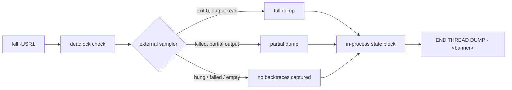

# SIGUSR1 thread dump degrades instead of disappearing

## Summary

The SIGUSR1 handler failed at exactly the moment it was needed: on the wedged
M2 Ultra, `sample` itself hung, the handler skipped the capture, and the dump
body was empty — a `END THREAD DUMP` banner with nothing above it. An empty dump
is worse than no dump, because it reads as clean.

The dump is now built in two independent parts, and the banner says which of
them survived:

1. **External sampler** — still bounded (5 s, plus a 500 ms kill grace) and still
   `-file`-based to avoid the pipe-buffer deadlock. An empty or missing output
   file is no longer treated as a successful capture.
2. **In-process state block** — always printed, needs no external tool and no
   GPU driver call: PID, elapsed run time, GPU circuit-breaker state and trip
   reason, abandoned-thread count, last watchdog heartbeat, every outstanding
   GPU request with the age of its wait, and the dumping thread's own backtrace.

Two supporting changes make that possible: a registry of in-flight GPU requests
(`src/analysis/gpu/inflight.rs`), and a non-blocking heartbeat snapshot on the
watchdog. Both readers use bounded `try_lock_for()` and report contention rather
than waiting on it, so the handler's "never block the process" guarantee holds.

Off macOS the sampler is only attempted when `NEAT_AI_DISCOVERY_SAMPLE_PROGRAM`
names one. That is what lets the fallback paths be exercised by `cargo test` on
the Linux CI runner rather than only on a Mac.

Closes #1934.

### On the optional items

- **Raising `SAMPLE_TIMEOUT_SECS` / retrying** (issue item 3, "consider") was
  deliberately **not** done. The timeout only bounds how long a *stuck* process
  waits for a *stuck* tool; now that the dump always carries the state block,
  waiting longer buys nothing and costs the wedged process more time. The bound
  stays at 5 s + 500 ms and is exported as
  `neat_ai_discovery::debug::SAMPLE_TIMEOUT_SECS` so tests can assert on it.
- **Coordination with #1905** (predictable `/tmp` output filename): the output
  path construction was moved verbatim into `src/debug/sample_capture.rs` and
  left as the single site to change, with a comment pointing at #1905. Nothing
  here clobbers that fix; case 2 of the new test (missing output file) exercises
  the shared surface.
- **Sub-issue #1933** (GPU-thread liveness heartbeat) is still open, so the
  heartbeat line reports the existing watchdog heartbeat. When #1933 lands it
  has one place to extend.

## Evidence

This is a backend/CLI change with no web interface, so there is no screenshot.
The evidence is the test suite plus the shape of the dump.



Before — the reported failure:

```text
--- Running 'sample' for full thread analysis (1 second) ---
[NEAT-AI-Discovery][debug] WARNING: 'sample' did not exit within 5s. Skipping thread dump capture...
================================================================================
END THREAD DUMP
================================================================================
```

After — same wedged sampler, reproduced by `tests/issue_1934_sample_fallback.rs`:

```text
[NEAT-AI-Discovery][debug] WARNING: 'sample' did not exit within 5s. ...
[NEAT-AI-Discovery][debug] WARNING: no readable 'sample' output at /tmp/...
Try manually: sample 1234 1 -mayDie -file /tmp/sample.txt

--- In-process state (no external tools) ---
Process ID: 1234
Elapsed run time: 918.4s (since library initialisation)
GPU circuit breaker: TRIPPED (reason: batch_timeout)
Abandoned GPU threads: 1
Last heartbeat: stage "analysis:synapse", last beat 604.2s ago
Outstanding GPU requests: 2
  - helpful_batch (waiting 601.9s)
  - relu_eval (waiting 12.4s)

--- Dumping thread: signal-handler (ThreadId(7)) ---
<backtrace>
================================================================================
END THREAD DUMP - no backtraces captured
================================================================================
```

Quality gate: `./quality.sh` passes cleanly (fmt, clippy `-D warnings`, full test
suite, docs, `cargo deny`).

## Test Plan

### New integration test — `tests/issue_1934_sample_fallback.rs`

Every case points `crate::config::sample_program()` at a purpose-built script via
`NEAT_AI_DISCOVERY_SAMPLE_PROGRAM`, renders a real dump, and asserts on the text.
Each render runs under an outer `recv_timeout` so a blocking regression fails the
test instead of wedging CI.

| Test | Sampler behaviour | Asserts |
|---|---|---|
| `a_hanging_sampler_still_produces_the_in_process_fallback` | `sleep 600` | timeout reported, full fallback block present, banner `no backtraces captured`, and the handler returns inside the sampler bound (the timing case) |
| `a_sampler_that_writes_no_output_still_produces_the_in_process_fallback` | `exit 0`, no `-file` output | "wrote no readable output", full fallback block, `no backtraces captured` |
| `a_failing_sampler_still_produces_the_in_process_fallback` | `exit 3` | "command failed", full fallback block, `no backtraces captured` |
| `a_successful_sampler_is_reported_as_a_full_dump` | writes a call graph, exits 0 | banner `full dump`, captured thread printed, state block still present |
| `a_killed_sampler_with_partial_output_is_reported_as_a_partial_dump` | writes a call graph, then hangs | banner `partial dump`, partial content printed, returns inside the bound |

Each fallback case also asserts the bare `END THREAD DUMP\n` banner is **absent**
— that exact string is the regression signature — and that the
"Try manually: sample …" hint survives.

### New unit tests

- `src/debug.rs` — banner wording for all three completeness levels; a rendered
  dump always contains the state block and a classified banner; a dump returns
  within the sampler bound.
- `src/debug/sample_capture.rs` — an empty/whitespace/missing output file is not
  readable content; unmatched call-graph output is reported rather than silently
  dropped; thread headers and library frames survive the filter. The pre-existing
  `run_external_command_with_timeout_does_not_hang_and_preserves_partial_output`
  test moved here unchanged with the helper it exercises.
- `src/debug/process_state.rs` — the state block always names the process and the
  GPU state; an outstanding request appears with its label and age.
- `src/analysis/gpu/inflight.rs` — a request is listed until its guard drops;
  dropping one guard leaves its sibling registered; the reported age reflects the
  wait.

### Security self-check

- No new external input is parsed; the sampler path is unchanged and remains
  `-file`-based with `stdout`/`stderr` discarded.
- No secrets, credentials or hidden files staged.
- No new dependency.
- `NEAT_AI_DISCOVERY_SAMPLE_PROGRAM` was already an operator-controlled
  diagnostic override; this change does not widen who can set it.
- The `/tmp` output filename remains predictable — that is #1905's scope, and it
  was left as a single site to change rather than being partially altered here.
