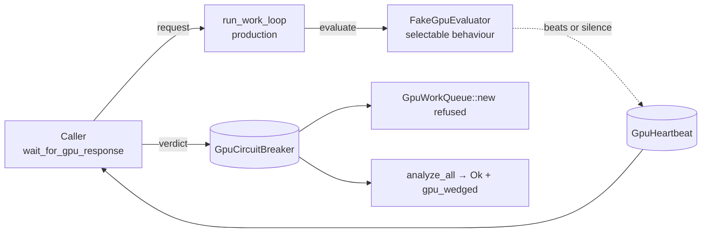

# Deterministic wedged-GPU test harness (Issue #1935)

## Summary

Nothing in the suite could express "the GPU never answers". The wedge behind
Issue #1926 only ever reproduced on one Apple M2 Ultra, so every sibling fix —
deadline-derived inner timeouts (#1928), stale-request skipping (#1929), the
circuit breaker (#1930), the signalled partial result (#1931), the typed
non-retryable error (#1932) and the liveness heartbeat (#1933) — was shipping
without a test that would fail if it regressed.

This adds the missing test double and the regression tests that use it. A fake
`RequestEvaluator` with selectable behaviours drives the **production** work
loop, the **production** bounded wait and the **production** circuit breaker
with no `wgpu` device involved, so everything runs on GPU-less CI runners in
about three seconds. Closes #1935.

No production code changed — this is the verification counterpart to the fixes.

## Evidence

This is a backend/test change with no web interface to screenshot. The evidence
is the test runs below.

### What the fake device models

| Behaviour | Models | Guards |
|-----------|--------|--------|
| `Completes` | a healthy device | #1929 |
| `CompletesAfter` | a slow device answering inside the stall window | #1933 |
| `BeatsThenCompletes` | a long evaluation that keeps publishing progress | #1933 |
| `BeatsWithoutCompleting` | progress forever, no answer | #1933 (backstop) |
| `NeverAnswers` | the Issue #1926 wedge | #1930, #1932, #1933 |
| `WedgesUntilBudgetExpires` | a wedged device with budgeted inner waits | #1928 |



### The tests run in CI's own invocation

Both new suites are ordinary `#[test]`s with no `#[ignore]` and no GPU feature
gate, so they are part of the `test` job's
`cargo test --lib --tests --bins --all-features -- --test-threads=2`:

```text
running 8 tests
test analysis::gpu::queue::wedge_tests::a_device_that_answers_inside_the_window_is_not_flagged ... ok
test analysis::gpu::queue::wedge_tests::a_silent_gpu_is_declared_wedged_within_the_stall_window ... ok
test analysis::gpu::queue::wedge_tests::a_slow_but_progressing_gpu_is_never_flagged_as_wedged ... ok
test analysis::gpu::queue::wedge_tests::an_abandoned_request_never_reaches_the_wedged_gpu ... ok
test analysis::gpu::queue::wedge_tests::an_endlessly_progressing_gpu_still_ends_at_the_absolute_timeout ... ok
test analysis::gpu::queue::wedge_tests::a_wedged_request_cannot_outlive_its_time_budget ... ok
test analysis::gpu::queue::wedge_tests::the_first_wedge_stops_every_later_submission ... ok
test analysis::gpu::queue::wedge_tests::the_whole_wedge_sequence_fits_inside_a_simulated_run_budget ... ok
test result: ok. 8 passed; ... finished in 1.74s

running 4 tests
test analyze_all_returns_a_signalled_partial_result_after_a_wedge ... ok
test a_silent_gpu_trips_the_process_wide_breaker_within_the_stall_window ... ok
test no_second_gpu_thread_is_spawned_after_the_first_wedge ... ok
test the_whole_wedge_sequence_fits_inside_a_simulated_run_budget ... ok
test result: ok. 4 passed; ... finished in 1.05s
```

Total added runtime is ~2.8s across both binaries, which does not move the
suite's wall clock materially.

### The #1928 assertion genuinely fails without its fix

Swapping the submitted request's deadline-derived budget for
`GpuTimeBudget::unbounded()` — i.e. reverting what #1928 added — makes the
wedged device run past the caller and the test fail loudly rather than hang:

```text
thread 'a_wedged_request_cannot_outlive_its_time_budget' panicked at
src/analysis/gpu/queue/wedge_tests.rs:205:5:
the worker must stop at the request's budget, not at a fixed constant (took 5.0443055s)
test result: FAILED. 0 passed; 1 failed; ... finished in 5.05s
```

### Harness invariants

- **Nothing may hang.** Every blocking behaviour is bounded twice — by a 5s
  harness cap and by a release flag that frees the worker thread for joining —
  and every timing assertion carries an explicit upper bound. A harness bug
  fails an assertion instead of wedging CI.
- **Nothing may leak a tripped breaker.** The in-crate tests own an isolated
  `GpuCircuitBreaker` and reset it via the test-only reset hook; the integration
  binary resets the process-wide one on the way in *and* out, even on panic. All
  twelve tests pass under `--test-threads=2`.

## Test Plan

Added `src/analysis/gpu/queue/fake_evaluator.rs` (the double, `#[cfg(test)]`)
and these tests:

`src/analysis/gpu/queue/wedge_tests.rs` — loop and wait behaviour:

- `a_wedged_request_cannot_outlive_its_time_budget` (#1928) — the worker gives
  up at the request's budget, before its caller does, and the device is handed a
  bounded budget shorter than the caller timeout.
- `an_abandoned_request_never_reaches_the_wedged_gpu` (#1929) — a dropped
  receiver costs zero evaluations; the live request behind it is still served.
- `a_silent_gpu_is_declared_wedged_within_the_stall_window` (#1933, #1930,
  #1932) — detection costs the window, trips the breaker with
  `HeartbeatStall`, and classifies as the non-retryable `GpuWedged`.
- `a_device_that_answers_inside_the_window_is_not_flagged` (#1933).
- `a_slow_but_progressing_gpu_is_never_flagged_as_wedged` (#1933) — progress
  resets the stall clock across an evaluation that outlasts the window.
- `an_endlessly_progressing_gpu_still_ends_at_the_absolute_timeout` (#1933) —
  the backstop fires as `BatchTimeout`, not as a stall.
- `the_first_wedge_stops_every_later_submission` (#1930) — five later
  submissions are refused immediately, no work reaches the device, the device is
  never rebuilt.
- `the_whole_wedge_sequence_fits_inside_a_simulated_run_budget` (#1926).

`tests/issue_1935_wedged_gpu_harness.rs` — the sequence through the public API:

- `a_silent_gpu_trips_the_process_wide_breaker_within_the_stall_window` (#1933).
- `no_second_gpu_thread_is_spawned_after_the_first_wedge` (#1930) — three
  `GpuWorkQueue::new()` attempts are refused without spawning or waiting.
- `analyze_all_returns_a_signalled_partial_result_after_a_wedge` (#1931) — `Ok`
  with `gpu_wedged`, no GPU-derived results, and the fingerprints, cache
  hit/miss counts and module outcome tracker still populated.
- `the_whole_wedge_sequence_fits_inside_a_simulated_run_budget` (#1926) — wedge
  plus five further analysis passes inside a 10s budget.

Docs: a "How the wedged-GPU defences are tested" section with a Mermaid diagram
in `docs/GPU_GUIDE.md`, plus a CHANGELOG entry.

## Security self-check

- No new external input, dependency, endpoint, or credential surface — the
  change is test-only code plus documentation.
- No secrets or hidden files staged.
