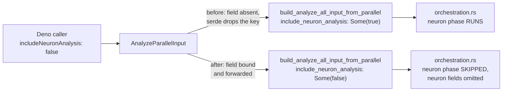

# FFI_API.md documents request and response fields the FFI cannot honour (Issue #1937)

## Summary

`docs/FFI_API.md` — the contract integrators code against — promised request
fields the library silently ignored, response fields no code can emit, and wire
names that contradict the serde definitions. This change makes the contract and
the code agree, moving whichever side was actually wrong. Closes #1937.

**Item 1 — phase gating is now wired through, not deleted.** The doc's
`includeSynapseAnalysis` / `includeNeuronAnalysis` section described a real,
fully-implemented capability: `orchestration.rs:365-366` reads both flags and
skips the matching phase, and benches plus a dozen tests exercise it via
`AnalyzeAllInput`. Only the FFI entry point was missing — `AnalyzeParallelInput`
had no such fields, so serde discarded the caller's keys as unknown, and
`build_analyze_all_input_from_parallel` hard-coded both to `Some(true)`. Both
fields are now on the request type and forwarded verbatim. Deleting the section
instead would have removed a working capability from the published surface; this
direction breaks no existing caller (absent still means "run the phase") and
makes the documented behaviour true.

**Items 2–5 — the doc moved.** Four defects where the source was right:

| # | Defect | Fix |
|---|--------|-----|
| 2 | Six `droughtDiagnostic` rows (`dominantFailedModule`, …, `predictedVsActualGapP50`) describe `FailureAggregates`, which has no `Serialize` derive and whose module is wired into nothing | Rows removed; the table is now the complete nine-field schema, with a note on why the aggregates do not reach the wire |
| 3 | `max_analysis_memory_mb` / `analysis_deadline_ms` written snake_case against a `rename_all = "camelCase"` struct (and the doc's own camelCase elsewhere) | Respelt `maxAnalysisMemoryMb` / `analysisDeadlineMs`; the `memoryBudgetExceeded` output field alongside them too |
| 4 | `"reason": null` and `"environmentallyDisabled": null` shown for `skip_serializing_if = "Option::is_none"` fields | Keys removed from the examples, matching the table's existing "omitted otherwise" |
| 5 | Symbol list said `src/lib.rs` / `#[no_mangle]`; `src/lib.rs` has none | Points at `src/ffi/` / `#[unsafe(no_mangle)]`, agreeing with README.md |

`tests/issue_1684_doc_dedup.rs` pinned two of the removed drought names in
place, so it is updated in this PR — see Test Plan.



## Evidence

Library/FFI change with no web interface, so no screenshot applies. Evidence is
the test suite and the quality gate.

TDD order was followed for the code change — the five
`phase_gating_wiring_tests` were written first and failed against the unfixed
conversion:

```text
---- ffi_internal::analysis::phase_gating_wiring_tests::neuron_phase_can_be_disabled_by_the_caller stdout ----
assertion `left == right` failed
  left: Some(true)
 right: Some(false)

test result: FAILED. 1 passed; 4 failed
```

After wiring the fields through:

```text
test result: ok. 5 passed; 0 failed; 0 ignored; 0 measured; 1441 filtered out
```

`./quality.sh` (fmt, clippy `-D warnings`, `cargo deny`, full test suite, doc
build, release build) → **All quality checks passed!**

## Test Plan

**Added — `src/ffi_internal/analysis.rs::phase_gating_wiring_tests`** (5 tests,
the regression tests for item 1; each deserialises a real `analyze_parallel`
payload and asserts on the converted `AnalyzeAllInput`):

- `neuron_phase_can_be_disabled_by_the_caller`
- `synapse_phase_can_be_disabled_by_the_caller`
- `both_phases_can_be_disabled_together`
- `explicit_true_is_preserved`
- `absent_fields_default_to_running_both_phases`

**Added — `tests/issue_1937_ffi_api_doc_contract.rs`** (4 tests pinning the
corrected doc to observable type behaviour, so the text cannot drift back):

- `documented_camel_case_tuning_keys_are_the_ones_serde_binds` — the camelCase
  keys bind, the snake_case ones do not, and the doc no longer shows snake_case.
- `documented_phase_gating_fields_bind_to_the_request_type`
- `omitted_optional_response_fields_are_absent_not_null` — serialises
  `CheckGpuOutput` and `EnvironmentalGatesJson` and asserts the keys are absent.
- `exported_symbol_list_points_at_the_ffi_module`

**Modified — `tests/issue_1684_doc_dedup.rs::drought_diagnostic_schema_home_is_ffi_api`.**
The old assertion required FFI_API.md to contain `dominantFailedModule` and
`predictedVsActualGapP50` — the exact unemittable names item 2 removes, so it
held the drift in place. **Business-logic change documented:** the assertion is
now derived from the type rather than hard-coded — it serialises a
`DroughtDiagnostic`, requires every key it actually emits to be documented, and
requires the six `FailureAggregates` names *not* to appear as schema rows. No
test was commented out or deleted; the test still guards FFI_API.md as the
schema home, and now self-corrects if the struct gains a field.

## Security Self-Check

- **Input validation** — the two new fields are `Option<bool>`; serde rejects any
  other JSON type at the boundary. No new parsing or unsafe code.
- **Injection surface / output encoding / auth** — unchanged; no new SQL, shell,
  filesystem, or HTTP calls, and no new entry point.
- **Secrets / dependencies** — no secrets staged, no dependency changes.
