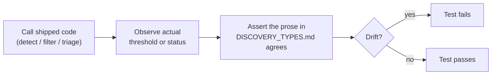

# Align DISCOVERY_TYPES.md and ANALYSIS_DEEP_DIVE.md with shipped thresholds

## Summary

`docs/DISCOVERY_TYPES.md` is the designated ground truth for discovery types —
CONTRIBUTING.md and AGENTS.md both point readers at it — so a wrong status or
threshold there propagates everywhere. Six deliberate, issue-tracked changes
(#888, #892, #1019, #1059, #1767/#1812) were never absorbed into the prose,
sending anyone tuning detection down paths the code has closed.

Every stale value is corrected, and each correction is pinned by a new
doc-contract test that first proves the shipped behaviour, then asserts the
prose agrees with what that behaviour just showed. Closes #1938.

| # | Stale claim | Shipped truth |
|---|-------------|---------------|
| 1 | Batch-Successful listed 🟢 Active | ⛔ Disabled by default, gated on `NEAT_AI_DISCOVERY_BATCH_SUCCESSFUL` (#1059) |
| 2 | Low-impact ceiling `1e-3` | `LOW_IMPACT_CEILING = 0.04`, `MAX_ABSOLUTE_STD_DEV = 0.02` (#892) |
| 3 | Removal criterion `impact < costOfGrowth` | Boosted savings vs contribution + noise floor; now links to FOCUS_SELECTION.md § 4.1, plus the sole-op net-gain rule (#1767, #1812) |
| 4 | Add-neuron example with `"bias": 10` | `1.2` — the old example could never clear `SENSIBLE_BIAS_ABS_MAX = 2.0` (#888) |
| 5 | Add-synapse "searches over 9 weight candidates" | Live path proposes `ADAPTIVE_PROPOSAL_CANDIDATE_COUNT = 12`; the 9-variant grid is the no-history fallback (#1019) |
| 6 | Remove-Neuron-High-Error marked 🔴 in detail, ⛔ in the table | ⛔ in both |
| 7 | Deep dive ranges 20 / 10 / 0.1 | 5 / 2 / 0.01, with 0.03 outgoing for non-linear squashes (#888, #905) |

The ⛔ legend entry was broadened from "permanently disabled due to fundamental
flaw" to also cover a module gated behind an opt-in environment variable, so
batch-successful and remove-neuron-high-error can share one honest marker.

## Evidence

This is a documentation change to a CLI/FFI library — there is no web interface
to screenshot. The evidence is the new test binary, which fails against the
pre-change docs and passes after.

Each test binds a doc claim to real behaviour rather than grepping source:



Before the doc fixes, all seven tests failed on their prose assertions while the
behavioural halves passed — i.e. the code was right and the docs were wrong:

```text
test result: FAILED. 0 passed; 7 failed
  batch-successful is disabled by default; summary row must not claim 🟢 Active
  the low-impact section must quote the shipped 0.04 ceiling
  the documented add-neuron example must pass filter_candidates_to_sensible_ranges
    left: 0, right: 1
  the deep dive must quote the shipped 5 / 2 / 0.01 bounds
  the Add Synapses section must quote the live candidate count
  the removal criterion must not be restated in its pre-boost form
  the detail section must use the same ⛔ marker as the summary row
```

After:

```text
test result: ok. 7 passed; 0 failed; 0 ignored
```

`./quality.sh` passes cleanly (fmt, clippy `-D warnings`, `cargo deny`, full
test suite, docs, release build).

## Test Plan

New file `tests/issue_1938_discovery_doc_contract.rs`:

- `batch_successful_is_off_by_default_and_the_reference_says_so` — asserts
  `batch_successful_enabled()` is `false` without the env gate, then that the
  summary row is not 🟢 Active and the detail section names the env var.
- `low_impact_detection_admits_activations_above_the_stale_1e_3_ceiling` —
  `detect_low_impact_neurons` detects a neuron at mean activation `0.02` (which
  the documented `1e-3` ceiling excluded) and still rejects `0.05`.
- `documented_add_neuron_example_survives_the_sensible_range_filter` — parses
  the worked JSON example straight out of the doc and asserts
  `filter_candidates_to_sensible_ranges` keeps it.
- `deep_dive_sensible_ranges_match_the_shipped_filter` — the post-#888 bounds
  pass the filter and each pre-#888 bound is rejected; the deep dive quotes the
  passing ones.
- `add_synapse_weight_search_documents_the_live_candidate_count` — cold tracker
  yields the fixed grid, warm tracker yields
  `ADAPTIVE_PROPOSAL_CANDIDATE_COUNT`; the doc quotes the latter and marks the
  grid as fallback.
- `removal_criterion_is_boosted_savings_and_lives_in_focus_selection` —
  `triage_removal_candidates` emits a boosted-savings reason, never
  `< costOfGrowth`; the doc defers to FOCUS_SELECTION.md.
- `remove_neuron_high_error_uses_one_status_marker` — summary row and detail
  section carry the same ⛔ marker.

No existing tests were modified or removed.
