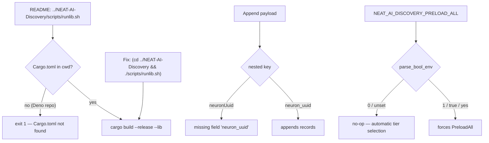

# Fix four documented commands that fail as written

## Summary

Four copy-paste paths in the docs failed — or silently did nothing — exactly as
written. Each is fixed at the doc surface, and each fix is pinned by a test that
drives the real code path the doc describes. Closes #1939.

| # | Surface | Was | Now |
|---|---------|-----|-----|
| 1 | `README.md` Quick Start | `../NEAT-AI-Discovery/scripts/runlib.sh` | `(cd ../NEAT-AI-Discovery && ./scripts/runlib.sh)` |
| 2 | `docs/STREAMING_GUIDE.md`, `src/ffi/recording.rs` rustdoc | `neuronUuid` | `neuron_uuid` |
| 3 | `docs/CACHE_TUNING.md` | `export NEAT_AI_DISCOVERY_PRELOAD_ALL=0` | recipe removed; prose matches `:190` |
| 4 | `README.md` fuzz fences | `cargo +nightly fuzz run <target>` | `cargo +nightly fuzz run --locked <target>` |

**1 — cross-repo `runlib.sh` aborted.** `_meta_for_here` (`scripts/runlib.sh`)
requires `Cargo.toml` in the caller's cwd and exits 1 without it; no `cd` to the
crate root happens first. Run from the NEAT-AI Deno directory, the documented
command never reached `cargo build`. The doc now uses the subshell form — the
minimal fix. Whether the script should `cd` to its own crate root instead is a
workflow decision left to a human; the script is unchanged.

**2 — `neuronUuid` failed deserialisation.** `NeuronData` carries no
`rename_all`, so its wire key is `neuron_uuid`; the enclosing
`StreamingObservation` *is* camelCase, which is why `obsIndex` / `neuronData` /
`inputs` were already correct and only the nested key was wrong. A payload using
`neuronUuid` fails with `missing field 'neuron_uuid'`. This went unnoticed
because every streaming test appended via Rust structs and never crossed the
JSON boundary — so this PR adds that boundary test.

**3 — `PRELOAD_ALL=0` was a silent no-op.** `parse_bool_env`
(`src/config/helpers.rs`) treats only `1`/`true`/`yes` as truthy, so `0` is
indistinguishable from unset and forces nothing. The recipe is replaced with the
accurate statement the same doc already makes at `:190`.

**4 — fuzz commands omitted `--locked`.** `docs/ci-fuzzing-workflow.yml` runs
`cargo +nightly fuzz run --locked …` so the committed `fuzz/Cargo.lock` is
honoured; the README's commands did not, so contributors did not reproduce CI's
pinned resolution.

## Evidence

No web interface to screenshot — this is a documentation and FFI-contract
change. Evidence is the test suite: the six behavioural tests below fail against
the *pre-fix* documented commands (they assert the documented form aborts /
rejects / no-ops), and the four doc-contract tests failed before the doc edits
and pass after.

Where each documented path breaks, and what the fix changes:



Full gate green:

```
$ ./quality.sh < /dev/null
✅ All quality checks passed!

$ cargo test --test issue_1939_documented_commands
test result: ok. 10 passed; 0 failed
```

## Test Plan

All in `tests/issue_1939_documented_commands.rs` (new):

**Behavioural — drive the real path the doc describes**

- `runlib_aborts_when_invoked_from_a_directory_without_cargo_toml` — runs the
  real `scripts/runlib.sh` from a temp dir and asserts the non-zero exit and
  `Cargo.toml not found`, i.e. the failure the old README command produced.
- `documented_append_payload_deserialises` — the corrected guide payload
  deserialises into `AppendRecordsInput`, with every field asserted.
- `camel_case_neuron_uuid_is_rejected_at_the_json_boundary` — the old spelling
  fails with an error naming `neuron_uuid`. **This is the JSON-boundary
  regression test the issue asked for** — the gap that let the wrong key sit in
  the docs.
- `ffi_append_reports_a_parse_failure_for_camel_case_neuron_uuid` — the same
  payload through the real `append_discovery_records` FFI entry point returns
  `success: false` (result pointer freed via `free_discovery_result`).
- `preload_all_zero_behaves_exactly_like_unset` — `=0` yields the same
  `preload_all()` / `streaming_enabled()` as unset, proving the no-op.
- `preload_all_one_disables_streaming` — `=1` is the sole working override.

**Doc-contract — lock the corrected text against the artefact it must match**

- `readme_cross_repo_invocation_changes_directory_first`
- `docs_use_the_wire_spelling_for_the_nested_neuron_key`
- `cache_tuning_drops_the_no_op_preload_recipe`
- `readme_fuzz_commands_match_ci_by_passing_locked` — asserts no README
  `cargo +nightly fuzz run` line lacks `--locked`, and that
  `docs/ci-fuzzing-workflow.yml` still uses it.

## Security Self-Check

Documentation and test-only change; no new input handling, endpoints, or
dependencies. The added FFI test frees its result pointer per the
`free_discovery_result` invariant. No secrets or hidden files staged.
