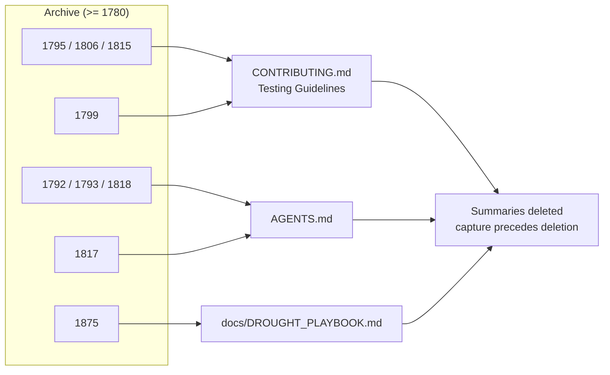

# Fold five unabsorbed PR-summary learnings into the live docs (Issue #1940)

## Summary

Five durable learnings from the `>= 1780` PR-summary archive were reflected
nowhere in `README.md`, `AGENTS.md`, `CONTRIBUTING.md` or `docs/**` — three of
them conventions already being cited by later PRs *as if* documented (most
sharply "the #1806 convention", named by `pr-summary-1810.md` and written down
nowhere a reader would look). Each is now folded into the doc that owns the
topic, and only then are the source summaries deleted — capture is the
precondition for deletion under the archive's own retention rule. Closes #1940.

| # | Learning | Folded into |
|---|----------|-------------|
| 1 | Dead-wiring test doctrine — a unit test that builds its own subject cannot detect a missing production caller; guards must drive the shipped entry point and assert on the FFI response shape (the **#1806 convention**) | `CONTRIBUTING.md` § Testing Guidelines |
| 2 | An assertion that holds whether or not the path fires is not coverage — pin a positive precondition (`considered > 0`) | `CONTRIBUTING.md` § Testing Guidelines |
| 3 | "Dead levers" — delete a never-constructed component unless a concrete writer can be named, **and delete its config surface in the same change**, plus the negative result explaining why no writer can exist | `AGENTS.md` |
| 4 | Mermaid `;` in unquoted note text is a statement separator; the enforcing gate lives outside this repo so `./quality.sh` cannot catch it | `AGENTS.md` |
| 5 | Poisoned-mutex recovery via `PoisonError::into_inner` for counter-only state, and the bound on when it is safe | `docs/DROUGHT_PLAYBOOK.md` |

**Deleted** (durable content now captured): `pr-summary-1792`, `1793`, `1795`,
`1799`, `1802`, `1806`, `1815`, `1817`, `1818`, `1875`. No live doc, source file
or script linked to any of them. #1802's fail-loud reconciliation invariant was
already captured in `docs/analysis/candidate-reconciliation-1802.md`,
`docs/CONFIGURATION.md` and `docs/FFI_API.md`; the only unabsorbed remainder was
its vacuity design constraint, now folded under learning 2.

Documentation- and test-only change — no `src/` behaviour is modified, so no
manual `Cargo.toml` version bump is required (CI's `version-increment` job still
applies).

## Evidence

No web interface to screenshot — this is a documentation change. Evidence is the
new doc-contract suite plus the full gate.

`./quality.sh < /dev/null` → **All quality checks passed** (bash syntax,
shellcheck, PR-summary layout, `cargo deny`, build, fmt, clippy `-D warnings`,
type checks, full test suite, rustdoc `-D warnings`, release build).

The pre-existing `agents_is_thin` guard (`tests/issue_1683_agents_consolidation.rs`)
caps `AGENTS.md` below 200 lines; the first draft of the fold breached it at 208
and the additions were compressed to fit — `AGENTS.md` is now 193 lines.

## Test Plan

New suite `tests/issue_1940_pr_summary_folding.rs` (12 tests), following the
`issue_1682_pr_summary_folding.rs` doc-contract pattern. Each test asserts on the
live doc's *content*, so a future edit that drops a folded learning fails the
gate:

- `contributing_records_the_dead_wiring_diagnosis` — the root diagnosis sentence
  and attribution to #1795/#1806/#1815.
- `contributing_names_the_1806_convention` — the convention is defined by name.
- `contributing_requires_assertions_on_the_ffi_response_shape` — names the
  response shape and a serialised key (`rejectionBreakdown`).
- `contributing_records_the_vacuous_assertion_trap` /
  `contributing_prescribes_a_positive_precondition` — the trap, the `considered > 0`
  remedy, and the #1271 cap that shrank the fixture.
- `agents_records_the_dead_lever_rule` /
  `agents_requires_the_config_surface_to_die_with_the_component` /
  `agents_records_why_no_writer_can_exist` — the one-liner, the same-change
  config-surface rule, the `failureCache`/`source_uuid` negative result, and the
  exemption for the live `candidate_starvation.rs`.
- `agents_records_the_mermaid_semicolon_trap` — the rule, the reason, and that
  the enforcing gate is `mermaid_validator.ts` outside this repo.
- `playbook_records_the_poisoned_mutex_convention` /
  `playbook_bounds_the_poison_recovery_convention` — the `if let Ok(guard)`
  failure mode, the `PoisonError::into_inner` remedy, and the bound (safe only
  for counters mutated by infallible operations, not for state a panic can leave
  half-updated).
- `folded_summaries_were_deleted_after_capture` — all ten summaries are gone and
  the #1802 analysis doc that justified deleting its summary is retained.

Existing tests: none modified or removed. The full suite passes.
