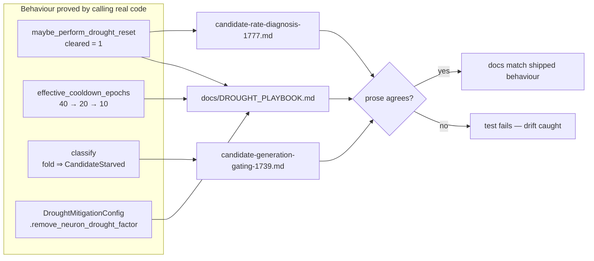

# Drought-campaign docs no longer state superseded facts as current

## Summary

The #1777–#1818 drought campaign changed facts that its own earlier documents
still stated in the present tense. `docs/DROUGHT_PLAYBOOK.md` — an operator
playbook read mid-incident — contradicted both the source and itself, and two
`docs/analysis/` studies that five campaign PR summaries cite as canonical
carried superseded claims with no status annotations. Fixed here, plus a
prevention note that makes the annotation obligation explicit. **Closes #1941.**

### `docs/DROUGHT_PLAYBOOK.md` (live reference — rewritten in place)

| Was | Now |
|-----|-----|
| Intro: "**four** suppression layers … the candidate outcome cache" | "**three** suppression layers", agreeing with the file's own § *Suppression Layers* ("Three mechanisms"). The cache was deleted by #1792 and now survives only in that section's historical note. |
| Escape hatch "can clear failed cache entries and active cooldowns in one shot"; lever table's "one-shot cache + cooldown reset" | Cooldown-only, naming the tracker as the reset's one remaining clearable input. `clear_failed_entries` no longer exists. |
| Adaptive target-cooldown relaxation (#1204) is "**not yet shipped** … thresholds remain static" — while `:404-405` described it as live | Replaced with a regime table for the shipped behaviour (÷2 / +1 in Conservative, ÷4 / +2 in Extended Drought, 2-epoch floor), pointing at `TargetFailureTracker::effective_cooldown_epochs` / `::effective_consecutive_failures`. Self-contradiction resolved. |
| Operator Levers table omitted the two divisor knobs | `COOLDOWN_CONSERVATIVE_DIVISOR` and `COOLDOWN_EXTENDED_DROUGHT_DIVISOR` added, "when to change" only — defaults stay in `docs/CONFIGURATION.md` per #1684. |
| Quoted startup line missing `remove_neuron_drought_factor` | Added, matching `log_effective_drought_mitigation_config`. |
| `ModuleStarvationTracker` cited as a live #1421 helper; walkthrough blamed "the cache and cooldown" | Both scrubbed — the tracker was deleted by #1793. |

### `docs/analysis/*.md` (point-in-time studies — annotated, not rewritten)

Both keep their original prose and gain a dated "as at" header plus inline
**Superseded** annotations, matching the pattern the 1777 study already used at
its `#1778` and `#1803` markers.

- **`candidate-rate-diagnosis-1777.md`** — B1 (`CandidateOutcomeCache` deleted by
  #1792, `ModuleStarvationTracker` by #1793, `TargetFailureTracker` wired by
  #1790/#1791, so *"in production the drought reset clears nothing"* has been
  false since #1791); B2 (`ageEpochs` added by #1781); B3 (all five drop paths
  wired by #1796–#1801 with #1802's fail-loud reconciliation, ordering fixed by
  #1800).
- **`candidate-generation-gating-1739.md`** — the "HOLD" verdict and the
  `Where it is wired` section, both superseded by #1800's
  `starvation_classifier_breakdown`.

### Prevention — `docs/archive/README.md`

Extended with a "what goes where" table: `docs/*.md` = live reference (rewrite in
place), `docs/analysis/*.md` = point-in-time studies (date and annotate, never
rewrite), `docs/archive/pr-summaries/` = transient (fold, then leave). The
directory previously never mentioned `docs/analysis/` at all, which is how this
whole class of drift stayed undocumented.

## Evidence

No web interface to screenshot — this is a documentation change to a
backend/CLI library. The evidence is
`tests/issue_1941_drought_docs_contract.rs`, which does **not** grep source:
each test first proves current behaviour by calling the real code, then asserts
the prose agrees with what that call just demonstrated.



All 9 tests failed against the un-annotated docs before the change and pass
after:

```text
running 9 tests
test the_intro_counts_only_the_three_live_suppression_layers ... ok
test the_escape_hatch_clears_cooldowns_only_and_the_prose_says_so ... ok
test adaptive_cooldown_relaxation_has_shipped_and_the_playbook_agrees ... ok
test the_operator_levers_table_lists_the_relaxation_divisors ... ok
test the_quoted_startup_line_lists_every_emitted_lever ... ok
test the_1777_diagnosis_annotates_its_superseded_root_cause_b ... ok
test the_1739_gating_study_is_dated_and_marked_superseded ... ok
test the_archive_readme_documents_every_documentation_tier ... ok
test the_playbook_never_presents_deleted_components_as_live ... ok

test result: ok. 9 passed; 0 failed
```

## Test Plan

New file `tests/issue_1941_drought_docs_contract.rs` (9 tests):

- `the_intro_counts_only_the_three_live_suppression_layers` — fires the reset on
  a real tracker (one cooldown cleared) to show the tracker is its only
  clearable input, then pins the intro to three layers and to non-contradiction
  with § *Suppression Layers*.
- `the_escape_hatch_clears_cooldowns_only_and_the_prose_says_so` — asserts the
  target leaves cooldown, then that no prose promises cache clearing.
- `adaptive_cooldown_relaxation_has_shipped_and_the_playbook_agrees` — asserts
  the window and trigger both relax through Conservative and Extended Drought,
  then that the playbook no longer says "not yet shipped" / "thresholds remain
  static".
- `the_operator_levers_table_lists_the_relaxation_divisors` — both divisor env
  vars present in the Operator Levers section.
- `the_quoted_startup_line_lists_every_emitted_lever` — reads
  `remove_neuron_drought_factor` off `DroughtMitigationConfig::from_env()`, then
  requires all nine emitted fields in the quoted block.
- `the_1777_diagnosis_annotates_its_superseded_root_cause_b` — the reset clears
  a real cooldown, so B1/B2/B3 must each carry a **Superseded** marker naming
  #1792 / #1781 / #1800.
- `the_1739_gating_study_is_dated_and_marked_superseded` — reproduces #1800's
  verdict flip (4 gate-side ⇒ `ProposalRichOverRejected`; + 9 suppressed ⇒
  `CandidateStarved`), then requires the dated header and status note.
- `the_archive_readme_documents_every_documentation_tier` — checks each tier
  directory exists on disk and is described in the README.
- `the_playbook_never_presents_deleted_components_as_live` — regression guard:
  `ModuleStarvationTracker` absent, `CandidateOutcomeCache` confined to the
  #1792 historical note, walkthrough no longer blames a deleted cache.

Existing doc gates re-run clean: `issue_1684_doc_dedup`,
`issue_1685_doc_link_integrity`, `issue_1681_doc_staleness`. No existing test
was modified or removed. `Cargo.toml` bumped `0.74.201` → `0.74.202`.

## Pre-PR Security Self-Check

Documentation and one new integration test — no new input surface, no secrets,
no injection surface, no dependency change, no auth or error-handling paths
touched.
