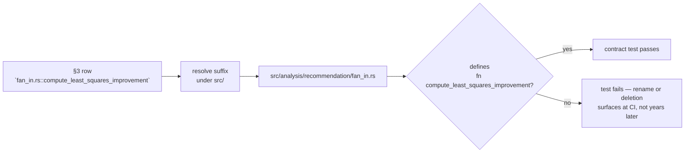

# Cost-function notes: replace the falsified premise and re-anchor every catalogue site

## Summary

`docs/COST_FUNCTION_NOTES.md` argued for discovery's cost-agnosticism from a
checkable claim that is false today — "there are **zero references to any cost
name in `src/` of this crate**", with the grep to prove it. That grep now
returns 118 matching lines, and the document contradicts itself three sections
later by describing `CostFunctionHint::from_name(...)`. Its per-consumer
catalogue had rotted too: every `file:line` reference had drifted, most by one
line, sixteen by +9 to +61 lines onto unrelated code.

This PR rewrites the premise to the invariant that is actually true, re-anchors
all 66 catalogue references, and adds a contract test so the same drift cannot
recur silently. Closes #1942.

- **§1 premise rewritten.** Cost *names* do reach the crate — via two name
  mappers (`CostFunctionHint::from_name`, `TaskDescriptor::from_name`) that
  translate a name into residual semantics at the crate boundary. The real
  invariant is that no analysis consumer branches on the configured cost; each
  reads `DiscoverRecord.errors` and nothing else. Aligned with the caller-facing
  summary in `docs/DISCOVERY_TYPES.md`.
- **All catalogue sites re-anchored to symbols.** `compound_degradation.rs:171`
  → `compound_degradation.rs::detect_bias_corrections`, and so on for every row
  in §3 and every reference in §4–§6, §8. Line numbers in a 400-line catalogue
  rot on each refactor (the issue's suggestion 3); symbols do not, and a test
  can verify them.
- **Three genuinely misclassified rows corrected.** All three
  `sample_weighted.rs` consumers take `.abs()` of the per-record mean, so
  `compute_sample_weights` is `RESIDUAL→MAGNITUDE` (not `RESIDUAL`) and its
  `CATEGORICAL_ERROR` verdict is ⚠️ (magnitude ranking survives), not ❌.
- **§6 item 3 marked resolved** — `docs/discoveries/add-neuron.md` was reworded
  under #1251; the notes still described it as pending.

Scope held to this document plus its new test: no source behaviour changed.
`Cargo.toml` carries the mandated patch bump (`0.74.204` → `0.74.205`).

## Evidence

No web interface to screenshot — this is a documentation change verified by
tests. The drift and the false premise were both proved from the source before
being fixed:

```text
$ grep -rn "MSE\|MAE\|MAPE\|MSLE\|HINGE\|CROSS_ENTROPY\|CATEGORICAL_ERROR" src/ | wc -l
     118
```

Every non-comment dispatch on a cost name lives in exactly two files:

```text
src/analysis/cost_function_hint.rs:48   "MSE" | "MAE" | "CROSS_ENTROPY" ... => Self::LinearResidual,
src/analysis/task_descriptor.rs:135     "MSE" | "MAE" => Self { ... }
```

Regression linkage — the new tests fail against the pre-fix document and pass
after it:

```text
# docs/COST_FUNCTION_NOTES.md at HEAD (unfixed)
test the_catalogue_cites_no_bare_line_numbers ... FAILED
test every_documented_site_resolves_to_a_function_in_the_source ... FAILED
test the_provenance_anchors_still_carry_the_errors_field ... FAILED
test the_background_section_does_not_claim_zero_cost_name_references ... FAILED
test cost_names_reach_the_crate_only_through_the_two_name_mappers ... ok
test result: FAILED. 1 passed; 4 failed

# with this PR's document
test result: ok. 5 passed; 0 failed
```

How the reference now resolves, and why it stops rotting:



## Test Plan

New: `tests/issue_1942_cost_function_notes_contract.rs` (5 tests).

- `cost_names_reach_the_crate_only_through_the_two_name_mappers` — proves the
  behaviour first (`CostFunctionHint::from_name("MSE")` vs `("HINGE")`,
  `TaskDescriptor::from_name("CATEGORICAL_ERROR", 3)` vs `("MSE", 3)`), then
  asserts the set of source files carrying a `"COST_NAME" =>` match arm is
  exactly the two mappers §1 names. A new dispatch site anywhere else fails the
  test — that is the cost-agnostic invariant, enforced.
- `the_background_section_does_not_claim_zero_cost_name_references` — runs the
  document's own grep over `src/`, asserts it returns hits, and asserts the
  prose no longer claims zero.
- `every_documented_site_resolves_to_a_function_in_the_source` — resolves all
  66+ `file.rs::symbol` references to exactly one file under `src/` and asserts
  that file defines the function.
- `the_catalogue_cites_no_bare_line_numbers` — keeps the catalogue
  symbol-anchored so the drift class cannot return.
- `the_provenance_anchors_still_carry_the_errors_field` — §8's two anchors
  (`DiscoverRecord::errors`, `DiscoverRecordJson::errors`) still exist.

Full gate: `./quality.sh < /dev/null` (fmt, clippy `-D warnings`, `cargo deny`,
full test suite, rustdoc).
