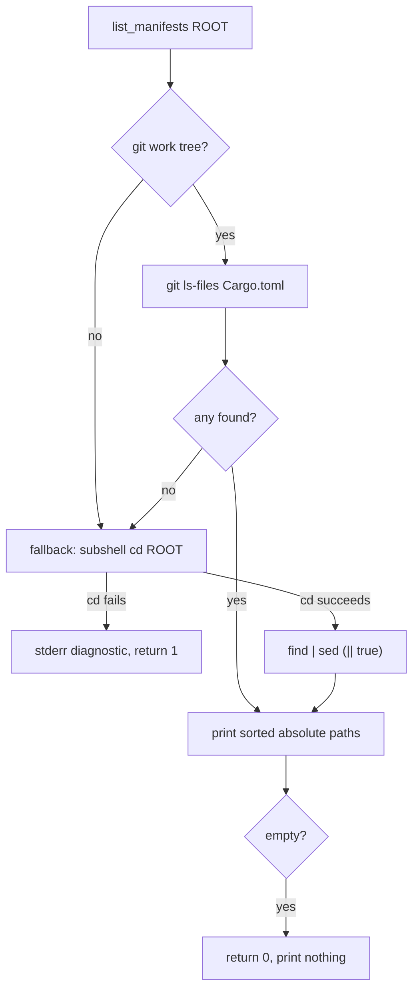

# Split the loud `cd` failure from the tolerated `find` hiccup in `list_manifests` (Issue #1974)

## Summary

`bump_deps::list_manifests()` ran its non-git fallback as
`found="$(cd "$root" && find …)" || found=""`. The trailing `|| found=""`
swallowed a failed `cd "$root"`: an unreadable or missing root collapsed to
"no manifests" and the helper still returned success, so the quarantine gate
would age-check nothing and report a clean run — a fail-silent path.

The fallback now enters the root in a subshell that aborts on a failed `cd`,
and only the `find`/`sed` pipeline keeps its `|| true` tolerance. A `cd`
failure prints a diagnostic naming the root on stderr and returns 1; a
readable root with no manifests still returns 0 and prints nothing.

The ShellCheck SC2015 diagnostic quoted in the issue is already gone at
`Develop` HEAD (`quality/shellcheck.sh .` reports `OK — 23 script(s) passed`
before and after this change), so this PR fixes the remaining half of the
issue: the fail-silent behaviour behind the lint. Closes #1974.

## Evidence

Backend/CLI change — no web interface to screenshot. Verified by tests and by
the shell gate.



Before the fix, the `cd fails` branch led to `return 0` with no output — the
same result as a genuinely empty root.

Test output after the fix:

```
running 4 tests
test missing_root_fails_loudly_instead_of_reporting_no_manifests ... ok
test empty_readable_root_is_not_an_error ... ok
test unreadable_root_fails_loudly ... ok
test find_fallback_lists_manifests_outside_a_git_tree ... ok

test result: ok. 4 passed; 0 failed
```

The two failure tests fail against the unfixed script (both observed
`exit Some(0)`), and pass after it.

## Test Plan

- Added `tests/issue_1974_list_manifests_cd_failure.rs`:
  - `missing_root_fails_loudly_instead_of_reporting_no_manifests` — a
    non-existent root must exit non-zero, emit no manifests, and name the root
    on stderr (regression test for the fail-silent path).
  - `unreadable_root_fails_loudly` — a `chmod 000` root must exit non-zero
    (unix only; skipped when running as root, where the permission bits are
    not enforced).
  - `find_fallback_lists_manifests_outside_a_git_tree` — the fallback still
    lists `Cargo.toml` and `fuzz/Cargo.toml` outside a git tree and keeps
    `target/` out of the gated set.
  - `empty_readable_root_is_not_an_error` — an empty readable root is still a
    legitimate exit-0 empty result, not a failure.
- Re-ran `tests/issue_1908_manifest_coverage.rs` (4 tests) — unchanged.
- `quality/shellcheck.sh .` — `OK — 23 script(s) passed ShellCheck`.
- `./bump-deps.sh --print-config` still lists `Cargo.toml` and
  `fuzz/Cargo.toml`.

The follow-up noted in the issue (macOS `date` failures in
`tests/issue_1909_quarantine_second_precision.rs` and
`tests/bump_deps_test.sh`) is a separate root cause and is out of scope here.
