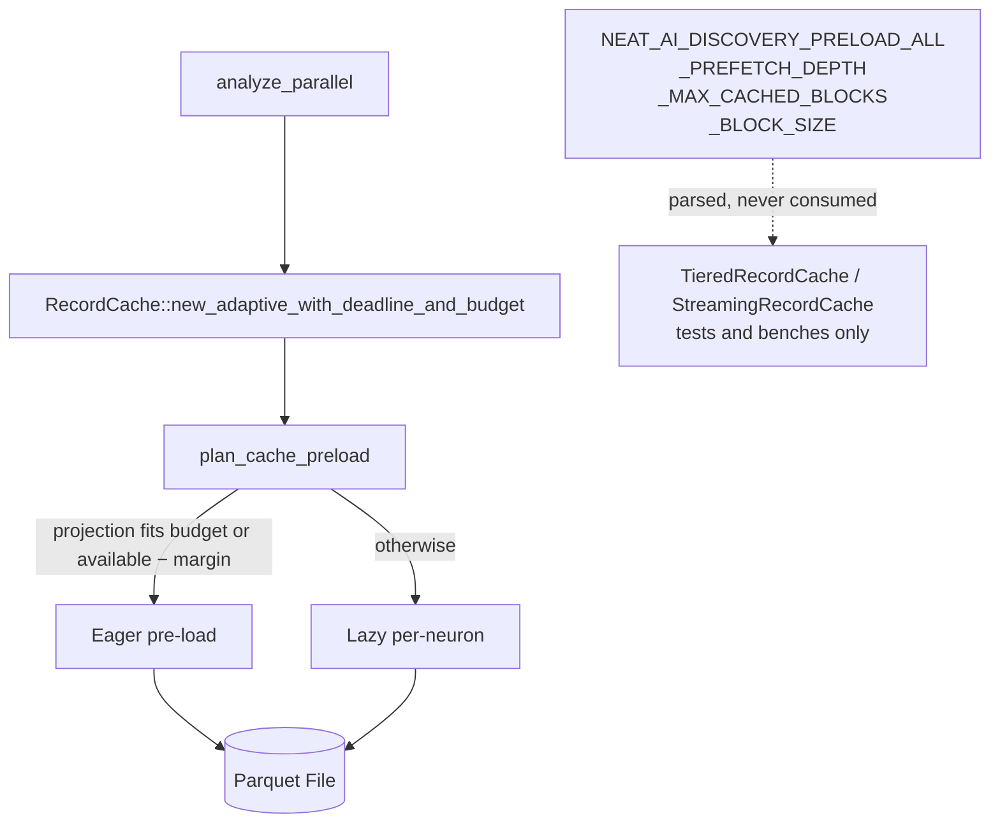

# CACHE_TUNING and GPU_GUIDE documented an unwired cache/streaming subsystem

## Summary

`docs/CACHE_TUNING.md`, `docs/GPU_GUIDE.md` and the `docs/CONFIGURATION.md`
§ Streaming & Parquet rows told operators to tune a three-tier cache and four
streaming knobs that `analyze_parallel` never reaches. An operator mid-OOM
incident who set `NEAT_AI_DISCOVERY_PRELOAD_ALL=1` or `_MAX_CACHED_BLOCKS`
observed no change and lost the incident window — exactly the dead-lever failure
mode AGENTS.md § "Dead Levers" records from Issues #1792/#1793/#1818.

This PR takes the "align the docs with reality" branch of that rule: no
production caller could be named for the tiered subsystem, so the docs now
describe the code path that actually runs and the unwired parts are quarantined
in an explicitly test/bench-only appendix. **Closes #1987.**

### What production actually does



### Changes

| File | Change |
|------|--------|
| `docs/CACHE_TUNING.md` | Rewritten around the two modes production has (eager pre-load vs lazy per-neuron via `plan_cache_preload`). `## Tier Selection Logic` → `## Preload Decision Logic`, documenting the footer projection, the budget / available−margin bound and both lazy `reason` values. New "Operator Levers That Reach the Analysis Cache" table promotes `max_analysis_memory_mb`, `NEAT_AI_DISCOVERY_FOCUS_RANKING_MEMORY_MARGIN_MB` and `NEAT_AI_DISCOVERY_MAX_PARQUET_DECODE_MB`, and names the four knobs that do not reach it. Troubleshooting now quotes the two log strings production emits; the unreachable "High cache miss rate in LRU mode" symptom is gone. Three-tier model moved to `## Appendix — Tiered Cache (test and bench only)`. |
| `docs/CONFIGURATION.md` | The four § Streaming & Parquet rows now state their real reach ("defined, parsed, **not consumed by `analyze_parallel`**") with the specific reason for each. `NEAT_AI_DISCOVERY_SESSION_TTL_SECS` — a live recording knob in the same table — is untouched. |
| `docs/GPU_GUIDE.md` | Streaming section marked not wired and pointed at the real levers. Memory-pressure table's Behaviour column corrected: only `Critical` acts, by cancelling in-flight analysis (Issue #1099) — the other three bands do nothing. Adaptive block sizing and the compressed LZ4 cache marked not wired; the unbenchmarked "2x larger creatures" claim dropped. |
| `docs/ANALYSIS_DEEP_DIVE.md` | Follows the renamed anchor and no longer claims the tiered API is what the library automatically uses. |

### Documented test modification

`tests/issue_1684_doc_dedup.rs::cache_tier_logic_has_one_home_and_the_others_link_to_it`
was renamed to `cache_preload_logic_has_one_home_and_the_others_link_to_it` and
retargeted from `## Tier Selection Logic` / `#tier-selection-logic` to
`## Preload Decision Logic` / `#preload-decision-logic`. The invariant it guards
— one home for the cache memory model, everything else links to it — is
unchanged; only the canonical heading moved, because the old heading named a
mechanism with no production caller. No assertion was weakened or removed.

## Evidence

Documentation-only change with no web interface, so no screenshot applies. The
evidence is the new contract test: each case first proves the current behaviour
by calling the real code, then asserts the prose agrees.

```text
$ cargo test --test issue_1987_cache_docs_contract -- --test-threads=1
test block_size_is_fixed_in_production_and_the_gpu_guide_says_so ... ok
test memory_pressure_only_acts_at_critical_and_the_table_matches ... ok
test preload_all_parses_but_does_not_move_the_production_decision ... ok
test production_cache_selection_is_binary_and_the_guide_says_so ... ok
test the_canonical_reference_annotates_the_unreached_streaming_rows ... ok
test the_compressed_cache_is_not_auto_selected_and_the_claim_is_gone ... ok
test the_tiered_model_survives_only_as_a_test_and_bench_appendix ... ok
test troubleshooting_quotes_the_log_lines_production_emits ... ok

test result: ok. 8 passed; 0 failed
```

All eight failed against the pre-change docs (on the doc assertions — the
real-code assertions passed from the start, which is the point: the code was
right and the prose was wrong).

## Test Plan

New — `tests/issue_1987_cache_docs_contract.rs`:

| Test | Real behaviour proved | Prose asserted |
|------|----------------------|----------------|
| `production_cache_selection_is_binary_and_the_guide_says_so` | `decide_cache_preload_for_budget` / `decide_cache_preload_for_available_memory` return exactly two modes with typed reasons | the operator-facing guide names both modes and no LRU tier |
| `the_tiered_model_survives_only_as_a_test_and_bench_appendix` | `select_loading_strategy` still yields three strategies | the appendix is marked test/bench-only and names `new_tiered` |
| `preload_all_parses_but_does_not_move_the_production_decision` | with `PRELOAD_ALL=1`, `is_streaming_enabled()` flips but both preload decisions stay `Lazy` | the guide no longer offers it as a bypass |
| `the_canonical_reference_annotates_the_unreached_streaming_rows` | — | all four rows carry the reach annotation; the live TTL row does not |
| `block_size_is_fixed_in_production_and_the_gpu_guide_says_so` | `block_size()` is `DEFAULT_BLOCK_SIZE` while `adaptive_block_size(1 GB)` and `(64 GB)` differ from it | the GPU guide drops "automatically tuned" and marks the table not wired |
| `memory_pressure_only_acts_at_critical_and_the_table_matches` | `categorise_memory_pressure` / `would_cancel_for_memory_pressure` across all four bands — only `Critical` acts | the Behaviour column promises no cache/eviction/block adaptation and states cancellation |
| `the_compressed_cache_is_not_auto_selected_and_the_claim_is_gone` | `RecordCache::new_adaptive_with_deadline_and_budget` on a real parquet with a zero budget returns a working plain cache | auto-selection and "2x larger creatures" claims removed |
| `troubleshooting_quotes_the_log_lines_production_emits` | captures live tracing output from the lazy fallback: both real lines present, `tiered loading strategy selected` absent | troubleshooting quotes the emitted lines only |

Existing suites re-run green: `issue_1684_doc_dedup`,
`issue_1939_documented_commands`, `issue_1611_env_var_single_source`,
`issue_1685_doc_link_integrity`, `doc_cache_tuning_examples` (its tier examples
still hold — the worked table moved into the appendix intact), plus the full
`./quality.sh` gate.

## Security Self-Check

- **Input validation / injection / output encoding / authn / error handling**:
  not applicable — documentation prose and a doc-contract test; no new runtime
  code path, endpoint, or external input.
- **Secrets**: none staged; no hidden files touched.
- **Dependencies**: none added.
