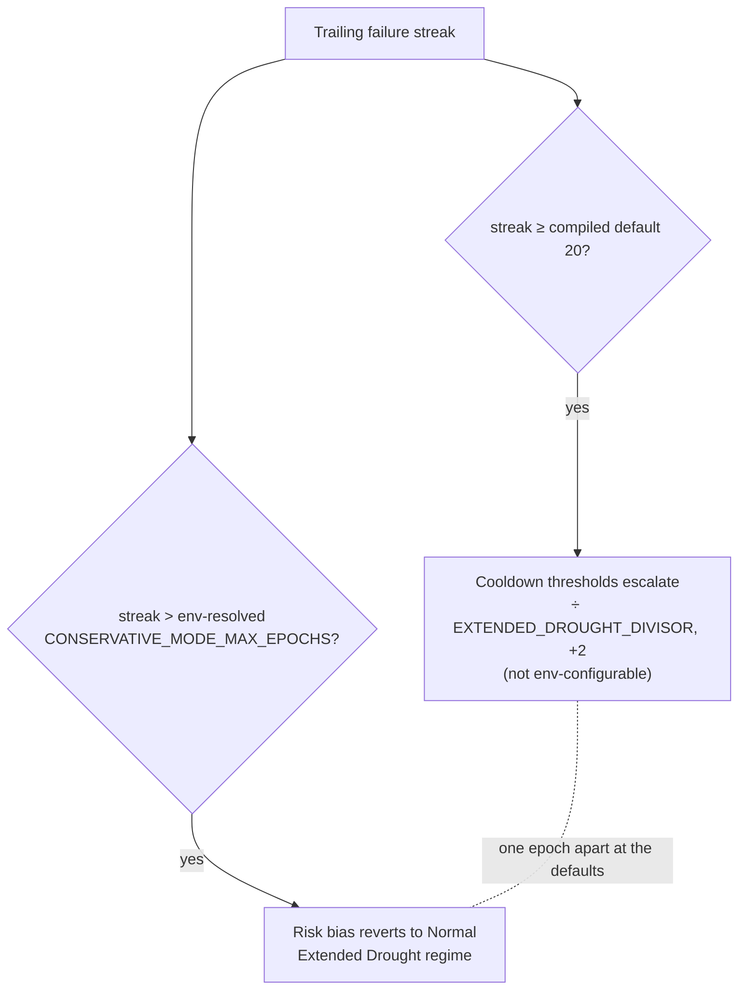

# Drought docs describe only surfaces the code can emit (Issue #1988)

## Summary

`docs/DROUGHT_PLAYBOOK.md` and one `docs/CONFIGURATION.md` row still described
drought-diagnostic surfaces the code cannot emit — residuals the #1937 / #1941
fixes did not reach. These docs are the operator's incident runbook, so a false
field name costs time at exactly the moment there is least slack. Closes #1988.

Four defects fixed, each pinned by a test that first proves the real behaviour
and then asserts the prose agrees:

1. **Six phantom `droughtDiagnostic` fields removed.** `dominantFailedModule`,
   `dominantFailedModuleShare`, `dominantFailedTargetUuid`,
   `dominantFailedTargetShare`, `dominantOperationCount` and
   `predictedVsActualGapP50` appeared in the JSON example, the prose beneath it
   and six rows of the walkthrough lever table. `DroughtDiagnostic` has exactly
   nine fields and has never carried any of them — #1937 already struck the same
   six rows from `docs/FFI_API.md`; the Playbook copy was missed.
2. **Rejection-reason names corrected to the stable constants.**
   `budget_exceeded` → `budget_truncated`, `cooldown_skipped` →
   `target_cooldown_skipped`, and `duplicate` / `redundant_path` →
   `duplicate_of_failure_cache` / `same_target_squash_duplicate`
   (`redundant_path` is a discovery module, not a rejection reason). The
   suppression-layer Mermaid node was corrected too, and the table now points at
   `ALL_REJECTION_REASONS` as the authoritative list.
3. **Stale reset description struck from `docs/CONFIGURATION.md`.** The
   `DROUGHT_RESET_AFTER_EPOCHS` row no longer claims the reset clears
   "failed-candidate cache entries" — that half went with `CandidateOutcomeCache`
   in #1792, leaving the cooldown tracker as the reset's only clearable input.
4. **Boundary and worked-example drift.** The adaptive-cooldown escalation
   compares the streak against the **compiled default**
   `DEFAULT_CONSERVATIVE_MODE_MAX_EPOCHS` with `≥`, while the risk-bias revert
   uses the env-resolved value with `>` — so
   `NEAT_AI_DISCOVERY_CONSERVATIVE_MODE_MAX_EPOCHS` moves the bias revert but not
   the cooldown escalation, and at the defaults the two land one epoch apart.
   Both facts are now documented (Adaptive Responses + the Operator Levers row).
   The worked example was resplit accordingly (streak 20 escalates the cooldown,
   streak 21 reverts the bias) and no longer claims the default 50-epoch escape
   hatch fires inside a 30-epoch drought, nor tells the operator to "enable" a
   lever that is armed by default.

The compiled-default pinning is **documented, not changed**: reading the env
value in `target_failure_tracker.rs` would alter runtime behaviour for anyone
already setting the variable, which is out of scope for a documentation audit.

## Evidence

This is a documentation change to a Rust library — there is no web interface to
screenshot. The evidence is the new contract test suite, which fails against the
pre-fix docs and passes after them.

Before the fix (all eight tests red):

```text
test result: FAILED. 0 passed; 8 failed
`budget_exceeded` is not in ALL_REJECTION_REASONS — the playbook names a reason the code cannot emit
the playbook must not document dominantFailedModule: no such field is ever emitted
the lever table must not carry rows for fields that are never emitted: left: 15  right: 9
the candidate cache went with CandidateOutcomeCache (#1792): | `NEAT_AI_DISCOVERY_DROUGHT_RESET_AFTER_EPOCHS` | 50 | … failed-candidate cache entries …
```

After the fix:

```text
running 8 tests
test every_documented_rejection_reason_is_a_stable_reason_name ... ok
test the_configuration_reset_row_describes_only_the_cooldown_clearing ... ok
test the_cooldown_escalation_boundary_is_pinned_to_the_compiled_default ... ok
test the_invented_reason_names_appear_nowhere_in_the_playbook ... ok
test the_playbook_documents_only_the_nine_emitted_diagnostic_fields ... ok
test the_suppression_layer_diagram_names_only_stable_reasons ... ok
test the_walkthrough_lever_table_has_one_row_per_emitted_field ... ok
test the_worked_example_does_not_claim_the_default_reset_fires ... ok

test result: ok. 8 passed; 0 failed
```

The two drought boundaries the docs now distinguish:



## Test Plan

New file `tests/issue_1988_drought_docs_contract.rs` — eight tests, each proving
the code's real behaviour before asserting the prose:

- `the_playbook_documents_only_the_nine_emitted_diagnostic_fields` — serialises a
  diagnostic returned by `emit_drought_diagnostic`, asserts exactly nine wire
  keys, that none of the six phantoms is among them, and that the playbook names
  every real key and no phantom.
- `the_walkthrough_lever_table_has_one_row_per_emitted_field` — parses the lever
  table and asserts row-for-row parity with the emitted key set.
- `every_documented_rejection_reason_is_a_stable_reason_name` — every backticked
  reason in the common-reasons table must be in `ALL_REJECTION_REASONS`.
- `the_suppression_layer_diagram_names_only_stable_reasons` — same check against
  the Mermaid rejection node.
- `the_invented_reason_names_appear_nowhere_in_the_playbook` — regression guard
  for the three invented names plus `redundant_path`.
- `the_configuration_reset_row_describes_only_the_cooldown_clearing` — runs
  `maybe_perform_drought_reset`, asserts the outcome clears cooldowns only, then
  asserts the CONFIGURATION.md row says exactly that.
- `the_cooldown_escalation_boundary_is_pinned_to_the_compiled_default` — proves
  `effective_cooldown_epochs` escalates at streak `== 20` while `decide_mode` is
  still `Conservative` at that streak, then asserts the playbook documents the
  pinning and the `≥`.
- `the_worked_example_does_not_claim_the_default_reset_fires` — proves
  `maybe_perform_drought_reset` returns `None` at a 30-epoch streak with the
  default 50-epoch threshold, then asserts the example does not claim otherwise.

Full `./quality.sh` (fmt, clippy, `cargo deny`, check, test, release build) run
clean.
