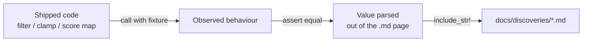

## Summary

Six per-scenario pages under `docs/discoveries/` quoted weight caps, activation
score maps and improvement formulas the code replaced up to the #888 era. Issue
#1938 corrected `docs/DISCOVERY_TYPES.md` and `docs/ANALYSIS_DEEP_DIVE.md` but
never swept the scenario pages beneath them, so the two levels of the same
documentation tree disagreed — and the worked examples illustrated candidates the
shipped clamps make impossible to emit. Closes #1989.

Every corrected claim is now pinned to observable behaviour of the real code by
`tests/issue_1989_scenario_docs_contract.rs`, so the pages cannot silently drift
again. Following the convention `docs/COST_FUNCTION_NOTES.md` mandates, the pages
cite constant names (`file.rs::CONSTANT`) rather than bare values wherever
practical.

### What changed per page

| Page | Was | Now |
|------|-----|-----|
| `add-neuron.md` | \|incoming\| ≤ 20, \|outgoing\| ≤ 0.1, \|bias\| ≤ 10; ratio ≥ 50 only | ≤ 5.0 / ≤ 0.01 / ≤ 2.0 citing `MAX_INCOMING_WEIGHT`, `MAX_OUTGOING_WEIGHT`, `MAX_BIAS_MAGNITUDE` and their `SENSIBLE_*_ABS_MAX` enforcement, with the Issue #888 provenance; ratio row now names `MIN_WEIGHT_RATIO` (50, IDENTITY) **and** `MIN_WEIGHT_RATIO_NON_LINEAR` (10); new note on the #905 non-linear calculation ceiling (`MAX_OUTGOING_WEIGHT_NON_LINEAR`, 0.03) that the sensible-range filter still trims to 0.01. Example outgoing weight 0.08 → 0.008. |
| `add-synapse.md` | "capped at ±0.1" (×2); worked weights 0.04–0.08, i.e. 4–8× above the real clamp | Clamp cited as ±`MAX_OUTGOING_WEIGHT` (0.01) with the #888 cache evidence; every worked weight rescaled into the 1e-3 band (0.008, 0.006, −0.004, 0.007) |
| `activation-recommendation.md` | Four of five flowchart branches drifted; "LEAKYRELU (0.85)" is in no score map | Score pairs regenerated from `classify_activation_suitability`: Sparse RELU 0.9 / RELU6 0.85, Bounded LOGISTIC 0.9 / HARD_TANH 0.85, Bimodal TANH 0.7 / HARD_TANH 0.7, Uniform TANH 0.75 / IDENTITY 0.7. Worked example recomputed with the real gradient-flow penalty: RELU 0.375 (not 0.60), delta 0.525, expected improvement 0.0105 |
| `sample-weighted.md` | `min(weighted_mean_error × hard_to_easy_ratio × 0.01, 0.1)` | `min(weighted_mean_error × min(hard_to_easy_ratio, 10) × 0.01, 0.1)`; example corrected 0.068 → 0.038 |
| `input-sensitivity.md` | "Scale to dominance_threshold × 0.8"; example answer 1.6 | The real expression — `weight × min(dominance_threshold × 0.8 / sensitivity_score, WEIGHT_REDUCTION_FACTOR)` — with the 0.3 floor named; example answer 0.33. The threshold-effect `setWeight` row no longer quotes a `gradient × 0.3` weight the code never computes |
| `remove-low-impact.md` | "impact < costOfGrowth (1e-7)" criterion; "highest success-rate type 🏆" | Criterion delegated to `FOCUS_SELECTION.md` §4.1 (`boostedSavings > contribution`, `REMOVAL_CANDIDATE_BOOST` 1.5×), matching `DISCOVERY_TYPES.md`; example reworked to the §4.1 inequality; superlative dropped — `change-squash` leads at 18.2% vs 17.6% |

## Evidence

No web interface is involved — this is a documentation correction guarded by
integration tests. The evidence is the new contract suite, which fails against
the pre-fix pages and passes after.

```
running 9 tests
test activation_page_score_pairs_match_the_shipped_score_maps ... ok
test activation_page_worked_example_matches_the_shipped_scores ... ok
test add_neuron_page_quotes_the_post_888_sensible_ranges ... ok
test add_neuron_worked_example_survives_the_sensible_range_filter ... ok
test add_synapse_page_weights_survive_the_shipped_clamp ... ok
test input_sensitivity_page_states_the_real_weight_scaling ... ok
test remove_low_impact_page_delegates_the_criterion_to_focus_selection ... ok
test remove_low_impact_page_drops_the_highest_success_rate_claim ... ok
test sample_weighted_page_states_the_ratio_clamp ... ok

test result: ok. 9 passed; 0 failed
```

Each test proves the claim from the code *first*, then asserts the page agrees
with what it just proved — so the assertions cannot rot into pure text matching:



## Test Plan

Added `tests/issue_1989_scenario_docs_contract.rs` (9 tests). Each drives real
functions with fixtures and compares the result against the value parsed out of
the page:

- `add_neuron_page_quotes_the_post_888_sensible_ranges` — proves
  `filter_candidates_to_sensible_ranges` accepts 5.0 / 0.01 / 2.0 and rejects
  20 / 0.1 / 10, then asserts the constraint table quotes the former and names
  `MIN_WEIGHT_RATIO_NON_LINEAR`.
- `add_neuron_worked_example_survives_the_sensible_range_filter` — parses the
  example's incoming weight, outgoing weight, bias and activation and feeds them
  through the real filter (fails on the old 0.08).
- `add_synapse_page_weights_survive_the_shipped_clamp` — proves
  `calculate_optimal_outgoing_weight` pins an over-large weight to
  `MAX_OUTGOING_WEIGHT`, then asserts every weight the page quotes is within it.
- `activation_page_score_pairs_match_the_shipped_score_maps` — extracts every
  `NAME (score)` pair from the flowchart and checks it against
  `classify_activation_suitability` for that class; an activation absent from the
  map (the old `LEAKYRELU`) fails outright.
- `activation_page_worked_example_matches_the_shipped_scores` — rebuilds the
  example's `InputDistribution` from its own metric table, then verifies every
  tabulated score, the improvement delta and the ×0.02 expected improvement.
- `sample_weighted_page_states_the_ratio_clamp` — a 100-easy/100-hard fixture
  yields a ratio of 18; asserts `detect_high_error_neurons` scales by the clamped
  10 (and that clamped ≠ unclamped for this fixture), then that the page states
  the clamp and recomputes its own example with it.
- `input_sensitivity_page_states_the_real_weight_scaling` — a weight-3.2 input
  perfectly correlated with the target error; asserts
  `detect_dominant_inputs` scales the existing weight and does *not* set it to
  `dominance_threshold × 0.8`, then recomputes the page's example.
- `remove_low_impact_page_delegates_the_criterion_to_focus_selection` — shows
  `detect_low_impact_neurons` still flags a neuron whose activation is five
  orders of magnitude above the 1e-7 `costOfGrowth` default, disproving the old
  criterion, then asserts the page delegates to §4.1.
- `remove_low_impact_page_drops_the_highest_success_rate_claim` — parses both
  success rates out of `DISCOVERY_TYPES.md` and asserts `change-squash` still
  outranks `remove-low-impact`, so the superlative must stay gone.

No existing tests were modified or removed. Full `./quality.sh` passes (fmt,
clippy `-D warnings`, check, cargo-deny, test, release build).
