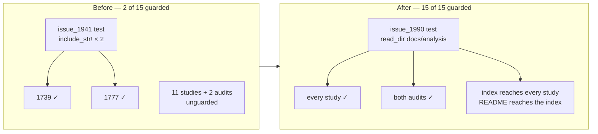

# Point-in-time studies and audits no longer state superseded facts as current

## Summary

The repo's point-in-time studies stated superseded facts in the present tense,
and the repo's own convention for preventing exactly that — the dated "as at"
header plus inline supersession notes mandated by `docs/archive/README.md` — was
unmet by 11 of 13 `docs/analysis/*.md` studies and both `docs/`-level audits, and
was test-enforced for only two files. An agent picking up one of these studies
would plan work against a pipeline that no longer exists: re-proposing #1923's
gate resolver, re-diagnosing #1802's closed counter, or re-implementing #1711's
shipped detector.

This change annotates the superseded claims, enforces the convention with a test
that iterates the directory rather than naming two files, and adds the index that
makes the studies reachable in the first place. No engine behaviour changes.

**Closes #1990.**

### What changed

1. **Dated "as at" headers** on all 13 `docs/analysis/*.md` studies and both
   `docs/`-level audits (11 + 2 added; #1739 and #1777 already had one).
2. **Inline supersession notes** on each headline stale claim, naming the issue
   that closed it and keeping the still-true halves explicitly:

   | Document | Claim | Closed by |
   | --- | --- | --- |
   | `candidates-cache-study-1920.md` | `meanActivation` hard-coded to `0.0`, "the gate never runs" | #1923 (`activation_weighting.rs::resolve_activation_weighted_gate`) |
   | `candidates-cache-study-1920.md` | follow-up table listing #1923/#1924/#1925 as open | all three shipped — status column added |
   | `candidate-rate-diagnosis-1777.md` | "the `previous_neuron_fingerprints` half stands as written" | #1781 (`fingerprint_skip_escape.rs::should_bypass_fingerprint_cache`) |
   | `candidate-rate-diagnosis-1777.md` | `functionally_constant_neuron_uuids` returns an empty `HashSet` | #1813 structural fixpoint |
   | `candidate-rate-diagnosis-1777.md` | `is_constant_neuron` gate | renamed to `discovery_dispatch.rs::accepted_constant_bias_fold` |
   | `rejection-diagnosis-1737.md` | `below_improved_ratio` "never incremented" | #1802 — **`interference_filtered` half kept, it still holds** |
   | `rejection-diagnosis-1737.md` | floor verdict contradicting #1740, with no cross-link | #1778 settled it; both docs now cross-link |
   | `threshold-review-1740.md` | "floors are correctly scaled, no floor change" | #1778 rescale, #1812 sole-op carve-out |
   | `snapshot-mining-1631.md` | dormant detector skips `\|weight\| > 1e-4` | #1632 contribution-first detection |
   | `CANDIDATE_PIPELINE_MCMC_AUDIT.md` | `SYNAPSE_PREDICTION_CALIBRATION = 0.001`, pessimism 0.05/0.85, `order_focus_targets()` in `orchestration.rs` | today 0.0003, 0.03/0.9, `utils/deadline.rs` |
   | `CANDIDATE_PIPELINE_MCMC_AUDIT.md` | §6.2 adaptive proposal listed as future work | #1019 added to the Postscript |
   | `DOMINATED_BRANCH_COLLAPSE_EXTENT.md` | "no dominance detection at all … extent is zero" | #1711 (the same doc's own register already said so) |

3. **`docs/analysis/README.md` index** — issue number, "as at" date and
   current/superseded status per study, plus the two audits — linked from the
   root README documentation table.
4. **Rotted line-number citations** replaced with the `file.rs::symbol`
   convention already used by `remove-neuron-reachability-1785.md` and
   `COST_FUNCTION_NOTES.md`.

### Enforcement, before and after



## Evidence

Documentation and test change only — no web interface to screenshot, and no
engine behaviour altered, so no benchmark applies. The evidence is the test
suite: each supersession test first proves the *current* behaviour by calling
the real code, then asserts the prose agrees. That ordering is what stops the
tests degrading into source-text greps — if #1923's resolver were reverted, the
behavioural half fails before the prose half is ever checked.

```text
running 9 tests
test every_point_in_time_document_carries_a_dated_as_at_header ... ok
test the_1631_snapshot_study_annotates_the_contribution_first_detector ... ok
test the_1737_diagnosis_annotates_the_wired_below_improved_ratio_counter ... ok
test the_1740_threshold_review_annotates_the_rescaled_floor ... ok
test the_1777_diagnosis_annotates_the_shipped_fingerprint_escape ... ok
test the_1920_study_annotates_the_resolved_activation_gate ... ok
test the_analysis_index_lists_every_study_and_the_readme_links_it ... ok
test the_dominated_branch_report_annotates_the_shipped_detector ... ok
test the_mcmc_audit_agrees_with_the_shipped_calibration_constants ... ok

test result: ok. 9 passed; 0 failed
```

Each was confirmed failing against the un-annotated docs before the annotations
were written (TDD): all nine failed on the first run, each on its prose
assertion, with the behavioural assertions already passing.

## Test Plan

New file `tests/issue_1990_analysis_docs_contract.rs` — nine tests:

| Test | Real code it proves against |
| --- | --- |
| `every_point_in_time_document_carries_a_dated_as_at_header` | iterates `docs/analysis/*.md` via `read_dir` plus both audits — new studies are covered automatically |
| `the_analysis_index_lists_every_study_and_the_readme_links_it` | same directory listing, asserted against the index and the root README |
| `the_1920_study_annotates_the_resolved_activation_gate` | `activation_weighting.rs` writes `candidate.mean_activation` back |
| `the_1737_diagnosis_annotates_the_wired_below_improved_ratio_counter` | `EvaluationDropCounters::drop_below_improved_ratio` increments the counter |
| `the_1740_threshold_review_annotates_the_rescaled_floor` | `GAIN_FLOOR_NOISE_BACKSTOP` is in the shipped constants |
| `the_1631_snapshot_study_annotates_the_contribution_first_detector` | `detect_dormant_synapses` flags a `\|weight\| = 5.0` synapse whose source never activates — the retired weight-magnitude skip would have missed it |
| `the_1777_diagnosis_annotates_the_shipped_fingerprint_escape` | `should_bypass_fingerprint_cache` releases the cache after a drought streak |
| `the_mcmc_audit_agrees_with_the_shipped_calibration_constants` | reads `SYNAPSE_PREDICTION_CALIBRATION` / pessimism floor / exponent from the constants and requires the audit to state them |
| `the_dominated_branch_report_annotates_the_shipped_detector` | `detect_dominated_branches` finds exactly one dominated branch in the #1705 MAXIMUM fixture |

No existing test was modified, commented out, or removed. The pre-existing
`tests/issue_1941_drought_docs_contract.rs` still passes unchanged — its two
`include_str!`-pinned files remain covered by it, and are now also covered by the
directory-iterating test here. A new file was used rather than extending #1941 to
keep each test file focused on one issue, matching the repo's
`issue_NNNN_description.rs` convention.

## Security Self-Check

- **Input validation**: no new external input surface — the tests read files
  under `CARGO_MANIFEST_DIR` only.
- **Secrets**: none staged; the change is Markdown, one test file, and a version
  bump.
- **Injection surface**: none added.
- **Dependencies**: none added.
