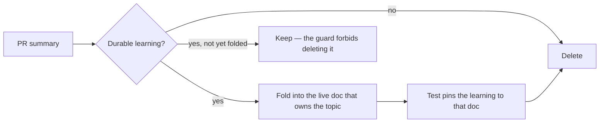

# Resolve the PR-summary retention contradiction and fold seven learnings

## Summary

The rule governing what happens to a PR summary after its learnings are captured
was stated three contradictory ways, so a worker could not know whether "then
delete" was mandatory or forbidden — which blocked every fold issue. The
contradiction is resolved in favour of the operative #1682 rule (**fold, then
delete**, with capture as the precondition), and the seven durable learnings that
lived only in the summary archive are folded into the live docs that own them.
Closes #1991.

### The contradiction, resolved at all three sites

| Site | Was | Now |
| --- | --- | --- |
| `docs/archive/pr-summaries/README.md` | "fold, then delete … capture is the **precondition** for deletion" | unchanged — this is the operative rule |
| `docs/archive/README.md` tier table | "then **leave the summary alone**" | "then delete the summary — capture is the precondition for deletion, never the other way round" |
| `scripts/check-pr-summary-location.sh` | "**never delete** — the learnings must be preserved" | "never delete an **unfolded** summary — fold its durable learnings into the live docs first, then delete it" |

Deletion stays conditional on capture: the no-dropped-negative-result guarantee
in `pr-summaries/README.md` is untouched.

### The seven learnings folded

| # | Learning | Target |
| --- | --- | --- |
| 1 | The nightly toolchain is deliberately **not** date-pinned — `-Z sanitizer` / `libfuzzer-sys` support goes stale, and rustup's signed channel carries no third-party `build.rs` (#1912) | `README.md` § Fuzz Testing, cross-noted in `quality/cargo_install_pinning.sh` |
| 2 | A process-wide singleton needs an injectable **value seam**; `#[serial]` alone is not enough — a tripped global breaker cascaded into 12 unrelated failures (#1929, #1930) | `CONTRIBUTING.md` § Test Organisation |
| 3 | GPU-queue fixture trap — holding the exit-channel sender past queue drop fabricates an `abandoned_threads` report and 30 s of dead wall clock, making the documented breaker regression signal lie (#1930) | `docs/GPU_GUIDE.md` breaker section |
| 4 | `crossbeam_channel::Sender::receiver_count()` does not exist on the 0.5 line — why stale-request liveness is `Arc`/`Weak`-based (#1929) | `docs/GPU_GUIDE.md` stale-skip section |
| 5 | Raising `SAMPLE_TIMEOUT_SECS` / retrying the sampler was evaluated and **rejected** (#1934) | `docs/GPU_GUIDE.md` § degraded dump |
| 6 | Direction of fix — a half-wired documented capability gets **wired, not deleted** (#1937) | `docs/archive/README.md` |
| 7 | Cite code by symbol (`<file>.rs::<function>`), never by bare line number (#1942) | `CONTRIBUTING.md` § Code Style |

Learnings 1, 3, 4 and 5 are negative results — the class the archive exists to
preserve and the class most at risk of silent re-attempt, so each is written as
an explicit "do not re-attempt this".

With every learning captured, `pr-summary-1912.md`, `pr-summary-1929.md`,
`pr-summary-1930.md`, `pr-summary-1934.md`, `pr-summary-1937.md` and
`pr-summary-1942.md` are deleted per the retention rule.

## Evidence

Documentation change — there is no web interface to screenshot. The evidence is
`tests/issue_1991_pr_summary_retention_contract.rs` (16 tests, all green), which
grounds each doc claim in the real code rather than asserting prose alone:

- `the_breaker_seam_the_convention_describes_really_exists` constructs an
  isolated `GpuCircuitBreaker`, trips it, and asserts `global_gpu_breaker()` is
  still closed — the seam CONTRIBUTING.md now documents.
- `crossbeam_is_still_on_the_line_the_note_describes` reads `Cargo.lock` and
  fails loudly if `crossbeam-channel` leaves 0.5.x, so learning 4's note gets
  revisited rather than silently rotting.
- `the_sample_timeout_is_still_the_bound_the_note_defends` asserts the exported
  `SAMPLE_TIMEOUT_SECS` is still the 5 s bound the rejection argument defends.
- `the_location_guard_passes_on_the_committed_tree` executes
  `scripts/check-pr-summary-location.sh` and asserts exit 0.

`./quality.sh` passes: `cargo deny`, the `cargo install` pinning gate, the
PR-summary location guard, `cargo fmt --check`, `clippy -D warnings`,
`cargo check --all-targets --all-features`, the full test suite, `cargo doc`, and
the release build.

## Test Plan

- **Added** `tests/issue_1991_pr_summary_retention_contract.rs` — 16 tests:
  - Retention rule: `the_archive_tier_table_says_fold_then_delete`,
    `the_location_guard_forbids_deleting_only_unfolded_summaries`,
    `the_canonical_retention_rule_keeps_capture_as_the_precondition`,
    `the_location_guard_passes_on_the_committed_tree`.
  - Folded learnings: `readme_records_why_the_nightly_toolchain_is_not_date_pinned`,
    `the_pinning_gate_cross_notes_the_nightly_exemption`,
    `contributing_requires_a_value_seam_for_process_wide_singletons`,
    `the_breaker_seam_the_convention_describes_really_exists`,
    `gpu_guide_records_the_exit_channel_fixture_trap`,
    `gpu_guide_records_why_liveness_is_arc_based`,
    `crossbeam_is_still_on_the_line_the_note_describes`,
    `gpu_guide_records_the_rejected_sample_timeout_increase`,
    `the_sample_timeout_is_still_the_bound_the_note_defends`,
    `the_archive_readme_records_the_direction_of_fix_rule`,
    `contributing_requires_symbol_anchored_doc_references`.
  - Retention discipline: `folded_summaries_were_deleted_after_capture` asserts
    all six summaries are gone — and it only passes because the eleven capture
    tests above pass first.
- **Modified** `tests/issue_1941_drought_docs_contract.rs` —
  `the_archive_readme_documents_every_documentation_tier` now also asserts the
  transient tier row no longer says "leave the summary alone". No existing
  assertion was removed or weakened; this test owns the tier table, so it moves
  with it.
