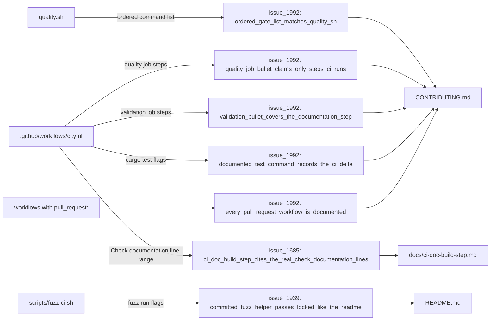

# PR Summary — Issue #1992

## Summary

`CONTRIBUTING.md`'s CI description had drifted from the installed workflows, and
the README's fuzzing section promised a `--locked` guarantee the recommended
helper script did not deliver. Corrected the prose against the artefacts and
added derived guards so the same drift fails a test rather than a debugging
session. Closes #1992.

**Documentation corrections (`CONTRIBUTING.md`)**

- The `quality` job bullet claimed "cargo check, doc build" — the job
  (`ci.yml`) runs fmt check, Clippy, `cargo build --lib`, an artefact cleanup,
  then tests. It now says so, and points at `./scripts/doc-check.sh` because no
  workflow builds the docs.
- The ordered `quality.sh` list omitted `./quality/cargo_install_pinning.sh`
  (Issue #1912), which runs between the ShellCheck gate and the PR-summary
  layout check. Inserted at its true position and the list renumbered to 12.
- Five installed, PR-triggered workflows were undocumented: `cargo-quality.yml`
  (Coverage), `markdown-lint.yml`, `semgrep.yml`, `gitleaks.yml`,
  `actionlint.yml`. All five are now listed, with a note on the
  `"*"` + `milestone/*` trigger pair.
- The `validation` bullet omitted its `Check documentation` step.
- CI's test command carries `--bins --verbose` on top of the documented local
  command; the delta is now recorded verbatim (`--bins` selects nothing — the
  crate declares no `[[bin]]` targets).

**Behavioural fix (`scripts/fuzz-ci.sh`)**

- `cargo +nightly fuzz run` now passes `--locked`, so CI fuzz runs resolve the
  committed `fuzz/Cargo.lock` the README annotates. Without it cargo re-resolved
  the graph and the reproducibility the README promised was silently void.

**Pointer fix (`docs/ci-doc-build-step.md`)**

- The pointer at CI's own documentation check was stale (`ci.yml:362-379`); the
  step now sits at `ci.yml:404-423`.

## Evidence

No web interface to screenshot — this is a documentation and shell-script
change. The evidence is the seven guards below, each of which fails against the
pre-fix tree (verified by running them before the fix) and passes after it.

Where the drift was, and what now derives each claim from its artefact:



Test output after the fix:

```text
test result: ok. 6 passed  (tests/issue_1992_ci_doc_accuracy.rs)
test result: ok. 11 passed (tests/issue_1939_documented_commands.rs)
test result: ok. 9 passed  (tests/issue_1685_doc_link_integrity.rs)
```

## Test Plan

New — `tests/issue_1992_ci_doc_accuracy.rs` (all assertions derive the expected
text from the artefact, so they survive unrelated edits):

- `quality_job_bullet_claims_only_steps_ci_runs` — the bullet's step list may
  not name `cargo check` or a doc build while the `quality` job runs neither.
- `ordered_gate_list_matches_quality_sh` — the documented list must match
  `quality.sh`'s commands one-for-one, in order (this is the assertion that
  caught the missing `cargo_install_pinning.sh` gate).
- `ordered_gate_list_is_numbered_sequentially` — no renumbering gaps.
- `every_pull_request_workflow_is_documented` — every workflow declaring a
  `pull_request:` trigger must be named in CONTRIBUTING.
- `validation_bullet_covers_the_documentation_step` — derived from the
  `validation` job's step names.
- `documented_test_command_records_the_ci_delta` — when CI's `cargo test` line
  differs from `quality.sh`'s, CONTRIBUTING must record CI's verbatim.

Extended:

- `tests/issue_1939_documented_commands.rs::committed_fuzz_helper_passes_locked_like_the_readme`
  — the committed `scripts/fuzz-ci.sh` (not just the proposed workflow file)
  must pass `--locked`. This is the regression test for the fuzz fix: it fails
  against the unfixed script and passes after it.
- `tests/issue_1685_doc_link_integrity.rs::ci_doc_build_step_cites_the_real_check_documentation_lines`
  — derives the `Check documentation` line range from `ci.yml` the way the
  existing test derives the `quality.sh` pointers, closing the gap that let the
  `ci.yml` pointer rot.

No existing tests were modified or removed. `./quality.sh` passes.
