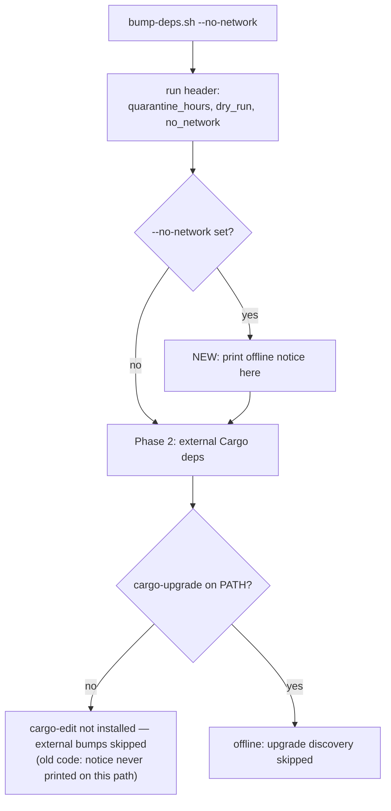

# `--no-network` notice is unreachable without cargo-edit (Issue #1994)

## Summary

`bump-deps.sh` printed its `--no-network` notice **inside** the
`command -v cargo-upgrade` branch. On a host with no cargo-edit installed the
script took the "external bumps skipped" branch, so the offline mode was never
logged and `tests/bump_deps_test.sh` Test 11
(`no-network mode reports skipped network`) failed — 68 passed, 1 failed on
macOS, identically at `Develop` HEAD and with `bump-deps.sh` stashed.

Offline is a mode of the **whole run**, not of the upgrade step, so the notice
now prints with the run header, before any tool-availability branch. The
upgrade step keeps a short, step-specific line (`(offline: upgrade discovery
skipped)`) so the log still explains why no candidates were discovered.
Closes #1994.



## Evidence

Backend/CLI change — no web interface to screenshot. Verified by running the
real script and the test suites.

Before the fix (script stashed, tests kept):

```text
Test 11: --no-network --dry-run does not fail when offline
  PASS: --no-network --dry-run exits 0
  FAIL: no-network mode reports skipped network (output did not match '(skipping network|--no-network|offline)')

Test 25: --no-network mode is reported on a host without cargo-edit
  FAIL: no-network notice printed without cargo-edit (output did not match '(skipping network|--no-network|offline)')
Passed: 70   Failed: 2
```

```text
test no_network_notice_prints_without_cargo_edit ... FAILED
test result: FAILED. 1 passed; 1 failed
```

After the fix:

```text
Test 25: --no-network mode is reported on a host without cargo-edit
  PASS: no-network notice printed without cargo-edit
  PASS: --dry-run --no-network exits 0 without cargo-edit
  PASS: cargo-edit-absent branch was actually taken
Passed: 72   Failed: 0   All tests passed.
```

```text
test no_network_notice_prints_without_cargo_edit ... ok
test run_without_no_network_does_not_claim_to_be_offline ... ok
test result: ok. 2 passed; 0 failed
```

## Test Plan

- **`tests/issue_1994_no_network_notice.rs` (new, gated by `cargo test`)**
  - `no_network_notice_prints_without_cargo_edit` — runs the real script under a
    sanitised `PATH`/`HOME` (cargo symlinked in, cargo-edit absent, empty `HOME`
    so `~/.cargo/env` cannot restore `~/.cargo/bin`), asserts exit 0, that the
    cargo-edit-absent branch was actually taken, and that the offline notice is
    still printed. Fails against the unfixed script.
  - `run_without_no_network_does_not_claim_to_be_offline` — a plain `--dry-run`
    in the same environment must not report offline mode.
- **`tests/bump_deps_test.sh` Test 25 (new)** — the same contract at the shell
  level, with a fail-loud guard if a cargo-edit-free `PATH` cannot be
  constructed. Existing Test 11 is unchanged and now passes on hosts without
  cargo-edit.
- `./quality.sh` (bash syntax, ShellCheck, `cargo deny`, clippy, full test
  suite, docs, release build) passes.
