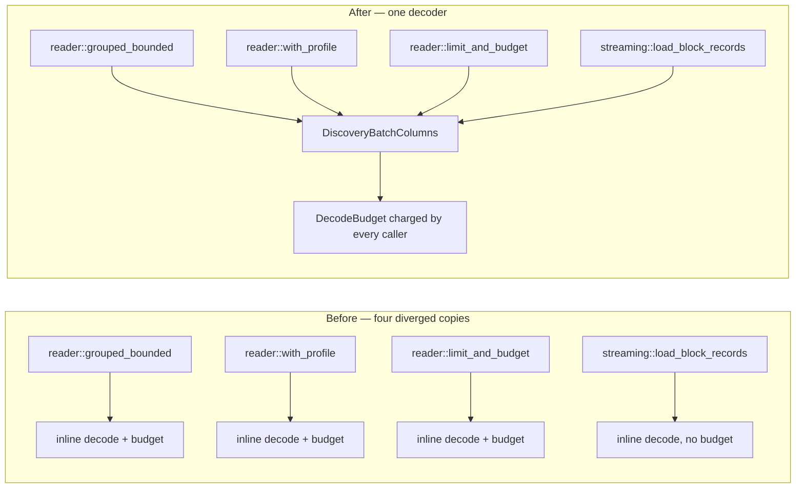

# One shared decoder for discovery Parquet batches (Issue #2005)

## Summary

The rule for decoding a batch of discovery Parquet rows into `DiscoverRecord`s —
resolve `obs_index` / `neuron_uuid` / `value` / `activation` / `errors` by name,
downcast each to its Arrow type, then per row read the nullable `value` and
decode the `errors` list — was copy-pasted into four live readers, and the copies
had diverged. This PR extracts a single decoder,
`parquet_format::batch_columns::DiscoveryBatchColumns`, and calls it from all
four sites. Closes #2005.

Each caller keeps its own row filtering, grouping and budget policy; the decoder
owns only column resolution and per-row decoding, with `include_errors` as the
one axis the callers vary (mirroring `ColumnProfile`'s errors projection,
Issue #1073). No parameterised super-helper was needed — every caller reduced to
a `resolve` + `decode_row` pair.

Reconciling the divergence fixes two real defects in the streaming path:

- **Issue #1869 (decode budget)** — the streaming block loader charged nothing,
  so it was the only decode path where oversized UUIDs or `errors` lists
  materialised unbounded. It now resolves and charges the same `DecodeBudget`,
  bounded by `NEAT_AI_DISCOVERY_MAX_PARQUET_DECODE_MB` (or half of total RAM).
- **Issue #1482 (schema-mismatch wording)** — the three `reader.rs` copies
  reported `Missing obs_index column` while the streaming copy reported
  `Parquet schema mismatch: missing 'obs_index' column`. All paths now emit the
  latter, so one grep finds every decode path.

A prefetch failure in the streaming thread previously passed silently
(`if let Ok(...)`); it now logs a warning naming the block and the error, since
a decode-budget abort can reach that thread.

## Evidence

Backend/library change with no web interface, so no screenshot applies. The
behavioural evidence is the test suite below.

Call sites before and after:

Line counts: `src/parquet_format/reader.rs` loses ~200 lines of duplicated
resolution/decoding; `src/analysis/streaming.rs` loses ~60.

## Test Plan

Unit tests — `src/parquet_format/batch_columns.rs`:

| Test | Verifies |
|------|----------|
| `decodes_every_column_including_nullable_value_and_error_lists` | A batch built against `create_schema` decodes with the correct `obs_index`, UUID, activation, `Some`/`None` `value`, and variable-length `errors` lists. |
| `skipping_errors_yields_empty_error_lists` | `include_errors = false` produces empty `errors` vecs while nullability still decodes correctly. |
| `a_missing_column_is_a_recoverable_schema_mismatch` | A short schema returns `Parquet schema mismatch: missing 'obs_index' column` rather than panicking — the single wording every reader now shares. |
| `a_wrongly_typed_column_is_a_recoverable_cast_failure` | A `Utf8` `obs_index` returns `Failed to cast obs_index column`. |

Integration tests — `tests/issue_2005_shared_batch_decoder.rs`:

| Test | Verifies |
|------|----------|
| `every_reader_decodes_a_batch_identically` | All four readers (grouped, UUID-filtered, observation-limited, streaming block loader) return byte-identical records for a file containing a null `value`, an empty `errors` list, and lists of differing lengths. |
| `the_without_errors_profile_still_yields_empty_error_lists` | The `WithoutErrors` projection still returns every row, with empty `errors` and correct nullability. |
| `the_streaming_block_loader_charges_the_decode_budget` | Regression for the #1869 divergence: with `NEAT_AI_DISCOVERY_MAX_PARQUET_DECODE_MB=1`, `StreamingRecordCache::get` fails with a typed `MemoryExhausted` error naming the decode budget. Fails against the unfixed code, which returned all 10,000 records. |
| `the_streaming_block_loader_succeeds_within_a_generous_budget` | A 4 GB budget leaves the streaming path working as before. |

Existing coverage kept green: `tests/issue_1869_parquet_decode_bound.rs`,
`tests/issue_1406_shared_parquet_decode.rs`,
`tests/recording/issue_193_streaming_parquet.rs`, plus the full `./quality.sh`
gate (fmt, clippy `-D warnings`, check, test, release build).

## Security Self-Check

- **Input validation** — the decoder resolves columns by name and downcasts
  defensively; a missing or wrongly-typed column returns a recoverable error
  instead of a panic (`RecordBatch::column(index)` panics out of bounds).
- **Fail loud** — the streaming path now charges the decode budget and a
  prefetch failure logs a warning rather than being discarded silently.
- **Secrets / injection / output encoding / auth** — not applicable; no new
  external input, no new dependency, no I/O surface added.
