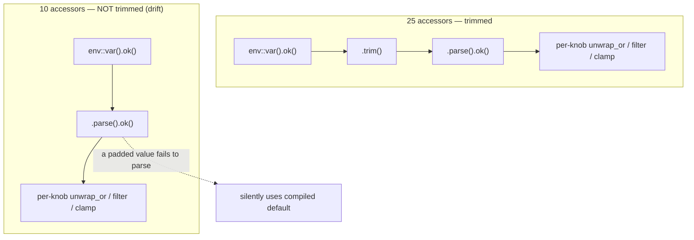
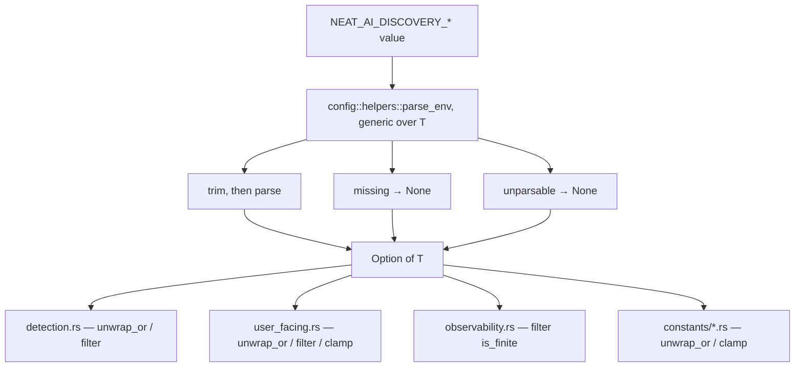

# Numeric env-override parse chain unified in one helper (Issue #2006)

## Summary

The rule for reading a numeric `NEAT_AI_DISCOVERY_*` override —
`std::env::var(name).ok()`, trim, `parse().ok()` — was copy-pasted into 35
accessors across `src/config/` and `src/analysis/constants/`, and the copies had
**diverged**: 25 trimmed before parsing and 10 did not. A value carrying stray
whitespace (a trailing newline from a shell heredoc, `VAR: " 5 "` in a YAML
`env:` block) therefore tuned most knobs but **silently fell back to the
compiled default** for those ten — a lever the operator set and that changed
nothing.

This PR adds the numeric flavour of the rule beside the boolean ones already in
`src/config/helpers.rs`, and routes every accessor through it:

```rust
pub(crate) fn parse_env<T: std::str::FromStr>(name: &str) -> Option<T> {
    std::env::var(name).ok().and_then(|v| v.trim().parse().ok())
}
```

Only the *parse* rule is shared. The per-knob policy that follows —
`unwrap_or`, `filter`, `clamp` bounds — is **not** shared knowledge and stays at
each call site, so `parse_env` takes no behaviour flags beyond the target type.

**Behaviour change:** the ten previously-untrimmed knobs now honour a padded
value instead of silently discarding it. The 25 already-trimmed knobs are
unchanged. No fallback, filter or clamp bound moved.

Closes #2006.

### Knobs that changed behaviour

| Accessor | File |
|----------|------|
| `noise_signal_threshold` | `src/config/detection.rs` |
| `dominance_threshold` | `src/config/detection.rs` |
| `gradient_threshold` | `src/config/detection.rs` |
| `gpu_batch_size_override` | `src/config/user_facing.rs` |
| `gpu_retry_limit` | `src/config/user_facing.rs` |
| `watchdog_stall_timeout` | `src/config/user_facing.rs` |
| `watchdog_abort_delay` | `src/config/user_facing.rs` |
| `max_cached_blocks` | `src/config/user_facing.rs` |
| `prefetch_depth` | `src/config/user_facing.rs` |
| `block_size` | `src/config/user_facing.rs` |

### Files touched

| File | Call sites routed through `parse_env` |
|------|---------------------------------------|
| `src/config/helpers.rs` | helper added (+ unit tests) |
| `src/config/mod.rs` | `mod helpers` → `pub(crate) mod helpers` |
| `src/config/detection.rs` | 7 |
| `src/config/user_facing.rs` | 18 |
| `src/config/observability.rs` | 1 |
| `src/analysis/constants/candidate_scoring.rs` | 9 |
| `src/analysis/constants/detection_thresholds.rs` | 2 |

`src/config/mod.rs::parse_drought_threshold` is a documented test-isolation copy
taking `Option<&str>` rather than an env name, and is deliberately untouched.

## Evidence

This is a library/config change with no web interface, so there is no screenshot
to capture. The evidence is the test suite: the 8 new integration tests below
**failed before the change and pass after it**, with the failure output being
exactly the silent-fallback symptom the issue describes (e.g.
`noise_signal_threshold` returned the compiled default `0.75` for an override of
`" 0.25 "`).

### Before — the parse rule per accessor



### After — one shared rule, per-knob policy kept local



### Local verification

```
cargo clippy --all-targets --all-features -- -D warnings   # clean
cargo test --test issue_2006_numeric_env_override_trim     # 15 passed
cargo test --lib config                                    # 43 passed
```

## Test Plan

### New — `tests/issue_2006_numeric_env_override_trim.rs` (15 tests)

Regression tests for the divergence. Each sets a padded override on a real
accessor and asserts the knob is actually tuned; each is `#[serial]` because it
mutates process-wide env state.

- `noise_signal_threshold_tolerates_surrounding_whitespace` (**failed before**)
- `noise_signal_threshold_falls_back_when_unparsable`
- `dominance_threshold_tolerates_trailing_newline` (**failed before**)
- `gradient_threshold_tolerates_surrounding_whitespace` (**failed before**)
- `watchdog_stall_timeout_tolerates_surrounding_whitespace` (**failed before**)
- `watchdog_stall_timeout_disabled_for_zero_and_unparsable`
- `watchdog_abort_delay_tolerates_surrounding_whitespace` (**failed before**)
- `watchdog_abort_delay_falls_back_when_unparsable`
- `max_cached_blocks_tolerates_surrounding_whitespace` (**failed before**)
- `max_cached_blocks_is_none_when_unparsable`
- `prefetch_depth_tolerates_surrounding_whitespace` (**failed before**)
- `prefetch_depth_falls_back_when_unparsable`
- `block_size_tolerates_surrounding_whitespace_and_still_clamps` (**failed
  before**) — also pins that the per-knob clamp is unchanged
- `block_size_falls_back_when_unparsable`
- `outlier_percentile_keeps_trim_and_range_filter` — guards the other direction:
  an accessor that already trimmed keeps both its trim and its range filter

`gpu_batch_size_override` and `gpu_retry_limit` also regained the trim but
memoise into a process-wide `OnceLock`, so their value is frozen by whichever
test touches them first and they cannot be exercised in-process. Their trim is
covered by the helper's own unit tests, and the module doc comment records why.

### New — `src/config/helpers.rs` unit tests (5 tests)

Direct coverage of the shared rule, on a test-only env var name:

- `unset_variable_is_none` — happy-path absence
- `parses_a_clean_value` — integer and float targets
- `tolerates_surrounding_whitespace` — spaces, trailing newline, tabs
- `unparsable_and_empty_values_are_none` — junk, empty, all-whitespace, float
  into an integer target, negative into an unsigned target, overflow of the
  target type
- `interior_whitespace_is_not_stripped` — `" 4 2 "` stays a typo, not `42`

### Unchanged

No existing test was modified, commented out or removed. The full
`./quality.sh` gate (fmt, clippy `-D warnings`, `cargo deny`, check, tests,
release build) passes.

## Documentation

`docs/CONFIGURATION.md` — the authoritative variable reference — now states the
whitespace-tolerance contract once in its preamble, alongside the existing
"invalid values fall back to the default" sentence, and points at
`config::helpers::parse_env` as the single source of the rule.
