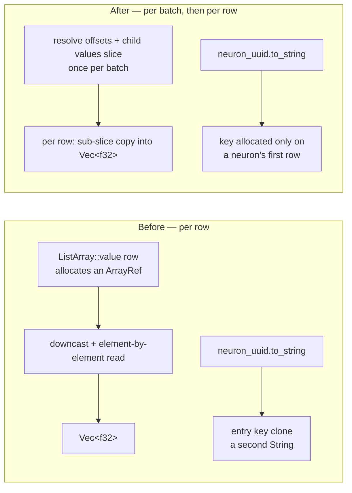

# PR Summary — Issue #2007

## Summary

Removed the avoidable per-row allocations from the discovery Parquet **read**
paths. Two allocations per decoded row are gone:

1. **The per-row Arrow array.** `DiscoveryBatchColumns::decode_row` called
   `ListArray::value(row)`, which builds a fresh `ArrayRef` — a heap allocation
   plus an atomic refcount — for every row, downcasts it, then reads it back one
   element at a time. The `errors` column is now flattened **once per batch**
   into its offsets and its child `&[f32]`, so a row's errors are a plain
   sub-slice copy.
2. **The per-row map key.** Both grouping readers keyed their
   `HashMap<String, Vec<DiscoverRecord>>` with `entry(record.neuron_uuid.clone())`,
   allocating a `String` for every row even though a recording holds thousands
   of rows per neuron. Only a neuron's *first* row allocates a key now.

All four read loops named in the issue benefit, because three of them
(`read_all_records_grouped_by_neuron_bounded`,
`read_records_from_parquet_with_profile`,
`read_records_from_parquet_with_limit_and_budget`) share
`DiscoveryBatchColumns` and the fourth
(`StreamingRecordCache::load_block_records`) shares both it and the grouping
fix. #2005's shared decoder was already on `Develop`, so this change only
optimises it — no extraction was needed.

Behaviour is unchanged, and malformed offsets now fail loud with a recoverable
error instead of panicking on an out-of-range slice.

`DiscoverRecord.neuron_uuid` was **left as `String`**. The issue permitted an
`Arc<str>` representation change "if benchmarks justify it"; it does not — the
two allocations removed here already deliver the gain, while `Arc<str>` would
ripple through 719 `DiscoverRecord::new` call sites and 282 struct literals for
one remaining short-string `malloc` per row.

Closes #2007.

## Evidence

### Benchmark methodology

`parquet_loading_comparison`'s `parquet_column_pruning` group is the part of
that benchmark that actually measures the read path — it calls
`read_all_records_grouped_by_neuron_with_profile` inside `b.iter`, whereas the
`preloaded` / `lru` / `streaming` / `tiered` groups build their cache once
*outside* `b.iter` and then measure cache lookups only.

This machine (Mac16,13, 10 cores, macOS/arm64) had an intermittent unrelated
job consuming ~500 % CPU during the run, which made a plain before-then-after
comparison worthless: the first sequential run reported a 27 % *regression* on
one dataset and a 13 % *improvement* on another from the same binary pair. The
numbers below therefore come from **two pre-built binaries** — one from
`Develop`, one with this change — run **alternately within each of 10 rounds**,
so contention hits both arms equally.

Reported figure: each arm's **best of 10 rounds**, i.e. its least-contended
observation. Criterion settings per round: `--warm-up-time 1
--measurement-time 3 --sample-size 30`.

### Results — `parquet_column_pruning` (lower is better)

| Benchmark | Before (ms) | After (ms) | Change | Rounds favouring the change |
|---|---:|---:|---:|---:|
| `full_read/50n_200r_5e_10000total` | 3.262 | 3.053 | **−6.4 %** | 9/10 |
| `full_read/100n_500r_10e_50000total` | 8.540 | 7.157 | **−16.2 %** | 9/10 |
| `full_read/200n_500r_20e_100000total` | 18.571 | 15.759 | **−15.1 %** | 7/10 |
| `without_errors/50n_200r_5e_10000total` | 2.862 | 2.820 | −1.5 % | 9/10 |
| `without_errors/100n_500r_10e_50000total` | 4.853 | 4.487 | **−7.5 %** | 9/10 |
| `without_errors/200n_500r_20e_100000total` | 7.301 | 6.641 | **−9.0 %** | 7/10 |

Every dataset size and both column profiles improved; none regressed. Across
all six benchmarks the optimised arm was faster in **50 of 60 paired rounds**.

The split matches the two fixes: `full_read` gains the most (−15 % to −16 % on
the larger datasets) because it decodes the `errors` lists, while
`without_errors` — which only benefits from the dropped map-key clone — gains a
smaller but consistent amount that grows with row count.

### Where the allocations went

No UI is involved — this is a library read path, so there is no screenshot to
capture. The verification is the test suite plus the benchmark table above.

## Test Plan

New — `tests/issue_2007_decode_allocations.rs` (rows deliberately interleave two
neurons and carry error lists of length 0, 1, 2 and 3, so a mis-computed list
offset or a mis-keyed group shifts a neighbouring row's values):

- `grouping_keeps_every_row_with_its_own_neuron_and_error_list`
- `every_read_path_decodes_the_same_rows`
- `the_observation_limit_keeps_whole_observations`
- `projecting_errors_away_yields_empty_lists_not_shifted_ones`
- `the_streaming_block_loader_decodes_the_same_rows`

New unit test — `src/parquet_format/batch_columns.rs`:

- `a_sliced_batch_decodes_each_row_from_its_own_offsets` — a sliced
  `RecordBatch` whose list offsets no longer start at zero must still read each
  row's own values. This is the case the old `ListArray::value(row)` call
  handled implicitly and the new offset arithmetic has to handle explicitly.

Existing suites kept passing unchanged: `issue_2005_shared_batch_decoder`,
`parquet_column_pruning`, `issue_1869_parquet_decode_bound`,
`issue_1901_parquet_schema_nullability`, plus the full `./quality.sh` gate.
No existing test was modified or removed.
