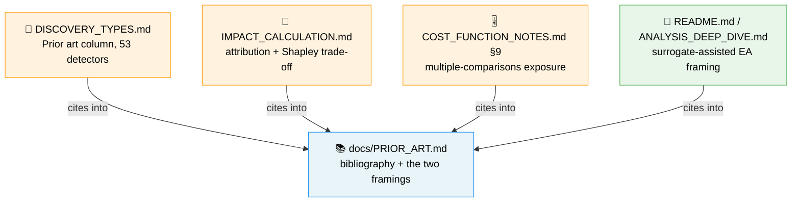

# Docs: map the detectors and the pipeline onto the published research

## Summary

Discovery was documented entirely in house vocabulary — detectors, impact,
candidates, discounting — so a reader could not tell a well-grounded design from
fifty heuristics. This adds the map to the literature. No detector is renamed:
the names in `DISCOVERY_TYPES.md` are the caller-facing contract and a test now
pins them. Closes #2025.

What changed:

- **`docs/PRIOR_ART.md` (new)** — the single home for the bibliography (53
  references, every link resolved before committing) and for the two framings:
  1. **The pipeline is a surrogate-assisted evolutionary algorithm** (Jin 2011)
     — the SSE proxy is the cheap surrogate, the controller's full-corpus
     re-score is the true evaluation, and the ranking quantity **expected
     improvement** is the standard acquisition function of efficient global
     optimisation (Jones et al. 1998). The doc says plainly that the term was
     arrived at here independently, and where the analogy stops (an analytic
     surrogate carries no posterior variance).
  2. **"Impact" is an attribution/saliency measure** — normalised path-weight
     propagation is LRP (Bach et al. 2015) / DeepLIFT (Shrikumar et al. 2017),
     the removal decision is OBD (LeCun et al. 1989) and Taylor-criterion
     pruning (Molchanov et al. 2017), and the ablation validation is a
     unit-ablation study (Zhou et al. 2018).
  Per-stage mappings cover clustering (González et al. 2016), top-K
  randomisation (Auer et al. 2002), the success/failure caches (Glover 1986,
  Fialho et al. 2010), MH acceptance (Metropolis et al. 1953, Hastings 1970,
  Kirkpatrick et al. 1983), and linkage learning (Harik & Goldberg 1997,
  Thierens 2010).
- **`docs/DISCOVERY_TYPES.md`** — a `Prior art` column on all five summary
  tables, one citation per detector (53 rows) keyed into the bibliography, or an
  explicit **"No close precedent found"** where nothing fits (Oscillating
  Neuron, Error Plateau) rather than stretching the row onto the nearest famous
  paper.
- **`README.md` / `docs/ANALYSIS_DEEP_DIVE.md`** — both framings named with
  citations, linking to the bibliography.
- **`docs/IMPACT_CALCULATION.md`** — new "Prior Art — Impact as an Attribution
  Measure" section: why **impact discounting** exists (per-unit attributions do
  not sum to the whole-network effect), that the principled treatment is Shapley
  allocation (Lundberg & Lee 2017), and what the exact version would cost
  (2^n coalitions — 2^447 on a production creature). Also a prior-art note on
  the remove-neuron compensation maths (Nagel et al. 2019, Luo et al. 2017).
- **`docs/COST_FUNCTION_NOTES.md` § 9** — the multiple-comparisons exposure
  documented beside the existing SSE-proxy caveat: ~50 detectors proposing
  adaptively against one corpus is the reusable-holdout regime (Dwork et al.
  2015, Blum & Hardt 2015). It states both what we do (controller ablation test,
  the per-candidate hold-out split in `holdout_validation.rs`, pessimism
  discounting and gain floors) **and** what we do not (no fresh-corpus
  validation, no query budget, no FDR correction).

## Evidence

Documentation-only change with no web interface to screenshot — the evidence is
the doc-contract test suite, which parses the committed Markdown rather than
asserting on prose by eye.

```text
$ cargo test --test issue_2025_prior_art_map
running 13 tests
test result: ok. 13 passed; 0 failed; 0 ignored

$ ./quality.sh < /dev/null
✅ All quality checks passed!
```

Neighbouring doc-contract suites still pass unchanged (the summary tables grew a
column):

```text
$ cargo test --test issue_1685_doc_link_integrity --test issue_1684_doc_dedup \
    --test issue_1938_discovery_doc_contract --test issue_1942_cost_function_notes_contract \
    --test issue_1723_active_docs_no_private_repo_names --test issue_1990_analysis_docs_contract \
    --test issue_1989_scenario_docs_contract
test result: ok. 14 passed / 9 passed / 2 passed / 7 passed / 5 passed / 9 passed / 9 passed
```

Every bibliography link was resolved over the network before it was committed
(arXiv abstract titles matched by ID, DOIs checked for a `302` from
`doi.org`, proceedings pages for `200`).

How the docs now fit together:



## Test Plan

Added `tests/issue_2025_prior_art_map.rs` — 13 tests that parse the committed
Markdown and assert on structure, not prose:

- `every_summary_table_has_a_prior_art_column` — all five tables end with a
  `Prior art` column.
- `every_detector_row_cites_prior_art_or_says_none_was_found` — every one of the
  53 rows has six cells and a non-empty prior-art cell, and every citation in it
  resolves to a bibliography entry (or is the explicit "No close precedent
  found" literal).
- `no_detector_was_renamed` — the acceptance criterion, pinned against a
  hard-coded list of the 53 detector names.
- `every_bibliography_entry_has_a_title_and_a_link` — each entry carries a year
  and an `](http…` link to the work.
- `every_bibliography_entry_is_actually_cited` — no padding: each entry is cited
  from the prose or from another doc.
- `readme_frames_the_pipeline_as_a_surrogate_assisted_ea`,
  `deep_dive_frames_the_pipeline_and_the_attribution_model`,
  `prior_art_doc_is_listed_in_the_readme_documentation_index`,
  `discovery_types_points_at_the_bibliography` — the framings and the index
  links.
- `impact_doc_cites_the_attribution_and_pruning_literature`,
  `impact_doc_states_the_shapley_versus_discounting_trade_off` — the attribution
  citations plus the exponential coalition cost.
- `cost_notes_document_the_multiple_comparisons_exposure`,
  `cost_notes_state_what_is_done_about_repeated_selection` — §9 exists, names the
  reused corpus, and states the mitigation.

No existing tests were modified or removed.
