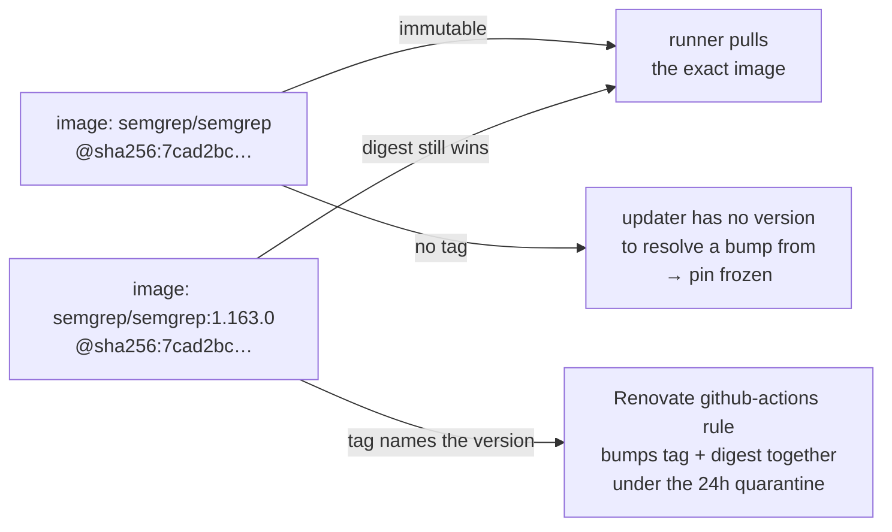

# PR Summary — Issue #2035

## Summary

The Semgrep job pinned its container to a **bare digest** —
`semgrep/semgrep@sha256:7cad2bc…` with no release tag beside it. The digest is
immutable but untrackable: Renovate's `github-actions` manager and Dependabot's
`docker` ecosystem both resolve a bump from the *tag* and then rewrite the
digest next to it, and `./bump-deps.sh` has no version string to key off either,
so the pin was frozen at whatever `1.163.0` resolved to on the day it was set.

The pin now carries both parts —
`semgrep/semgrep:1.163.0@sha256:7cad2bc…` — and a new gate enforces that shape
for **every** container image in **every** workflow, so the next one cannot be
added bare. The tag was verified against Docker Hub before being written:
`registry-1.docker.io/v2/semgrep/semgrep/manifests/1.163.0` returns
`docker-content-digest: sha256:7cad2bc2d1e44f87f0bf4be6d1fa23aa90fb72015bebc89fb91385d813987a03`,
the exact digest already pinned, so the image the runner pulls is byte-for-byte
unchanged.

With a tag present the image becomes a tracked `github-actions` dependency, so
the existing `github-actions` packageRule in `renovate.json` applies the same
24h quarantine window as every other external dependency (Issue #1234).

Closes #2035.

## Evidence

Backend/CI change — no web interface to screenshot. The evidence is the new
test suite, observed red against the unfixed pin and green after it:

```text
# before the fix
test every_workflow_container_image_carries_a_tag_and_a_digest ... FAILED
  semgrep.yml:30: container image `semgrep/semgrep@sha256:7cad2bc…` must be
  pinned as `name:<tag>@sha256:<digest>` (Issue #2035) — bare digest with no
  release tag — no updater can resolve a bump from it
test semgrep_job_pins_the_semgrep_image_by_tag_and_digest ... FAILED
test result: FAILED. 6 passed; 2 failed

# after the fix
test result: ok. 8 passed; 0 failed
```

What changed, and why each half is load-bearing:



## Test Plan

Added `tests/issue_2035_container_image_tag_pin.rs` (8 tests):

- `every_workflow_container_image_carries_a_tag_and_a_digest` — scans every
  `image:` declaration under `.github/workflows/` and requires
  `name:<tag>@sha256:<64-hex>`. This is the test that failed against the bare
  digest.
- `semgrep_job_pins_the_semgrep_image_by_tag_and_digest` — the specific surface
  the issue names.
- `container_image_gate_scans_at_least_one_image` — fail-loud guard so the gate
  cannot report success while scanning nothing.
- `a_bare_digest_pin_is_rejected` — drives the validator with the exact pre-fix
  reference and asserts it is rejected for the missing tag.
- `a_tagged_digest_pin_is_accepted` — the fixed shape, plus a
  `registry:5000/team/tool:2.1.0@sha256:…` case so a registry port is not
  mistaken for a tag.
- `a_tagged_but_undigested_pin_is_rejected` — keeps the mutable-tag shape that
  Issue #1258 removed rejected.
- `a_latest_tag_is_rejected` — `latest` names no version to bump from.
- `a_malformed_digest_is_rejected` — short digest and non-`sha256` algorithm.

Also updated:

- `.github/workflows/semgrep.yml` — the pin, and the stale comment claiming the
  surface was untrackable by design.
- `CONTRIBUTING.md` — the CI section now documents the tag+digest requirement
  for workflow container images and names the enforcing test.
- `Cargo.toml` — patch version `0.74.226` → `0.74.227` (AGENTS.md requires a
  version bump on any code change).

`./quality.sh` was run in full after the final edit.
