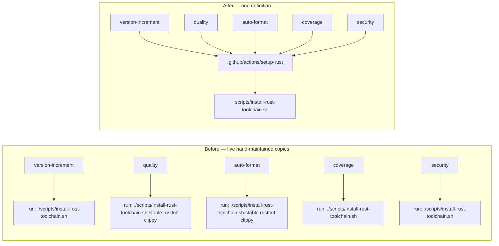
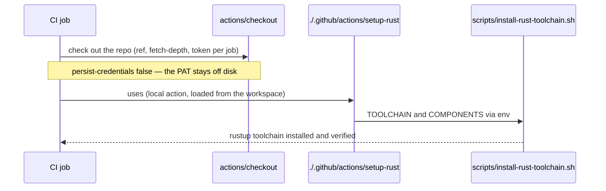

# PR Summary — Issue #2036

## Summary

The Rust bootstrap step was copy-pasted across five jobs in three workflows:
`ci.yml` (`version-increment`, `quality`, `auto-format`), `cargo-quality.yml`
(`coverage`) and `security.yml` (`security`). Each carried its own invocation of
`./scripts/install-rust-toolchain.sh` plus the same ~8-line rationale comment, so
adding a required rustup component meant five identical edits and missing one
silently left that job on the old toolchain.

The invocation now lives once, in the `.github/actions/setup-rust` composite
action, and all five call sites reference it as
`uses: ./.github/actions/setup-rust` (with `components: rustfmt, clippy` at the
two jobs that format and lint). Inputs reach the shell through `env:`, never
`${{ }}` interpolation, and the script's existing allowlist still rejects
anything that is not a plain identifier. Closes #2036.

**Scope note — the checkout deliberately stays in each job.** The issue proposed
folding the checkout into the same composite action. That is not implementable:
GitHub loads a local action (`uses: ./…`) from the runner's workspace, so the
repository must already be checked out before the action file exists on disk — a
checkout inside the action could never run. The jobs' checkouts also genuinely
differ (`ref`, `fetch-depth`, `token`), and their `persist-credentials: false`
posture is asserted per workflow (Issues #1567, #1643, #1647, #1868). This is
recorded in the action's header comment, in CONTRIBUTING.md, and by
`each_calling_job_still_checks_out_before_using_the_local_action`.

## Evidence

Backend/CI-configuration change with no web interface, so there is nothing to
screenshot. What was run instead:

- `actionlint -shellcheck= .github/workflows/*.yml` — exit 0. actionlint
  resolves `uses: ./.github/actions/setup-rust` against the committed action
  metadata, so a missing action or a misnamed input would fail here.
- `cargo test --test issue_2036_setup_rust_composite` — 10 passed. Four of those
  execute the action's own `run:` body against a stub `rustup` and assert on the
  commands rustup actually receives.
- `cargo test --test issue_1891_rust_toolchain_install` — 15 passed (the
  #1891 regression guards, updated to follow the new indirection).
- `./quality.sh` — full gate, see Test Plan.

Before and after, for one representative job:

Each job still runs its own `actions/checkout` first, unchanged:

## Test Plan

Added `tests/issue_2036_setup_rust_composite.rs` (10 tests):

- `installs_the_default_toolchain_when_no_inputs_are_supplied` — executes the
  action's `run:` body with the declared defaults against a stub `rustup`, and
  asserts an empty `components` input never reaches rustup as an empty component
  name.
- `passes_the_components_input_through_to_rustup` — `rustfmt, clippy` arrives as
  `--component rustfmt --component clippy`.
- `honours_a_non_default_toolchain_input` — a `nightly` input installs and
  defaults to `nightly`.
- `fails_loud_when_an_input_is_not_a_plain_identifier` — a component containing
  shell metacharacters exits non-zero and rustup is never invoked.
- `action_declares_the_toolchain_and_components_inputs`,
  `action_inputs_reach_the_shell_through_env_not_interpolation` — the action is
  composite and consumes `$TOOLCHAIN` / `$COMPONENTS` rather than interpolating
  `${{ }}` into a shell body.
- `every_bootstrap_call_site_uses_the_composite_action`,
  `no_workflow_invokes_the_bootstrap_script_directly`,
  `the_call_sites_that_need_rustfmt_and_clippy_still_request_them`,
  `each_calling_job_still_checks_out_before_using_the_local_action` — the five
  call sites, the single caller of the script, the two component sites, and the
  checkout-before-local-action ordering.

Modified `tests/issue_1891_rust_toolchain_install.rs` — **documented test
change.** Its three workflow regression guards counted the literal string
`scripts/install-rust-toolchain.sh` in each workflow (3/1/1) and the literal
`… stable rustfmt clippy` twice in `ci.yml`. Those counts are 0 by construction
now that the call sites go through the composite action, so the guards were
retargeted at the same invariant one step down: the workflows must reference
`uses: ./.github/actions/setup-rust` at the same 3/1/1 sites, the action must
invoke the committed script, `ci.yml` must still request
`components: rustfmt, clippy` twice, and `dtolnay/rust-toolchain` must not
reappear in any workflow **or** in the action. No behavioural test was removed
or weakened — the 12 tests that exercise the script itself are untouched.

Documentation updated in the same change: `CONTRIBUTING.md` now names the
composite action as the single bootstrap definition and records why the checkout
cannot move into it. `docs/ci-doc-build-step.md` cites `ci.yml` by line number,
so its pointer was corrected to `ci.yml:408-427` (enforced by
`tests/issue_1685_doc_link_integrity.rs`).

## Pre-PR Security Self-Check

- **Input validation** — the action's two inputs are validated by the script's
  existing plain-identifier allowlist before reaching rustup, covered by
  `fails_loud_when_an_input_is_not_a_plain_identifier`.
- **Injection surface** — inputs are exported through `env:` and quoted in the
  shell body, never pasted in via `${{ }}`; asserted by
  `action_inputs_reach_the_shell_through_env_not_interpolation`.
- **Secrets** — no secret moved. No checkout, `token:` or
  `persist-credentials: false` line was touched, and no hidden path is staged.
- **Dependencies** — no new dependency; the change removes a third-party action
  from nothing and adds only a same-repo composite action, which carries no
  SHA-pinning concern.
