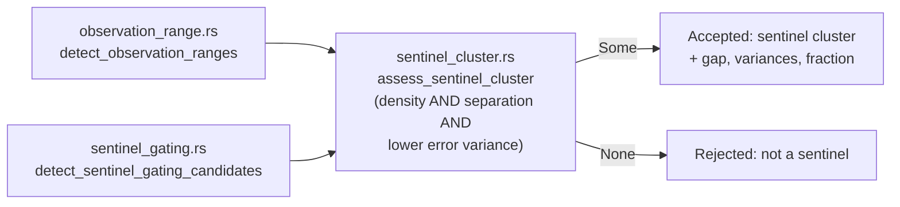

## Summary

The sentinel-cluster decision — *is this cluster of observation values a "no data"
marker rather than a signal?* — was copy-pasted into two detectors, and the copies
had diverged into a real logic bug. `observation_range.rs` read

```rust
if gap < MIN_GAP { continue; }
let is_sentinel = sentinel_error_var < non_sentinel_error_var || gap >= MIN_GAP;
```

Because the function had already `continue`d on `gap < MIN_GAP`, the second
disjunct was unconditionally true, so `is_sentinel` was always `true` and the
error-variance half of the rule was dead code. Any dense, well-separated cluster
was accepted as a sentinel however informative its errors were —
`sentinel_gating.rs` enforced the variance test, both module docs claimed it, and
only one copy still did it.

This change extracts the decision into
`src/analysis/detection/sentinel_cluster.rs::assess_sentinel_cluster`, which both
detectors now call, and settles the rule as **AND** — the reading
`sentinel_gating.rs` already enforced and both module docs describe:

1. **Density** — at least `MIN_SENTINEL_FRACTION` of samples within
   `SENTINEL_TOLERANCE` of the candidate value.
2. **Separation** — at least `MIN_SENTINEL_GAP` clear of the useful range, and
   outside it.
3. **Error decorrelation** — the cluster's error variance is lower than the useful
   range's.

Returning `Some(SentinelCluster)` *is* the accept decision, so neither caller can
re-apply or re-weaken the rule; the struct carries the evidence
(`gap`, both variances, the fraction, the useful range) that `sentinel_gating`
needs for its improvement estimate. The byte-for-byte duplicated
`compute_error_variance` helper is now defined once, alongside it.

Closes #2042.



## Evidence

Backend/library change with no web interface, so no screenshot applies. The
evidence is the test run: the two tests that pin the reported bug were observed
failing against the unfixed code —

```
test test_observation_range_rejects_high_error_variance_cluster ... FAILED
  got [ObservationRangeResult { neuron_uuid: "input-obs", sentinel_values: [-1.0], … }]
test test_both_detectors_reject_high_error_variance_cluster ... FAILED
  ranges=[ObservationRangeResult { … }], gating=[]
```

— and passing after it (`7 passed; 0 failed`). The full detection suite is green
(`490 passed; 0 failed`), as is `cargo test --lib --tests --all-features`.

`./quality.sh` was run in the foreground. Every stage passes — bash syntax,
shellcheck, `cargo install` pinning, PR summary layout, `cargo deny check`,
`cargo fmt`, `cargo clippy --all-targets --all-features -D warnings`,
`cargo check`, `RUSTDOCFLAGS="-D warnings" cargo doc`, and
`cargo build --release --lib` — **except one pre-existing environmental failure**
unrelated to this change:
`tests/issue_1939_documented_commands.rs::runlib_aborts_when_invoked_from_a_directory_without_cargo_toml`.
It expects `scripts/runlib.sh` to abort with `Cargo.toml not found`, but in this
container the script's rustup probe aborts first with
`ERROR: rustup installation appears incomplete`. Verified pre-existing: the same
test fails identically with the working tree reverted to the base commit
`5e99f3e`, before any change here. The remaining gate stages were run
individually after it and all pass.

## Test Plan

New — `tests/detection/issue_2042_sentinel_cluster_shared.rs` (registered in
`tests/detection/main.rs`):

- `test_observation_range_rejects_high_error_variance_cluster` — the regression:
  a wide-gap cluster whose error variance *exceeds* the useful range's is no
  longer reported as a sentinel by `observation_range`.
- `test_both_detectors_reject_high_error_variance_cluster` — both detectors agree
  on that rejection.
- `test_both_detectors_accept_low_error_variance_cluster` — the mirror case: both
  accept the same sentinel at -1.0.
- `test_both_detectors_reject_insufficient_gap` — a sub-`MIN_SENTINEL_GAP`
  separation is rejected by both, whatever the variance.
- `test_assess_sentinel_cluster_accepts_and_reports_evidence` — the shared rule
  direct: accepts, and reports the fraction, gap, useful range and both variances.
- `test_assess_sentinel_cluster_rejects_non_sentinels` — sparse cluster, cluster
  inside the useful range, and empty input all rejected.
- `test_compute_error_variance` — population variance over selected indices, plus
  the single-sample and empty-indices edges.

Unchanged and still green: `tests/detection/issue_398_observation_range_detection.rs`
(9 tests) and `tests/detection/issue_400_sentinel_value_gating.rs`. No existing
test was modified or removed — the Issue #398 fixtures all pair a constant-error
sentinel with a varying-error useful range, so they satisfy the variance rule the
fix restores.
