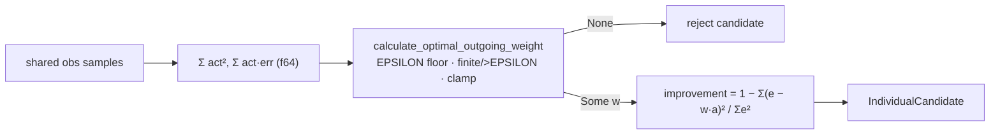

## Summary

`batch_successful/detection.rs::evaluate_individual` reimplemented the
least-squares weight rule `w = Σ(error × activation) / Σ(activation²)` inline
instead of calling the canonical `calculate_optimal_outgoing_weight`, and the
copy had already diverged: it used an unnamed `1e-10` activation-energy floor
rather than the module's `EPSILON` (`1e-8`), and omitted the finite /
above-epsilon rejection and the `MAX_OUTGOING_WEIGHT` clamp entirely. The
detector could therefore emit `addSynapse` weights the canonical path rejects
as invalid or out of range, and any future tightening of the weight-validity
rules would have skipped this path.

Detection now calls `calculate_optimal_outgoing_weight` with
`incoming_weight = 1.0` (the add-synapse case, so the incoming/outgoing ratio
check does not apply). The two sums are still accumulated in `f64` to avoid
catastrophic cancellation and narrowed to `f32` for the gate — the same shape
as the existing `synapse::cpu_pre_reject` caller. The reported `improvement` is
computed from the emitted (clamped) weight, so it is the error reduction that
weight actually delivers rather than one an unapplied weight would have. Closes
#2043.

## Evidence

Backend-only change — no web interface to screenshot. Verified by tests:

- The three new tests were observed **failing** against the unfixed code
  (emitted weight `0.5` against a `MAX_OUTGOING_WEIGHT` of `0.01`; a source with
  `Σ activation² ≈ 4e-9` accepted with `improvement: 1.0`), and passing after
  the change.
- Full gate: `./quality.sh` — **all quality checks passed** (fmt, clippy
  `-D warnings`, `cargo check`, `cargo deny`, full test suite, docs, release
  build).
- Pre-existing `batch_successful` coverage
  (`tests/recommendation/issue_965_batch_successful_grouping.rs`,
  `issue_1059_disable_batch_successful.rs`,
  `issue_1249_categorical_error_sse_gating.rs`) passes unchanged — no existing
  test was modified, commented out, or removed.

## Test Plan

Added `tests/recommendation/issue_2043_canonical_weight_reuse.rs` (registered in
`tests/recommendation/main.rs`):

- `emitted_weight_is_clamped_to_max_outgoing_weight` — a source whose unclamped
  optimal weight is `0.5` is still detected, but its emitted weight respects
  `MAX_OUTGOING_WEIGHT`.
- `negative_correlation_weight_is_clamped_to_negative_ceiling` — the same for a
  negatively correlated source.
- `degenerate_activation_energy_is_rejected_at_the_canonical_epsilon` — a
  perfectly correlated source with `Σ activation² ≈ 4e-9` (above the old
  `1e-10` floor, below the canonical `EPSILON`) is rejected.
- `improvement_is_computed_from_the_emitted_weight` — the reported improvement
  equals `1 − Σ(e − w·a)² / Σe²` for the emitted weight.

Docs updated: `docs/DISCOVERY_TYPES.md` (batch-successful detection strategy now
names the canonical weight gate) and `CHANGELOG.md`. `Cargo.toml` patch version
bumped `0.74.229` → `0.74.230` per AGENTS.md.
