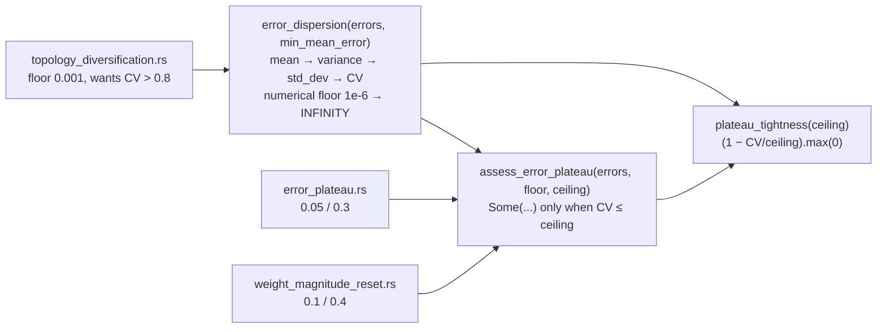

## Summary

The "is the error stuck/plateaued" formula — mean → variance → standard
deviation → coefficient of variation, plus the `plateau_tightness` score
derived from it — was hand-rolled three times, and the third copy had already
drifted. `error_plateau.rs` and `weight_magnitude_reset.rs` each carried the
two-tier guard (a business floor on the mean, then a separate `1e-6` numerical
floor guarding the division, with an `f32::INFINITY` fallback);
`topology_diversification.rs` collapsed both into a single `mean < 0.001` check
with no fallback, so a near-zero mean there produced a finite CV instead of
infinity.

The chain now lives once in `src/analysis/detection/error_dispersion.rs`:

- `error_dispersion(errors, min_mean_error)` — the shared maths, gated on the
  caller's **business** floor, with the **numerical** floor
  (`MIN_CV_DENOMINATOR = 1e-6`) kept separate and named.
- `ErrorDispersion::plateau_tightness(cv_ceiling)` — the `(1 - cv/ceiling).max(0)`
  score, previously duplicated in two detectors.
- `assess_error_plateau(errors, min_mean_error, cv_ceiling)` — the full plateau
  rule; its `Some` *is* the decision, so callers never re-apply it.

It reuses the repo's existing `stats::compute_mean` / `stats::compute_variance`
rather than re-summing inline. Each detector keeps its own constants
(`MIN_PLATEAU_ERROR`/`MAX_COEFFICIENT_OF_VARIATION`, `MIN_STUCK_ERROR`/
`MAX_ERROR_CV`, and `topology_diversification`'s floor, now named
`MIN_MEAN_ERROR_FOR_CV`), so **thresholds and detection behaviour are
unchanged** — only the shared knowledge moved.

`topology_diversification` reads the same dispersion in the opposite direction
(it wants CV *above* 0.8), which is why the shared API separates the maths
(`error_dispersion`) from the plateau verdict (`assess_error_plateau`).

Closes #2044.

## Evidence

Backend/library change with no web interface, so no screenshot applies. The
evidence is the test suite below plus the quality gate.

Commands run (all `< /dev/null`, unattended):

- `cargo test --test detection --test recommendation` — 503 + 244 tests pass,
  covering the existing `issue_545_error_plateau`,
  `issue_547_error_plateau_structural`, `issue_550_weight_magnitude_reset` and
  `issue_549_topology_diversification` suites that pin the pre-existing
  detection behaviour.
- `./quality.sh` — bash syntax, shellcheck, cargo-install pinning, PR-summary
  layout, `cargo deny`, `cargo clippy --all-targets --all-features -D warnings`,
  `cargo check`, and the full test run all pass, plus
  `RUSTDOCFLAGS="-D warnings" cargo doc --no-deps` run separately.

**One pre-existing, environmental test failure** is unrelated to this diff:
`tests/issue_1939_documented_commands.rs::runlib_aborts_when_invoked_from_a_directory_without_cargo_toml`
fails in this container because the sandbox's rustup install is incomplete
(`ERROR: rustup installation appears incomplete`). Confirmed pre-existing by
stashing the whole change and re-running the same test on a clean tree — it
fails identically there.

## Test Plan

New: `tests/detection/issue_2044_error_dispersion_shared.rs` (10 tests, all
calling the real functions with real data):

- `empty_errors_have_no_dispersion`, `mean_below_business_floor_is_rejected`,
  `mean_on_the_business_floor_is_accepted` — the business floor.
- `dispersion_matches_hand_computed_statistics`,
  `constant_errors_have_zero_coefficient_of_variation` — the maths, against
  hand-computed mean/std_dev/CV.
- `near_zero_mean_yields_infinite_coefficient_of_variation` — the numerical
  floor kept distinct from the business floor: a mean below `MIN_CV_DENOMINATOR`
  yields `f32::INFINITY`, zero tightness, and no plateau. This is the guard the
  third copy had dropped.
- `coefficient_of_variation_on_the_ceiling_is_still_a_plateau`,
  `plateau_tightness_falls_to_zero_at_the_ceiling` — ceiling boundary is
  inclusive, matching the original `if cv > ceiling { continue }`.
- `error_plateau_detector_reports_shared_statistics`,
  `weight_magnitude_reset_detector_reports_shared_statistics` — drive the real
  detectors end to end and assert their reported `mean_error`, `std_dev` and
  CV equal what the shared helper computes for the same errors, so a future
  divergence fails the suite.

Unchanged and still passing: the existing detector suites listed above, which
are the regression guard that the extraction preserved behaviour.
