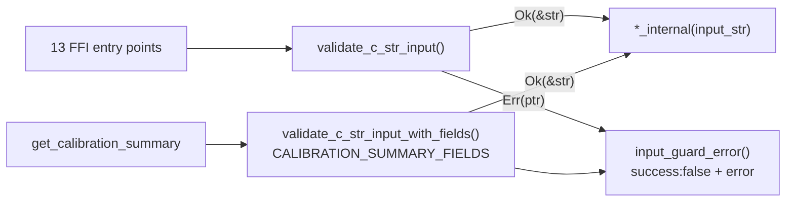

## Summary

The null-pointer / invalid-UTF-8 input guard for `*const c_char` FFI arguments
was inlined at all 13 FFI entry points, so a change to either error message —
or to a response shape, as `get_calibration_summary` already showed — had to be
re-typed at every site. The guard now lives once in `src/ffi/helpers.rs` and the
13 entry points call it. Observable responses are unchanged. Closes #2045.

- `validate_c_str_input(ptr) -> Result<&str, *mut c_char>` — rejects a null
  pointer and invalid UTF-8, returning the ready-made FFI error pointer.
- `validate_c_str_input_with_fields(ptr, extra_fields)` — same guard for an
  entry point whose error response shape carries extra fields;
  `get_calibration_summary` passes `CALIBRATION_SUMMARY_FIELDS` instead of
  hand-typing `"calibrationSummary":[]` into two literals.
- Both error messages are now composed in one place (`input_guard_error`), so a
  wording change is a one-line edit rather than a 13-site sweep.

## Evidence

Backend/FFI change with no web interface, so no screenshot applies. The
behavioural evidence is the test run below.

- `cargo test --lib ffi::helpers` — 15 passed (5 new guard tests).
- `cargo test --test ffi issue_2045` — 3 passed; the same three tests pass
  against the pre-refactor code, pinning the responses of all 13 entry points
  across the change.
- `cargo-clippy --all-targets --all-features -- -D warnings` — clean;
  `cargo-fmt --all -- --check` — clean; `cargo check --all-targets
  --all-features` — clean.
- Full suite: `cargo test --lib --tests --all-features --no-fail-fast --
  --test-threads=2` — 181 test binaries green, one **pre-existing environment**
  failure unrelated to this diff:
  `issue_1939_documented_commands::runlib_aborts_when_invoked_from_a_directory_without_cargo_toml`.
  `scripts/runlib.sh` installs rustup into `$CARGO_HOME/bin`, which is not on
  this container's `PATH`, so its `rustup show` check aborts before the
  `Cargo.toml not found` path the test asserts. Reproduced directly with
  `bash scripts/runlib.sh` from an empty directory — no Rust code involved.

## Test Plan

- Added `src/ffi/helpers.rs` unit tests: valid UTF-8 accepted, empty string
  accepted, null pointer rejected with `Null input pointer`, invalid UTF-8
  rejected with `Invalid UTF-8 in input`, and the `_with_fields` variant
  carrying `"calibrationSummary":[]` on both error paths and passing valid
  input through.
- Added `tests/ffi/issue_2045_input_guard_helper.rs`: every one of the 13 entry
  points returns the exact guard response for a null pointer and for invalid
  UTF-8, `get_calibration_summary` (and only it) keeps `calibrationSummary` in
  that response, and valid UTF-8 passes the guard through to the entry point.
- No existing tests were modified or removed; `tests/ffi/main.rs` gains the new
  module registration.
