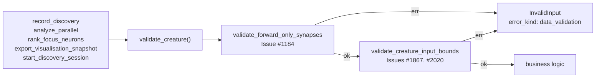

## Summary

The order-dependent creature-validation gate — `validate_forward_only_synapses`
then `validate_creature_input_bounds` — was re-typed as a two-call `and_then`
chain at all five FFI entry points that accept a `CreatureJson`. The documented
`AGENTS.md` invariant ("both checks, in that order, before any business logic")
therefore relied on every future entry point copying the chain correctly.

`validate_creature` (`src/ffi_types/creature_validation.rs`) is that
composition, expressed once. The five sites call it, and `AGENTS.md` now names
the single function. Observable responses are unchanged — the same
`DiscoveryError::InvalidInput` with `error_kind: "data_validation"` for either
violation. Closes #2046.

## Evidence

Backend/FFI change with no web interface, so no screenshot applies. The
behavioural evidence is the test run below.

- `cargo test --test ffi issue_2046` — 7 passed, covering the composed gate and
  all five entry points.
- `cargo test --test ffi` — 177 passed, 0 failed (the existing #1184, #1188,
  #1867 and #2020 suites pin the unchanged responses across the refactor).
- `cargo test --test issue_1256_public_api_surface` and
  `--test issue_1683_agents_consolidation` — pass, so the new export and the
  edited `AGENTS.md` still satisfy the public-API and thin-pointer guards.
- `cargo fmt --all -- --check` and
  `cargo clippy --all-targets --all-features -- -D warnings` — clean.
- Version bumped `0.74.233` → `0.74.234` per the `AGENTS.md` rule.

## Acceptance Criteria

<!-- vibe-spec-review inputs="diff+issue-body" -->

- **met** — add a `validate_creature(&CreatureJson) -> Result<(), DiscoveryError>`
  helper performing the two-call chain once — evidence:
  `src/ffi_types/creature_validation.rs:28` — reviewer: met
- **met** — have all five sites reference that single function — evidence:
  `src/ffi_internal/analysis.rs:61`, `src/ffi_internal/analysis.rs:594`,
  `src/ffi_internal/recording.rs:40`, `src/ffi_internal/utilities.rs:103`,
  `src/ffi/recording.rs:146` — reviewer: met
- **met** — the `AGENTS.md` table references the single function — evidence:
  `AGENTS.md:124-129` and `AGENTS.md:167` — reviewer: met
- **unrequested** — `validate_creature` is re-exported at the crate root
  (`src/lib.rs:144`) and pinned in `tests/issue_1256_public_api_surface.rs` —
  reviewer: unrequested — reason: the integration test drives the helper through
  the public API, and both composed validators are already public, so this keeps
  the surface consistent.
- **unrequested** — CHANGELOG entry and the `0.74.233` → `0.74.234` version bump
  — reviewer: unrequested — reason: `AGENTS.md` mandates a version bump on any
  code change and the CHANGELOG carries a per-issue entry for prior work.

## Standards Review

<!-- vibe-standards-review inputs="diff+CODING-STANDARDS.md" -->

- **violation** — inline `#[cfg(test)]` unit tests duplicated four of the new
  integration tests, against `CONTRIBUTING.md`'s "prefer `tests/` over inline
  unit tests" rule — evidence: `src/ffi_types/creature_validation.rs:33` (as
  reviewed) — reason: fixed here — the inline module was removed and its one
  unique case (the Issue #2020 zero observation width) moved to
  `tests/ffi/issue_2046_creature_validation_helper.rs`.
- **violation** — no `docs/archive/pr-summaries/pr-summary-2046.md`
  (`CONTRIBUTING.md:448`) — evidence: the branch at review time — reason: fixed
  here — this file.
- **clean** — Australian English throughout the new prose; version bump present
  with no dependency drift in `Cargo.lock`; tests call real code (the four
  `*_internal` functions and the real `extern "C" start_discovery_session`) with
  every `unsafe` block carrying a SAFETY comment and the `char*` freed via
  `free_discovery_result`; all five entry points validate before any business
  logic in the documented order; CHANGELOG and `AGENTS.md` updated in the same
  commit; no CI or gate file touched.
- **clean** — `docs/FFI_API.md` and `docs/CONFIGURATION.md` correctly untouched:
  caller-visible behaviour and the environment-variable surface are unchanged.

## Test Plan

- Added `tests/ffi/issue_2046_creature_validation_helper.rs`:
  - `valid_creature_passes_the_composed_gate` — a forward-only, in-bounds
    creature is accepted.
  - `composed_gate_rejects_a_forward_only_violation` — a back-edge returns a
    `data_validation` error naming the forward-only invariant.
  - `composed_gate_rejects_an_input_bounds_violation` — `usize::MAX` input is
    rejected citing Issue #1867.
  - `composed_gate_rejects_a_zero_observation_width` — a zero `output` width is
    rejected citing Issue #2020 (built in Rust, since serde rejects it on read).
  - `composed_gate_reports_the_forward_only_fault_first` — a creature violating
    both invariants reports the topology fault, pinning the order.
  - `every_creature_entry_point_rejects_a_forward_only_violation` and
    `every_creature_entry_point_rejects_an_input_bounds_violation` — each of the
    five entry points returns `success: false`, `errorKind: "data_validation"`,
    `retryable: false` for both halves of the gate.
- Updated `tests/issue_1256_public_api_surface.rs` to pin the new
  `validate_creature` export.
