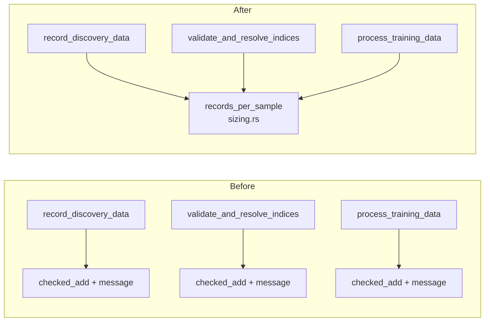

## Summary

The overflow-checked "records per training sample" derivation was copy-pasted
verbatim across three files in `src/record/` — the same `checked_add`, the same
error message, and three separate comment trails all citing Issue #1867. Nothing
stopped a fourth call site (or an edit to one of the three) reintroducing a bare
`+` and silently regressing that overflow fix, because release builds set no
`overflow-checks`.

The derivation now lives once in `record::records_per_sample`
(`src/record/sizing.rs`) and the three sites call it. Behaviour, error messages
and the public FFI responses are unchanged — this is a de-duplication, not a
behaviour change. Closes #2047.

### Call sites rewired

| Site | Uses the count for |
|------|--------------------|
| `src/record/mod.rs` (`record_discovery_data`) | sizing `estimated_total_records` for the Parquet writer |
| `src/record/validation.rs` (`validate_and_resolve_indices`) | the `records_per_sample == 0` rejection |
| `src/record/processing.rs` (`process_training_data`) | each per-observation `Vec::with_capacity` |



## Evidence

Backend/library change with no web interface, so there is nothing to screenshot.
The evidence is the test run below.

- New suite, run red before the helper existed (`unresolved import
  neat_ai_discovery::record::records_per_sample`) and green after:

  ```
  running 6 tests
  test maximum_representable_sum_is_accepted ... ok
  test overflow_is_detected_from_either_side ... ok
  test sums_non_input_neurons_and_creature_inputs ... ok
  test zero_widths_derive_zero_records ... ok
  test overflowing_sum_is_reported_not_wrapped ... ok
  test record_discovery_data_still_refuses_an_overflowing_input ... ok

  test result: ok. 6 passed; 0 failed
  ```

- The pre-existing Issue #1867 suite still passes unchanged (7 passed), including
  `record_discovery_data_reports_overflow_instead_of_wrapping`, and the 13
  `record::tests::*` unit tests pass.
- `./quality.sh` passed in full after the final edit — `cargo deny`, bash syntax,
  ShellCheck, `cargo fmt`, `cargo clippy -D warnings`, `cargo check
  --all-targets --all-features`, the full test suite, docs build and the release
  build.

## Test Plan

Added `tests/issue_2047_records_per_sample_helper.rs`:

- `sums_non_input_neurons_and_creature_inputs` — happy path, `3 + 2 == 5`.
- `zero_widths_derive_zero_records` — edge case: the helper derives a size and
  returns `0` rather than erroring; rejecting a zero count stays in
  `validate_and_resolve_indices`.
- `maximum_representable_sum_is_accepted` — boundary: `usize::MAX + 0` is a
  representable sum, not an overflow.
- `overflowing_sum_is_reported_not_wrapped` — error path, asserting the exact
  shared message every call site now reports.
- `overflow_is_detected_from_either_side` — overflow is caught whichever operand
  is oversized.
- `record_discovery_data_still_refuses_an_overflowing_input` — end-to-end through
  the recording pipeline, pinning the Issue #1867 guarantee the three duplicated
  copies existed to provide.

Existing tests were neither modified nor removed.
