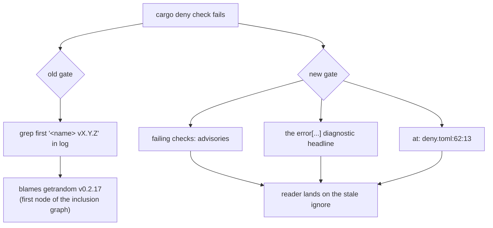

## Summary

`./bump-deps.sh` exited non-zero on every run, so the worker reverted every
dependency bump and bumps were effectively disabled for this repository.

Root cause: `deny.toml` ignored `RUSTSEC-2024-0436` (`paste`, unmaintained)
with the reason *"transitive dep from parquet; awaiting upstream migration to
pastey"*. `parquet 59.3.0` completed exactly that migration, so `paste` left
`Cargo.lock` and the ignore matched no crate. `unused-ignored-advisory =
"deny"` (Issue #1917) then failed the whole `cargo deny check`, which is
phase 4 of `bump-deps.sh` — exit 7 on every run.

The fix removes the dead ignore and lands the bumped lockfile with it
(`parquet 59.3.0`, `arrow 59.3.0`, `wgpu`/`naga 30.0.1`, `wasm-bindgen 0.2.128`
and friends; no `Cargo.toml` requirement changed). The bump was produced by
`./bump-deps.sh` itself, so the 24 h quarantine gate applied to it.

A second, compounding defect is fixed in the same change: the audit gate lied
about the cause. It scraped the first `<name> vX.Y.Z` token out of the
cargo-deny log and reported it as *"the offending crate"*, but cargo-deny
prints its inclusion graph and yanked-crate warnings **before** the failing
diagnostic — so a stale `deny.toml` entry was reported as
`offending crate: getrandom v0.2.17`, and three consecutive triage runs chased
a crate that had nothing to do with the failure. The gate now reports what
cargo-deny actually said.

Closes #2054.

## Evidence

Backend/CLI change only — no web interface to screenshot. Evidence is the
script's own exit status, before and after, on a clean checkout.

**Before** (stale ignore, bumped lock):

```
error[advisory-not-detected]: advisory was not encountered
   ┌─ .../deny.toml:62:13
62 │     { id = "RUSTSEC-2024-0436", reason = "transitive dep from parquet; awaiting upstream migration to pastey" },
   │             no crate matched advisory criteria
advisories FAILED, bans ok, licenses ok, sources ok
ERROR: audit gate failed — cargo deny check rejected the tree
       failing checks: advisories
       error[advisory-not-detected]: advisory was not encountered
       at: .../deny.toml:62:13
EXIT=7
```

That is already the *new* diagnostic. The old one printed
`ERROR: audit gate failed (offending crate: getrandom v0.2.17)` — the first
crate in the inclusion graph, not the cause.

**After** (ignore removed):

```
advisories ok, bans ok, licenses ok, sources ok

✅ bump-deps: no bumps (quarantined=0, lock_pinned_back=0, audit_run=1)
EXIT=0
```

The audit gate's failure path, before and after:



## Reproduction

- **symptom** — `./bump-deps.sh` exits 7 on every run (`advisories FAILED`,
  `no crate matched advisory criteria` at `deny.toml:62`), so the worker
  reverts each bump and dependency bumps stop happening for the repo
- **status** — `verified` — `./bump-deps.sh` was run end to end on a clean
  checkout and exited 7 with the reported diagnostic; after the fix the same
  command exits 0. Both regression suites were observed failing against the
  unfixed tree and passing after the fix:
  `issue_2054_bump_deps_audit_diagnostic` 7/7 failed with
  `bump_deps::describe_deny_failure: command not found` against the unfixed
  `bump-deps.sh` and 7/7 pass now;
  `issue_1917_stale_advisory_suppression` failed 2/5 against the unfixed
  `deny.toml` with the bumped lock and passes 5/5 now
- **regression test** —
  `tests/issue_1917_stale_advisory_suppression.rs::every_advisory_ignore_names_a_crate_still_in_the_graph`
  (the stale ignore) and
  `tests/issue_2054_bump_deps_audit_diagnostic.rs::does_not_blame_a_bystander_crate_from_the_inclusion_graph`
  (the misattributed diagnostic)

## Test Plan

Added `tests/issue_2054_bump_deps_audit_diagnostic.rs` — 7 tests driving the
new `bump_deps::describe_deny_failure` helper (sourced from the real
`bump-deps.sh` via the existing `BUMP_DEPS_SOURCE_ONLY` seam) against recorded
cargo-deny logs:

- `names_the_check_that_failed` — reports `failing checks: advisories`
- `quotes_the_diagnostic_cargo_deny_emitted` — quotes the `error[...]` headline
- `points_at_the_config_line_that_failed` — reports `deny.toml:62:13`, and not
  the location under an unrelated `warning[yanked]`
- `does_not_blame_a_bystander_crate_from_the_inclusion_graph` — never names
  `getrandom` or `chacha20`
- `reports_a_licence_rejection_by_its_own_check_and_diagnostic` — the general
  case: a `licenses FAILED` log is reported as `licenses`, not `advisories`
- `an_unrecognisable_log_says_so_instead_of_inventing_an_offender` — fails loud
  without mining a crate name out of an unparsable log
- `a_missing_log_is_reported_rather_than_swallowed` — an unreadable log is
  stated, not silently treated as no information

Modified `tests/issue_1917_stale_advisory_suppression.rs` (documented business
change): `JUSTIFIED_IGNORES` no longer lists `("RUSTSEC-2024-0436", "paste")`,
because that ignore no longer exists. `the_paste_suppression_is_still_required`
is replaced by `the_retired_paste_suppression_does_not_come_back` — the
original test's own failure message said *"drop this test with the ignore, not
before"*, and the ignore is now gone. The replacement inverts the guard: while
`paste` is absent from `Cargo.lock`, `RUSTSEC-2024-0436` must not be ignored,
which is precisely the state that broke `bump-deps.sh`. No test was removed
without a replacement guarding the same property.

Gate status: `./quality.sh` passes end to end — `✅ All quality checks passed!`,
exit 0 — covering bash syntax, ShellCheck (24 scripts), cargo-install pinning,
PR-summary layout, `cargo deny check`, debug build, `cargo fmt`, Clippy
`-D warnings`, `cargo check --all-targets --all-features`, the full test suite,
`cargo doc` with `RUSTDOCFLAGS="-D warnings"`, and the release library build.

The gate first failed on one **pre-existing, unrelated** test —
`tests/issue_1939_documented_commands.rs::runlib_aborts_when_invoked_from_a_directory_without_cargo_toml`.
`scripts/runlib.sh` is byte-identical to `origin/Develop` here and untouched by
this PR; it fails on a container whose `CARGO_HOME` is not `$HOME/.cargo`,
because `_require_tools` extends `PATH` with `$HOME/.cargo/bin` only, so its own
rustup install is invisible to the `rustup show` check that follows. That is
stSoftwareAU/NEAT-AI-Discovery#2055, fixed there rather than here. With
`$HOME/.cargo/bin` present the same test passes (11/11) and the whole gate is
green, which is the run recorded above.
