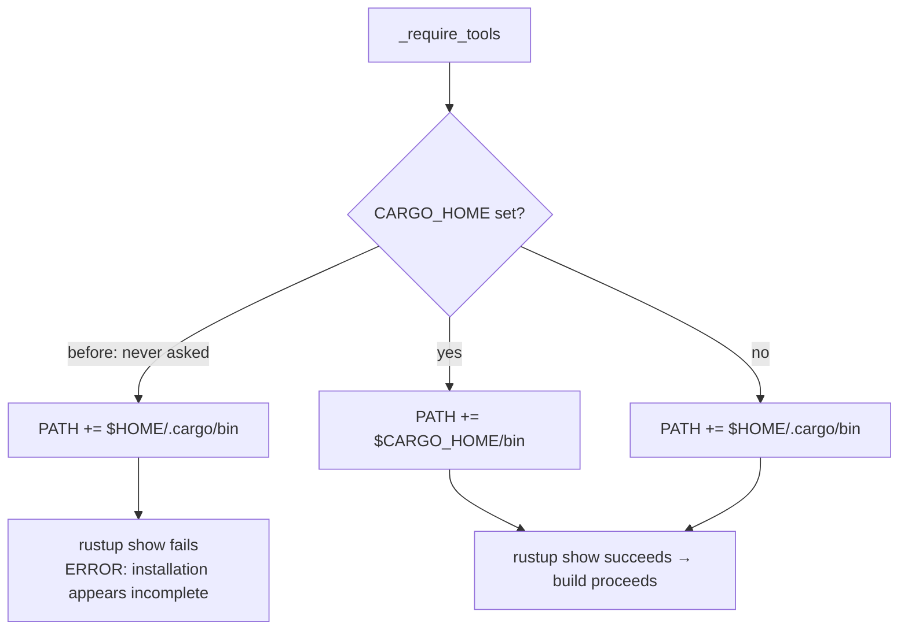

## Summary

`scripts/runlib.sh::_require_tools` prepended `$HOME/.cargo/bin` to `PATH` and
nothing else, so on a host whose toolchain lives under a non-default
`CARGO_HOME` the `rustup` that is present — or the one the function had just
installed via `scripts/install-rustup.sh` — was never resolvable. The `rustup
show` sanity check that follows then failed with "rustup installation appears
incomplete", aborting before any of the script's real work and taking
`./quality.sh` with it. Each run also re-downloaded a rustup toolchain it could
not then see.

`_require_tools` now resolves its toolchain directory once, honouring
`CARGO_HOME` and falling back to `$HOME/.cargo` when it is unset, and uses that
for both `PATH` extensions (the initial one and the post-install one). No other
behaviour changes: the installer bootstrap, the shell-rc persistence and the
`rustup show` check are untouched.

Closes #2055.

## Evidence

Backend/CLI change with no web interface, so there is no screenshot to capture.
The evidence is the test run below, plus the observable behaviour on the
container that reported the bug (`cargo` at `/usr/local/bin/cargo`,
`CARGO_HOME=/home/vibe/auto-issue-work/.container-state/cargo` holding a
`bin/rustup`, no `$HOME/.cargo`):

Before — `tests/issue_1939_documented_commands.rs` on that host:

```
---- runlib_aborts_when_invoked_from_a_directory_without_cargo_toml stdout ----
Rust installed successfully
ERROR: rustup installation appears incomplete. Please check Rust installation.
test result: FAILED. 10 passed; 1 failed
```

After, on the same host:

```
test runlib_aborts_when_invoked_from_a_directory_without_cargo_toml ... ok
test result: ok. 11 passed; 0 failed
```

Toolchain resolution before and after:



`./quality.sh` was run in full after the final edit and reported
`✅ All quality checks passed!` (9m33s), which includes `shellcheck` over
`scripts/runlib.sh`.

## Reproduction

- **symptom** — on a host where `CARGO_HOME` is not `$HOME/.cargo`, `runlib.sh`
  exits with "ERROR: rustup installation appears incomplete", after needlessly
  downloading a rustup toolchain, instead of reaching its own
  `Cargo.toml not found` abort — blocking `./quality.sh` entirely
- **status** — `verified` — `runlib_resolves_a_toolchain_under_a_non_default_cargo_home`
  was observed failing against the unfixed script with the reporter's exact
  stderr (`runlib.sh failed to resolve the sandboxed toolchain; stderr: ERROR:
  rustup installation appears incomplete.`) and passing after the fix; the
  originally failing
  `issue_1939_documented_commands::runlib_aborts_when_invoked_from_a_directory_without_cargo_toml`
  went 10/11 → 11/11 on the affected host
- **regression test** — `tests/issue_2055_runlib_cargo_home_path.rs::runlib_resolves_a_toolchain_under_a_non_default_cargo_home`

## Test Plan

- Added `tests/issue_2055_runlib_cargo_home_path.rs`, which drives the real
  script against a sandboxed toolchain (stub `rustup`/`cargo`/`rustc` under a
  toolchain root, plus a failing `rustup` shim earlier on `PATH`) and asserts on
  observable behaviour — the script must reach `Cargo.toml not found` without
  hitting the shim and without attempting an install:
  - `runlib_resolves_a_toolchain_under_a_non_default_cargo_home` — the
    regression; red before the fix.
  - `runlib_falls_back_to_home_cargo_bin_when_cargo_home_is_unset` — the default
    layout still resolves `$HOME/.cargo/bin`; green before and after, so the
    fallback is locked in.

  Both are hermetic: no network, no real toolchain, no mutation of the host.
- Re-ran the neighbouring script tests unchanged:
  `tests/issue_1939_documented_commands.rs` (11/11) and
  `tests/issue_1911_rustup_digest_verification.rs` (11/11, including
  `runlib_keeps_its_path_persistence_and_sanity_check`).
- Full `./quality.sh` gate: passed.
