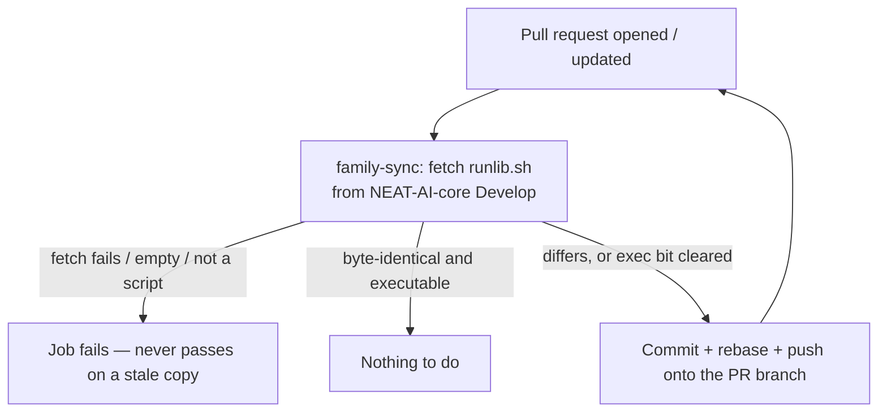
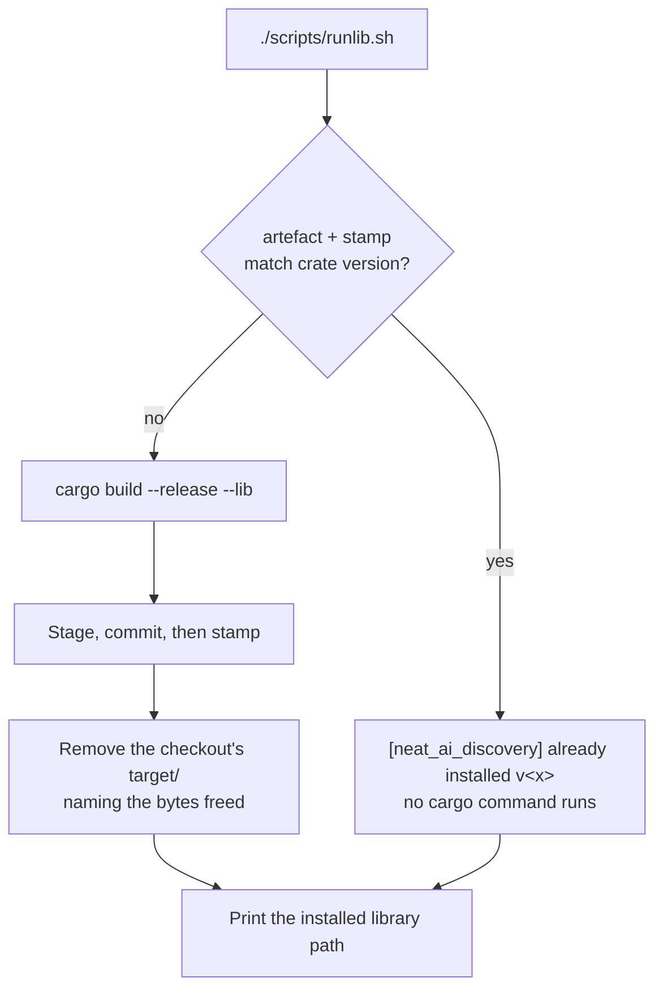

# Adopt the canonical NEAT-AI-core `runlib.sh` and keep it byte-identical

## Summary

`scripts/runlib.sh` is now **byte-identical** to `scripts/runlib.sh` on
NEAT-AI-core `Develop` (core #680/#705), and a new `family-sync` CI job keeps it
that way on every pull request. Closes #2072.

The copy that was here had drifted: it forced a full release rebuild whenever
`target/` lacked the artefact, even when `~/.cargo/lib/libneat_ai_discovery.so`
and `.neat_ai_discovery.version` already matched the crate version. A fleet
build host therefore regrew a multi-gigabyte `target/` on every invocation. The
canonical helper skips the build outright on a match — running **no** `cargo`
command at all — and removes the checkout's `target/` after a successful
install.

`.github/workflows/family-sync.yml` fetches core's copy on every PR and commits
the refreshed file onto the branch when it differs, rebasing first so a branch
another job moved is not rejected. A failed fetch, an empty payload, or a
payload that is not a shell script **fails the job** — a stale copy must never
pass as synced. Push auth mirrors `ci.yml`'s `version-increment` job: the
`ACTIONS_PUSH` PAT is never persisted to `.git/config` and reaches git only
through an explicit authenticated remote URL (Issue #1868).

`scripts/install-rustup.sh` and `scripts/rustup-init.sha256` are **kept**: the
issue says to remove them only if nothing else references them, and
CONTRIBUTING.md documents them while nine behavioural tests in
`tests/issue_1911_rustup_digest_verification.rs` exercise them.

## Evidence

This is a backend/CLI change with no web interface to screenshot. The evidence
is the script's own behaviour, captured on this host.

**Acceptance criterion 3, verified end to end on a real host** (`CARGO_HOME` is
the container's non-default root, which also exercises Issue #2055):

```text
$ rm -f "$CARGO_HOME/lib/.neat_ai_discovery.version"
$ ./scripts/runlib.sh            # run 1 — must build, install, remove target/
    Finished `release` profile [optimized] target(s) in 1m 48s
[neat_ai_discovery] removed /…/NEAT-AI-Discovery/target (freed 2914144256 bytes)
/home/vibe/auto-issue-work/.container-state/cargo/lib/libneat_ai_discovery.so
exit 0;  target/ REMOVED

$ ./scripts/runlib.sh            # run 2 — must skip
[neat_ai_discovery] already installed v0.74.239        <- the complete stderr
/home/vibe/auto-issue-work/.container-state/cargo/lib/libneat_ai_discovery.so
exit 0;  target/ does NOT exist
```

Run 2's stderr is that one line in full — no cargo output, because no cargo
command ran.

**Acceptance criterion 1, verified live:**

```text
$ diff <(gh api repos/stSoftwareAU/NEAT-AI-core/contents/scripts/runlib.sh?ref=Develop \
    -H "Accept: application/vnd.github.raw") scripts/runlib.sh
$ echo $?
0
```

**Gates:** `./quality.sh` passes in full (bash syntax, ShellCheck, cargo-install
pinning, PR-summary layout, `cargo deny check`, build, fmt, clippy `-D
warnings`, type check, full test suite, rustdoc, release build).
`actionlint .github/workflows/family-sync.yml` and `markdownlint-cli2` are
clean.





## Acceptance Criteria

<!-- vibe-spec-review inputs="diff+issue-body" -->

- **met** — Overwrite `scripts/runlib.sh` with core Develop's copy, byte-identical — evidence: `scripts/runlib.sh`; live `diff` against the canonical URL is empty — reviewer: met
- **partial** — Add a `family-sync` CI job with the same push-token pattern and same-repo guard as `version-increment` in `ci.yml` — evidence: `.github/workflows/family-sync.yml` (fetch, `curl --fail`, commit, rebase, push, `persist-credentials: false`, fork guard) — reviewer: partial — reason: every behavioural sub-requirement is implemented, but in its own workflow rather than inside `ci.yml`, whose banner and AGENTS.md forbid modifying it without explicit approval; a maintainer must add `Family Sync / Sync scripts/runlib.sh from NEAT-AI-core` to the required-status-check list for it to gate merges. The reviewer's other half of this verdict — the missing CONTRIBUTING CI-inventory entry — was fixed in this diff.
- **met** — Remove `scripts/install-rustup.sh` / `scripts/rustup-init.sha256` only if nothing else references them; otherwise leave them — evidence: both files retained, referenced by `CONTRIBUTING.md` and the nine behavioural tests in `tests/issue_1911_rustup_digest_verification.rs` — reviewer: met — reason: the reviewer noted the retention risked becoming self-justifying via a doc-grep test this PR authored; that test was removed, so the remaining references are pre-existing ones.
- **met** — Update README / docs lines that describe runlib rebuilding when `target/` is missing — evidence: `README.md` (TL;DR, Quick Start, Distributed Build), `CONTRIBUTING.md` (Prerequisites, Building, bootstrap, CI inventory), `docs/BENCHMARKS.md` — reviewer: met — reason: the reviewer found one further stale line (Criterion baselines in `target/criterion/`, which runlib now deletes); it is now warned about in `docs/BENCHMARKS.md`.
- **met** — `diff scripts/runlib.sh <(curl core Develop scripts/runlib.sh)` is empty on the merged branch — evidence: live `diff` exit 0, reproduced by the reviewer independently — reviewer: met
- **met** — A PR opened with a stale copy receives a CI commit refreshing it — evidence: `.github/workflows/family-sync.yml` copy-on-mismatch, commit, rebase onto a freshly fetched head, push with the PAT so CI re-triggers; shape asserted by `tests/issue_2072_canonical_runlib.rs::family_sync_commits_and_pushes_the_refreshed_copy` — reviewer: met — reason: the reviewer noted it is implementation-present rather than runtime-observable before merge, and that fork PRs are skipped by design (they hold no push credential), so byte-identity is not asserted on a fork PR.
- **met** — Running `./scripts/runlib.sh` twice: the second run prints `[neat_ai_discovery] already installed v<x>`, runs no cargo command, and `target/` does not exist — evidence: the real-host transcript above, plus `tests/issue_2072_canonical_runlib.rs::a_successful_install_removes_target_and_the_next_run_skips` — reviewer: met
- **met** — Tests and quality checks pass — evidence: `./quality.sh` green end to end after the final edit — reviewer: met — reason: the reviewer saw only the diff and could not run the gate; it was run here and passed. The one red it found, `./scripts/doc-check.sh`, is a pre-existing broken intra-doc link on `origin/Develop` (`src/analysis/production_discovery_regression.rs`), untouched by this diff and not wired into `quality.sh` or CI.
- **unrequested** — Two Mermaid diagrams in `README.md` and this summary — reviewer: unrequested — reason: the repo's standards require a diagram where a change alters workflow or sequence of events; the diagram was moved out of the middle of the bullet list so the list renders as one.
- **unrequested** — `tests/issue_2055_runlib_cargo_home_path.rs` now also asserts the install destination and stamp under a non-default `CARGO_HOME` — reviewer: unrequested — reason: the old `_require_tools` contract the test drove no longer exists, so a rewrite was unavoidable; `CARGO_HOME` now determines the install root too, which is the same regression surface.
- **unrequested** — `family-sync.yml` validates an empty or non-shebang payload, and restores a cleared executable bit — reviewer: unrequested — reason: `curl --fail` covers HTTP errors only; a 200 serving an error page, or a byte-identical copy that is not executable, would otherwise be reported as synced — the silent-failure class the issue's "never skip silently" rules out.
- **unrequested** — `tests/common/runlib_support.rs` — reviewer: unrequested — reason: the standards reviewer flagged the sandbox primitives as duplicated across two test files; only the four shared primitives were extracted, leaving both `Sandbox` types separate rather than building one over-parameterised harness.
- **unrequested** — `CONTRIBUTING.md` CODEOWNERS prose: "toolchain installers" → "toolchain bootstraps" — reviewer: unrequested — reason: one word, made wrong by this change — `runlib.sh` bootstraps rather than installs a toolchain now.

## Standards Review

<!-- vibe-standards-review inputs="diff+CODING-STANDARDS.md" -->

- **violation** — no `docs/archive/pr-summaries/pr-summary-2072.md` — evidence: `CONTRIBUTING.md` PR-summary requirement — reason: fixed here; this file is it.
- **violation** — a test that greps `CONTRIBUTING.md` for two path strings exercises no code, in a file whose header promises behavioural assertions — evidence: `tests/issue_1911_rustup_digest_verification.rs` (`the_digest_verified_bootstrap_stays_the_documented_one`) — reason: fixed — the test was removed, and the module header records that the guard it replaced (`runlib_keeps_its_path_persistence_and_sanity_check`) was removed because the canonical helper neither persists `PATH` into rc files nor runs `rustup show`, leaving it no behaviour to guard.
- **violation** — a test grepping the upstream copy for the literal `COPY CONTRACT` would fail on an upstream reword with no locally permitted fix — evidence: `tests/issue_2072_canonical_runlib.rs` (`the_committed_copy_declares_the_core_copy_contract`) — reason: fixed — the test was removed; the `family-sync` job is the real enforcement of byte-identity.
- **violation** — whole-file substring scans standing in for structural checks (`push:` anywhere in the file; one `set -euo pipefail` satisfying a check meant to cover both run steps) — evidence: `tests/issue_2072_canonical_runlib.rs` (`family_sync_runs_on_every_gated_pull_request`, `family_sync_fails_the_job_when_the_canonical_copy_cannot_be_fetched`) — reason: fixed — the trigger check now matches a two-space-indented `push:` line, and the strict-mode check counts `run: |` blocks and requires one `set -euo pipefail` per block.
- **violation** — sandbox harness duplicated near-verbatim across two test files while `tests/common/` exists — evidence: `tests/issue_2072_canonical_runlib.rs` and `tests/issue_2055_runlib_cargo_home_path.rs` — reason: fixed — shared primitives moved to `tests/common/runlib_support.rs`.
- **violation** — `family-sync` absent from CONTRIBUTING's CI-pipeline inventory, whose closing sentence claims every separate workflow gates `"*"` and `milestone/*` — evidence: `CONTRIBUTING.md` CI Pipeline section — reason: fixed both ways — the job is listed, and its branch filter was widened to `"*"` plus `milestone/*` to match every other separate workflow (it previously gated `Develop` + `milestone/*` only).
- **violation** — a private fleet host name survived in an earlier commit's message and tree, which `tests/source_free_of_private_repo_names.rs` exists to prevent — evidence: former commit `13bb451` — reason: fixed — the branch history was rebuilt from the scrubbed tree into three commits with clean messages, so the name appears nowhere in the branch. This required a force-push of this issue branch, which is unshared and had no PR open; no other branch was touched.
- **violation** — two commit subjects over the 72-character limit — evidence: `CONTRIBUTING.md` commit-message guidance — reason: fixed in the rebuilt history (68, 60 and 65 characters).
- **violation** — multi-line `run:` steps omitted `shell: bash`, unlike `ci.yml`'s — evidence: `.github/workflows/family-sync.yml` — reason: fixed; both run steps now declare it.
- **clean** — Australian English throughout the added lines (`artefact`, `optimised`, `behaviour`, `licence`); the only American spelling is the mandated Actions keyword `synchronize`.
- **clean** — the single `uses:` is pinned to a 40-character SHA with its version comment (`actions/checkout@de0fac2e4500dabe0009e67214ff5f5447ce83dd # v6.0.2`), re-resolved this run via `gh api repos/actions/checkout/commits/v6.0.2` and matching every other workflow in the repo.
- **clean** — no hidden or secret paths staged; `secrets.ACTIONS_PUSH` is bound only to the pushing step, with `persist-credentials: false` and an explicit authenticated remote URL.
- **clean** — fail-loud posture in the new workflow: `set -euo pipefail` in both run steps, `curl --fail --retry 3`, explicit `::error::` plus `exit 1` on an empty payload, a non-script payload and a failed rebase, least-privilege `permissions:`, and `timeout-minutes: 10`.
- **clean** — the tests execute the real script rather than inspecting its source: exit status, stdout, stderr and on-disk state, with a logging stub `cargo` proving "no cargo command ran" and a sentinel proving a tampered `rustup-init` is never executed.
- **clean** — `Cargo.toml` untouched, which is correct for the PR flow; CI's `version-increment` bumps the patch once, the extra fleet rebuild the issue already accepted.

### Noted, not fixed here

Two independent rustup pins now exist: `_RUNLIB_RUSTUP_VERSION` inside the
canonical `scripts/runlib.sh`, and `RUSTUP_VERSION` in
`scripts/install-rustup.sh`. They agree today (1.29.0) and can drift. The runlib
side cannot be changed in this repository — it is upstream content — so
reconciling them is NEAT-AI-core's call, not this PR's.

## Test Plan

Added — `tests/issue_2072_canonical_runlib.rs` (12 tests, all driving the real
committed script or the committed workflow):

- `an_installed_matching_version_skips_the_build_without_running_cargo` — the
  regression itself: an installed artefact with a matching stamp and **no**
  `target/` must skip, run no cargo command, and not recreate `target/`.
- `a_successful_install_removes_target_and_the_next_run_skips` — the full
  acceptance cycle: build → install → stamp → `target/` removed, then a second
  run that skips, runs no cargo command and leaves no `target/`.
- `a_stale_stamp_rebuilds_and_restamps`, `removing_the_stamp_forces_a_rebuild` —
  a version mismatch and a deleted stamp both drive a real build.
- `a_missing_toolchain_fails_loud_and_installs_nothing`,
  `it_aborts_when_the_working_directory_holds_no_manifest` — fail-loud paths.
- `a_tampered_rustup_init_is_refused_without_being_executed` — a stub `curl`
  serves a payload whose digest cannot match the pin; the run dies naming the
  mismatch and the sentinel proves the file was never executed.
- Five `family_sync_*` tests over the committed workflow: canonical URL and
  byte comparison, `curl --fail` plus the empty/non-script guards, commit +
  rebase + push, PAT kept off disk and forks skipped, and the trigger set.

Modified:

- `tests/issue_2055_runlib_cargo_home_path.rs` — both tests rewritten against
  the canonical contract: a toolchain under a non-default `CARGO_HOME` is the
  one that runs (a failing shim earlier on `PATH` proves it), and the library
  and stamp land under that same root; unset `CARGO_HOME` still means
  `$HOME/.cargo`.
- `tests/issue_1911_rustup_digest_verification.rs` — the call-site guard now
  demands runlib's own pinned-digest refusal; the obsolete rc-file/`rustup show`
  guard was removed, with the reason recorded in the module header. The nine
  behavioural tests of `scripts/install-rustup.sh` are untouched.
- `tests/issue_1939_documented_commands.rs` — the missing-manifest abort
  wording.

Added — `tests/common/runlib_support.rs`, the sandbox primitives both runlib
test files share.
