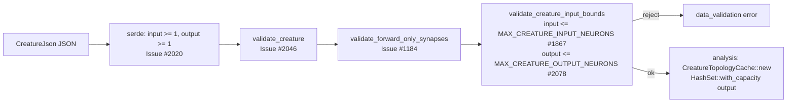

# Bound `creature.output` at the FFI boundary (Issue #2078)

## Summary

`MAX_CREATURE_INPUT_NEURONS` (Issue #1867) capped `creature.input`, but its
sibling `creature.output` was bounded only **below** (`output >= 1`,
Issue #2020). `CreatureTopologyCache::new`
(`src/analysis/detection/topology_cache.rs:44`) sizes an output-UUID `HashSet`
from that caller-supplied count, so a `CreatureJson` carrying
`"output": 18446744073709551615` reached `HashSet::with_capacity(usize::MAX)`
through `analyze_parallel` / `rank_focus_neurons`. Allocation failure routes
through `handle_alloc_error`, which **aborts** the host process — an abort the
`panic::catch_unwind` around every FFI entry point cannot intercept.

`validate_creature_input_bounds` now caps `output` at the new
`MAX_CREATURE_OUTPUT_NEURONS` (1,000,000), mirroring the `input` cap and
returning the same structured `data_validation` error. Because
`validate_creature` (Issue #2046) composes that gate for all five creature
entry points, the bound applies everywhere a `CreatureJson` crosses the
boundary, before any business logic runs.

Closes #2078.

## Evidence

Backend/FFI change with no web interface, so there is nothing to screenshot.
The evidence is the test run.

**Red → green, observed this run.** With the new
`MAX_CREATURE_OUTPUT_NEURONS` constant added but the bound **not yet enforced**,
`cargo test --test ffi issue_2078` reported
`test result: FAILED. 2 passed; 4 failed` — the four rejection tests failed, and
`analyze_parallel_rejects_oversized_output_without_aborting` showed the
oversized creature sailing past the gate (it returned `gpu_permanent`, i.e. the
creature was accepted and the call proceeded into the analysis path), while
`rank_focus_neurons_rejects_oversized_output_without_aborting` returned
`"success": true` for a creature declaring `usize::MAX` outputs. After adding
the enforcement branch, the same command reports
`test result: ok. 6 passed; 0 failed`.

`cargo clippy --all-targets --all-features` is clean and `cargo fmt --all` has
been applied.

## Trigger closed — no trivial bypass

The issue's exact trigger —
`{"input": 1, "output": 18446744073709551615, "neurons": [...], "synapses": []}`
— is now rejected with `errorKind: "data_validation"` before any analysis work
starts. There is no equivalent bypass:

- `creature.output` is a bare `usize`; the only values above the cap are
  `1_000_001..=usize::MAX`, and the check is a single `>` comparison over the
  whole range (no arithmetic that could wrap, no parsing step in between).
- Every FFI entry point accepting a `CreatureJson` runs the bound through the
  single composed gate `validate_creature` (Issue #2046), so no entry point can
  reach the analysis path with an unbounded `output`.
- Every `CreatureTopologyCache::new` call site lives inside
  `src/analysis/detection/` and `src/analysis/module_dispatch_specs/`, reached
  only from those gated entry points (verified by grepping all call sites); the
  remaining ones are the module's own unit tests.
- The sibling allocation in the same constructor,
  `HashSet::with_capacity(creature.input)`, was already bounded by
  `MAX_CREATURE_INPUT_NEURONS`, so both capacity hints in the cache are now
  bounded.

## Test Plan

Regression tests added — each fails against the unfixed code (the gate accepts
the oversized creature) and passes after the fix:

- `tests/ffi/issue_2078_creature_output_bounds.rs::creature_output_above_limit_is_rejected`
  — reproduces the flaw at the boundary (`MAX_CREATURE_OUTPUT_NEURONS + 1`) and
  asserts the `data_validation` classification and the issue citation.
- `tests/ffi/issue_2078_creature_output_bounds.rs::creature_output_at_usize_max_is_rejected`
  — the issue's `usize::MAX` trigger.
- `tests/ffi/issue_2078_creature_output_bounds.rs::analyze_parallel_rejects_oversized_output_without_aborting`
  — the end-to-end abort regression through `analyze_parallel_internal`.
- `tests/ffi/issue_2078_creature_output_bounds.rs::rank_focus_neurons_rejects_oversized_output_without_aborting`
  — the same through `rank_focus_neurons_internal`.
- `tests/ffi/issue_2078_creature_output_bounds.rs::creature_output_exactly_at_limit_is_accepted`
  and `::ordinary_output_creature_is_accepted` — the bound is inclusive and does
  not reject ordinary creatures.
- `src/ffi_types/creature_bounds.rs` unit tests `output_limit_is_inclusive`,
  `output_above_limit_is_rejected_as_data_validation` and
  `usize_max_output_is_rejected`.
- `tests/issue_1256_public_api_surface.rs` now imports
  `MAX_CREATURE_OUTPUT_NEURONS`, so removing it from the public surface is a
  compile-time failure.

Docs updated in the same change: `docs/FFI_API.md` (the bound section now covers
both widths), `AGENTS.md` (validated FFI surface), and `CHANGELOG.md`.
`Cargo.toml` version bumped `0.74.239` → `0.74.240` per the repository's
version-bump rule.
