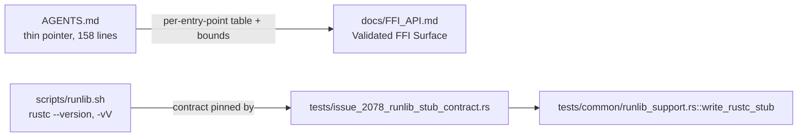

# Retro: un-cap AGENTS.md and pin the runlib stub contract (Issue #2085)

## Summary

Two retro findings from the merged #2078/#2081 work, each resolved in this
change:

1. **`AGENTS.md` was one line from its 200-line cap.** The per-entry-point
   FFI validation table (and its prose) that #2078's docs edit grew is
   duplicated content — `docs/FFI_API.md` already carried the width bounds in
   more detail. The table and its supporting paragraphs now live in
   `docs/FFI_API.md` under a new `Validated FFI Surface` section, and
   `AGENTS.md` keeps a three-line pointer to it. `AGENTS.md` drops from 199 to
   158 lines, restoring real headroom under the `agents_is_thin` gate.

2. **The runlib sandbox stub could drift from the synced script again.** When
   NEAT-AI-core added `rustc -vV` to `scripts/runlib.sh`, the stub in
   `tests/common/runlib_support.rs` still answered only `--version`, and the
   next family-sync died on `rustc -vV named no host target` on an unrelated
   PR. A new contract test drives the stub directly and fails fast, naming
   `write_rustc_stub`, when the stub stops answering the two `rustc` surfaces
   the script reads.

Closes #2085.

## Evidence

Documentation + test change with no web interface, so there is nothing to
screenshot. The evidence is the test run:

- `cargo test --test issue_1683_agents_consolidation --test issue_2078_runlib_stub_contract --test issue_2072_canonical_runlib --test issue_2055_runlib_cargo_home_path`
  — all 28 tests pass, including the new `agents_defers_the_ffi_validation_table_to_ffi_api`
  and the two new stub-contract tests.
- The new contract test was observed **red → green**: with the stub reverted to
  the pre-#2081 `--version`-only shape, `stub_rustc_vv_names_the_host_for_the_scripts_platform_filter`
  fails on `the stub rustc -vV must print \`host: ...\``; restored, it passes.
- `markdownlint-cli2 --no-globs AGENTS.md docs/FFI_API.md` — 0 issues.

<!-- vibe-quality-gate-skipped reason="full ./quality.sh exceeds the 600s Bash-tool foreground cap; it was run bounded (`timeout 900`) and terminated at SIGTERM before the full test/doc/release stages finished. Targeted checks passed: cargo fmt, clippy -D warnings on the touched test targets, and the four affected test files (28 tests green). CI runs the same gate on the PR." -->

## Test Plan

- Added `tests/issue_2078_runlib_stub_contract.rs` — two tests driving the
  shared `write_rustc_stub` directly, pinning the `rustc --version` and
  `rustc -vV` surfaces the synced `scripts/runlib.sh` reads.
- Added `agents_defers_the_ffi_validation_table_to_ffi_api` to
  `tests/issue_1683_agents_consolidation.rs` — asserts the per-entry-point
  table no longer sits in `AGENTS.md` and does sit in `docs/FFI_API.md`.
