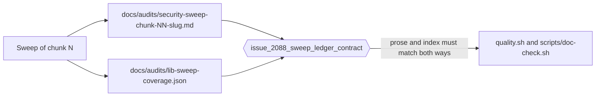

# Security sweep ledger: create `docs/audits/` so a swept chunk can be told from an unswept one

## Summary

Closes #2088.

Before this change there was no sweep-coverage ledger at all, so #2083 could not
mark any unreached chunk as "already covered by a dated prior sweep". Every
chunk was permanently "never recorded", each overflow tracker restarted from
zero, and the same surface could be swept twice while another was never swept.

This adds `docs/audits/` with the three ledger files, a pointer from
`SECURITY.md`, and — the part that keeps the ledger honest — an enforced parity
check wired into the existing doc-check gate.

- `docs/audits/README.md` — what the ledger is, when a sweep must write to it,
  the required fields of a chunk record, the one-file-per-chunk rule, and why a
  record with no commit SHA is worthless.
- `docs/audits/lib-sweep-coverage.json` — machine-readable index, one chunk per
  line with a stable key order so concurrent sweeps conflict on one line only.
  All nine chunk ids from #2083 are seeded with `"last_swept": null`: an
  explicit "never recorded" is the datum that was missing.
- `docs/audits/security-sweep-TEMPLATE.md` — the per-chunk skeleton, so the
  eight chunk issues produce comparable records.
- `SECURITY.md` — one-line pointer to the ledger under **Supply-chain
  machinery**.
- `scripts/doc-check.sh` — now runs the ledger contract test, so the rules are a
  gate rather than a convention.

No sweep coverage is claimed. Prior remediation work (#1867, #1900–#1918, #2020,
#2054, #2078) is described in the README and template as *related remediations*,
explicitly not sweep coverage, and never justifies a non-null `last_swept`.



### Design decisions

- **One file per chunk, never a shared append-only document.** The eight chunk
  issues run in parallel; a shared prose file guarantees merge conflicts.
- **One shared JSON index, line-oriented.** Each chunk entry sits on its own
  line with a fixed key order, so two concurrent sweeps conflict on one line
  instead of the whole file. The contract test enforces both properties.
- **Records are falsifiable.** Every claimed sweep pins a baseline commit SHA
  and a sweep date, so a reader can run
  `git diff <baseline_commit>..HEAD -- <paths>` and see whether the record still
  describes the current code.
- **The test asserts the rule, not the seeded state.** It does not assert
  `last_swept == null` forever — that would block the eight chunk issues from
  ever recording a sweep. It asserts the nine ids are present and the general
  falsifiability rule: non-null `last_swept` requires an ISO date, a hex SHA and
  an existing record file; null requires null baseline and record.

### Pre-existing gate defect uncovered

Wiring the ledger check into `scripts/doc-check.sh` exposed that the script was
already failing before this change:

```text
error: unresolved link to `validate_coordinated_candidate_gain`
error: could not document `neat_ai_discovery`
```

`quality.sh` runs `cargo doc --no-deps` **without** `--all-features`, while
`scripts/doc-check.sh` runs it **with** `--all-features`, so the
`regression-harness`-gated `production_discovery_regression` module was never
documented in CI and the broken intra-doc link went unnoticed. Acceptance
criterion 5 requires `scripts/doc-check.sh` to pass, so the link in that
module's doc comment is now fully qualified
(`crate::analysis::candidate_aggregation::validate_coordinated_candidate_gain`).
One line of doc text; no behaviour change.

## Evidence

**Test file added by this branch:** `tests/issue_2088_sweep_ledger_contract.rs`
(331 added lines).

**Regression test:**
`tests/issue_2088_sweep_ledger_contract.rs::prose_records_and_index_entries_match_both_ways`

**Fails before the fix, passes after.** The nine contract tests were written
first, against the unfixed tree (no `docs/audits/` directory, no `SECURITY.md`
pointer):

```text
$ cargo test --test issue_2088_sweep_ledger_contract   # before
test result: FAILED. 0 passed; 9 failed; 0 ignored; 0 measured; 0 filtered out
```

The failures named the missing `docs/audits/README.md`,
`docs/audits/lib-sweep-coverage.json`, `docs/audits/security-sweep-TEMPLATE.md`
and the missing `SECURITY.md` pointer. After adding the ledger:

```text
$ cargo test --test issue_2088_sweep_ledger_contract   # after
test result: ok. 9 passed; 0 failed; 0 ignored; 0 measured; 0 filtered out
```

**Original trigger is closed, with no trivial bypass.** The trigger was that a
sweep record could exist only as prose — invisible to the next automated run —
or not exist at all, with nothing detecting either state. The parity test closes
both directions: a `docs/audits/security-sweep-chunk-*.md` with no matching
index entry fails, and an index entry whose `record` names a missing file fails.
The obvious bypasses are also closed: a hand-edited index that no longer parses
fails `coverage_index_parses_and_covers_every_overflow_chunk`; dropping a chunk
id fails the same test; claiming a sweep without a baseline SHA, without an ISO
date, or without a record file fails
`a_claimed_sweep_pins_a_baseline_commit_and_a_record`; reflowing the index onto
one line or reordering keys fails `every_entry_is_one_line_with_a_stable_key_order`;
and deleting the `SECURITY.md` pointer or the README's rules fails their own
tests. The test runs from **both** gates — explicitly from
`scripts/doc-check.sh` and implicitly from `quality.sh`'s
`cargo test --lib --tests --all-features` — so skipping one gate does not skip
the check.

## Acceptance Criteria

<!-- vibe-spec-review inputs="diff+issue-body" -->

1. `docs/audits/README.md`, `docs/audits/lib-sweep-coverage.json` and
   `docs/audits/security-sweep-TEMPLATE.md` exist — reviewer: met. All three
   added by this branch; asserted by
   `issue_2088_sweep_ledger_contract.rs::ledger_files_exist`.
2. The JSON validates and contains an entry for every chunk id named in #2083
   (2, 4, 7, 8a, 8b, 9, 11, 13, 16) with `last_swept: null` — reviewer: met.
   `docs/audits/lib-sweep-coverage.json` carries all nine ids, each with
   `"last_swept": null`, `"baseline_commit": null`, `"record": null`; asserted by
   `coverage_index_parses_and_covers_every_overflow_chunk`.
3. The README states the per-chunk-file rule and the commit-SHA requirement —
   reviewer: met. `docs/audits/README.md` sections "One file per chunk — never a
   shared document" and "A record with no commit SHA is worthless"; asserted by
   `readme_states_the_per_chunk_file_rule_and_the_commit_sha_requirement`.
4. `SECURITY.md` links to the ledger — reviewer: met. Sweep-coverage ledger
   bullet under **Supply-chain machinery**; asserted by
   `security_policy_links_the_sweep_ledger`.
5. `./quality.sh` and `scripts/doc-check.sh` pass — reviewer: met. Both run to
   completion on this branch: `./quality.sh` ends `✅ All quality checks
   passed!` and `./scripts/doc-check.sh` ends `✅ Documentation build passed —
   no warnings` after the 9-test ledger check.
6. Failure Detection — a check that the JSON parses and that every
   `docs/audits/security-sweep-chunk-*.md` has a matching index entry and vice
   versa, wired into the existing doc-check gate — reviewer: met.
   `prose_records_and_index_entries_match_both_ways` covers both directions and
   `scripts/doc-check.sh` invokes the test file directly.
7. `src/analysis/production_discovery_regression.rs` doc-link fix — reviewer:
   unrequested. reason: not asked for by the issue; it is a pre-existing broken
   intra-doc link that made `scripts/doc-check.sh` fail, so criterion 5 could
   not be met without it (see "Pre-existing gate defect uncovered").
8. `Cargo.toml` / `Cargo.lock` patch version bump 0.74.244 → 0.74.245 —
   reviewer: unrequested. reason: not asked for by the issue; required by the
   repository rule that the `Cargo.toml` version is incremented on any code
   change.

## Standards Review

<!-- vibe-standards-review inputs="diff+CODING-STANDARDS.md" -->

The repository has no `CODING-STANDARDS.md`; the reviewer used the documented
canonical conventions it points at (`AGENTS.md`, `CONTRIBUTING.md`).

- **violation** — `docs/archive/pr-summaries/pr-summary-2088.md` was absent at
  review time, which `CONTRIBUTING.md` requires for every PR. Fixed: this file
  is that summary, committed on the branch.
- **clean** — Australian English throughout the new files; the one `defence`
  hit in `SECURITY.md` is pre-existing.
- **clean** — fails loud: every malformed ledger state (missing file, bad JSON,
  missing key, non-ISO date, non-hex SHA, orphaned record) panics with a
  descriptive message rather than being skipped.
- **clean** — the tests exercise real files and real parsing, not source-text
  grep of production code.
- **clean** — scope discipline: scaffolding only, no sweep coverage claimed.
- **clean** — `production_discovery_regression.rs` cites a real, existing
  symbol by path, per the "cite code by symbol" rule.
- **clean** — version bump present per the `AGENTS.md` version rule.
- **clean** — no CI workflow files touched; no hidden, secret or build-artefact
  files staged.
- **clean** — documentation updated alongside code: `SECURITY.md` gained the
  pointer to the new subsystem, and `scripts/doc-check.sh`'s comment about
  `quality.sh` running the same test was verified true.

## Test Plan

```bash
cargo test --test issue_2088_sweep_ledger_contract   # 9 passed
./scripts/doc-check.sh                               # doc build + ledger check
./quality.sh                                         # full gate
```

- `./quality.sh` — passed (`✅ All quality checks passed!`); it picks up the new
  contract test through `cargo test --lib --tests --all-features`.
- `./scripts/doc-check.sh` — passed end to end: `cargo doc --no-deps
  --all-features` clean, then 9/9 ledger tests.
- `cargo clippy --all-targets --all-features -- -D warnings` — clean.

### Manual falsification checks

Each was applied to a scratch copy of the ledger and reverted:

- Delete an index entry while its record file remains → parity test fails.
- Point an entry's `record` at a non-existent file → parity test fails.
- Set `last_swept` without a `baseline_commit` → falsifiability test fails.
- Reorder the keys within an entry line → key-order test fails.
- Remove the `SECURITY.md` pointer → policy-link test fails.
