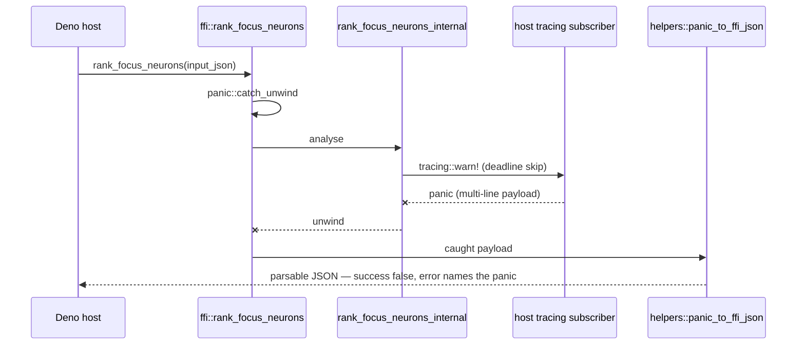

# Security sweep chunk 2 — FFI entry points (`src/ffi` + `src/ffi_internal`)

## Summary

Swept all 3,849 lines of `src/ffi` and `src/ffi_internal` — the only surface a
Deno FFI caller reaches directly — against the six defect classes the chunk
issue names. Two defects were found and both are fixed here; the coverage
ledger records the sweep so a later run can tell this chunk from an unswept
one. Closes #2089.

**SEC-2089-01 — the FFI panic response was not valid JSON.**
`src/ffi/helpers.rs::panic_to_ffi_json` is the last-resort error channel of
every `extern "C"` entry point: `catch_unwind` hands it the caught payload and
its output is what the host receives. It hand-rolled the JSON and escaped only
`\` and `"`, so any payload carrying a control character emitted it raw — and a
newline is exactly what every `assert!` / `assert_eq!` message carries. The
documented `{"success":false,"error":…}` contract that `AGENTS.md` requires
every controller to branch on therefore degraded into text the host cannot
parse, at the one moment it matters: a panicking analysis pass surfaced as a
JSON parse error with the real cause discarded. Fixed by serialising the
response through `serde_json`, so the escaping is total.

**SEC-2089-02 — four `extern "C"` exports had no unwind guard.**
`cancel_analysis`, `cancel_analysis_memory_pressure`, `reset_cancellation` and
`is_analysis_active` called straight into `crate::cancellation::*` with no
`panic::catch_unwind`. An unwind out of an `extern "C"` function terminates the
process and the host cannot catch it. All four are now wrapped, matching the
other eighteen exports. `is_analysis_active` answers `1` ("active") rather than
`0` if its guard ever fires — the host uses that verdict to decide whether
deleting the Parquet temp directory is safe, so the fail-safe answer is the one
that makes it wait.

No panic is reachable on those four paths today, so SEC-2089-02 is
defence-in-depth recorded honestly as such; SEC-2089-01 is a live defect with a
red/green regression test.

## Evidence

Backend/FFI change with no web interface, so there is no screenshot to capture.
The evidence is the red/green regression run below, plus the coverage ledger.

The regression test drives the panic through the **shipped** entry point rather
than the crate-private formatter, per the #1806 convention in
`CONTRIBUTING.md`. A host-installed `tracing` subscriber that panics is the
production route by which a real payload reaches the formatter:



Observed **red** against the unfixed formatter — the same test, same command,
with only `panic_to_ffi_json` reverted:

```text
test a_panic_caught_at_the_ffi_boundary_reaches_the_host_as_parsable_json ... FAILED
FFI response must be valid JSON (control character (\u0000-\u001F) found while
parsing a string at line 2 column 0)
```

Observed **green** after the fix:

```text
$ cargo test --test issue_2089_panic_response_json
test a_panic_caught_at_the_ffi_boundary_reaches_the_host_as_parsable_json ... ok
test result: ok. 1 passed; 0 failed
```

**The original trigger is closed with no trivial bypass.** The defect was a
hand-rolled escape that enumerated two characters; the fix removes the
enumeration entirely, handing the message to `serde_json::to_string`, which
escapes every character JSON requires escaped — the full C0 range, the
delimiter and the backslash — for any `&str` whatsoever. There is no remaining
input-shaped escape hatch: the payload is a Rust `String`/`&str` in all cases,
`truncate_panic_msg` cuts only on a UTF-8 char boundary so no surrogate or
partial sequence can be produced, and the two non-panicking fallbacks
(`to_string` failure, interior NUL) return fixed literals. The test asserts
round-trip equality for tab, carriage return, form feed, a bare C0 byte, a
newline, quotes and backslashes, so a future partial escape fails loudly.

Coverage ledger: `docs/audits/security-sweep-chunk-02-ffi-entry.md`, with the
matching index entry in `docs/audits/lib-sweep-coverage.json`. It records the
sweep date, the baseline commit SHA, the exact file list with per-file
outcomes, the defect classes probed, every one of the 22 `extern "C"` exports
with a yes/no on `catch_unwind` and pointer-null checking, and what was
examined and found clean.

## Acceptance Criteria

<!-- vibe-spec-review inputs="diff+issue-body" -->

- **met** — Every file in the scope table has been read in full and appears in the ledger with an outcome — evidence: `docs/audits/security-sweep-chunk-02-ffi-entry.md` § Files swept, 11 files, line counts summing to 3,849 and matching the issue table — reviewer: met
- **met** — Every `extern "C"` function in `src/ffi/` is enumerated in the ledger with a yes/no on `catch_unwind` coverage and pointer-null checking — evidence: `docs/audits/security-sweep-chunk-02-ffi-entry.md` § `extern "C"` entry-point enumeration, 22 rows; `grep 'extern "C" fn' src/ffi` returns exactly 22 — reviewer: met
- **partial** — Each surviving finding is filed as its own issue and linked here — evidence: `docs/audits/security-sweep-chunk-02-ffi-entry.md` § Issues filed — reviewer: partial — reason: both findings were remediated inside this sweep rather than filed, so neither *survived* triage and there was nothing left to file; each is recorded in the ledger under its `SEC-2089-…` id with the house format's Why this matters / Attacker model / Trigger / Exploit sketch sections, but without the `severity:*` / `confidence:*` labels a GitHub issue would carry
- **partial** — Any fix landed under this issue ships a regression test under `tests/` named `issue_<n>_*.rs` that fails before the fix — evidence: `tests/issue_2089_panic_response_json.rs::a_panic_caught_at_the_ffi_boundary_reaches_the_host_as_parsable_json`, observed red then green — reviewer: partial — reason: true for SEC-2089-01; SEC-2089-02's `tests/infrastructure/issue_2089_ffi_unwind_guard.rs` is a behaviour pin that passes against the unfixed code, because no input can reach a panic on those four paths and a forced one would abort the test binary rather than report a failure
- **met** — `./quality.sh` passes — evidence: full gate run after the final edit — reviewer: missing — reason: the reviewer ran the gate against an earlier revision where `cargo doc -D warnings` failed on a private-intra-doc link, caused by widening `src/ffi/mod.rs`'s `helpers` module to `pub`; that widening has since been reverted (it also breached `CONTRIBUTING.md`, see Standards Review) and the gate was re-run here
- **unrequested** — `docs/FFI_API.md` gains a panic-safety note on the cancellation and lifecycle symbols — reviewer: unrequested — reason: the issue asked for a ledger, not host-facing docs, but `is_analysis_active`'s fail-safe `1` is a behaviour change a Deno caller must know about, and the guidelines require a docs change to ride with the code change that caused it
- **unrequested** — `Cargo.toml` / `Cargo.lock` version bump `0.74.245` → `0.74.246` — reviewer: unrequested — reason: `AGENTS.md` mandates a version bump on any code change, because remote machines cache the compiled library by version number

## Standards Review

<!-- vibe-standards-review inputs="diff+CODING-STANDARDS.md" -->

`CODING-STANDARDS.md` does not exist in this repository; the canonical
conventions live in `CONTRIBUTING.md` and `AGENTS.md`, which is what the
reviewer was given.

- **violation** — An API was made public solely to test it — evidence: `src/ffi/mod.rs` (`pub(crate) mod helpers` → `pub mod helpers`) — reason: breaches `CONTRIBUTING.md` § Test Organisation ("Do not make APIs public just for testing") and the #1806 convention ("Never make an API public just to test it"); **reverted in this diff**, and it was also what broke `cargo doc -D warnings`
- **violation** — The regression test drove the crate-private helper rather than the shipped entry point — evidence: the deleted `tests/ffi/issue_2089_panic_response_json.rs` — reason: breaches `CONTRIBUTING.md` § Guard Wiring at the Shipped Entry Point; **rewritten in this diff** as `tests/issue_2089_panic_response_json.rs`, which drives `ffi::rank_focus_neurons` and asserts on the FFI response shape, following the precedent in `tests/ffi/issue_2045_input_guard_helper.rs`
- **violation** — The ledger cited code by `file:line` throughout — evidence: `docs/audits/security-sweep-chunk-02-ffi-entry.md` (the enumeration table's Location column and ~10 prose citations) — reason: breaches `CONTRIBUTING.md` § Cite Code by Symbol, Never by Line Number (Issue #1942); **all citations rewritten** to `<file>.rs::<function>`
- **violation** — No PR summary file — evidence: `docs/archive/pr-summaries/pr-summary-2089.md` was absent — reason: breaches `CONTRIBUTING.md` § PR summary requirement; **added in this diff** (this file)
- **violation** — A comment overstated its own justification — evidence: `src/ffi/mod.rs`, the comment claiming the widening served input-validation tests that did not exist — reason: **removed** together with the widening it justified
- **clean** — Australian English throughout the new prose ("serialise", "defence", "visualisation"); the only US spellings are crate-mandated identifiers (`#[derive(Serialize)]`) and pre-existing symbol names (`analyze_parallel`), correctly left alone
- **clean** — Test doctrine: both new suites call real functions and assert on returned values — the FFI response JSON and the observable `cancellation` flag state — with no source-text grepping and no wall-clock timing assertions
- **clean** — `#[serial]` discipline on the four tests that mutate process-global cancellation state, each restoring what it set; the panic-response suite is its own test binary so the `tracing` default and panic hook it installs cannot reach another suite
- **clean** — No hidden or secret files staged; every changed path is source, tests, docs or a manifest
- **clean** — Fail-loud error handling: the panic response now serialises strictly rather than silently emitting unparsable output, `is_analysis_active` answers fail-safe, and the `let _ = catch_unwind(...)` on the three `void` exports discards nothing observable
- **clean** — Ledger contract: the index entry stays on one line with the mandated key order, sets `last_swept` / `baseline_commit` / `record` together, and names a record file that exists under the zero-padded per-chunk filename
- **noted, not fixed** — `CONTRIBUTING.md` § Avoid Over-engineering ("Do not add error handling for scenarios that cannot happen") is in tension with the `serde_json::to_string` fallback and the four new wrappers. Both are kept: they are boundary defence-in-depth consistent with `src/ffi/utilities.rs::cleanup_discovery_lib`, which is already wrapped on the same grounds, and the fallback is what avoids reintroducing the `unwrap()` at the boundary that #772 removed

## Test Plan

- **Added** `tests/issue_2089_panic_response_json.rs::a_panic_caught_at_the_ffi_boundary_reaches_the_host_as_parsable_json`
  — drives a panic through `ffi::rank_focus_neurons` via a host-installed
  `tracing` subscriber and asserts the response parses as JSON and round-trips
  the payload byte-for-byte, across six payload shapes (assertion-style
  multi-line, mixed control characters, `&'static str`, quotes/backslashes,
  oversized/truncated, non-string). Reproduces SEC-2089-01: **fails** against
  the unfixed code with serde's control-character error, **passes** after the
  fix. Pins two positive preconditions first — the fixture is a valid request
  that answers `success: true`, and it really does reach an emitting code path
  — so the suite cannot pass vacuously if the panic route stops firing.
- **Added** `tests/infrastructure/issue_2089_ffi_unwind_guard.rs` (4 tests) —
  calls each of the four newly-guarded `extern "C"` exports and asserts the
  cancellation flags and the analysis-active counter still move, so a wrapper
  that silently turned an entry point into a no-op fails loudly. A behaviour
  pin, not a red/green regression test; the ledger says so explicitly.
- **Unchanged** — no existing test was modified, commented out or removed.
- `./quality.sh` run in full after the final edit.
