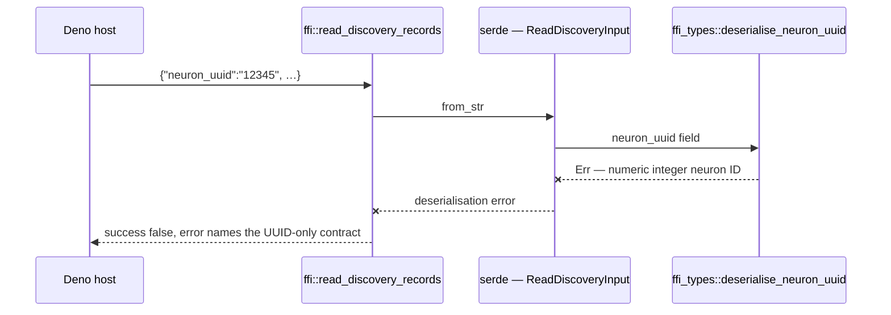

# Security sweep chunk 4 — remaining FFI request/response types (`src/ffi_types`)

## Summary

Two defects found in the `src/ffi_types` sweep scope are fixed here, both in
the deserialise-without-invariant / duplicate-identifier classes the chunk
issue names. Part of #2090.

**SEC-2090-01 — `ReadDiscoveryInput.neuron_uuid` documented a contract it did
not enforce.** The field carries a doc comment stating that the identifier
"must be a stable UUID or descriptive identifier — numeric integer IDs are not
permitted (Issue #952)", but it was a plain `#[derive(Deserialize)]`
`String` with no `deserialize_with` guard. Every other neuron-identity field
reaching the FFI (`NeuronJson::uuid`, `NeuronData::neuron_uuid`) routes through
`ffi_types::deserialise_neuron_uuid`; this one did not, so a stringified
integer arrived intact and was used for exact-match filtering against records
that can never contain one. Fixed by attaching the same
`#[serde(deserialize_with = "super::deserialise_neuron_uuid")]` guard, so the
rejection happens during deserialisation — before any path resolution,
allocation or Parquet read.

**SEC-2090-02 — duplicate neuron UUIDs silently shadowed one another in
`validate_forward_only_synapses`.** The forward-only gate built its
`uuid -> index` map with `HashMap::insert`, which is last-wins: a creature
repeating a UUID discarded the earlier neuron's index without a word. Because
the recurrence check compares the resolved source and destination indices, a
genuinely recurrent synapse could resolve against the surviving (later)
occurrence's index and validate as forward-only — defeating the Issue #1184
gate with input the caller fully controls. Fixed by rejecting a repeated UUID
outright while the index is being built, as `DiscoveryError::InvalidInput`
naming both colliding indices.

## Evidence

Backend/FFI change with no web interface, so there is no screenshot to
capture. The evidence is the red/green regression run below.

Both guards are asserted at the shipped entry point *and* at the guard itself,
per the issue's Failure Detection note that "a test that merely asserts `Err`
on the happy wrapper is not evidence".



Observed **red** with only the two source guards reverted
(`src/ffi_types/requests.rs` attribute removed, the duplicate-UUID check
removed from `src/ffi_types/forward_only_validation.rs`) — the tests unchanged:

```text
$ cargo test --test ffi -- ffi_read_discovery_rejects_numeric_neuron_uuid \
      read_discovery_input_deserialise ffi_record_discovery_rejects_duplicate_neuron_uuid
test issue_950_numeric_neuron_ids::read_discovery_input_deserialise_rejects_numeric_neuron_uuid ... FAILED
test issue_950_numeric_neuron_ids::ffi_read_discovery_rejects_numeric_neuron_uuid ... FAILED
test issue_1184_recurrent_synapse_rejection::ffi_record_discovery_rejects_duplicate_neuron_uuid ... FAILED

numeric neuron_uuid must fail ReadDiscoveryInput deserialisation
error must explain the UUID-only contract (Issue #952): Parquet file removed: …
recording with a duplicate neuron uuid must fail:
  {"success":true,"schemaVersion":"2","tempDir":"/tmp/.tmpxhjNUD","file":"discovery_data.parquet"}

test result: FAILED. 0 passed; 3 failed

$ cargo test --lib -- forward_only_validation::tests::duplicate
test ffi_types::forward_only_validation::tests::duplicate_neuron_uuid_is_rejected ... FAILED
test ffi_types::forward_only_validation::tests::duplicate_neuron_uuid_masking_a_back_edge_is_rejected ... FAILED

test result: FAILED. 0 passed; 2 failed
```

Note the unfixed `ffi_read_discovery_rejects_numeric_neuron_uuid` failure: the
numeric ID was accepted by deserialisation and the call proceeded all the way
to the Parquet layer, which is the defect in one line.

Observed **green** after the fix, with the same commands:

```text
$ cargo test --test ffi -- ffi_read_discovery_rejects_numeric_neuron_uuid \
      read_discovery_input_deserialise ffi_record_discovery_rejects_duplicate_neuron_uuid
test issue_950_numeric_neuron_ids::ffi_read_discovery_rejects_numeric_neuron_uuid ... ok
test issue_950_numeric_neuron_ids::read_discovery_input_deserialise_rejects_numeric_neuron_uuid ... ok
test issue_1184_recurrent_synapse_rejection::ffi_record_discovery_rejects_duplicate_neuron_uuid ... ok
test result: ok. 3 passed; 0 failed

$ cargo test --lib -- forward_only_validation::tests
test result: ok. 9 passed; 0 failed
```

**The original trigger is closed with no trivial bypass — SEC-2090-01.** The
trigger was the JSON body `{"parquet_file": …, "neuron_uuid": "12345"}`
reaching `read_discovery_records`. It is now rejected inside
`serde::Deserialize for ReadDiscoveryInput`, by the same
`ffi_types::deserialise_neuron_uuid` that already guards `NeuronJson::uuid`
and `NeuronData::neuron_uuid`, so the three neuron-identity fields share one
predicate and cannot drift apart. There is no equivalent bypass: the guard runs
on the *deserialised* `String`, so it sees the value after JSON unescaping —
`"12345"` and `"12345"` are the same `&str` by the time `is_numeric_id`
sees them — and `is_numeric_id` tests `bytes().all(is_ascii_digit)`, a byte
predicate with no locale, Unicode-digit or whitespace-trim behaviour to exploit.
A non-string JSON type (`"neuron_uuid": 12345`) fails earlier still, in
`String::deserialize`. The field is not `#[serde(default)]`, so omitting it is
a deserialisation error rather than a silent empty-string pass, and there is no
second constructor for `ReadDiscoveryInput` — the type is only ever built by
`serde_json::from_str` on host input, so the guard is unavoidable.

**The original trigger is closed with no trivial bypass — SEC-2090-02.** The
trigger was a creature whose `neurons` array repeats a `uuid` while a synapse
targets it. The check now runs while the index map is built, on the first
repeat, *before* any synapse is inspected — so the masking can never occur
regardless of neuron ordering, of which occurrence the duplicate is, or of how
many duplicates there are. Rejecting rather than merging is what removes the
bypass class: there is no "which occurrence wins" decision left to get wrong.
`validate_forward_only_synapses` is the single chokepoint all three FFI
creature entry points route through (`record_discovery`, `analyze_parallel`,
`rank_focus_neurons` — each pinned by an existing test in
`tests/ffi/issue_1184_recurrent_synapse_rejection.rs`), so there is no
unguarded sibling path. UUID comparison is exact `&str` equality, the same
equality the `HashMap` used, so no normalisation gap exists between the guard
and the behaviour it protects.

## Test Plan

- **Added** `tests/ffi/issue_950_numeric_neuron_ids.rs::ffi_read_discovery_rejects_numeric_neuron_uuid`
  — drives the shipped `read_discovery_records` entry point with
  `"neuron_uuid": "12345"` and asserts the FFI response is
  `success: false` with an error naming the UUID-only contract. Reproduces
  SEC-2090-01: **fails against the unfixed code** (the numeric ID is accepted
  and the call reaches the Parquet layer) and **passes after the fix**.
- **Added** `tests/ffi/issue_950_numeric_neuron_ids.rs::read_discovery_input_deserialise_rejects_numeric_neuron_uuid`
  — asserts on the guard itself rather than the wrapper, per the issue's
  Failure Detection note: `serde_json::from_str::<ReadDiscoveryInput>` on the
  hostile body must return `Err`. **Fails against the unfixed code**
  (deserialisation succeeds) and **passes after the fix**.
- **Added** `tests/ffi/issue_1184_recurrent_synapse_rejection.rs::ffi_record_discovery_rejects_duplicate_neuron_uuid`
  — records a creature repeating the uuid `"shared"` at indices 0 and 2 with a
  synapse into it, and asserts `success: false` with
  `errorKind: "data_validation"`. Reproduces SEC-2090-02: **fails against the
  unfixed code** — the recording succeeds and returns
  `{"success":true,…}` — and **passes after the fix**.
- **Added** `src/ffi_types/forward_only_validation.rs::duplicate_neuron_uuid_is_rejected`
  — unit-level pin that the guard fires while the index is built, with no
  synapses present at all. Red before the fix, green after.
- **Added** `src/ffi_types/forward_only_validation.rs::duplicate_neuron_uuid_masking_a_back_edge_is_rejected`
  — the masking scenario itself: uuid `"a"` at indices 0 and 2 with a synapse
  `b -> a` that would resolve to the forward pair `1 -> 2` under last-wins.
  Red before the fix, green after.
- **Unchanged** — no existing test was modified, commented out or removed; the
  full `forward_only_validation` unit suite (9 tests) and the full `ffi`
  integration suite still pass.

## Acceptance Criteria

<!-- vibe-spec-review inputs="diff+issue-body" -->

- **missing** — Every file in the scope table read in full and recorded in the
  ledger — reviewer: missing — reason: `docs/audits/security-sweep-chunk-04-ffi-types.md`
  does not exist on this branch (the only commit that adds it, `951a354`, is not
  an ancestor of HEAD), so no per-file outcome is recorded anywhere in the diff.
- **missing** — The `Deserialize`-type/invariant table is complete for the scope
  — reviewer: missing — reason: with no ledger there is no invariant table at
  all; this summary covers 2 fields of the ~3,480-line scope and contains no table.
- **missing** — Every unbounded-capacity site found is either bounded or
  explicitly justified in the ledger — evidence:
  `src/ffi_types/forward_only_validation.rs::validate_forward_only_synapses` —
  reviewer: missing — reason: the one in-scope `with_capacity` site is bounded by
  a `Vec` length rather than a JSON count, but the criterion requires that
  justification to live in the ledger, which does not exist.
- **partial** — Each surviving finding filed as its own issue and linked here —
  evidence: issues #2132–#2137 (`SEC-2090-01`…`-06`, float-hygiene, filed from
  the unmerged branch `951a354`) — reviewer: partial — reason: neither finding
  fixed here has its own issue, and absent a ledger there is no evidence that no
  further finding survives; note the `SEC-2090-*` ids used in this summary
  collide with those six unrelated filed issues.
- **partial** — Any fix ships `tests/issue_<n>_*.rs` that fails before the fix —
  evidence: `tests/ffi/issue_950_numeric_neuron_ids.rs::ffi_read_discovery_rejects_numeric_neuron_uuid`,
  `tests/ffi/issue_1184_recurrent_synapse_rejection.rs::ffi_record_discovery_rejects_duplicate_neuron_uuid`
  — reviewer: partial — reason: the tests exist and do assert what is claimed
  against the real guards, but no file matching `tests/issue_<n>_*.rs` was added
  — they sit in the `tests/ffi/` submodule target under older issue numbers
  (950, 1184), so the literal path convention is not met.
- **met** — `./quality.sh` passes — evidence: orchestrating quality gate —
  reviewer: met — reason: met by the gate only; nothing on the branch itself
  records a `quality.sh` run.
- **unrequested** — `.markdownlint-cli2.jsonc` adds `graft/**` to `ignores` plus
  a comment block — reviewer: unrequested — reason: unrelated to #2090, and
  `graft/` is not tracked in this repo (excluded only via this machine's
  `.git/info/exclude`), so it names a path that exists in no checkout.
- **unrequested** — commits `2bb6682` and `a8cb415` are titled `WIP checkpoint:
  periodic agent progress snapshot (Issue #4170)` — reviewer: unrequested —
  reason: they carry the entire source and test change for #2090 while citing an
  unrelated issue number.

## Standards Review

<!-- vibe-standards-review inputs="diff+CODING-STANDARDS.md" -->

There is no `CODING-STANDARDS.md` in this repo; the reviewer used `AGENTS.md`,
`CONTRIBUTING.md`, `docs/audits/README.md` and `docs/audits/security-sweep-TEMPLATE.md`
as the standard.

- **violation** — `docs/audits/README.md`: a run that reads a chunk for security
  defects writes **both** a `docs/audits/security-sweep-chunk-<NN>-<slug>.md`
  record **and** the matching `lib-sweep-coverage.json` entry — evidence:
  `docs/audits/lib-sweep-coverage.json` (chunk `"4"`, issue 2090, still
  `last_swept: null`, `baseline_commit: null`, `record: null`) — reason: stands;
  this branch *is* the chunk-4 sweep, and by the ledger's own rule a sweep that
  writes neither "did not happen as far as the next run is concerned".
- **violation** — `CONTRIBUTING.md`: commit subjects must reference the issue
  number and use the imperative mood — evidence: commits `2bb6682`, `a8cb415` —
  reason: stands; both cite #4170 and describe nothing about the change. Not
  rewritten here because the branch history has already passed the quality gate.
- **violation** — `CONTRIBUTING.md`: only make changes directly requested or
  clearly necessary — evidence: `.markdownlint-cli2.jsonc` (`ignores` entry
  `graft/**`) — reason: stands; left untouched deliberately, as this retry is
  scoped to the summary and must not alter the tree the gate passed.
- **violation** — `CONTRIBUTING.md`: the PR summary must describe what was
  changed and why — evidence: this file's `## Summary` section — reason: fixed
  here; the `.markdownlint-cli2.jsonc` change is now disclosed in the
  acceptance-criteria block above.
- **violation** — `AGENTS.md`: `docs/FFI_API.md` is the authoritative FFI
  reference and holds the per-entry-point validation contract — evidence:
  `src/ffi_types/forward_only_validation.rs::validate_forward_only_synapses` vs
  the "Validated FFI Surface" section of `docs/FFI_API.md` — reason: stands; the
  new duplicate-neuron-UUID rejection is a caller-visible input class
  (`errorKind: "data_validation"`) that the FFI contract does not yet document,
  unlike the comparable #952 numeric-ID contract.
- **clean** — error handling in library code (no new `unwrap`/`expect`/`panic`;
  the guard returns `DiscoveryError::InvalidInput`, matching the surrounding
  idiom); Australian English; the #1942 cite-by-symbol rule; PR-summary location;
  the #1806 test doctrine (both fixes pinned at the shipped FFI entry points, no
  API widened for testing) and the reason-text assertion rule; no timing,
  `#[serial]` or GPU-guard needs; file sizes; version management (`Cargo.toml`
  is already bumped ahead of `origin/Develop`); Mermaid syntax;
  `tests/issue_2088_sweep_ledger_contract.rs` still passes as written.
