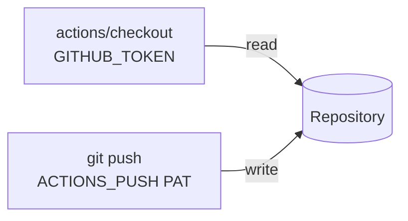

## Summary

Drop the unused `GITHUB_TOKEN` write grants from the three jobs that push
commits. Closes #2102.

`version-increment` and `auto-format` (`ci.yml`) and `family-sync`
(`family-sync.yml`) all push with the `ACTIONS_PUSH` PAT through an explicit
authenticated remote URL, and check out with `persist-credentials: false`
(Issue #1868). The `GITHUB_TOKEN` is only used by `actions/checkout` to read
the repository, so their `contents: write` / `pull-requests: write` grants were
unused privilege.



- [x] Each job keeps an explicit job-level block, now `contents: read`, with a
      one-line comment saying why.
- [x] Updated the top-level `permissions:` comments in both workflows.
- [x] Inverted the Issue #1286 test, which had pinned `contents: write`. It now
      asserts that the three jobs grant no write scope and still push through
      the PAT.

The edit to `ci.yml` is limited to the `permissions:` blocks and their
comments. Triggers, steps and pinned SHAs are unchanged.

## Evidence

`cargo test --test issue_1286_workflow_permissions` before the workflow fix
(red):

```text
job `version-increment` in ci.yml pushes with the ACTIONS_PUSH PAT, so it must
not grant the GITHUB_TOKEN write scopes ["contents", "pull-requests"] (Issue #2102)
test result: FAILED. 2 passed; 1 failed
```

After the fix (green): `test result: ok. 3 passed; 0 failed`.

## Test Plan

- `tests/issue_1286_workflow_permissions.rs::pat_pushing_jobs_grant_github_token_no_write`
  is the regression test for #2102. It fails against the old workflows and
  passes after the fix.
- `write_scopes_detects_write_grants` covers the helper: write grants, a
  read-only block, and empty input.
- `./quality.sh < /dev/null`
