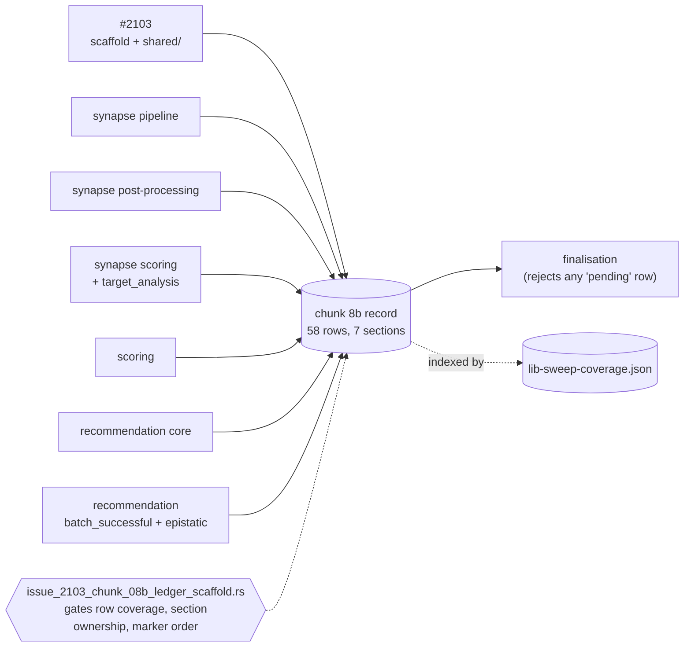

# Chunk 8b: sweep ledger scaffold + `src/analysis/shared/` audit

## Summary

Creates the chunk 8b sweep record at
`docs/audits/security-sweep-chunk-08b-synapse-scoring-recommendation.md` with a
row for every one of the 58 in-scope files, and completes the first of its
seven audit sections: `src/analysis/shared/` (4 files, 895 lines).

The record is filled by seven sub-issues running in parallel, so its whole
shape is designed for disjoint edits: rows sit under one `###` heading per
sub-issue, and each of the two finding tables carries one
`<!-- section: … -->` marker per sub-issue. `tests/issue_2103_chunk_08b_ledger_scaffold.rs`
gates that shape so it cannot rot silently.

**The `shared/` sweep is a negative result — no vulnerability was found and no
finding issue was filed.** All four files are clean for the shared-state race
class and the other classes probed. `#2093` carries a comment with the outcome
and two corrections for the remaining sub-issues.

Closes #2103.

### What the `shared/` sweep actually traced

- **`TimingCollector` is the only mutable shared state in `shared/`.** Writers
  are `record_shader` (under a `parking_lot::Mutex`) and three
  `AtomicU64::fetch_add` counters; the single reader `finalize` has exactly two
  call sites, `synapse/results.rs::finalise_synapse_results` and
  `neuron/post_processing.rs::build_neuron_results`. Both run **after** their
  dispatch function's rayon `par_iter()` sections have joined, so no
  reader/writer window exists and the `Relaxed` loads observe every worker's
  `fetch_add`.
- **Unbounded map growth was the one plausible attack** — `shader_timings` is
  keyed by a `String`. Every `TimingScope::shader` call site passes a
  compile-time literal (`"relu"`, `"activation"`, `"helpful"`, `"harmful"`), so
  the key set is four entries and no caller can extend it.
- **`gpu_info.rs::ZeroCopyBufferConfig::from_env` cannot panic on any env
  value** — it delegates to `config/helpers.rs::parse_optional_bool_env`, which
  is total (non-UTF-8 → `None`, unrecognised string → `None`, no `unwrap`, no
  numeric parse). `buffer_count` is a hardcoded `3`, never input-derived.
- **`metadata.rs` carries no interior mutability** — 11 `#[derive]`d plain-data
  types, no `Mutex`/`Cell`/`Atomic*`/`static mut`, no arithmetic, no
  comparisons.
- **Two corrections recorded for the remaining sub-issues:** the dispatch files
  the issue named (`src/analysis/orchestration.rs`,
  `src/analysis/discovery_dispatch.rs`) carry **zero** `TimingCollector`
  references; the real sites are
  `synapse/orchestration.rs::analyze_synapses_with_cache_impl` and
  `neuron/mod.rs::analyze_neurons_with_cache_and_gpu_queue`.

## Evidence

Backend/documentation change with no web interface — no screenshot applies.
Evidence is the test suite and the full quality gate.

- `./quality.sh` run to completion on the final tree: **all checks passed**
  (bash syntax, shellcheck, cargo-install pinning, PR-summary layout,
  `cargo deny check`, build, fmt, clippy `-D warnings`, `cargo check
  --all-targets --all-features`, full `cargo test`, rustdoc `-D warnings`,
  release build).
- `cargo test --test issue_2103_chunk_08b_ledger_scaffold --test
  issue_2088_sweep_ledger_contract` → 20 passed.

### Regression test — failing first

`tests/issue_2103_chunk_08b_ledger_scaffold.rs::the_shared_rows_are_swept_with_a_reason`
reproduces the defect this change removes: a chunk section that looks swept
from the index while its rows still read `pending`.

- **Observed red against the unfixed tree.** With the record absent (the state
  before this change), 8 of the 9 tests in the file fail —
  `the_record_exists_and_pins_its_chunk_id_baseline_and_parent`,
  `the_shared_rows_are_swept_with_a_reason` and
  `the_shared_sweep_cites_symbols_that_still_exist` among them:
  `…security-sweep-chunk-08b-synapse-scoring-recommendation.md must exist and
  be readable: No such file or directory (os error 2)`.
- **Observed red for the narrow trigger.** Flipping one `shared/` row's outcome
  from `clean — …` back to `pending — …` fails
  `the_shared_rows_are_swept_with_a_reason` on its own, with the rest of the
  file green — so the assertion is specific to the defect, not to the file's
  existence.
- **Green after the fix.** Both are green on the committed tree.

### Original trigger closed, no trivial bypass

The defect class this change closes is a **ledger-integrity** one, not a
runtime vulnerability: a file in scope silently having no row, or a section
being reported as swept while its rows read `pending`.

- **Missing row.** `every_in_scope_file_has_exactly_one_row` walks the live
  filesystem under the four scope roots and does a both-ways set comparison
  against the table. Adding a `.rs` file without a row fails the test; deleting
  one without removing its row fails it too. The bypass would be a duplicate
  row masking a gap — also rejected, by the `tabled.insert` assertion.
- **Silent `pending`.** `an_unfinished_chunk_says_so_above_its_table` derives
  the pending count from the rows themselves, so removing the `IN PROGRESS`
  heading while rows are outstanding fails. The heading cannot be satisfied by
  rewording, and the count cannot be faked without also changing the rows a
  later reader checks.
- **Stale citation.** `the_shared_sweep_cites_symbols_that_still_exist` asserts
  each symbol the outcome names is still declared in `src/` — a sweep
  describing code that has moved now fails loudly instead of reading as
  coverage. `the_record_cites_no_line_numbers` blocks the `file.rs:<line>`
  form that cannot be checked this way.

**On the security label:** the `shared/` sweep found nothing exploitable, so
there is no attacker trigger to close. The one candidate — unbounded growth of
the shared `shader_timings` map — is closed by construction, not by this diff:
every key is a compile-time literal, so no caller-supplied string reaches it,
and there is no path through the public API that supplies one.

## Reproduction

Not applicable — issue #2103 does not carry the `bug` label.

## Acceptance Criteria

<!-- vibe-spec-review inputs="diff+issue-body" -->

- **met** — Ledger exists at the exact path with 58 rows, baseline SHA `b85a551` and sweep date — evidence: `docs/audits/security-sweep-chunk-08b-synapse-scoring-recommendation.md`, verified by `tests/issue_2103_chunk_08b_ledger_scaffold.rs::every_in_scope_file_has_exactly_one_row` (set-equality against the live tree) and `::the_record_exists_and_pins_its_chunk_id_baseline_and_parent` — reviewer: met
- **met** — All four `shared/` rows have a non-`pending` outcome with a one-line reason — evidence: `tests/issue_2103_chunk_08b_ledger_scaffold.rs::the_shared_rows_are_swept_with_a_reason` — reviewer: met
- **met** — Every finding filed with `security`, `lang:rust`, `severity:*`, `confidence:*`, linked in the ledger and in a comment on #2093, carrying the failing-first test requirement — evidence: `## Issues filed` reads `negative-result`, and stSoftwareAU/NEAT-AI-Discovery#2093 now carries the outcome comment — reviewer: met — reason: the reviewer's words were "met (vacuous)" — zero findings survived, so the labelling and failing-first clauses have nothing to attach to; it also noted no comment existed on #2093, which was posted after the review
- **met** — `./quality.sh` passes — evidence: full gate run to completion on the final tree, `✅ All quality checks passed!` — reviewer: partial — reason: departed from the reviewer's verdict, which was "full gate not run" because a sub-agent cannot run a release build and the whole suite; it was run here and passed
- **unrequested** — `tests/issue_2103_chunk_08b_ledger_scaffold.rs` — reviewer: unrequested — reason: the issue only requires failing-first tests for finding *fixes*, and there were none; kept because a seven-PR shared document with no gate is exactly the shape that rots silently, and the repo's security-fix contract requires a regression test in the branch
- **unrequested** — the `docs/audits/lib-sweep-coverage.json` edit — reviewer: unrequested — reason: forced, not chosen — `tests/issue_2088_sweep_ledger_contract.rs` rejects a prose record with no index entry, and rejects a non-null `record` alongside a null `last_swept`
- **unrequested** — the `### Why this record cites symbols, not line numbers` section — reviewer: unrequested — reason: documents a deliberate departure from the issue's `file:line` column wording, required by CONTRIBUTING.md § Cite Code by Symbol (#1942); recording it beats six later sub-issues each rediscovering the conflict

## Standards Review

<!-- vibe-standards-review inputs="diff+CODING-STANDARDS.md" -->

- **violation** — committed blob was not `rustfmt`-clean — evidence: `tests/issue_2103_chunk_08b_ledger_scaffold.rs:144` — reason: fixed here; `cargo fmt --all` applied and `./quality.sh` re-run green
- **violation** — 17 `file.rs:NN` citations, the rot CONTRIBUTING.md § Cite Code by Symbol (#1942) bans in *every* doc — evidence: `docs/audits/security-sweep-chunk-08b-synapse-scoring-recommendation.md:243` — reason: fixed here; the outcome now cites `file.rs::symbol` throughout, both finding-table site columns were renamed, and `::the_record_cites_no_line_numbers` blocks the form for the six remaining sub-issues
- **violation** — no `docs/archive/pr-summaries/pr-summary-2103.md` — evidence: missing file — reason: fixed here; this document
- **violation** — prose-keyword assertions that pass for any document containing the words — evidence: `tests/issue_2103_chunk_08b_ledger_scaffold.rs:300` — reason: fixed here; replaced by `::the_shared_sweep_cites_symbols_that_still_exist`, which asserts each cited symbol is still declared in `src/`, and the hardcoded sweep-date literal became an ISO-format check
- **violation** — `last_swept` reads as a completed sweep at 4/58 rows — evidence: `docs/audits/lib-sweep-coverage.json:9` — reason: **stands, deliberately.** `tests/issue_2088_sweep_ledger_contract.rs` rejects a `record` with a null `last_swept`, so a partly-swept chunk cannot be expressed in the index at all without changing that ledger-wide contract — out of scope for this issue. Mitigated: the record carries an explicit `### Sweep status — IN PROGRESS` heading explaining exactly how to read the date, and `::an_unfinished_chunk_says_so_above_its_table` keeps it there while any row reads `pending`
- **clean** — Australian English throughout (`finalisation`, `artefact`, `parallel`); the only `-ize` token is the real Rust symbol `finalize`. No hidden or secret paths staged — three tracked files, no dotfiles or credentials. File size and focus within the repo's targets; tests live in `tests/`. Commit messages imperative, issue-referenced, run-id stamped. Ledger rules (`docs/audits/README.md`) honoured: correct `security-sweep-chunk-08b-<slug>.md` name, one file per chunk, index key order preserved on a single line, "Related remediations" kept separate from sweep coverage. `markdownlint-cli2` reports 0 issues. Record facts independently verified: 58 files / 20,997 lines matches the tree exactly, `b85a551` resolves, and `git diff b85a551..HEAD` over the four roots is empty

## Test Plan

Added `tests/issue_2103_chunk_08b_ledger_scaffold.rs` (9 tests):

| Test | What it would catch |
| --- | --- |
| `the_record_exists_and_pins_its_chunk_id_baseline_and_parent` | a record with no chunk id, exposure, baseline SHA, parent issue or ISO sweep date — unfalsifiable by a later reader |
| `the_index_names_the_chunk_8b_record` | a prose record invisible to the next automated run |
| `every_in_scope_file_has_exactly_one_row` | an in-scope file with no row (never swept), a row for a deleted file, or a duplicate row masking a gap |
| `every_row_sits_under_one_named_sub_issue_section` | a row outside the seven sub-issue sections — no owner, and a shared region two PRs would conflict on |
| `every_row_carries_an_outcome` | an empty outcome or missing line count |
| `the_shared_rows_are_swept_with_a_reason` | a `shared/` row left `pending`, or a bare `clean` with no checkable reason |
| `the_shared_sweep_cites_symbols_that_still_exist` | an outcome naming no reader/writer/dispatch site, or citing a symbol that no longer exists in `src/` |
| `the_record_cites_no_line_numbers` | a `file.rs:<line>` citation reintroducing the #1942 rot |
| `an_unfinished_chunk_says_so_above_its_table` | the `IN PROGRESS` heading removed while rows still read `pending`, leaving the index's date as the only (misleading) signal |

Existing `tests/issue_2088_sweep_ledger_contract.rs` (9 tests) continues to pass
against the amended index — prose/index parity both ways, key order, and the
baseline-SHA requirement.

No existing test was modified or removed.
