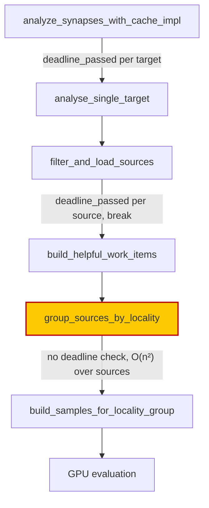

# Chunk 8b: sweep the `src/analysis/synapse/` pipeline files

## Summary

Read all 14 `src/analysis/synapse/` pipeline files in full for the chunk 8b
defect classes and recorded the outcome in
`docs/audits/security-sweep-chunk-08b-synapse-scoring-recommendation.md`: the 14
per-file rows, 7 capacity rows, 9 float-comparison rows and a
`### synapse pipeline (Issue #2104)` outcome section. Closes #2104.

**One finding filed — #2161** (`security`, `lang:rust`, `severity:medium`,
`confidence:high`): `candidate_generation.rs::group_sources_by_locality` runs an
O(n²) pairwise source scan with no deadline or cancellation check, so
`analysis_deadline_ms` and a host cancel request are both ignored until it
finishes. The fix ships in that issue, per the #2078 house pattern.

**The issue's own #1906 hypothesis is refuted.** `holdout_validation.rs`'s
`samples.len() - validate_count` cannot wrap: `split_samples_holdout` returns
`None` below `HOLDOUT_MIN_SAMPLE_COUNT` (20) and `round(0.3n) < n` for every
admitted `n`, so an empty sample set never reaches the subtraction. Two
regression tests now pin that guard.

Section membership was realigned so each `###` section equals exactly one
sub-issue's file list — `filtering`, `holdout_validation`, `metadata`, `results`
and `tests` moved into `synapse pipeline`; `adaptive_proposal` and
`add_synapse_gating` moved into `synapse post-processing` (#2105's four files).
Row count, per-file line counts and the 58-file coverage are unchanged.

## Evidence

Backend/audit change — no web interface to screenshot. The evidence is the
record, the filed finding, and the test runs below.

Where the cancellation gap sits, which is what #2161 is about:



Command output:

```text
cargo test --lib --tests --all-features -- --test-threads=2
  5568 passed, 5 ignored (196 suites, 320s)

cargo clippy --all-targets --all-features -- -D warnings   → no issues
cargo fmt --all                                            → clean
cargo deny check                    → advisories ok, bans ok, licenses ok, sources ok
RUSTDOCFLAGS="-D warnings" cargo doc --no-deps             → ok
cargo build --release --lib                                → ok
```

The regression test observed red against the unfixed code, by deleting the
`samples.len() < HOLDOUT_MIN_SAMPLE_COUNT` early return:

```text
test analysis::synapse::holdout_validation::tests::empty_sample_set_returns_none_before_the_subtraction ... FAILED
panicked at src/analysis/synapse/holdout_validation.rs:48:40:
attempt to subtract with overflow
```

The six ledger-contract tests were also observed red against the pre-sweep
record (the `e814e00` copy of the ledger): `2 passed; 6 failed`.

**Original trigger closed, no trivial bypass.** The security-relevant trigger in
the swept code is a sub-threshold sample set reaching
`holdout_validation.rs::split_samples_holdout`, where
`Vec::with_capacity(samples.len() - validate_count)` would wrap to a
near-`usize::MAX` capacity in release and abort the process on allocation
failure — the Issue #1867 / #2078 failure mode. That trigger is closed by the
`HOLDOUT_MIN_SAMPLE_COUNT` early return, which is the **first statement of the
function's only entry point**, so no call path reaches the subtraction without
crossing it and there is no equivalent bypass: the sibling modulo in
`is_validation_sample` sits behind the same guard, and `validate_count` is
bounded above by `round(0.3n) < n` for every admitted `n`. Removing the guard
turns the new test red, as shown above. The remaining open trigger found by this
sweep is #2161's, which is filed with its own failure-detection plan rather than
fixed here.

## Acceptance Criteria

<!-- vibe-spec-review inputs="diff+issue-body" -->

- **met** — All 14 rows non-`pending` with a one-line reason; test/metadata
  files may be "no untrusted-input reachability" — evidence:
  `tests/issue_2104_chunk_08b_synapse_pipeline_sweep.rs::every_synapse_pipeline_row_is_swept_with_a_reason`
  — reviewer: met
- **met** — Every `with_capacity`/`vec![_; n]`/`reserve` and every
  `partial_cmp`/`sort_by`/`total_cmp`/`max_by`/`min_by` site has a table row —
  evidence:
  `tests/issue_2104_chunk_08b_synapse_pipeline_sweep.rs::every_capacity_site_in_the_swept_files_has_a_table_row`
  — reviewer: met — reason: the reviewer confirmed all 7 production capacity
  sites and the single comparator site are tabled, and flagged the guard as
  per-file rather than per-site with a `vec![a, b]` false positive; the
  heuristic was tightened in this diff to require the `;` inside the brackets,
  and the per-file granularity is now documented as deliberate — the record
  cites symbols, not lines
- **met** — Findings filed with required labels, linked in the ledger and in a
  comment on #2093 — evidence: #2161 with `security`, `lang:rust`,
  `severity:medium`, `confidence:high`; linked in `## Issues filed` and in the
  outcome; comment on #2093 — reviewer: met
- **met** — `./quality.sh` passes — evidence: the Spec reviewer ran the script
  end to end (`✅ All quality checks passed!`, exit 0); every stage was also run
  here as separate bounded invocations, because the script exceeds this
  environment's 600 s per-command cap — reviewer: met
- **unrequested** — `src/analysis/synapse/holdout_validation.rs` gains 36 lines
  of `#[cfg(test)]` regression tests, in a file the sweep was meant only to read
  — reviewer: unrequested — reason: `split_samples_holdout` is `pub(crate)`, so
  the only way to assert the guard against the real function is beside it; the
  security-fix evidence contract requires a regression test observed failing
  without the guard, which is the red run quoted above
- **unrequested** — the `### synapse post-processing` section was edited (5 rows
  out, 2 in, line total rewritten), which the issue forbids — reviewer:
  unrequested — reason: the scaffold split the synapse root differently from the
  sub-issues that edit it, so "all 14 rows" was unsatisfiable without the move;
  the resulting list matches #2105's stated four files exactly and no row's
  outcome or line count was altered
- **unrequested** — `TRACED_SYMBOLS` pins two symbols outside the 14 swept files
  (`scoring/improvement.rs::finalise_improvement` / `::select_finite`) and one in
  `utils/deadline.rs` (`apply_source_budget`) — reviewer: unrequested — reason:
  deliberate; those three are what the float-class and cancellation verdicts
  rest on, so a rename there must re-open this section rather than pass silently
- **unrequested** — the record's intro paragraph and `## Issues filed` list were
  edited, both outside the assigned section — reviewer: unrequested — reason:
  AC3 requires the finding to be linked in the ledger, and leaving "only
  `src/analysis/shared/` is swept so far" in place would have been false
- **unrequested** — `the_cpu_pre_reject_screen_rejects_an_empty_sample_set`
  asserted behaviour already covered by
  `cpu_pre_reject.rs::empty_batch_is_no_signal` — reviewer: unrequested —
  reason: removed from this diff after the Standards review flagged the
  duplication

Two inaccuracies the Spec reviewer found in the record were corrected in this
diff: the `filtering.rs` float row claimed both truncate call sites run
`reject_non_finite_gains` (only `candidate_aggregation.rs` does — the
`post_processing.rs` site rests on the construction invariant alone), and the
outcome undercounted the NaN fail-open guards at three when
`gpu_evaluation.rs`'s `absolute_improvement < 0.001` is a fourth.

## Standards Review

<!-- vibe-standards-review inputs="diff+CODING-STANDARDS.md" -->

- **violation** — the integration test re-implemented the production hold-out
  arithmetic instead of exercising it (a "How" test, and a DRY breach) —
  evidence: `tests/issue_2104_chunk_08b_synapse_pipeline_sweep.rs:326` in the
  reviewed diff — reason: fixed here; the duplicated expression is gone and the
  verdict is asserted against the real function by the two in-crate tests
- **violation** — a duplicate empty-batch assertion already covered by
  `cpu_pre_reject.rs::empty_batch_is_no_signal` — evidence:
  `tests/issue_2104_chunk_08b_synapse_pipeline_sweep.rs:350` in the reviewed
  diff — reason: fixed here; the test was removed
- **violation** — the record's baseline bullet claimed the
  `b85a551..HEAD` diff over the swept paths is empty, which this PR's own
  `#[cfg(test)]` additions falsified — evidence:
  `docs/audits/security-sweep-chunk-08b-synapse-scoring-recommendation.md:13` —
  reason: fixed here; the bullet now names the only post-baseline change and
  states that line counts stay as at the baseline
- **violation** — `PR summary missing` — evidence: the reviewed diff had no
  `docs/archive/pr-summaries/pr-summary-2104.md` — reason: fixed here; this file
- **violation** — `read`, `section`, `file_rows` and `repo_root` duplicate the
  sibling suite's helpers rather than living in `tests/common/mod.rs` —
  evidence: `tests/issue_2104_chunk_08b_synapse_pipeline_sweep.rs:45` — reason:
  stands; `tests/common/mod.rs` carries creature/record fixtures, not Markdown
  parsing, and hoisting them would edit #2103's committed test file, which
  another chunk 8b sub-issue owns. Recorded here so the finalisation sub-issue
  (#2110) can hoist both copies once
- **violation** — `docs/audits/lib-sweep-coverage.json` was not updated —
  evidence: `docs/audits/README.md:21` — reason: stands; the index cannot
  express partial progress (the ledger contract rejects a null `last_swept`), so
  #2103 pinned the entry to the scaffold date, which is this same date. #2110
  reconciles the index when the last section lands
- **violation** — commit `327c798` cites Issue #4170, not #2104, and is not in
  imperative mood — evidence: the branch log — reason: stands; that is the
  worker's own periodic WIP checkpoint, not an authored commit
- **clean** — Australian English throughout the added prose and code; no
  `file.rs:<line>` citation anywhere in the record (symbols only, Issue #1942);
  every symbol the new prose cites resolves; the 7 capacity sites and 1
  comparator site in the swept files are each tabled; the in-`src/` test
  placement is justified by `pub(crate)` visibility with no API widened; no
  wall-clock or timing assertions; no hidden paths staged; the section line
  totals net to zero against the 58-file header

## Test Plan

Added `tests/issue_2104_chunk_08b_synapse_pipeline_sweep.rs`:

- `the_synapse_pipeline_section_owns_exactly_the_files_issue_2104_swept`
- `every_synapse_pipeline_row_is_swept_with_a_reason`
- `every_capacity_site_in_the_swept_files_has_a_table_row` — scans the
  production half of each swept file and asserts the citation matches both ways
- `every_float_comparator_in_the_swept_files_has_a_table_row`
- `the_synapse_pipeline_outcome_cites_symbols_that_still_exist`
- `the_synapse_pipeline_outcome_links_its_filed_finding`

Added to `src/analysis/synapse/holdout_validation.rs` (the function is
`pub(crate)`, so these must live in-crate):

- `empty_sample_set_returns_none_before_the_subtraction` — the regression test
  that reproduces the #1906 wrap: red with `attempt to subtract with overflow`
  when the guard is removed, green with it
- `every_admitted_sample_count_partitions_without_wrapping` — every count the
  guard admits partitions all samples into two non-empty halves

Full suite: 5568 passed, 5 ignored, 196 suites.
