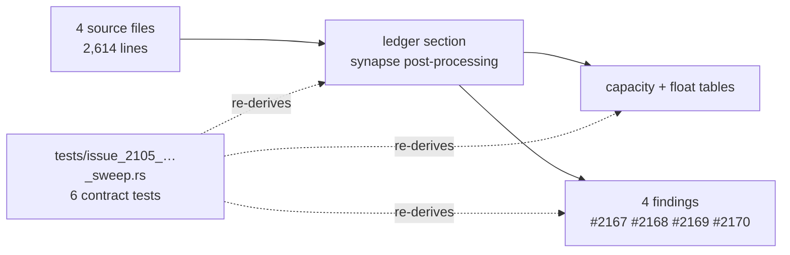

# Chunk 8b: sweep `src/analysis/synapse/` post-processing and structural files (#2105)

## Summary

Read `src/analysis/synapse/{post_processing,structural_patterns,adaptive_proposal,add_synapse_gating}.rs`
(2,614 lines) in full for the chunk 8b defect classes and recorded the outcome in
`docs/audits/security-sweep-chunk-08b-synapse-scoring-recommendation.md`. All four
`synapse post-processing` rows move off `pending`, the capacity and float-comparison
tables gain the rows for every site in those files, and four findings are filed with
the house labels. Closes #2105.

**Findings filed** (all `security`, `lang:rust`, `confidence:high`):

| Issue | Severity | Finding |
| --- | --- | --- |
| #2170 | high | An FFI-supplied `ModuleOutcomeTracker` reaches `should_skip_add_synapse_by_outcome` unvalidated; `ModuleStats::success_rate`'s `attempts - successes` is a `u32` subtraction before the cast, and the derived `Deserialize` bypasses the invariant `record` maintains |
| #2167 | medium | The three descending `total_cmp` sorts in `apply_post_processing` rank a non-finite gain above every finite one; the filters ahead of them drop a NaN and keep `+inf`, and `+inf` is reachable through `compute_neuron_error_sq_map`'s `e * e` overflow |
| #2169 | medium | Neither structural detector consults `deadline_passed` or the cancellation flag, and both are bounded only by untrusted creature size |
| #2168 | low | `apply_impact_to_helpful` byte-slices a UUID at index 12 for a verbose log and panics on a multi-byte char boundary |

The findings' own fixes are out of scope here — each filed issue states that its fix
ships a `tests/issue_<n>_*.rs` failing before the fix, per this issue's Failure
Detection clause.

## Evidence

Backend/audit change — no web interface to screenshot. The deliverable is the prose
record plus the contract test that holds it to the source, so the evidence is the test
run:

```text
$ cargo test --test issue_2105_chunk_08b_synapse_post_processing_sweep
test result: ok. 6 passed; 0 failed

$ ./quality.sh
✅ All quality checks passed!
```

Red-then-green, run against the pre-sweep ledger (`git show 337d403:…` restored over
the record, tests re-run, record restored):

```text
test result: FAILED. 1 passed; 5 failed
failures:
    every_capacity_site_in_the_swept_files_has_a_table_row
    every_float_comparator_in_the_swept_files_has_a_table_row
    every_synapse_post_processing_row_is_swept_with_a_reason
    the_synapse_post_processing_outcome_cites_symbols_that_still_exist
    the_synapse_post_processing_outcome_links_its_filed_findings
```

The original trigger — a swept file whose row still reads `pending`, a sized allocation
or a ranking comparator with no row naming what bounds it, or an outcome citing a symbol
that has since moved — is closed at the gate rather than in prose: the five tests above
re-derive every claim from the current tree on each `cargo test`, so the record cannot
drift silently. There is no trivial bypass: a new `with_capacity` or `sort_by` in any of
the four files fails `every_capacity_site_…` / `every_float_comparator_…` until it is
recorded, a renamed traced symbol fails `…_cites_symbols_that_still_exist`, and an
unlinked finding fails `…_links_its_filed_findings`.



## Acceptance Criteria

<!-- vibe-spec-review inputs="diff+issue-body" -->

- **met** — All 4 rows non-`pending` with a one-line reason — evidence: `docs/audits/security-sweep-chunk-08b-synapse-scoring-recommendation.md` `### synapse post-processing`; `tests/issue_2105_chunk_08b_synapse_post_processing_sweep.rs::every_synapse_post_processing_row_is_swept_with_a_reason` — reviewer: met
- **met** — Every capacity and float-comparison site in these files has a table row with its NaN handling — evidence: `tests/issue_2105_chunk_08b_synapse_post_processing_sweep.rs::every_capacity_site_in_the_swept_files_has_a_table_row` and `::every_float_comparator_in_the_swept_files_has_a_table_row` — reviewer: partial — reason: the reviewer found four comparison sites recorded only inside other rows' prose (the gain floor, the `error_sq > EPSILON` insert gate, `activation_mean_and_variance`'s `n <= 0.0`, the collapse detector's own `improvement <= 0.0`) and the variance-ratio divisor missing from the Division paragraph; each now has its own row, so the departure from its `partial` is the fix, not a disagreement
- **met** — Findings filed with required labels, linked in the ledger and in a comment on #2093 — evidence: #2167/#2168/#2169/#2170 each carry `security`, `lang:rust`, `severity:*`, `confidence:*`; ledger `## Issues filed`; `tests/issue_2105_chunk_08b_synapse_post_processing_sweep.rs::the_synapse_post_processing_outcome_links_its_filed_findings` — reviewer: met
- **met** — `./quality.sh` passes — evidence: full gate run after the final edit, `✅ All quality checks passed!` — reviewer: met — reason: the reviewer's own batched run hit a sandbox `Permission denied (os error 13)` on a test binary and it flagged that as environmental; the gate was re-run here in the foreground and passed cleanly
- **unrequested** — `tests/issue_2105_chunk_08b_synapse_post_processing_sweep.rs` (6 contract tests, 331 lines) — reviewer: unrequested — reason: the issue asks for `tests/issue_<n>_*.rs` beside each *fix*, not beside the audit; kept because it is the sibling #2103/#2104 convention and it is what stops the record drifting from the source it describes
- **unrequested** — finding #2168 (UTF-8 byte-slice panic) — reviewer: unrequested — reason: a panic-class defect outside the five classes the issue enumerates, found while reading the files in full as the Summary requires; recording it was cheaper than dropping it
- **unrequested** — #2170's root cause is traced into `src/analysis/module_weights.rs` and the `ffi_types`/`ffi_internal` layer — reviewer: unrequested — reason: only the consuming gate is in the four swept files; the trace is what establishes that untrusted input reaches it, and no code outside the file area is changed
- **unrequested** — four bullets appended to the shared `## Issues filed` section — reviewer: unrequested — reason: "linked in the ledger" cannot be satisfied inside the `synapse post-processing` section alone, and prior sweeps append there the same way

## Standards Review

<!-- vibe-standards-review inputs="diff+CODING-STANDARDS.md" -->

CONTRIBUTING.md is this repository's canonical conventions document (there is no
`CODING-STANDARDS.md`); the reviewer was given it and AGENTS.md.

- **violation** — the float-comparison check passed vacuously for a file with no comparator (#1799, an assertion that holds either way is not coverage) — evidence: `tests/issue_2105_chunk_08b_synapse_post_processing_sweep.rs:202` — reason: fixed here — the precondition that `post_processing.rs` still ranks with a comparator is asserted before the loop, and each needle now carries its call parenthesis so `min_bypass_weight_for_collapse()` is no longer miscounted as a `min_by` site
- **violation** — no `docs/archive/pr-summaries/pr-summary-2105.md` in the diff — evidence: `docs/archive/pr-summaries/` — reason: fixed here — this file
- **violation** — every commit in the range read `WIP checkpoint … (Issue #4170)`, naming an unrelated issue — evidence: `git log 337d403..HEAD` — reason: fixed here — the two commits added this run carry imperative subjects referencing #2105; the checkpoints themselves are the worker's own crash-safety commits and are not rewritten, since the branch is already pushed
- **violation** — ~100 lines of Markdown-section helpers duplicate the same machinery in `tests/issue_2104_chunk_08b_synapse_pipeline_sweep.rs` (DRY) — evidence: `tests/issue_2105_chunk_08b_synapse_post_processing_sweep.rs:32` — reason: stands — extracting a shared harness means editing the sibling sub-issues' test files, and this issue's brief is "edit only the `synapse post-processing` section"; the consolidation belongs to the chunk 8b finalisation sub-issue that reconciles all seven sections
- **violation** — the capacity/comparator gates assert on token presence in `src/` text rather than on behaviour (Test Outcomes, Not Implementation) — evidence: `tests/issue_2105_chunk_08b_synapse_post_processing_sweep.rs:182` — reason: stands — the deliverable of an audit sub-issue is the record, and the only falsifiable property of a record is that it still matches the tree it describes; the behavioural tests belong to the four filed findings' fixes, which is exactly what each finding issue commits to
- **clean** — Australian English throughout; symbol-form citations (`file.rs::symbol`, never `file.rs:line`, per #1942); no hidden or credential paths staged; tests live under `tests/`; no API widened to `pub` for testing; no `Cargo.toml`/`Cargo.lock`/workflow change; record and test both well under the file-size target; no `NEAT_AI_DISCOVERY_*` table added outside `docs/CONFIGURATION.md`

The reviewer also independently re-verified the load-bearing numbers (file lengths, the
three `total_cmp` sorts, no `overflow-checks` key in `Cargo.toml`) and found them correct.

### Corrections the Spec reviewer forced

The Spec reviewer re-read the source against the record and found three claims that
contradicted it. All three are fixed in this branch, and each was re-checked against the
file before the edit:

1. The harmful-bucket row said "No filter at all precedes the harmful sort".
   `apply_min_expected_gain_floor_for_synapses` runs over the harmful bucket just as it
   does over the helpful one, so the row and the narrative's "two `retain` filters" both
   understated it. The finding is unchanged — the floor keeps `+inf` either way.
2. The `detect_noisy_vs_trusted` row recorded `weight.abs() < WEIGHT_EPS` and
   `mean_delta < MEAN_EPS`. The code skips on `(a.weight - b.weight).abs() > WEIGHT_EPS`
   — a `>` on the pairwise difference. The fall-through conclusion holds, but a reader
   re-deriving it from the old row would have used the wrong predicate.
3. The `structural_patterns.rs` outcome row said "both detectors run quadratic scans".
   Only `detect_noisy_vs_trusted` is quadratic; `detect_collapsible_hidden_neurons` is a
   linear neuron pass whose per-neuron body walks the records. #2169's body already said
   this correctly; its title is corrected on GitHub to match.

## Test Plan

- Added `tests/issue_2105_chunk_08b_synapse_post_processing_sweep.rs` — 6 contract tests
  over the `synapse post-processing` section and the source it claims to have swept:
  - `::the_synapse_post_processing_section_owns_exactly_the_files_issue_2105_swept`
  - `::every_synapse_post_processing_row_is_swept_with_a_reason`
  - `::every_capacity_site_in_the_swept_files_has_a_table_row`
  - `::every_float_comparator_in_the_swept_files_has_a_table_row`
  - `::the_synapse_post_processing_outcome_cites_symbols_that_still_exist`
  - `::the_synapse_post_processing_outcome_links_its_filed_findings`
- `tests/issue_2105_chunk_08b_synapse_post_processing_sweep.rs::every_synapse_post_processing_row_is_swept_with_a_reason`
  is the regression test for the original trigger: it fails against the unfixed
  (`pending`) record and passes after the sweep, verified by restoring the base record
  and re-running (five of the six go red).
- No existing test was modified or removed; `tests/issue_2103_chunk_08b_ledger_scaffold.rs`
  and `tests/issue_2104_chunk_08b_synapse_pipeline_sweep.rs` still pass unchanged under
  `./quality.sh`.
