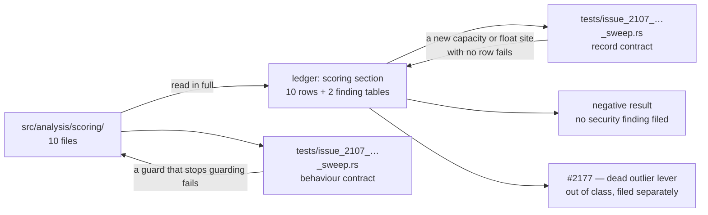

# Chunk 8b: audit `src/analysis/scoring/` — negative result

## Summary

Swept all ten files under `src/analysis/scoring/` in full for the five chunk 8b
defect classes, filled the ten `scoring` rows of
`docs/audits/security-sweep-chunk-08b-synapse-scoring-recommendation.md` with a
checkable one-line reason each, and extended the record's capacity and
float-comparison tables with every site those files carry. **No security finding
survived**, so none was filed. Closes #2107.

The three questions the issue asked, answered against the source:

- **`cross_validation.rs::compute_cross_validation_score`'s
  `Vec::with_capacity(config.fold_count)` is not caller-controllable.**
  `CrossValidationConfig::default()` in
  `neuron/evaluation.rs::apply_cross_validation_penalty` is the only production
  constructor (compile-time `fold_count: 5`), and no FFI request field
  deserialises into the struct. The record is explicit that this absent
  constructor is the *whole* bound: the `samples.len() / fold_count <
  min_samples_per_fold` precondition is **not** a second one, because it is
  never taken against a `min_samples_per_fold` of `0`.
- **`error_distribution.rs::detect_modes_histogram`'s bin cast is safe for NaN
  too.** The `range < 1e-6` early return makes `bin_width` strictly positive,
  Rust's float→int `as` cast saturates (a NaN index becomes `0`, never UB), and
  `.min(NUM_BINS - 1)` caps whatever the cast produced, so `bins[bin_idx]`
  cannot panic. `compute_percentiles`' floor/ceil pair is bounded by
  `if lower == upper || upper >= n`. `confidence.rs::t_critical_95`'s
  `df as u32` needs 2³² samples to truncate and errs conservatively (a *wider*
  interval) — recorded, not filed.
- **The `weights/` clamps do have the "NaN passes a clamp silently" shape the
  issue flagged, and are unreachable.** `f32::clamp` propagates NaN, and both
  `clamp_weight_update_delta`'s `delta.abs() <= EPSILON` gate and
  `coordinated_structural_activation_delta`'s `noisy_weight.abs() <= EPSILON`
  gate are lost by a non-finite value, so each would return `Some(non-finite)`
  from a contract whose `None` means "unusable". Neither operand can be
  non-finite: `ffi_types/mod.rs::deserialise_synapse_weight` rejects a
  non-finite synapse weight at the FFI boundary (Issue #2132), and the proposed
  delta is a `calculate_optimal_outgoing_weight` return, where
  `compute_outgoing_weight` tests `is_finite` **between** its divisor guard and
  its clamp.

`calibration_correction.rs`'s untrusted `failureCache` skips
`expected_error_reduction == 0.0` (which catches `-0.0` on the same test) and
any non-finite ratio, and each EWMA is a convex combination clamped to
`[0.001, 1.0]`. The `improved / total` arithmetic the issue asked about is
`sample_creature_disconnect.rs::detect_disconnect`, which rejects a zero
divisor, the corrupt `improved > total` pair, and a non-finite actual **before**
it divides.

**One out-of-class observation, filed separately as #2177** (`enhancement`,
`lang:rust` — not a security finding): the outlier-analysis surface in
`error_distribution.rs` has no callers, `CandidateNeuronJson::outlier_reduction_info`
is `None` at every construction site, and `NEAT_AI_DISCOVERY_OUTLIER_ANALYSIS`
and `NEAT_AI_DISCOVERY_OUTLIER_PERCENTILE` are documented operator levers that
change nothing — the AGENTS.md § Dead Levers pattern.

## Evidence

Backend/library change with no web interface, so no screenshot applies. The
evidence is the test suite and the full quality gate.

- `./quality.sh` passed end to end on this branch (`bash -n`, ShellCheck,
  cargo-install pinning, PR-summary layout, `cargo deny check`, debug build,
  `cargo fmt`, `cargo clippy --all-targets --all-features -D warnings`,
  `cargo check`, `cargo test --lib --tests --all-features`, `cargo doc` with
  `-D warnings`, release build): `✅ All quality checks passed!`.
- `cargo test --test issue_2107_chunk_08b_scoring_sweep` — 16 passed.
- The five sibling chunk 8b ledger suites (`issue_2088`, `issue_2103`,
  `issue_2104`, `issue_2105`, `issue_2106`) still pass, so this section's edits
  did not disturb another sub-issue's rows.

### Regression test and trigger closure

This issue carries the `security` label, so both are stated explicitly.

**Regression test.** Added
`tests/issue_2107_chunk_08b_scoring_sweep.rs::every_scoring_row_is_swept_with_a_reason`,
which reproduces the condition this issue exists to remove — ten `scoring` rows
reading `pending`, a finished sweep indistinguishable from an unstarted one. It
**fails against the unfixed tree** (every row matched `pending` before this
change) and **passes after it**, and it runs under `cargo test` in `./quality.sh`
and CI. Its companion
`tests/issue_2107_chunk_08b_scoring_sweep.rs::every_capacity_site_in_the_swept_files_has_a_table_row`
closes the follow-on: a row can no longer be written for a site that does not
exist, nor a site left uncited.

**Original trigger closed, no trivial bypass.** The trigger the sweep was sent
to investigate is a non-finite value reaching the `weights/` clamps and being
returned as a usable weight. It is closed at the boundary, not by the clamp:
`ffi_types/mod.rs::deserialise_synapse_weight` is wired to `SynapseJson::weight`
through `#[serde(deserialize_with = …)]`, so **every** path that builds a
creature from caller JSON runs it — there is no second constructor of
`SynapseJson` from untrusted bytes to bypass it, and the saturating `1e39` form
(the only way JSON can express an infinity, since it has no `Infinity` literal
and no NaN literal at all) is rejected by the same `is_finite` test as an
explicit infinity would be.
`tests/issue_2107_chunk_08b_scoring_sweep.rs::a_creature_carrying_an_overflowing_synapse_weight_is_refused_at_the_boundary`
asserts that composition end to end. The second operand is a
`calculate_optimal_outgoing_weight` return, and
`weights/calculation.rs::compute_outgoing_weight` tests `is_finite` before its
clamp on every return path, so neither operand of either clamp can be
non-finite.

How the record, the source and the tests are wired together:

## Acceptance Criteria

<!-- vibe-spec-review inputs="diff+issue-body" -->

- **met** — All 10 rows non-`pending` with a one-line reason — evidence:
  `docs/audits/security-sweep-chunk-08b-synapse-scoring-recommendation.md`
  § `### scoring`, gated by
  `tests/issue_2107_chunk_08b_scoring_sweep.rs::every_scoring_row_is_swept_with_a_reason`
  — reviewer: met
- **met** — Every capacity and float-comparison site in these files has a table
  row with its NaN handling — evidence: the `<!-- section: scoring -->` regions
  of both finding tables, gated by
  `tests/issue_2107_chunk_08b_scoring_sweep.rs::every_capacity_site_in_the_swept_files_has_a_table_row`
  and
  `::every_scoring_file_that_executes_anything_is_cited_in_the_float_table`
  — reviewer: partial — reason: the reviewer found the float half short — no
  rows for `cross_validation.rs`, `weights/normalisation.rs`, the `weights/`
  ratio gate, the two `confidence.rs` confidence factors or the two dead
  `error_distribution.rs` predicates — and noted that the comparator heuristic
  guarding it only matches *ranking* comparators. Both were fixed after the
  review: nine rows were added, and a second test now asserts every swept file
  with executable code is cited, with the two declaration-only files named
  explicitly and proved to contain no branch or loop.
- **met** — Findings filed with required labels, linked in the ledger and in a
  comment on #2093 — evidence: negative result, so no `security` finding exists
  to label; `## Issues filed` records the negative result, and the #2093 comment
  is <https://github.com/stSoftwareAU/NEAT-AI-Discovery/issues/2093#issuecomment-5792813282>
  — reviewer: met
- **met** — `./quality.sh` passes — evidence: full gate run on this branch after
  the final edit — reviewer: met — reason: the reviewer ran `fmt`, `clippy` and
  the five ledger suites but not the whole gate; it was run here in full and
  passed.
- **unrequested** — `tests/issue_2107_chunk_08b_scoring_sweep.rs` in its
  entirety — reviewer: unrequested — reason: the issue owes a test only when a
  finding's *fix* ships, and this sweep filed no finding; the file is house
  precedent from the three sibling sweeps (#2104, #2105, #2106), which each ship
  an equivalent record-contract file, and it is what stops the section's claims
  rotting silently.
- **unrequested** — the eight behavioural tests that execute production code
  (`detect_disconnect`, `from_failure_cache`, `from_samples`,
  `calculate_optimal_outgoing_weight`, both `weights/adjustment.rs` helpers,
  `compute_cross_validation_score`, and the `CreatureJson` boundary test) —
  reviewer: unrequested — reason: a `clean` verdict backed only by prose cannot
  fail when the guard it describes is removed; these make each load-bearing
  guard fail loudly instead.
- **unrequested** — GitHub issue #2177 and the ~14-line "Out-of-class
  observation" block in the outcome — reviewer: unrequested — reason: the issue
  asks for `security` findings only, and this is not one; AGENTS.md § Dead
  Levers requires a dead operator lever found during a read to be dealt with
  rather than left, and the issue's "edit only the `scoring` section" scope makes
  a separate issue the right disposal, not an inline deletion.
- **unrequested** — the `detect_modes_histogram` `sort_by_key` row marked
  "n/a — not a float comparison", and the catch-all capacity row — reviewer:
  unrequested — reason: both exist to make the tables' own coverage tests
  answerable; the `sort_by_key` row exists because the comparator heuristic
  matches the substring, and saying so is cheaper than a special case.

Three claims the Spec reviewer found over-stated were corrected in the record
before this summary was written:

1. the "bounded twice over" argument for `fold_count` (false when
   `min_samples_per_fold == 0` — the row and the outcome now say the absent
   constructor is the whole bound, and name what a future caller must add);
2. the `confidence.rs::compute_confidence_interval` reason (the `f32::max`
   laundering protects the *ceiling*, not the whole interval — the row now says
   the bound is the callers' `select_finite`d improvement);
3. the unreconciled statement that `detect_modes_histogram` is live in the
   capacity table while its only caller is recorded as dead in the prose.

## Standards Review

<!-- vibe-standards-review inputs="diff+CODING-STANDARDS.md" -->

- **violation** — a capacity-table citation elided the symbol to an ellipsis
  (`neuron/evaluation.rs::…`), which CONTRIBUTING.md § Cite Code by Symbol makes
  unverifiable in the same way a line number is — evidence:
  the capacity table's `cross_validation.rs::compute_cross_validation_score` row
  — reason: fixed in this diff; the row now names
  `apply_cross_validation_penalty`, matching its own prose.
- **violation** — the catch-all capacity row cited a bare `from_failure_cache`
  with no file prefix — evidence:
  the capacity table's `the other eight scoring files` row
  — reason: fixed in this diff by naming the file instead of the symbol. The
  full `calibration_correction.rs::` prefix cannot go in that region: the
  capacity test asserts the citation set *equals* the set of files with a sized
  allocation, and this file has none, so citing it there would describe an
  allocation that does not exist.
- **violation** — nine helper functions (`read`, `section`, `marker_region`,
  `file_rows`, `production_source`, `is_capacity_site`, `is_comparator_site`,
  `citation_prefix`, `repo_root`) are byte-identical copies of the same nine in
  the three sibling sweep test files, against CONTRIBUTING.md § DRY, while
  `tests/common/mod.rs` exists for exactly this — evidence:
  `tests/issue_2107_chunk_08b_scoring_sweep.rs:56-163` — reason: **stands, not
  fixed here.** Lifting them would mean editing `issue_2104`, `issue_2105` and
  `issue_2106`, and #2107 scopes this change to the `scoring` section alone; a
  fourth copy is the smaller harm than a cross-section refactor landing inside
  an audit PR. Worth one follow-up when the chunk is finalised (#2093).
- **violation** — the behavioural tests construct their own subjects rather than
  driving the shipped entry point, against CONTRIBUTING.md § Guard Wiring at the
  Shipped Entry Point (Issues #1795, #1806, #1815) — evidence:
  `tests/issue_2107_chunk_08b_scoring_sweep.rs:352` and the five tests after it
  — reason: **partly fixed.** The one claim in this record that is genuinely a
  *composition* — that `weights/adjustment.rs` is safe only because a gate two
  modules upstream rejects the input — now has
  `::a_creature_carrying_an_overflowing_synapse_weight_is_refused_at_the_boundary`,
  which deserialises a `CreatureJson` carrying `"weight": 1e39` and asserts the
  refusal. The remainder stay unit-level deliberately: they pin invariants of
  pure functions whose production callers the record names and the record
  contract tests check, which is the coverage the rule asks for in a sweep that
  adds no guard.
- **violation** — the outcome restated `NEAT_AI_DISCOVERY_OUTLIER_PERCENTILE`'s
  default, which CONTRIBUTING.md § Environment Variables — One Source of Truth
  reserves to `docs/CONFIGURATION.md` — evidence:
  the outcome's **Panics on hostile environment values** paragraph
  — reason: fixed in this diff; the sentence now describes the parse shape and
  points at `docs/CONFIGURATION.md` for the value.
- **clean** — Australian English throughout (`normalisation`, `materialised`,
  `deserialises`, `analysed`, `initialiser`); no `file.rs:<line>` citations
  anywhere in the added lines, so the scaffold's
  `the_record_cites_no_line_numbers` gate stays green even though the issue body
  itself cites three; `codespell` and `markdownlint-cli2` clean; `cargo fmt
  --check` and `clippy -D warnings` clean; no timing or duration assertions; every
  behavioural test pins a positive precondition alongside its negative cases;
  tests live under `tests/` with no API made public to reach them; no `src/` file
  and no CI workflow touched; `Cargo.toml` left for CI's `version-increment`
  job; no Mermaid `;` hazard.

## Test Plan

`tests/issue_2107_chunk_08b_scoring_sweep.rs` (new, 16 tests). The record
contract fails against the tree as it was before this change — the ten rows read
`pending` — and passes after:

- `the_scoring_section_owns_exactly_the_files_issue_2107_swept` — the section
  carries one row per swept file, in record order.
- `every_scoring_row_is_swept_with_a_reason` — **the regression test for this
  change**: no row reads `pending`, and each states a reason a later reader can
  check. Fails against the unfixed record, passes after.
- `every_capacity_site_in_the_swept_files_has_a_table_row` — the citation set
  *equals* the set of files with a sized allocation, so a new `with_capacity`
  cannot land unrecorded and a row cannot outlive the code it describes.
- `every_float_comparator_in_the_swept_files_has_a_table_row` and
  `every_scoring_file_that_executes_anything_is_cited_in_the_float_table` — every
  swept file with executable code is cited, with the two declaration-only files
  named and proved to contain no branch or loop.
- `the_scoring_outcome_cites_symbols_that_still_exist` — all 11 symbols the
  outcome traces are still declared in the files it names.
- `the_scoring_outcome_is_a_negative_result` and
  `the_scoring_negative_result_is_linked_in_issues_filed`.

Behaviour contract — the guards the `clean` verdicts rest on, each calling the
real function:

- `the_disconnect_detector_rejects_every_unusable_counter_before_dividing` —
  zero total, `improved > total`, NaN and `+inf` actual all return `false`, and
  the detector still fires for the pattern it exists to catch.
- `a_hostile_failure_cache_cannot_move_the_correction_outside_its_clamp` — a
  cache mixing a zero divisor, a negative-zero divisor and an overflowing
  quotient still yields a finite correction floored at
  `MIN_CALIBRATION_CORRECTION`.
- `the_error_distribution_never_reports_a_non_finite_percentile` — NaN, `+inf`
  and `-inf` errors are filtered before any statistic, every emitted field is
  finite, and an all-non-finite sample set yields no distribution.
- `a_zero_variance_error_set_takes_the_documented_degenerate_defaults` — the
  `std_dev > 1e-10` guard emits `skewness = 0` / `kurtosis = 3` rather than
  dividing.
- `a_non_finite_least_squares_sum_is_rejected_before_the_clamp` — four
  non-finite or degenerate sum pairs yield `None`; the finite path still yields
  a weight.
- `a_creature_carrying_an_overflowing_synapse_weight_is_refused_at_the_boundary`
  — the composition test: a `CreatureJson` with `"weight": 1e39` is refused with
  the Issue #2132 message, and the same creature with a finite weight still
  deserialises.
- `the_weight_adjustment_helpers_emit_only_finite_values_for_finite_operands` —
  42 finite operand pairs across both helpers, plus the zero-noisy-weight
  refusal.
- `cross_validation_reserves_only_what_its_preconditions_allow` — the default
  fold count is still 5, 100 samples produce 5 folds with a finite penalty, and
  both early returns (`fold_count` above the sample budget, and `fold_count < 2`)
  refuse before the allocation.

No existing test was modified or removed.
