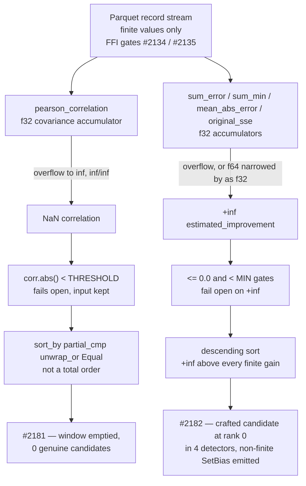

# Chunk 8b: audit `src/analysis/recommendation/` core detectors (Issue #2108)

## Summary

Swept all 8 files of `src/analysis/recommendation/` core (3,463 lines) for the
five chunk 8b defect classes, with ranking integrity as the primary lens, and
filled the `recommendation core` section of
`docs/audits/security-sweep-chunk-08b-synapse-scoring-recommendation.md` — the
eight per-file rows, the capacity table, the float-comparison table and a new
outcome section. Closes #2108.

**Three security findings filed**, each demonstrated against this tree with a
crafted input built from values the FFI boundary accepts:

- **#2181** (`security`, `lang:rust`, `severity:medium`, `confidence:high`) —
  `fan_in.rs::detect_fan_in_candidates` ranks its per-target inputs with
  `partial_cmp(…).unwrap_or(Equal)`, which is **not a total order**, while the
  `corr.abs() < THRESHOLD` filter above it **fails open** on NaN. A NaN
  correlation is reachable from finite records: an activation swing near
  `±2e30` overflows the `f32` covariance accumulator in `pearson_correlation`,
  whose `denom < f32::EPSILON` guard a NaN loses and whose `clamp` propagates
  it. Measured: 25 genuine fan-in candidates with the poisoned neurons listed
  *after* the honest ones, **0** with them listed first — the caller picks the
  order the unspecified sort produces.
- **#2182** (same labels) — the `recommendation core` counterpart of #2167.
  The descending sorts in **four** detectors rank a `+inf`
  `estimated_improvement` first, and each manufactures that `+inf` from
  **finite** records. Measured at rank 0 for all four.
  `output_bias_drift.rs` additionally emits a `-inf` bias in its `SetBias`
  payload. Two paths beyond the issue body as filed were found by the
  independent reviews of this diff, and both are recorded here and added to
  #2182 by comment:
  - **`multi_hop.rs`, second path** — `find_three_hop_extensions` spells its
    correlation filter `source_intermediate_corr.abs() < CORRELATION_THRESHOLD`
    — the same fail-open direction as `fan_in.rs` — so a NaN correlation
    survives, `combined_corr` is NaN, and under totalOrder a positive NaN sorts
    **above** `+inf` (comment 5800993251).
  - **`fan_in.rs`, a fourth detector** —
    `compute_least_squares_improvement` is `f32` throughout, so its
    `original_sse` overflows while the residual stays small and
    `(inf - finite).max(0.0)` is `+inf`; `compute_two_input_regression`
    reaches the same value by narrowing an `f64` improvement with a saturating
    `improvement as f32`. All four `evaluate_fan_in_pair` gates are fail-open
    for `+inf` — `inf <= 0.0` and `inf < inf * 1.05` are both false — so the
    pair heads the sort. **Measured at rank 0 on honest correlations of `1.00`
    and `0.58`**, so it is independent of #2181 and fixing #2181 would not
    close it (comment 5801505466).
- **#2183** (same labels) — the directory contains **zero**
  `deadline_passed` / `is_cancelled` calls, and
  `discovery_dispatch.rs::detect_discovery_modules_parallel` checks the
  deadline only *before* a module's closure runs, so the three quadratic
  detectors' scans cannot be interrupted once started. The two remaining
  detectors (`output_bias_drift.rs`, `sample_weighted.rs`) are single-pass
  linear in already-materialised records and are recorded as **not** part of
  #2183, with the condition that would change that.

**Two out-of-class observations**, filed as ordinary (non-security) issues:
**#2184** (a `HashMap`-iteration-order tie-break made the activation
recommendation non-deterministic, and the `"ReLU6"` penalty key was dead
because every insertion spells `"RELU6"`) and **#2185**
(`output_competition.rs`, 325 lines from Issue #1321, has no production caller
at all — AGENTS.md § *Dead Levers*). **#2184 has since been fixed** by PR #2187
(commit `3d1b24f`), which is merged into this branch; the record says so at
each of the three places it describes those defects.

The findings are linked in the ledger and in a comment on the parent issue
#2093.

## Evidence

Backend/library change with no web interface, so no screenshot applies. The
evidence is the contract test suite plus the measured triggers recorded in the
ledger and in each filed issue.

`tests/issue_2108_chunk_08b_recommendation_core_sweep.rs` (14 tests, 0.01 s)
splits into two halves:

- **Record contract** — the eight rows are present in record order and none
  reads `pending`; every capacity site and every float-comparison site in the
  production half of those files is cited in the matching table; the symbols
  the outcome traces still exist; the three findings are linked from the
  outcome and from `## Issues filed`; and a ranking verdict is recorded for
  every file that carries a ranking comparator.
- **Behaviour contract** — four tests pin the reachability the findings rest
  on (including one that drives the FFI deserialisation gate itself, so
  "reachable from finite records" is asserted where the gate lives) and three
  pin the `clean` verdicts.

## Acceptance Criteria

<!-- vibe-spec-review inputs="diff+issue-body" -->

- **met** — All 8 rows non-`pending` with a one-line reason — evidence: `docs/audits/security-sweep-chunk-08b-synapse-scoring-recommendation.md` § `recommendation core`, gated by `tests/issue_2108_chunk_08b_recommendation_core_sweep.rs::every_recommendation_core_row_is_swept_with_a_reason` — reviewer: met
- **met** — A ranking-integrity conclusion recorded per detector: can a crafted input reach rank 1 unchecked — yes/no, with the path — evidence: the **Ranking integrity** verdict table in the outcome section, gated by `tests/issue_2108_chunk_08b_recommendation_core_sweep.rs::the_recommendation_core_outcome_records_a_ranking_verdict_per_detector` — reviewer: partial — reason: the reviewer was right and the departure is a **correction, not a disagreement**. It found the `fan_in.rs` verdict (`no — the improvement sort cannot see a non-finite key`) demonstrably false and reproduced the counter-example. I reproduced it independently, corrected the verdict to **yes**, and added `::a_finite_record_set_still_ranks_a_fan_in_candidate_at_infinity` as the pinning test. The earlier review's `multi_hop.rs` correction is carried in the same table
- **met** — Every capacity and float-comparison site in these files has a table row with its NaN handling — evidence: the two `<!-- section: recommendation core -->` regions, gated by `tests/issue_2108_chunk_08b_recommendation_core_sweep.rs::every_capacity_site_in_the_swept_files_has_a_table_row` and `::every_float_comparator_in_the_swept_files_has_a_table_row` — reviewer: partial — reason: the reviewer named the `improvement as f32` narrowing cast in `fan_in.rs::compute_two_input_regression` as having no row; it now shares the `compute_least_squares_improvement` row, which records both `+inf` producers and their NaN handling. The reviewer also correctly noted the gating test only checks the file stem, so it could not have caught the gap; that limitation is inherited verbatim from `tests/issue_2105_*.rs` / `tests/issue_2107_*.rs` and is left alone rather than changed under one section's sub-issue
- **met** — Findings filed with required labels, linked in the ledger and in a comment on #2093 — evidence: #2181, #2182, #2183 each carry `security`, `lang:rust`, `severity:medium`, `confidence:high`; linked in `## Issues filed` (gated by `::the_recommendation_core_outcome_links_its_filed_findings`) and in stSoftwareAU/NEAT-AI-Discovery#2093 (comment 5795152721) — reviewer: met
- **met** — `./quality.sh` passes — evidence: run end to end in the foreground on this tree, exit 0, every stage green through `cargo test`, `cargo doc` and `cargo build --release --lib` — reviewer: met — reason: the reviewer ran the gate independently and also saw exit 0. The earlier session's `Permission denied (os error 13)` flake on freshly linked test binaries did not recur
- **unrequested** — `Cargo.toml` / `Cargo.lock` bumped `0.74.251` → `0.74.252` — reviewer: unrequested — reason: not creep in the reviewer's own assessment — AGENTS.md § *Version Bumps* requires the version to be incremented on any code change, and `0.74.251` is the milestone head's own version
- **unrequested** — two tests that assert the vulnerability *still exists* (`::a_finite_record_set_still_drives_the_fan_in_correlation_to_nan`, `::fan_in_candidates_still_depend_on_the_order_the_caller_lists_neurons_in`), plus the new `::a_finite_record_set_still_ranks_a_fan_in_candidate_at_infinity` — reviewer: unrequested — reason: kept, deliberately. The reviewer is right that these turn red when #2181 / #2182 are fixed; that is the design, stated in the file header and in each test's doc comment — the red is the signal that the section's rows need re-sweeping, not merely re-reading. Without them the `yes` verdicts are prose, and the issue's own *Failure Detection* section asks for a deterministic `tests/issue_<n>_*.rs` behind every NaN-ordering claim
- **unrequested** — `::the_ffi_boundary_still_accepts_the_magnitudes_both_findings_are_triggered_with` exercises `NeuronData` deserialisation in `src/ffi_types/`, outside the 8 files this sub-issue owns — reviewer: unrequested — reason: kept. The whole reachability claim is "finite on the wire, non-finite after arithmetic"; asserting it needs the gate that decides what is admissible on the wire, and that gate is `NeuronData`'s `Deserialize` impl (Issues #2134 / #2135). Reading a file outside the section is not editing it
- **unrequested** — the `#2184` / `#2185` bookkeeping, including the "since fixed by PR #2187" notes and the baseline-drift paragraph update — reviewer: unrequested — reason: kept. Out-of-class observations are part of the sweep's own outcome, and the record would otherwise state as present-tense defects two things this branch's merged tree has already fixed. The baseline-drift bullet enumerates post-baseline changes under the swept paths, and #2187 touches a file this section owns; leaving it out made that bullet false
- **unrequested** — a capacity-table row for `sample_weighted.rs::stratify_samples`' median-scratch `clone()` — reviewer: unrequested — reason: kept, because it is the one remaining per-neuron allocation proportional to the record count, but the prose says plainly that a `clone()` is not a *sized* allocation and so is not a capacity site under the sweep's own definition
- **unrequested** — GitHub issues #2184 and #2185 filed without the `security` / `severity:*` / `confidence:*` label set — reviewer: unrequested — reason: deliberate. Both are explicitly out-of-class observations, not security findings, and carrying security labels would misreport them; this is the shape Issue #2107 used when it filed #2177 for its dead-lever observation

## Standards Review

<!-- vibe-standards-review inputs="diff+CODING-STANDARDS.md" -->

Provenance note: this repository has no `CODING-STANDARDS.md`. Its canonical
conventions live in `CONTRIBUTING.md` and `AGENTS.md`, plus
`docs/audits/README.md` for the ledger this diff writes to; those are the
documents the Standards reviewer was given alongside the diff.

- **violation** — `docs/audits/README.md` § *Required fields* / falsifiability: the record attributed the #2184 fix to **PR #2185**, which is the open dead-module issue two rows away — evidence: `docs/audits/security-sweep-chunk-08b-synapse-scoring-recommendation.md::recommendation core` per-file row, outcome section and `## Issues filed` entry — reason: **fixed here**. The fix landed as PR #2187 (`3d1b24f`); all three citations corrected after confirming the PR number with `gh pr view 2187`
- **violation** — `docs/audits/README.md` § *A record with no commit SHA is worthless*: the baseline-drift bullet listed every post-baseline change under the swept paths except #2187's, which touches a file this section sweeps — evidence: the **Baseline commit** bullet of the record — reason: **fixed here**; the bullet now names it
- **violation** — CONTRIBUTING.md § *An Assertion That Holds Either Way Is Not Coverage* (Issue #1799): `::the_activation_recommender_ranks_over_a_constant_score_space` skipped a magnitude whose recommendation is `None`, so it would pass with zero assertions executed if every magnitude were skipped — evidence: `tests/issue_2108_chunk_08b_recommendation_core_sweep.rs::the_activation_recommender_ranks_over_a_constant_score_space` — reason: **fixed here**; the test now counts the magnitudes that ranked and asserts the count is non-zero
- **violation** — CONTRIBUTING.md § Quality Gate: the previous revision of this summary carried a `vibe-quality-gate-skipped` note and no clean end-to-end run — evidence: this file's former **Quality gate** section — reason: **fixed here**; the gate was run to completion on this tree and exits 0, and the note is gone
- **violation** — CONTRIBUTING.md § PR Summary File (evidence must be checkable): the previous revision claimed a `0.74.250 → 0.74.251` version move and a 13-test suite — evidence: this file's former **Acceptance Criteria** and **Test Plan** sections — reason: **fixed here**; the diff moves `0.74.251 → 0.74.252` and the suite is 14 tests
- **violation** — CONTRIBUTING.md § *Cite Code by Symbol, Never by Line Number* (Issue #1942), which binds every doc and PR summary: the previous revision cited `tests/…rs:445` and `…md:36` — evidence: this file's former **Standards Review** section — reason: **fixed here**; every citation in this revision names a symbol or a section
- **violation** — CONTRIBUTING.md § *Guard Wiring at the Shipped Entry Point*: `::the_ffi_boundary_still_accepts_…` drives `NeuronData` deserialisation rather than a C-ABI entry point, and asserts no FFI response shape — evidence: `tests/issue_2108_chunk_08b_recommendation_core_sweep.rs::the_ffi_boundary_still_accepts_the_magnitudes_both_findings_are_triggered_with` — reason: **stands**. `NeuronData`'s `Deserialize` impl *is* where the #2134 / #2135 finitude gate lives; a C-ABI round trip would exercise JSON plumbing, not the guard, and the sibling sweeps use the same shape
- **violation** — CONTRIBUTING.md § Commit Messages: five commits on this branch read `WIP checkpoint: periodic agent progress snapshot (Issue #4170)` — evidence: `git log` on this branch — reason: **stands**. Those are the worker's own periodic auto-commits from the interrupted earlier session, not authored here; rewriting pushed history to reword them is the more damaging option. Every commit added in this session names #2108
- **violation** — `docs/audits/README.md` § *When a sweep must write to the ledger*: `docs/audits/lib-sweep-coverage.json` is untouched — evidence: `docs/audits/lib-sweep-coverage.json`, chunk `8b` entry — reason: **stands**. The entry already exists from the #2103 scaffold with today's `last_swept` and the same `baseline_commit`; the index has no per-section granularity, the chunk is complete only when no row reads `pending` (two sections away), and drift is recorded in the record's baseline bullet, which this diff updates. `tests/issue_2088_sweep_ledger_contract.rs` passes
- **violation** — CONTRIBUTING.md § Boy Scout Rule: the record's *Sweep status — IN PROGRESS* paragraph still names only the earlier swept sections — evidence: the **Sweep status** paragraph of the record — reason: **stands, deliberately**. Issue #2108 instructs "Edit only the `recommendation core` section of the ledger" precisely because the chunk's sub-issues run concurrently; every sibling (#2105–#2107) left the same line, and rewriting a shared paragraph guarantees a conflict with whichever sibling PR merges next. It is the finalisation sub-issue's line to fix
- **violation** — AGENTS.md § *Dead Levers* expects a never-constructed component to be deleted in the same change, not filed — evidence: `src/analysis/recommendation/output_competition.rs` — reason: **stands**. This is an audit sub-issue whose scope is reading and recording; deleting 325 lines of production code under it would be exactly the scope creep the Change Scope rule forbids. Filed as #2185, matching the #2107 → #2177 precedent. The reviewer itself recorded this as a judgement call rather than a violation
- **clean** — Australian English throughout the added prose and test messages; symbol-not-line citation (`file.rs::symbol`) everywhere in the record, with the `(file, declaration)` pairs pinned by `::the_recommendation_core_outcome_cites_symbols_that_still_exist`; Issue #1799 preconditions pinned before every citation loop, before both negative assertions and now before the two behaviour loops; no `Instant` / `Duration` / wall-clock threshold anywhere; the new suite lives in `tests/` and makes nothing public for testing; `Cargo.toml` and `Cargo.lock` bumped in lockstep with no dependency resolution moved; the single Mermaid block uses quoted labels and entities with no bare `;`; no hidden paths staged; no `.github/**`, `quality.sh` or `bump-deps.sh` file touched; the PR summary is in `docs/archive/pr-summaries/`, which `scripts/check-pr-summary-location.sh` gates

## Test Plan

Added `tests/issue_2108_chunk_08b_recommendation_core_sweep.rs` — 14 tests.

**Record contract** — fails against the unswept ledger, passes after this
change. Verified by restoring the milestone head's copy of the record and
re-running: **6 of the 7 record-contract tests go red**
(`every_recommendation_core_row_is_swept_with_a_reason`,
`every_capacity_site_in_the_swept_files_has_a_table_row`,
`every_float_comparator_in_the_swept_files_has_a_table_row`,
`the_recommendation_core_outcome_cites_symbols_that_still_exist`,
`the_recommendation_core_outcome_links_its_filed_findings`,
`the_recommendation_core_outcome_records_a_ranking_verdict_per_detector`) and
all pass after:

- `the_recommendation_core_section_owns_exactly_the_files_issue_2108_swept`
- `every_recommendation_core_row_is_swept_with_a_reason`
- `every_capacity_site_in_the_swept_files_has_a_table_row`
- `every_float_comparator_in_the_swept_files_has_a_table_row`
- `the_recommendation_core_outcome_cites_symbols_that_still_exist`
- `the_recommendation_core_outcome_links_its_filed_findings`
- `the_recommendation_core_outcome_records_a_ranking_verdict_per_detector`

**Behaviour contract** — the reachability the findings rest on, and the guards
the `clean` verdicts rest on:

- `a_finite_record_set_still_drives_the_fan_in_correlation_to_nan`
- `a_finite_record_set_still_ranks_a_fan_in_candidate_at_infinity` *(new this
  revision — the #2182 `fan_in.rs` path)*
- `the_ffi_boundary_still_accepts_the_magnitudes_both_findings_are_triggered_with`
- `fan_in_candidates_still_depend_on_the_order_the_caller_lists_neurons_in`
- `sample_weighted_launders_every_unusable_error_before_it_ranks`
- `the_synapse_gradient_rejects_every_unusable_mean_before_returning_it`
- `the_activation_recommender_ranks_over_a_constant_score_space`

No existing test was modified or removed.

## Security note — the original trigger, and why it is still open

This is an **audit** PR: it records defects and files them; it does not change
any production code, so **no production trigger is closed here**. That is
deliberate and matches the process the issue sets out — "file one house-format
issue (#2078 shape) per surviving finding … stating that the fix ships
`tests/issue_<n>_*.rs` failing before the fix". Each of #2181, #2182 and #2183
carries that statement and the regression test it must ship.

What this PR does close is the **audit** gap, and its regression test is
`tests/issue_2108_chunk_08b_recommendation_core_sweep.rs::every_recommendation_core_row_is_swept_with_a_reason`,
which **fails against the unfixed ledger** (eight rows reading `pending`) and
**passes after this change** — observed both ways, as recorded in the Test Plan
above.

**No trivial bypass exists for that gate.** Filling a row with prose that names
no symbol fails `::the_recommendation_core_outcome_cites_symbols_that_still_exist`;
omitting a ranking verdict fails
`::the_recommendation_core_outcome_records_a_ranking_verdict_per_detector`;
adding a sort or a sized allocation to any of the eight files without recording
it fails `::every_float_comparator_in_the_swept_files_has_a_table_row` or
`::every_capacity_site_in_the_swept_files_has_a_table_row`; and dropping a
finding link fails `::the_recommendation_core_outcome_links_its_filed_findings`.
Each of those tests reads the production source at run time rather than a
snapshot, so a later edit cannot satisfy them by editing the record alone.
