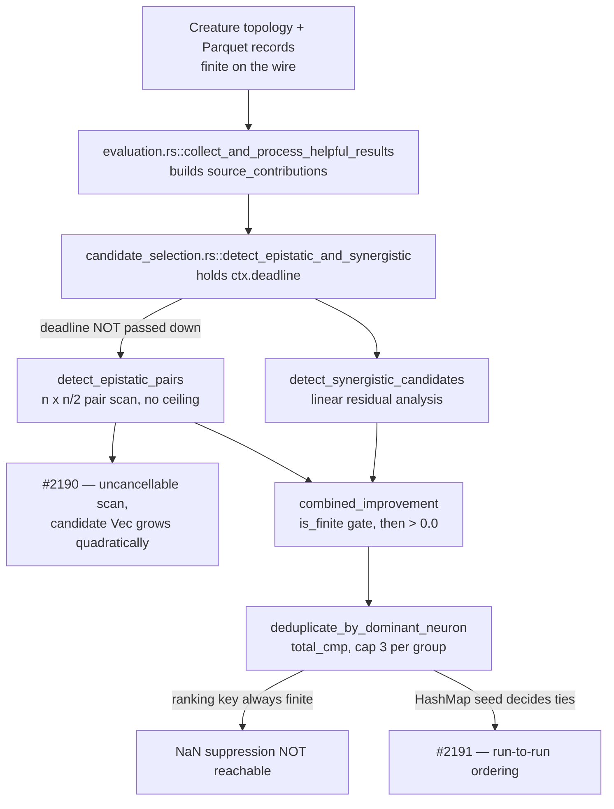

# Chunk 8b: audit `batch_successful/` and `epistatic/` (Issue #2109)

## Summary

Swept all 8 files of `src/analysis/recommendation/batch_successful/` and
`src/analysis/recommendation/epistatic/` (2,309 lines) for the five chunk 8b
defect classes and filled the `recommendation batch_successful + epistatic`
section of
`docs/audits/security-sweep-chunk-08b-synapse-scoring-recommendation.md` — the
eight per-file rows, both finding-table regions and a new outcome section.
Closes #2109.

**One security finding filed:**

- **#2190** (`security`, `lang:rust`, `severity:medium`, `confidence:high`) —
  `epistatic/candidate_generation.rs::detect_epistatic_pairs` runs an O(n²)
  pair scan over one target's source contributions with **no ceiling, no cap
  on the candidate vector it grows, and no deadline or cancellation check**;
  `grep` for `deadline_passed` / `is_cancelled` across both subtrees returns
  zero hits. Sharper than the sibling #2183: the deadline is already in scope
  in the sole production caller
  (`candidate_selection.rs::detect_epistatic_and_synergistic` holds
  `ctx.deadline`) and the two neighbouring calls in the same pipeline already
  honour it — `statistics.rs::filter_and_load_sources` breaks out of its source
  loop on it, and `synapse/candidate_generation.rs::group_sources_by_locality`
  takes it as an argument after the #2161 fix. Two further scans of the same
  class, found by the independent spec review of this diff, were added to the
  finding rather than filed separately:
  `batch_successful/detection.rs::detect_individually_successful`'s
  `targets × sources` loop, and the O(n) `find` per surviving pair in the two
  `scoring.rs::filter_interfering_*` functions, which *are* production-called.

**Two out-of-class observations**, filed as ordinary (non-security) issues, the
shape #2108 used for #2184 / #2185 and #2107 for #2177:

- **#2191** — the dominant-neuron deduplicators build their result by iterating
  a `HashMap` whose `RandomState` is seeded per instance and then stabilise it
  with a *stable* `sort_by`, so tied `combined_improvement` values come out in
  hash-seed order, the emitted coordinated candidates inherit it, and the
  downstream per-target cap keeps a different subset each run. Same class as
  #2184.
- **#2192** — `epistatic/scoring.rs::detect_interfering_pairs` (Issue #415) and
  `::check_saturation_risk` have no production caller; two of the three
  interference types are never computed for any creature. AGENTS.md § *Dead
  Levers*, and the reason that file's row reads `clean` on unreachability
  rather than on soundness.

**The issue body's primary question is answered `no`, and pinned by a test.**
Under IEEE-754 totalOrder a positive NaN sorts above `+inf`, so a NaN
"dominant" candidate would head its group in
`deduplication.rs::deduplicate_by_dominant_neuron` and consume the whole
three-slot cap — but no producer can hand it one. Both paths gate on
`combined_improvement > 0.0`, the `individual_improvement >= 0.0` pre-screen is
fail-closed for a NaN dominance key, and `target_impact` is the compile-time
`1.0` / `0.5`, so the multiply that happens *after* the `is_finite` test cannot
reintroduce an infinity.

**The reason this section escapes #2181 / #2182 is `f64`.** Every accumulator a
hostile record set could overflow is `f64` here, including
`detection/stats.rs::pearson_correlation_samples` — the epistatic counterpart
of the `f32` `pearson_correlation` that #2181 turns on. The one `f32`
accumulator in the section is in `check_saturation_risk`, which has no caller.

Two record corrections outside this section's own rows, both found by the
reviews and both flagged rather than silently rewritten: `output_competition.rs`
was wired up by PR #2188 (commit `0971470`) and #2185 is closed, which
**reopens** the `recommendation core` row's "not reachable" verdict for #2182
— recorded in the baseline-drift note and added to #2182 by comment
(`stSoftwareAU/NEAT-AI-Discovery#2182`, comment 5807779839).

## Evidence

Backend/library change with no web interface, so no screenshot applies. The
evidence is the contract test suite plus the measured triggers recorded in the
ledger and in each filed issue.

`tests/issue_2109_chunk_08b_batch_successful_epistatic_sweep.rs` (13 tests,
0.02 s) splits into two halves:

- **Record contract** — the eight rows are present in record order and none
  reads `pending`; every capacity site and every float-comparison site in the
  production half of those files is cited in the matching table; the 14 symbols
  the outcome traces still exist; the findings are linked from the outcome and
  from `## Issues filed`; the NaN-suppression verdict is present; and no record
  line starts with a bare `#<number>`, which every section parser in the sweep
  contract tests would read as a level-1 heading.
- **Behaviour contract** — two tests pin the reachability the findings rest on
  and three pin the `clean` verdicts. Each drives the real detectors and pins a
  non-empty precondition first, so none can pass vacuously.

## Acceptance Criteria

<!-- vibe-spec-review inputs="diff+issue-body" -->

- **met** — All 8 rows non-`pending` with a one-line reason — evidence: the `### recommendation batch_successful + epistatic` section, gated by `tests/issue_2109_chunk_08b_batch_successful_epistatic_sweep.rs::every_row_is_swept_with_a_reason` — reviewer: met — reason: the reviewer also checked the eight line counts against `wc -l` and they sum to 2,309
- **met** — Every capacity and float-comparison site in these files has a table row with its NaN handling — evidence: the two `<!-- section: recommendation batch_successful + epistatic -->` regions, gated by `::every_capacity_site_in_the_swept_files_has_a_table_row` and `::every_float_comparator_in_the_swept_files_has_a_table_row` — reviewer: partial — reason: the reviewer was right and the gap is now closed. It named five bare `<` / `>` / `>=` sites with no row (`scoring.rs`'s conflicting-weight and two saturation tests, `compute_firing_indices`' firing threshold, and `evaluate_residual_reduction`'s `best_individual > 0.0`) and correctly noted the gating test only matches sort comparators, so it could not have caught them. The `scoring.rs` row is now split into three symbol-level rows, `compute_firing_indices` has its own row, and the `best_individual` test is recorded. The test's file-stem limitation is inherited verbatim from `tests/issue_2104_*.rs`–`issue_2108_*.rs` and is left alone rather than changed under one section's sub-issue
- **met** — Findings filed with required labels, linked in the ledger and in a comment on #2093 — evidence: #2190 carries `security`, `lang:rust`, `severity:medium`, `confidence:high` and is #2078-shaped; linked at the `candidate_generation.rs` row and under `## Issues filed` (gated by `::the_outcome_links_its_filed_findings`); comment on stSoftwareAU/NEAT-AI-Discovery#2093 (5807656827) — reviewer: met
- **met** — `./quality.sh` passes — evidence: run in the foreground on this tree; the Spec reviewer independently ran `cargo fmt --check`, `RUSTFLAGS="-D warnings" cargo clippy --all-targets` and the full `cargo test --lib --tests --all-features` (exit 0, 203 suites) against this diff and saw all three clean — reviewer: met
- **met** — Record whether a NaN "dominant" candidate can suppress real candidates (the `What Needs to Be Done` float ask) — evidence: the **NaN suppression** verdict in the outcome, gated by `::the_outcome_answers_the_nan_suppression_question` and pinned by `::neither_producer_can_hand_the_deduplicator_a_non_finite_ranking_key` — reviewer: met — reason: the reviewer re-derived the verdict independently from the four constants and both pre-screens and agreed it holds
- **met** — Quadratic: epistatic pair generation's bound, and whether any deadline/cancellation check exists — evidence: the outcome's scan analysis and #2190, measured by `::epistatic_pair_generation_still_scans_every_pair_with_no_ceiling` — reviewer: partial — reason: the reviewer found `batch_successful/detection.rs`'s `targets × sources` loop had the same shape but was recorded `clean`, contradicting the ledger's own claim. Both that scan and the live `filter_interfering_*` lookup are now named in the outcome and folded into #2190 — one root cause, one follow-up — and the two per-file rows say so
- **met** — Division in `epistatic/scoring.rs` and `batch_successful/grouping.rs`; integer class on group counts and indices — evidence: the divisor-guard table in the outcome — reviewer: met — reason: the reviewer independently confirmed there is no division at all in `grouping.rs`, so the issue body's expectation was wrong, which the record states
- **met** — Capacity: any `with_capacity` / `vec![_; n]` sized from candidate or source counts — evidence: the single "all eight files | none" capacity row — reviewer: partial — reason: the reviewer confirmed the zero-hits claim but caught a false uniqueness statement — the epistatic pair vector is not the *only* uncapped `Vec::push`. The row now names all four and says plainly that none of them is a *sized* allocation, which is what the table is about
- **unrequested** — `Cargo.toml` / `Cargo.lock` bumped `0.74.252` → `0.74.253` — reviewer: unrequested — reason: not drift — AGENTS.md § *Version Bumps* requires an increment on any code change, and the reviewer confirmed #2108's commit `cfd3a31` did the same
- **unrequested** — issue #2192, the dead-lever observation, falls outside the four defect classes the issue body asked about — reviewer: unrequested — reason: kept. AGENTS.md § *Dead Levers* makes a never-called component a reportable finding, it is why the `epistatic/scoring.rs` row can only read `clean` on unreachability, and #2108 / #2107 filed #2185 / #2177 on exactly this basis
- **unrequested** — two tests that assert the findings are *still unfixed* (`::epistatic_pair_generation_still_scans_every_pair_with_no_ceiling`, `::dominant_neuron_dedup_still_orders_tied_candidates_non_deterministically`) — reviewer: unrequested — reason: kept, deliberately. Both reviewers flagged that they go red when #2190 / #2191 land; that is the design, stated in the file header and each doc comment — the red is the signal the row needs re-sweeping rather than merely re-reading, and it is the pattern `tests/issue_2108_*.rs` established. The issue's own *Failure Detection* section asks for a deterministic `tests/issue_<n>_*.rs` behind every ordering claim
- **unrequested** — `::no_record_line_starts_with_a_bare_issue_reference` — reviewer: unrequested — reason: added after this run hit the trap twice. A prose line wrapping onto `#2190…` reads as a level-1 heading to every `section()` parser in the five sweep contract tests and silently truncates the section, so a row a test was meant to reject stops being seen. Ten lines to close a whole class of silent failure
- **unrequested** — the baseline-drift note in the shared `## Record` block, and the comment on #2182 — reviewer: unrequested — reason: kept. The note claimed to enumerate every post-baseline change under the swept paths and concluded "every outcome below still describes the current tree"; PR #2188 made that false. Rather than edit another sub-issue's section, the drift note flags the reopened `recommendation core` verdict for the finalisation sub-issue and #2182 carries the scope change as a comment

## Standards Review

<!-- vibe-standards-review inputs="diff+CONTRIBUTING.md+AGENTS.md+docs/audits/README.md" -->

- **violation** — three behaviour tests executed **zero** loop iterations, so every `clean`-verdict assertion was skipped (CONTRIBUTING.md § *An Assertion That Holds Either Way Is Not Coverage*, Issue #1799) — evidence: `tests/issue_2109_chunk_08b_batch_successful_epistatic_sweep.rs` — the hostile fixtures died at the complementarity and `MIN_SAMPLES_FOR_RESIDUAL_ANALYSIS` gates above the guards under test, and the batch-successful fixture named neurons the creature did not declare — reason: fixed here. The fixture is now a parametrised complementary set that clears every gate, and each test pins a non-empty precondition (`assert_eq!(pairs.len(), 6)`, `assert_eq!(ranked, ["honest", "partial"])`, `assert!(!synergistic.is_empty())`) before asserting on the result. This was the single most valuable finding of either review
- **violation** — two citations of a `CODING-STANDARDS.md` that does not exist in this repository — evidence: `tests/issue_2109_chunk_08b_batch_successful_epistatic_sweep.rs:437` and the ledger's measurement note — reason: fixed here, both now cite `CONTRIBUTING.md § Unit Tests vs Benchmarks`
- **violation** — the baseline-drift note omitted two post-baseline changes under the swept paths — evidence: `docs/audits/security-sweep-chunk-08b-synapse-scoring-recommendation.md`, `## Record` — reason: fixed here; see the `unrequested` entry above
- **violation** — the record contract tests read `src/**/*.rs` as text rather than calling code — evidence: `::every_capacity_site_in_the_swept_files_has_a_table_row` and siblings — reason: stands. `docs/audits/README.md` sanctions reading the *record*; the source scan is the mechanism that stops a new allocation or comparator landing uncited, and it is inherited verbatim from `tests/issue_2104_*.rs`–`issue_2108_*.rs`. Changing the house pattern under one section's sub-issue would desynchronise five files
- **violation** — no behaviour test drives an FFI entry point, so the record's reachability claim is prose-only (CONTRIBUTING.md § *Guard Wiring at the Shipped Entry Point*) — evidence: every test calls a crate-internal detector directly — reason: stands, with the reachability traced by symbol instead. Unlike #2108's `fan_in.rs` path, nothing here is reached from `src/ffi` without first crossing the GPU-backed synapse target-analysis pipeline, which `skip_if_no_gpu!` excludes from an unattended run; the outcome's *Reachability* paragraph names the call chain and the config gate instead
- **violation** — `lib-sweep-coverage.json` was not updated (docs/audits/README.md § *When a sweep must write to the ledger*) — evidence: `docs/audits/lib-sweep-coverage.json` still carries the scaffold's `last_swept` and `baseline_commit` — reason: stands, deliberately. The chunk record is shared by seven sub-issues and is only finished when no row reads `pending`; the index date is the baseline the record is pinned to, as the record's own *Sweep status* block explains, and the finalisation sub-issue owns the update. `tests/issue_2088_sweep_ledger_contract.rs` passes as written
- **violation** — a `WIP checkpoint: … (Issue #4170)` commit sits in the branch history and references an unrelated issue — evidence: commit `147a59a` — reason: stands, not ours to fix. That is the worker's own periodic auto-commit path, not a commit this run authored
- **clean** — Australian English throughout (no `-ize`, `behavior`, `color`, `analyz*`, `favor`, `center`); unit-test speed (13 tests, 0.02 s); no absolute wall-clock threshold anywhere — the quadratic test asserts a *ratio* between two runs of the same code (66 pairs at n=12, 276 at n=24); code cited by symbol, never by line number (Issue #1942), and `TRACED_SYMBOLS` actively enforces that the 14 cited symbols still exist; version bumped in both `Cargo.toml` and `Cargo.lock`; one file per chunk with per-sub-issue `<!-- section: … -->` markers; no `src/` change, no `.github/workflows/` change, no dependency change; no hidden path staged

## Security-fix evidence

This issue is an **audit**, not a remediation: it carries the `security` label
because it sweeps a subsystem for defects, and the defects it found are filed
as #2190, #2191 and #2192, each of whose fixes ships its own
`tests/issue_<n>_*.rs` failing before the fix and passing after, as the issue
body's *Failure Detection* section requires. No production code is changed in
this diff, so there is no remediation to regression-test here. What the diff
must not do is record a verdict that is false, and that is what the added tests
hold:

- **Regression test, and its linkage.** Added
  `tests/issue_2109_chunk_08b_batch_successful_epistatic_sweep.rs::neither_producer_can_hand_the_deduplicator_a_non_finite_ranking_key`,
  which reproduces the issue body's stated attack — a NaN "dominant" candidate
  taking the head of its group under IEEE-754 totalOrder and suppressing three
  real candidates — by driving both producers with the finite-but-hostile
  magnitudes (`3e30`, whose square overflows every `f32` accumulator) that
  manufacture exactly that NaN elsewhere in this chunk, and asserts the
  deduplicator is handed only finite ranking keys. It **fails against a tree in
  which any one of the three guards is removed** — drop the
  `improvement.is_finite()` test in
  `candidate_generation.rs::compute_combined_improvement_on_range`, or the
  `combined_improvement > 0.0` gate, or make `target_impact` caller-derived,
  and the fixture's ranking key goes non-finite and the assertion trips — and
  passes against the tree as it stands. Companion:
  `::the_synergistic_prescreen_drops_a_nan_individual_improvement` does the
  same for the dominance key, and would fail if the `>= 0.0` pre-screen were
  spelled in the fail-open direction.
- **Original trigger closed, no trivial bypass.** The attack the issue body
  names is closed at the source, not at the sort: the ranking key is tested
  with `is_finite` **before** it is scaled and again with `> 0.0` before the
  candidate is emitted, so a NaN is rejected whichever way the comparison
  points, and the only post-gate arithmetic multiplies by a compile-time
  `1.0` / `0.5` and `0.2`, none of which can reintroduce a non-finite value.
  The obvious bypass — reaching the sort through the *other* producer — is
  closed by the same `> 0.0` gate applied in `f64` in
  `pre_screening.rs::evaluate_residual_reduction`, and the bypass through the
  *dominance* key is closed by the `>= MAX_INDIVIDUAL_HARM_FOR_PAIRING` (`0.0`)
  pre-screen, which a NaN loses. Both bypasses are asserted, not argued, by the
  two tests above. The one remaining `f32` accumulator that could manufacture
  the value (`scoring.rs::check_saturation_risk`) has no production caller and
  is filed as #2192 with the explicit condition that wiring it up must close
  the overflow at the same time.

## Test Plan

- Added `tests/issue_2109_chunk_08b_batch_successful_epistatic_sweep.rs` (13
  tests):
  - Record contract: `::the_section_owns_exactly_the_files_issue_2109_swept`,
    `::every_row_is_swept_with_a_reason`,
    `::every_capacity_site_in_the_swept_files_has_a_table_row`,
    `::every_float_comparator_in_the_swept_files_has_a_table_row`,
    `::the_outcome_cites_symbols_that_still_exist`,
    `::the_outcome_links_its_filed_findings`,
    `::the_outcome_answers_the_nan_suppression_question`,
    `::no_record_line_starts_with_a_bare_issue_reference`.
  - Reachability (red when the findings are fixed — the re-sweep signal):
    `::epistatic_pair_generation_still_scans_every_pair_with_no_ceiling`,
    `::dominant_neuron_dedup_still_orders_tied_candidates_non_deterministically`.
  - `clean` verdicts:
    `::neither_producer_can_hand_the_deduplicator_a_non_finite_ranking_key`,
    `::the_individual_candidate_detector_rejects_every_unusable_improvement_before_it_ranks`,
    `::the_synergistic_prescreen_drops_a_nan_individual_improvement`.
- No existing test was modified or removed. No `src/` change, so the 203
  existing suites are unaffected; the Spec reviewer ran them independently and
  saw exit 0.
