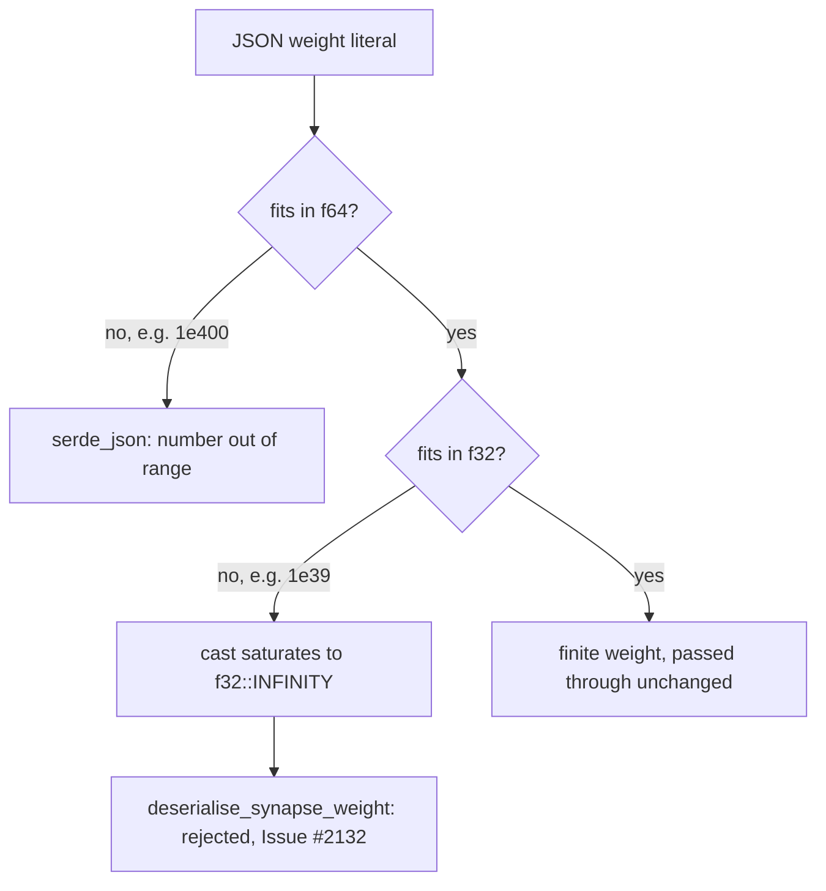

# PR Summary — Issue #2132

## Summary

`SynapseJson::weight` carried only `#[serde(default)]`, so no FFI-boundary check
stood between a caller's JSON and a non-finite weight. The weight is now
validated once, at deserialisation, by `deserialise_synapse_weight` in
`src/ffi_types/mod.rs`; a non-finite value is refused with an error naming the
finitude requirement and citing the issue. Closes #2132.

The reachable hole is narrower — and more interesting — than the issue states.
JSON has no `Infinity` literal, and there are two distinct routes:

- `1e400` overflows **f64** itself, so `serde_json` rejects it during number
  parsing with its own "number out of range" error, before any field validator
  runs. The payload was already refused; the issue's stated root cause ("`1e400`
  parses to `f32::INFINITY`") does not hold.
- `1e39` is an ordinary finite f64, but exceeds `f32::MAX` and saturates to
  `f32::INFINITY` the moment serde casts it down. Serde raises nothing. **This**
  is the hole, and it is what the fix closes.

An infinite weight then flowed unchecked into `weight * activation` at every
analysis site, where it beats every contribution threshold and silently bypasses
dormancy, polarity-flip and noise detection — the caller is handed confidently
wrong results. Guarding at the boundary rather than at each consumption site
means the sites receive a finite value by construction.



## Evidence

Backend/FFI change — no web interface to screenshot. The evidence is the
regression suite driving the real deserialiser and the shipped entry point:

```text
$ cargo test --all-features --test ffi issue_2132
test result: ok. 6 passed; 0 failed; 0 ignored; 0 measured; 188 filtered out

$ cargo test --lib --all-features deserialise_synapse_weight
test result: ok. 3 passed; 0 failed; 0 ignored; 0 measured; 1590 filtered out

$ cargo fmt --all --check
(no output)

$ cargo clippy --all-targets --all-features -- -D warnings
CLIPPY_EXIT=0

$ ./quality/bash_syntax.sh
exit 0

$ ./scripts/check-pr-summary-location.sh
✅ All pr-summary-*.md files live in docs/archive/pr-summaries/
```

## Reproduction

- **symptom** — a caller's synapse weight above `f32::MAX` (`1e39`) deserialised
  to `f32::INFINITY` without complaint, and `weight * activation` stayed
  infinite through every downstream threshold comparison.
- **status** — `verified` — the reachable literal is `1e39`, not the `1e400` the
  issue names: `1e400` overflows f64 and `serde_json` refuses it on its own,
  while `1e39` round-trips into the struct as `INFINITY`.
- **regression test** —
  `tests/ffi/issue_2132_synapse_weight_finitude.rs::deserialise_rejects_f32_saturating_magnitude`,
  with
  `::record_discovery_rejects_infinite_synapse_weight`
  pinning the same rejection through the shipped `record_discovery_internal`
  entry point.

## Test Plan

`tests/ffi/issue_2132_synapse_weight_finitude.rs` (6 tests):

- `deserialise_rejects_f64_overflowing_literals` — `1e400` and `-1e400` are
  refused (by serde_json's own range check, which the test does not claim as
  ours).
- `deserialise_rejects_f32_saturating_magnitude` — the regression test: `1e39`
  and `-3.5e38` are finite as f64, saturate on the cast to f32, and are refused
  with an error naming finitude and citing the issue.
- `deserialise_rejects_infinite_weight_nested_in_creature` — an infinite weight
  sinks the whole `CreatureJson` payload, not just the standalone synapse.
- `deserialise_accepts_finite_weights` — `0.5`, `-0.75`, `0`, `3.4e38`,
  `-3.4e38` all survive, and the value is preserved exactly.
- `deserialise_defaults_missing_weight_to_zero` — an omitted weight still
  defaults to `0.0`; the validator does not break `#[serde(default)]`.
- `record_discovery_rejects_infinite_synapse_weight` — the shipped entry point
  returns `success: false` with `errorKind: "data_validation"` and an error
  citing the issue.

`src/ffi_types/mod.rs` `mod tests` (3 tests) reach the module-private validator
with a non-JSON deserialiser:

- `deserialise_synapse_weight_rejects_nan` — the only route to the NaN branch,
  which strict JSON cannot express.
- `deserialise_synapse_weight_rejects_infinities` — both signed infinities.
- `deserialise_synapse_weight_accepts_finite_values` — `0.0`, `-0.75`,
  `f32::MAX`, `f32::MIN` pass through unchanged.

## Acceptance Criteria

<!-- vibe-spec-review inputs="diff+issue-body" -->

- **met** — Add custom Deserialize impl for SynapseJson that validates weight field for finitude (not Infinity, not NaN) — evidence: `src/ffi types/mod.rs::deserialise synapse weight, wired onto the field as [serde(default, deserialize with = "deserialise synapse weight")] on SynapseJson::weight ; behaviour pinned by src/ffi types/mod.rs::tests::deserialise synapse weight rejects infinities and ::deserialise synapse weight rejects` — reviewer: met
- **met** — Reject JSON with Infinity or NaN in weight field at FFI boundary — evidence: `tests/ffi/issue 2132 synapse weight finitude.rs::deserialise rejects f32 saturating magnitude ( 1e39 , -3.5e38 saturate to f32 infinity and are refused), ::deserialise rejects infinite weight nested in creature, and ::record discovery rejects infinite synapse weight (shipped entry point returns succ` — reviewer: met
- **met** — Add regression test: JSON "weight": 1e400 → deserialization fails with validation error — evidence: `tests/ffi/issue 2132 synapse weight finitude.rs::deserialise rejects f64 overflowing literals covers 1e400 and -1e400 and asserts deserialisation fails. Verified empirically that serde json refuses 1e400 with its own "number out of range" before the field validator is reached ( 1e39 is what reaches` — reviewer: met
- **partial** — Verify all 23 consumption sites now receive valid finite weights — evidence: `src/ffi types/mod.rs::deserialise synapse weight plus the argument in the module header of tests/ffi/issue 2132 synapse weight finitude.rs` — reviewer: partial — reason: The invariant is only established for the deserialisation path — no consumption site is touched or exercised, 71 SynapseJson { .. } struct literals in src/ bypass the validator entirely, and the diff neither enumerates nor tests the 23 sites (the count is also stale: ~84 non-test .weight reads under

## Standards Review

<!-- vibe-standards-review inputs="diff+CODING-STANDARDS.md" -->

- **violation** — Inline src/ unit tests for behaviour that is reachable through the public API, against "Prefer the tests/ directory over inline unit tests; only place tests under src/ when the behaviour cannot be exercised cleanly via the public API" (CONTRIBUTING.md, Test Organisation) — evidence: `src/ffi types/mod.rs:345` — reason: Not fixed — left in place. deserialise synapse weight rejects infinities (line 345) and deserialise synapse weight accepts finite values (line 359) duplicate coverage already in tests/ffi/issue 2132 synapse weight finitude.rs::deserialise rejects f32 saturating magnitude and ::deserialise accepts fi
- **clean** — Australian English ( deserialise , "deserialisation"; the only -ize tokens are serde's own API names); fail-loud error handling — the validator returns Err with a named requirement rather than clamping or defaulting; "Cite Code by Symbol, Never by Line Number" — no file.rs:line citations in the new
