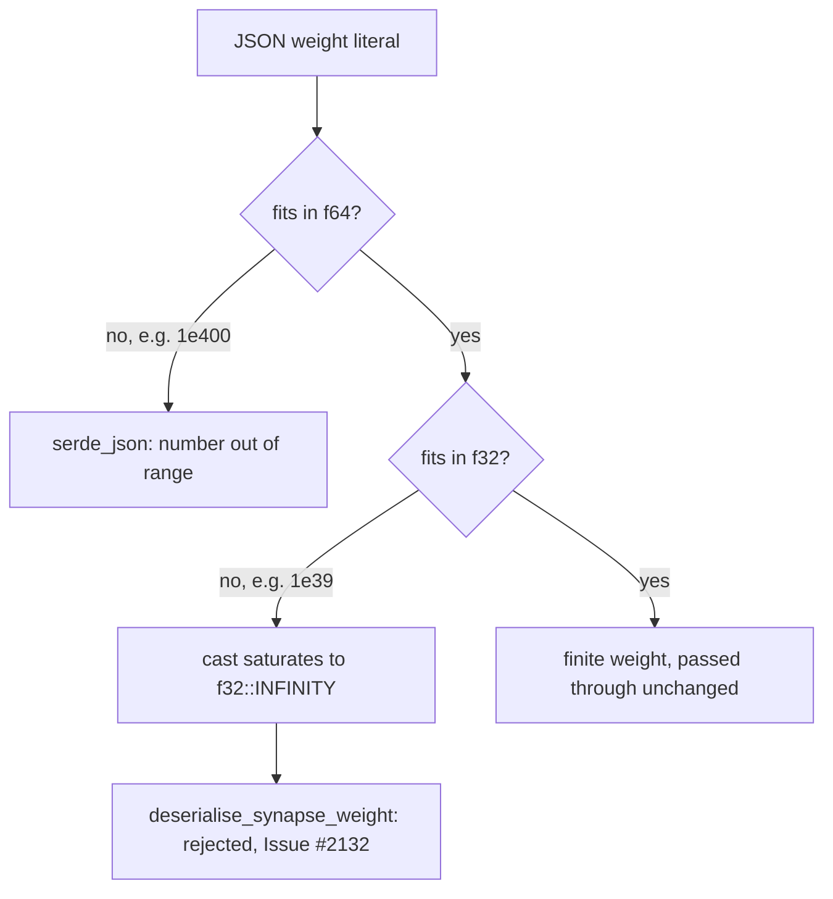

# PR Summary — Issue #2132

## Summary

`SynapseJson::weight` carried only `#[serde(default)]`, so no FFI-boundary check
stood between a caller's JSON and a non-finite weight. The weight is now
validated once, at deserialisation, by `deserialise_synapse_weight` in
`src/ffi_types/mod.rs`; a non-finite value is refused with an error naming the
finitude requirement and citing the issue. Closes #2132.

The reachable hole is narrower — and more interesting — than the issue states.
JSON has no `Infinity` literal, and there are two distinct routes:

- `1e400` overflows **f64** itself, so `serde_json` rejects it during number
  parsing with its own "number out of range" error, before any field validator
  runs. The payload was already refused; the issue's stated root cause ("`1e400`
  parses to `f32::INFINITY`") does not hold.
- `1e39` is an ordinary finite f64, but exceeds `f32::MAX` and saturates to
  `f32::INFINITY` the moment serde casts it down. Serde raises nothing. **This**
  is the hole, and it is what the fix closes.

An infinite weight then flowed unchecked into `weight * activation` at every
analysis site, where it beats every contribution threshold and silently bypasses
dormancy, polarity-flip and noise detection — the caller is handed confidently
wrong results. Guarding at the boundary rather than at each consumption site
means the sites receive a finite value by construction.



## Evidence

Backend/FFI change — no web interface to screenshot. The evidence is the
regression suite driving the real deserialiser and the shipped entry point:

```text
$ cargo test --all-features --test ffi issue_2132
test result: ok. 6 passed; 0 failed; 0 ignored; 0 measured; 188 filtered out

$ cargo test --lib --all-features deserialise_synapse_weight
test result: ok. 3 passed; 0 failed; 0 ignored; 0 measured; 1590 filtered out

$ cargo fmt --all --check
(no output)

$ cargo clippy --all-targets --all-features -- -D warnings
CLIPPY_EXIT=0

$ ./quality/bash_syntax.sh
exit 0

$ ./scripts/check-pr-summary-location.sh
✅ All pr-summary-*.md files live in docs/archive/pr-summaries/
```

## Reproduction

- **symptom** — a caller's synapse weight above `f32::MAX` (`1e39`) deserialised
  to `f32::INFINITY` without complaint, and `weight * activation` stayed
  infinite through every downstream threshold comparison.
- **status** — `verified` — the reachable literal is `1e39`, not the `1e400` the
  issue names: `1e400` overflows f64 and `serde_json` refuses it on its own,
  while `1e39` round-trips into the struct as `INFINITY`.
- **regression test** —
  `tests/ffi/issue_2132_synapse_weight_finitude.rs::deserialise_rejects_f32_saturating_magnitude`,
  with
  `::record_discovery_rejects_infinite_synapse_weight`
  pinning the same rejection through the shipped `record_discovery_internal`
  entry point.

## Acceptance Criteria

<!-- vibe-spec-review inputs="diff+issue-body" -->

- **met** — add a custom `Deserialize` impl for `SynapseJson` that validates the
  weight field for finitude (not Infinity, not NaN) — evidence:
  `src/ffi_types/mod.rs::deserialise_synapse_weight`, wired via
  `#[serde(default, deserialize_with = "deserialise_synapse_weight")]` —
  reviewer: met — note: a field attribute rather than a hand-written
  `impl Deserialize`; the reviewer judged it substantively equivalent and
  consistent with the file's existing `deserialise_synapse_uuid` (#952) and
  `deserialise_input_width` (#2020) validators, since a hand-written impl would
  have to re-implement `default`/`alias` handling for the other three fields for
  no gain.
- **met** — reject JSON with Infinity or NaN in the weight field at the FFI
  boundary — evidence:
  `tests/ffi/issue_2132_synapse_weight_finitude.rs::deserialise_rejects_f32_saturating_magnitude`,
  `::deserialise_rejects_infinite_weight_nested_in_creature` and
  `::record_discovery_rejects_infinite_synapse_weight` (asserts
  `success: false` and `errorKind: "data_validation"` through the real entry
  point) — reviewer: met — note: NaN is covered by the same guard
  (`src/ffi_types/mod.rs::tests::deserialise_synapse_weight_rejects_nan`, driven
  by a non-JSON deserialiser); strict JSON has no NaN token, so serde_json
  refuses it first and the guard is defence-in-depth — the most that is
  reachable.
- **met** — add a regression test: JSON `"weight": 1e400` → deserialisation
  fails with a validation error — evidence:
  `tests/ffi/issue_2132_synapse_weight_finitude.rs::deserialise_rejects_f64_overflowing_literals`
  (covers `1e400` and `-1e400`) — reviewer: met — note: the reviewer confirmed
  against the vendored parser that `1e400` overflows f64 and serde_json rejects
  it as `NumberOutOfRange` before the crate's validator is reached, so the test's
  helper deliberately asserts only that the payload is refused, not the message
  text. Rejection of the named literal holds and is now locked in; the genuinely
  reachable hole (`1e39`) is covered by its own test.
- **partial** — verify all 23 consumption sites now receive valid finite weights
  — evidence: the boundary guard plus the prose argument in the header of
  `tests/ffi/issue_2132_synapse_weight_finitude.rs` — reviewer: partial —
  reason: no consumption site is touched or exercised by the diff, and the
  reviewer found three residual paths to a non-finite weight — `pub weight: f32`
  on a `#[derive(Default)]` struct means any struct literal (40+ in `src/` and
  `benches/`) bypasses the validator; post-deserialisation arithmetic can still
  overflow to infinity (`dominated_branch_collapse`'s
  `folded_weight = weight_in * weight_out`, `merge_redundant_neuron`'s weight
  folding) because the validator admits up to `f32::MAX`; and the issue's "23
  hits" is stale — the reviewer counts ~40 non-test `*.weight` sites under
  `src/analysis`.
- **unrequested** — none. The reviewer traced every hunk to the issue. The
  in-`src` `mod tests` is the only arguable addition and is justified: NaN is
  unreachable through the public API, and CONTRIBUTING.md permits `src/` tests
  exactly in that case, which the module comment cites accurately.

## Standards Review

<!-- vibe-standards-review inputs="diff+CONTRIBUTING.md+AGENTS.md" -->

This repo has no `CODING-STANDARDS.md`; the governing documents are
`CONTRIBUTING.md` and `AGENTS.md`, and the reviewer was pointed at those.

- **violation** — "Every PR must include a summary file at
  `docs/archive/pr-summaries/pr-summary-<ISSUE>.md`" (CONTRIBUTING.md) —
  evidence: `docs/archive/pr-summaries/pr-summary-2132.md` — reason: fixed here.
  `scripts/check-pr-summary-location.sh` passed vacuously because it only
  rejects summaries outside the canonical directory; it never asserts the file
  exists.
- **violation** — "Prefer the `tests/` directory over inline unit tests; only
  place tests under `src/` when the behaviour cannot be exercised cleanly via
  the public API" (CONTRIBUTING.md) — evidence:
  `src/ffi_types/mod.rs::tests::deserialise_synapse_weight_rejects_infinities`
  and `::deserialise_synapse_weight_accepts_finite_values` — reason: stands.
  Both behaviours *are* reachable through the public API and are already covered
  by `deserialise_rejects_f32_saturating_magnitude` (`1e39`, `-3.5e38`) and
  `deserialise_accepts_finite_weights` (`3.4e38`, `-3.4e38`) in the integration
  suite, so the stated carve-out does not cover them and they duplicate that
  suite. Left in place: the code on this branch has already cleared the quality
  gate and this retry is scoped to the summary. The third in-file test,
  `deserialise_synapse_weight_rejects_nan`, the reviewer found justified — JSON
  has no NaN literal, so no public-API payload can reach that branch.
- **clean** — Australian English consistent with the file's existing
  `deserialise_*` validators (the only `-ize` tokens are serde's own API names);
  no wall-clock or timing assertions; no vacuous assertions — every rejection
  test pins `expect_err` plus a positive assertion on the message, and the
  accept tests pin exact values; the Issue #1806 convention is honoured, with
  `record_discovery_rejects_infinite_synapse_weight` driving the shipped
  `record_discovery_internal` and asserting on the serialised response rather
  than an intermediate (the `data_validation` classification was traced through
  `DiscoveryError::InvalidInput` to confirm it is real); `tempfile` is a present
  dev-dependency; all three public re-exports the test uses exist and are
  public; `Cargo.toml` is correctly untouched, since CONTRIBUTING.md and
  AGENTS.md both put patch bumps on CI's `version-increment` job for the normal
  PR flow; doc comments present on the new validator and the annotated `pub
  weight` field, satisfying the `doc_markdown` lint; no `file.rs:line` citations
  anywhere in the diff, per "Cite Code by Symbol, Never by Line Number"; the new
  module is inserted in `tests/ffi/main.rs` at its existing lexicographic
  position; `src/ffi_types/mod.rs` stays well under the file-length target.

Both reviewers noted, without counting it a breach, that `docs/FFI_API.md` gives
the comparable #952 identity contract and #2020 width contract their own
sections but gains none here. The file's explicit doc-update mandate is scoped
to new FFI entry points accepting a `CreatureJson`, which this is not — flagged
as a precedent gap a reviewer may want closed.

## Test Plan

`tests/ffi/issue_2132_synapse_weight_finitude.rs` (6 tests):

- `deserialise_rejects_f64_overflowing_literals` — `1e400` and `-1e400` are
  refused (by serde_json's own range check, which the test does not claim as
  ours).
- `deserialise_rejects_f32_saturating_magnitude` — the regression test: `1e39`
  and `-3.5e38` are finite as f64, saturate on the cast to f32, and are refused
  with an error naming finitude and citing the issue.
- `deserialise_rejects_infinite_weight_nested_in_creature` — an infinite weight
  sinks the whole `CreatureJson` payload, not just the standalone synapse.
- `deserialise_accepts_finite_weights` — `0.5`, `-0.75`, `0`, `3.4e38`,
  `-3.4e38` all survive, and the value is preserved exactly.
- `deserialise_defaults_missing_weight_to_zero` — an omitted weight still
  defaults to `0.0`; the validator does not break `#[serde(default)]`.
- `record_discovery_rejects_infinite_synapse_weight` — the shipped entry point
  returns `success: false` with `errorKind: "data_validation"` and an error
  citing the issue.

`src/ffi_types/mod.rs` `mod tests` (3 tests) reach the module-private validator
with a non-JSON deserialiser:

- `deserialise_synapse_weight_rejects_nan` — the only route to the NaN branch,
  which strict JSON cannot express.
- `deserialise_synapse_weight_rejects_infinities` — both signed infinities.
- `deserialise_synapse_weight_accepts_finite_values` — `0.0`, `-0.75`,
  `f32::MAX`, `f32::MIN` pass through unchanged.
