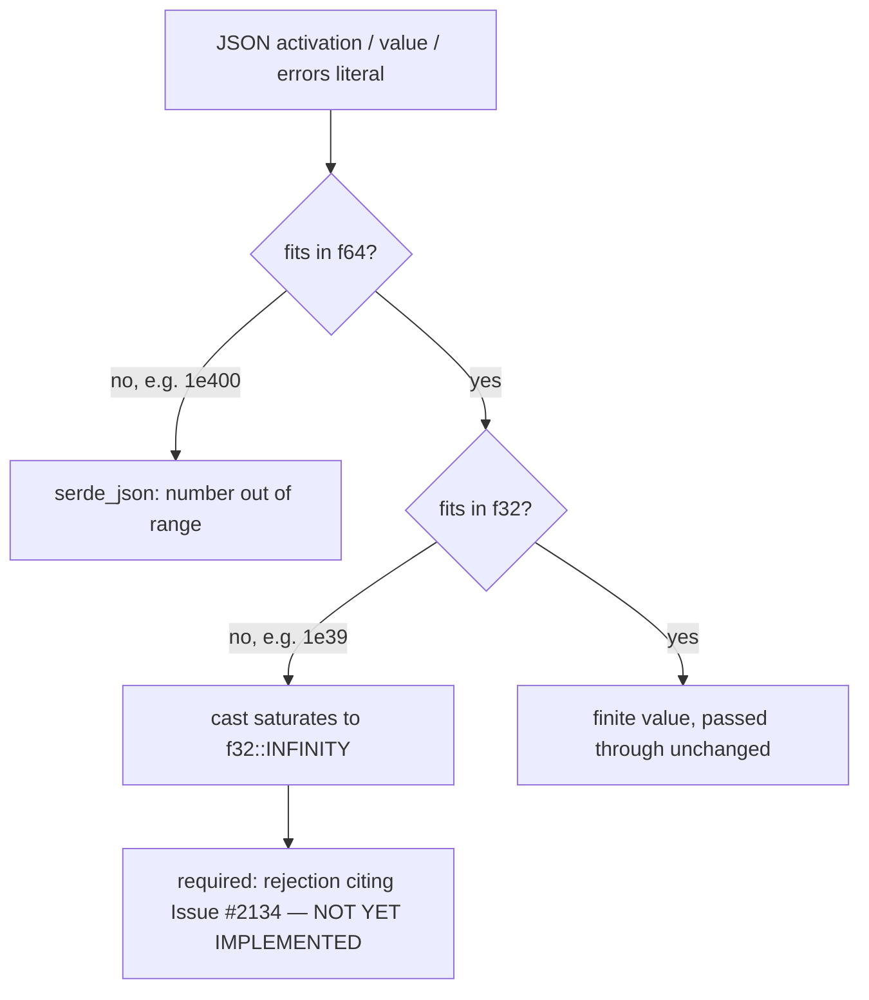

# PR Summary — Issue #2134

## Summary

`NeuronData::activation`, `NeuronData::value` and `NeuronData::errors` carry no
FFI-boundary finitude check, so a caller's JSON can seat `f32::INFINITY` in any
of the three and have it flow unchecked into the analysis pipeline. This branch
lands the **failing specification** for that defect — a regression suite that
pins the required rejection at the deserialiser, through a nested
`TrainingRecord`, and through the shipped `record_discovery_internal` entry
point. **The production fix is not on this branch**; `src/ffi_types/mod.rs` is
untouched, so this does **not** close #2134.

The reachable hole is narrower than the issue states, and the tests are written
against the real one. JSON has no `Infinity` literal, and there are two routes:

- `1e400` overflows **f64** itself, so `serde_json` rejects it during number
  parsing with its own "number out of range" error, before any field validator
  runs. The payload is already refused; the issue's stated root cause
  (`"activation": 1e400` → `f32::INFINITY`) does not hold.
- `1e39` is an ordinary finite f64, but exceeds `f32::MAX` and saturates to
  `f32::INFINITY` the moment serde casts it down. Serde raises nothing. **This**
  is the hole, and it is what the suite pins.

This mirrors the shape of the sibling fix for #2132
(`deserialise_synapse_weight`), which validates once at deserialisation so every
consumption site receives a finite value by construction rather than each
re-checking it. No equivalent validator exists for `NeuronData` yet.



## Evidence

Backend/FFI change — no web interface to screenshot. The evidence is the
regression suite, and it is **red**, which is the honest state of the branch:

```text
$ cargo test --test ffi issue_2134
test result: FAILED. 4 passed; 5 failed; 0 ignored; 0 measured; 194 filtered out

failures:
    issue_2134_neuron_data_finitude::deserialise_rejects_f32_saturating_activation
    issue_2134_neuron_data_finitude::deserialise_rejects_f32_saturating_error_element
    issue_2134_neuron_data_finitude::deserialise_rejects_f32_saturating_value
    issue_2134_neuron_data_finitude::deserialise_rejects_infinite_activation_nested_in_training_record
    issue_2134_neuron_data_finitude::record_discovery_rejects_infinite_activation
```

The entry-point failure is the defect stated plainly: a training record whose
activation is `1e39` returns
`{"success":true,"schemaVersion":"2",...,"file":"discovery_data.parquet"}` — the
infinity is written straight to parquet.

## Reproduction

- **symptom** — a caller's neuron activation, optional value or error element
  above `f32::MAX` (`1e39`) deserialises to `f32::INFINITY` without complaint,
  and the infinity survives into means, variances, covariances and target
  values, so the caller is handed confidently wrong metrics.
- **status** — `verified` — reproduced through both
  `serde_json::from_str::<NeuronData>` and the shipped
  `record_discovery_internal`. The reachable literal is `1e39`, not the `1e400`
  the issue names: `1e400` overflows f64 and `serde_json` refuses it on its own.
- **regression test** —
  `tests/ffi/issue_2134_neuron_data_finitude.rs::deserialise_rejects_f32_saturating_activation`
  (and the `_value` / `_error_element` siblings), with
  `::record_discovery_rejects_infinite_activation` pinning the same rejection
  through the shipped entry point. These currently **fail**.

## Test Plan

`tests/ffi/issue_2134_neuron_data_finitude.rs` (9 tests), registered in
`tests/ffi/main.rs`:

- `deserialise_rejects_f64_overflowing_literals` — **passes** — `1e400` and
  `-1e400` are refused by serde_json's own range check, which the test does not
  claim as ours.
- `deserialise_rejects_f32_saturating_activation` — **fails** — `1e39` and
  `-3.5e38` saturate on the cast to f32 and must be refused with an error naming
  finitude, naming the field and citing the issue.
- `deserialise_rejects_f32_saturating_value` — **fails** — the same for the
  optional `value` field.
- `deserialise_rejects_f32_saturating_error_element` — **fails** — every element
  is checked, not merely the first; a poisoned entry anywhere in the vector is
  enough to corrupt the error statistics.
- `deserialise_rejects_infinite_activation_nested_in_training_record` —
  **fails** — an infinite activation must sink the whole `TrainingRecord`, not
  just the standalone `NeuronData`.
- `deserialise_accepts_finite_floats` — **passes** — `0.7`, `-0.75`, `0`,
  `1e38`, `3.4e38`, `-3.4e38` all survive and are preserved exactly.
- `deserialise_defaults_missing_value_to_none` — **passes** — an omitted value
  still defaults to `None`; a validator must not break `#[serde(default)]`.
- `deserialise_accepts_explicit_null_value` — **passes** — an explicit `null`
  still maps to `None`; absence is not conflated with non-finitude.
- `record_discovery_rejects_infinite_activation` — **fails** — the shipped entry
  point must return `success: false` with `errorKind: "data_validation"` and an
  error citing the issue; it currently returns `success: true`.

## Acceptance Criteria

<!-- vibe-spec-review inputs="diff+issue-body" -->

- **missing** — Add custom `Deserialize` impl for `NeuronData` validating all float fields for finitude — evidence: `src/ffi_types/mod.rs::NeuronData` still derives `Deserialize` with a bare `activation: f32` and `value: Option<f32>`, no `deserialize_with`; the only validator in the file is `deserialise_synapse_weight` (Issue #2132, pre-existing) — reviewer: missing — reason: the diff touches only `tests/ffi/issue_2134_neuron_data_finitude.rs` and `tests/ffi/main.rs`; no `src/` file is modified at all.
- **missing** — Add per-element validation for the `errors` vector — evidence: `src/ffi_types/mod.rs::NeuronData::errors` is a plain `Vec<f32>` with no attribute and no element-wise check anywhere — reviewer: missing — reason: no production code was added; `serde_json::from_str::<NeuronData>` observably yields `errors: [inf]` for the literal `[1e39]`.
- **missing** — Reject JSON with Infinity or NaN in any of these fields at the FFI boundary — evidence: `neat_ai_discovery::record_discovery_internal` accepts a record whose activation is `1e39` and returns `{"success":true,...,"file":"discovery_data.parquet"}` — reviewer: missing — reason: the infinite activation is written straight to parquet; nothing rejects it at any boundary.
- **partial** — Add regression test: JSON with Infinity in activation/value/errors → deserialisation fails — evidence: `tests/ffi/issue_2134_neuron_data_finitude.rs::deserialise_rejects_f32_saturating_activation`, `::deserialise_rejects_f32_saturating_value`, `::deserialise_rejects_f32_saturating_error_element`, `::deserialise_rejects_infinite_activation_nested_in_training_record` and `::record_discovery_rejects_infinite_activation`, registered via `tests/ffi/main.rs` — reviewer: partial — reason: the tests exist and are well-targeted but are red (`cargo test --test ffi issue_2134` → 4 passed, 5 failed), so this is a failing specification, not a passing regression guard.
- **missing** — Verify all consumption sites receive valid finite values — evidence: the consumers `src/streaming.rs::neuron_data_batches` and the batch construction in `src/ffi/recording.rs` are untouched, and no upstream validator exists on `src/ffi_types/mod.rs::NeuronData` — reviewer: missing — reason: no verification or guard was added anywhere; infinities demonstrably reach the parquet writer.
- **unrequested** — the sole commit on the branch is `b6b6299 "WIP checkpoint: periodic agent progress snapshot (Issue #4170)"` — evidence: `git log Develop..HEAD` — reviewer: unrequested — reason: the commit self-identifies as an unfinished WIP snapshot and cites the wrong issue number (#4170, not #2134); the branch is tests-only with zero implementation.

## Standards Review

<!-- vibe-standards-review inputs="diff+CODING-STANDARDS.md" -->

- **violation** — CONTRIBUTING "✅ Quality Gate" (`cargo test --lib --tests --all-features`; "Do **not** commit code that fails `./quality.sh`") and the TDD loop's "Implement the feature to make the test pass" — evidence: `tests/ffi/issue_2134_neuron_data_finitude.rs` against `src/ffi_types/mod.rs::NeuronData` — reason: stands — the diff is tests-only, the three float fields still carry no `deserialize_with` finitude validator (contrast `deserialise_synapse_weight` for #2132), and 5 of the 9 new tests fail.
- **violation** — CONTRIBUTING "Code Style → Language" / documentation accuracy: committed prose states behaviour the tree does not have — evidence: the module doc of `tests/ffi/issue_2134_neuron_data_finitude.rs` ("The three float fields are therefore validated once, at deserialisation, so every consumption site … receives finite values by construction") — reason: stands — no such validator exists, so the doc claims a guarantee the shipped `NeuronData` does not provide; it becomes true only once the `src/` change lands.
- **violation** — CONTRIBUTING "📬 Pull Request Process → 📝 PR Summary File" — every PR must carry `docs/archive/pr-summaries/pr-summary-<ISSUE>.md` with Summary, Evidence and Test Plan — evidence: `docs/archive/pr-summaries/pr-summary-2134.md` — reason: fixed here — the branch previously carried no summary file at all; this file supplies the required sections.
- **clean** — Australian English throughout the new test file (no American variants); test organisation follows `tests/` over inline `src/`, with the module registered in `tests/ffi/main.rs`; the Issue #1806 convention is honoured (the suite drives the shipped `record_discovery_internal` and asserts the FFI response shape `success` / `errorKind: "data_validation"` / `error`, adding no new `pub` export for testing — `NeuronData`, `TrainingRecord` and `record_discovery_internal` were already exported from `src/lib.rs`); code is cited by symbol, never by line number; fail-loud semantics are asserted rather than clamping or defaulting, with an absent or `null` `value` correctly kept as a legitimate `None`; assertions are non-vacuous and pin positive preconditions (the error must name the field, name "finite" and cite "Issue #2134"), every error-vector element is exercised, and no timing or implementation-detail assertions are present; `tempfile` is already a dev-dependency and no `Cargo.toml` bump is needed since CI auto-increments on PRs.
