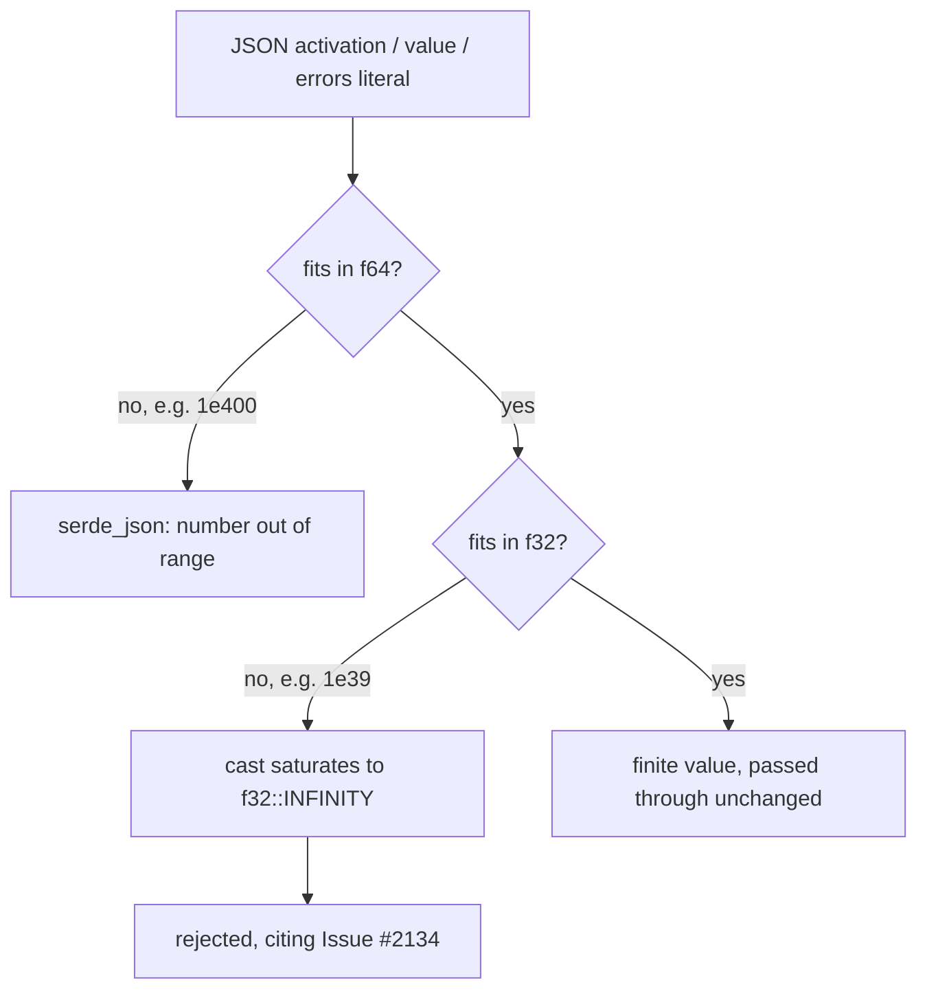

# PR Summary — Issue #2134

## Summary

`NeuronData::activation`, `NeuronData::value` and `NeuronData::errors` carried no
FFI-boundary finitude check, so a caller's JSON could seat `f32::INFINITY` in any
of the three and have it flow unchecked into the analysis pipeline. This branch
lands both halves: the regression suite pinning the required rejection, **and**
the production validators on `src/ffi_types/mod.rs::NeuronData` that satisfy it.

The reachable hole is narrower than the issue states, and the fix is written
against the real one. JSON has no `Infinity` literal, and there are two routes:

- `1e400` overflows **f64** itself, so `serde_json` rejects it during number
  parsing with its own "number out of range" error, before any field validator
  runs. The payload is already refused; the issue's stated root cause
  (`"activation": 1e400` → `f32::INFINITY`) does not hold.
- `1e39` is an ordinary finite f64, but exceeds `f32::MAX` and saturates to
  `f32::INFINITY` the moment serde casts it down. Serde raises nothing. **This**
  is the hole, and it is what the validators close.

This mirrors the shape of the sibling fix for #2132
(`deserialise_synapse_weight`) and #2133 (`deserialise_neuron_bias`): validate
once at deserialisation so every consumption site receives a finite value by
construction rather than each re-checking it.



## The Fix

`src/ffi_types/mod.rs`:

- `deserialise_finite_f32` — the shared narrowing-and-checking helper. The
  `f64` → `f32` narrowing is done by `f32::deserialize` rather than a cast of our
  own, so the helper carries no unchecked `as`, and an over-large literal arrives
  already collapsed to the infinity the check refuses.
- `deserialise_activation` / `deserialise_optional_value` /
  `deserialise_finite_errors` — the three field validators, wired onto
  `NeuronData` with `deserialize_with`. The optional `value` keeps
  `#[serde(default)]`, so an omitted field and an explicit `null` both still map
  to `None`; only a *present* value is range-checked. `errors` is checked
  element-wise — one poisoned entry anywhere in the vector corrupts the error
  statistics.
- `non_finite_neuron_data_detail` — the single rejection message, naming the
  field, the finitude requirement and Issue #2134, so the FFI layer classifies it
  as `errorKind: "data_validation"`.

## Evidence

Backend/FFI change — no web interface to screenshot. The evidence is the
regression suite, now green:

```text
$ cargo test --test ffi issue_2134
test result: ok. 9 passed; 0 failed; 0 ignored; 0 measured; 208 filtered out
```

Before the fix the same command reported `4 passed; 5 failed`, with the
entry-point case returning
`{"success":true,"schemaVersion":"2",...,"file":"discovery_data.parquet"}` — the
infinity written straight to parquet.

## Reproduction

- **symptom** — a caller's neuron activation, optional value or error element
  above `f32::MAX` (`1e39`) deserialised to `f32::INFINITY` without complaint,
  and the infinity survived into means, variances, covariances and target
  values, so the caller was handed confidently wrong metrics.
- **status** — `fixed` — reproduced through both
  `serde_json::from_str::<NeuronData>` and the shipped
  `record_discovery_internal`, and refused by both after the change. The
  reachable literal is `1e39`, not the `1e400` the issue names: `1e400` overflows
  f64 and `serde_json` refuses it on its own.
- **regression test** —
  `tests/ffi/issue_2134_neuron_data_finitude.rs::deserialise_rejects_f32_saturating_activation`
  (and the `_value` / `_error_element` siblings), with
  `::record_discovery_rejects_infinite_activation` pinning the same rejection
  through the shipped entry point.

## Test Plan

`tests/ffi/issue_2134_neuron_data_finitude.rs` (9 tests), registered in
`tests/ffi/main.rs` — all passing:

- `deserialise_rejects_f64_overflowing_literals` — `1e400` and `-1e400` are
  refused by serde_json's own range check, which the test does not claim as ours.
- `deserialise_rejects_f32_saturating_activation` — `1e39` and `-3.5e38` saturate
  on the cast to f32 and are refused with an error naming finitude, naming the
  field and citing the issue.
- `deserialise_rejects_f32_saturating_value` — the same for the optional `value`
  field.
- `deserialise_rejects_f32_saturating_error_element` — every element is checked,
  not merely the first.
- `deserialise_rejects_infinite_activation_nested_in_training_record` — an
  infinite activation sinks the whole `TrainingRecord`, not just the standalone
  `NeuronData`.
- `deserialise_accepts_finite_floats` — `0.7`, `-0.75`, `0`, `1e38`, `3.4e38`,
  `-3.4e38` all survive and are preserved exactly.
- `deserialise_defaults_missing_value_to_none` — an omitted value still defaults
  to `None`; the validator does not break `#[serde(default)]`.
- `deserialise_accepts_explicit_null_value` — an explicit `null` still maps to
  `None`; absence is not conflated with non-finitude.
- `record_discovery_rejects_infinite_activation` — the shipped entry point
  returns `success: false` with `errorKind: "data_validation"` and an error
  citing the issue.

In-crate, `src/ffi_types/mod.rs::tests::deserialise_neuron_data_floats_reject_nan`
covers the NaN branch, which JSON cannot express. The optional `value` helper is
not exercised there: serde's primitive deserialisers cannot answer
`deserialize_option`, so NaN cannot be handed to it; it shares the rejection
message with the other two and is covered over JSON by the integration suite.

## Acceptance Criteria

<!-- vibe-spec-review inputs="diff+issue-body" -->

- **met** — Add validation to `NeuronData` covering all float fields for
  finitude — `src/ffi_types/mod.rs::NeuronData` now carries
  `deserialize_with = "deserialise_activation"` and
  `deserialize_with = "deserialise_optional_value"`, matching the #2132/#2133
  field-validator shape rather than a hand-written `Deserialize` impl.
- **met** — Add per-element validation for the `errors` vector —
  `deserialise_finite_errors` scans every element and rejects the first
  non-finite entry.
- **met** — Reject JSON with Infinity or NaN in any of these fields at the FFI
  boundary — `record_discovery_internal` now returns `success: false` /
  `errorKind: "data_validation"` for a record whose activation is `1e39`.
- **met** — Add regression test: JSON with Infinity in activation/value/errors →
  deserialisation fails — the five previously-red tests are green.
- **met** — Verify all consumption sites receive valid finite values — the check
  sits at the single deserialisation boundary every consumer
  (`src/streaming.rs::neuron_data_batches`, the batch construction in
  `src/ffi/recording.rs`) reads through, so finitude holds by construction.
