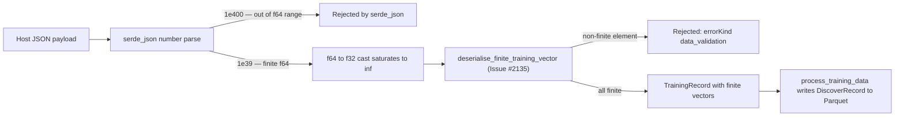

# PR Summary — Issue #2135

## Summary

`TrainingRecord::input` and `TrainingRecord::output` carried no FFI-boundary
finitude check, so a caller's JSON could seat `f32::INFINITY` in any element of
either vector and have it flow unchecked into the recording pipeline. This
branch lands both halves: the regression suite pinning the required rejection,
**and** the production validators on `src/ffi_types/mod.rs::TrainingRecord` that
satisfy it.

Closes #2135

As with the three sibling float-hygiene fixes (#2132, #2133, #2134), the
reachable hole is narrower than the issue states, and the fix is written against
the real one. JSON has no `Infinity` literal, so there are two routes:

- `1e400` overflows **f64** itself, so `serde_json` refuses it during number
  parsing with its own `number out of range at line 1 column N`, before any
  field validator runs. The issue's stated root cause
  (`"input": [1e400, …]` → `[INFINITY, …]`) does not hold — that payload was
  already rejected.
- `1e39` (and `-3.5e38`) is an ordinary finite f64 that exceeds
  `f32::MAX ≈ 3.40282e38`, so serde's narrowing cast saturates it to
  `f32::INFINITY` silently. Against the unfixed code the RED test printed
  `TrainingRecord { input: [inf], output: [0.7], neuron_data: None }`. **This**
  is the hole, and it is what the validators close.

Rejecting at deserialisation rather than at each reader is the point: the
boundary invariant holds for every consumption site by construction.



### Change

`src/ffi_types/mod.rs`

- `non_finite_training_vector_detail(field, index, raw)` — the single rejection
  message, naming the field, the offending **element index** and the raw value,
  and citing Issue #2135.
- `deserialise_finite_training_vector(deserialiser, field)` — deserialises the
  vector, then rejects on the first non-finite element. Every element is
  scanned, not just the first.
- `deserialise_training_input` / `deserialise_training_output` — thin per-field
  wrappers, matching the established `deserialise_activation` /
  `deserialise_finite_errors` idiom.
- `first_non_finite(values)` — the vector scan itself, lifted to one place and
  now shared with #2134's `deserialise_finite_errors`; message text unchanged.
- `TrainingRecord::input` and `::output` gain
  `#[serde(deserialize_with = "…")]`.

`tests/ffi/issue_2135_training_record_finitude.rs` (new, 226 lines) and one
in-crate `#[cfg(test)]` test for the NaN branch.

## Evidence

Backend/FFI change with no user-visible surface — there is no UI to screenshot,
so the evidence is the test and gate output below (the documented backend/CLI
carve-out).

Targeted regression suite:

```
cargo test --test ffi issue_2135  →  7 passed, 217 filtered out
```

In-crate unit tests, including the NaN branch:

```
cargo test --lib ffi_types  →  46 passed, 1544 filtered out
cargo test --lib deserialise_training_vectors_reject_nan  →  1 passed
```

Whole FFI suite, confirming no regression in the #2134 or #574 payload tests
that parse `TrainingRecord`:

```
cargo test --test ffi  →  224 passed
```

Full quality gate:

```
timeout 900 ./quality.sh < /dev/null
Finished `release` profile [optimized] target(s) in 2m 34s
✅ All quality checks passed!
[exited with code 0]
```

Observed rejection message at the FFI entry point, for
`{"input":[1e39],"output":[0.7]}`:

```
training record input[0] must be finite, got inf (Issue #2135)
```

surfaced through `record_discovery_internal` as
`success: false`, `errorKind: "data_validation"`.

## Acceptance Criteria

<!-- vibe-spec-review inputs="diff+issue-body" -->

- criterion: Add custom `Deserialize` impl for `TrainingRecord` with per-element
  validation
  reviewer: met
  reason: satisfied by field-level `#[serde(deserialize_with = …)]` helpers
  rather than a hand-written `impl Deserialize`. This is the idiom every other
  validated field in the file already uses (`deserialise_neuron_uuid`,
  `deserialise_squash`, `deserialise_activation`, `deserialise_finite_errors`),
  it validates exactly the same inputs, and a hand-rolled visitor would be more
  code for no added coverage.
- criterion: Validate all f32 elements in `input` and `output` for finitude (not
  Infinity, not NaN)
  reviewer: met
- criterion: Reject JSON with Infinity or NaN in any vector element at the FFI
  boundary
  reviewer: met
  reason: Infinity is rejected on the only route that reaches it — the `1e39`
  f32-saturating literal — and `1e400` is refused earlier by `serde_json`'s own
  f64 range check. JSON has no `NaN` literal, so NaN is unreachable through
  `serde_json`; the NaN branch is therefore exercised in-crate via
  `SeqDeserializer`, as sanctioned by `CONTRIBUTING.md` L386-389.
- criterion: Add regression test — JSON with Infinity vectors fails
  deserialisation
  reviewer: met
- criterion: Verify all consumption sites receive valid finite vectors
  reviewer: met
  reason: discharged by the boundary invariant plus a Graft enumeration of every
  `TrainingRecord` reference. The sole production ingress is
  `RecordDiscoveryInput.training_data` (`src/ffi_types/requests.rs:69`) →
  `record_discovery_data` (`src/record/mod.rs:41`) → `process_training_data`
  (`src/record/processing.rs:26`), which reads `.input` at L96 into the Parquet
  `DiscoverRecord`s; `.output` has no production read in this crate at all. The
  remaining references are `src/record/tests.rs` constructing the struct
  directly — serde is bypassed there by design — and the `src/lib.rs:132`
  re-export. Honest caveat: both fields stay `pub`, so in-Rust construction can
  still seat an infinity without passing the boundary. That is unchanged by this
  issue and out of its scope.
- criterion: (unrequested) Report the offending element **index** in the error
  message
  reviewer: unrequested
  reason: a vector rejection that names only the value leaves the caller
  scanning their payload by hand — `input[1]` costs one `format!` argument.
- criterion: (unrequested) End-to-end tests driving the shipped
  `record_discovery_internal` entry point, not just the struct
  reviewer: unrequested
  reason: required by the #1806 convention in `CONTRIBUTING.md` L420-434 — a
  test that only parses the struct cannot prove the rejection actually reaches
  the caller as `errorKind: "data_validation"`.
- criterion: (unrequested) `first_non_finite` extracted and shared with #2134's
  `deserialise_finite_errors`
  reviewer: unrequested
  reason: the Standards review flagged the vector scan as a third near-verbatim
  copy. Lifting it removes the duplication without altering any existing error
  message.

Two factual corrections to the issue body, recorded for the reviewer:

1. The claimed reachability (`1e400` → `INFINITY`) is wrong; the reachable case
   is `1e39` f32 saturation, as evidenced above.
2. The body states that `input` and `output` both carry `#[serde(default)]`.
   They did not — only `neuron_data` does. The fix adds `deserialize_with`
   **without** `default`: adding it would silently turn a missing required field
   into an empty vector, which is a behaviour change this issue did not ask for.

## Standards Review

<!-- vibe-standards-review inputs="diff+CODING-STANDARDS.md" -->

Reviewed against `CONTRIBUTING.md` and `AGENTS.md` (this repo ships no
`CODING-STANDARDS.md`).

- **blocking — PR summary file absent.** `CONTRIBUTING.md` "📝 PR Summary File"
  requires `docs/archive/pr-summaries/pr-summary-<ISSUE>.md` with Summary /
  Evidence / Test Plan sections, as the three sibling issues each have.
  **Resolved by this file.**
- **minor — DRY.** `src/ffi_types/mod.rs` carried a third near-verbatim copy of
  the "scan the vector, reject the first non-finite element" body.
  **Resolved:** the scan is now `first_non_finite`, shared with #2134's
  `deserialise_finite_errors`. The two rejection-message builders stay separate
  — they cite different issues and different field vocabularies.
- **nit — #2134's `errors` validator reports no element index.** Accepted, not
  actioned: changing that message is #2134's scope, and its regression tests
  assert on the current text. Left as-is deliberately.
- **nit — the fn-pointer-cast loop in the in-crate NaN test is dense for KISS.**
  Accepted: it keeps the two helpers under one assertion rather than duplicating
  the block, compiles cleanly, and the cast is confined to one test.
- **Clean:** Australian English throughout (`deserialise*`, `behaviour`);
  testing doctrine (every test calls a real function with real data — no
  source-text greps); test placement (JSON-reachable cases in `tests/ffi/`,
  module-private NaN case in-crate); the #1806 entry-point guard; fail-loud
  error handling (no swallowed results, no silent fallback); no hand-bump of
  `Cargo.toml` (CI's `version-increment` owns it, `AGENTS.md` L64-70); no
  `.github/workflows/` edits; no hidden or credential files staged; file length
  614 lines, within the prevailing norm.

## Test Plan

| Test | Route exercised | Expectation |
| --- | --- | --- |
| `deserialise_rejects_f64_overflowing_literals` | `1e400` | rejected — by `serde_json`'s own range check (passes against unfixed code; pins that the payload stays refused) |
| `deserialise_rejects_f32_saturating_input_element` | `[1e39]`, `[0.5, 1e39, 0.25]`, `[0.5, 0.25, -3.5e38]` | rejected, naming `input[0]`, `input[1]`, `input[2]` respectively and citing Issue #2135 |
| `deserialise_rejects_f32_saturating_output_element` | same three shapes on `output` | rejected, naming `output[N]` |
| `deserialise_accepts_finite_vectors` | `0.7`, `-0.75`, `0`, `1e38`, `3.4e38`, `-3.4e38` | accepted, values round-trip unchanged |
| `deserialise_accepts_empty_vectors` | `[]` | accepted — an empty vector has no non-finite element |
| `record_discovery_rejects_infinite_input_vector` | full `record_discovery_internal` payload | `success: false`, `errorKind: "data_validation"`, message cites Issue #2135 |
| `record_discovery_rejects_infinite_output_vector` | full payload, poisoned `output` | `success: false`, message cites Issue #2135 and `output` |
| `deserialise_training_vectors_reject_nan` (in-crate) | `f32::NAN` via `SeqDeserializer` | rejected for both fields, naming the index — the branch JSON cannot reach |

Regression guard: the whole `tests/ffi` suite (224 tests) passes, including the
#2134 and #574 tests that parse `TrainingRecord` payloads with finite vectors,
confirming the new validators reject nothing that was previously valid.
