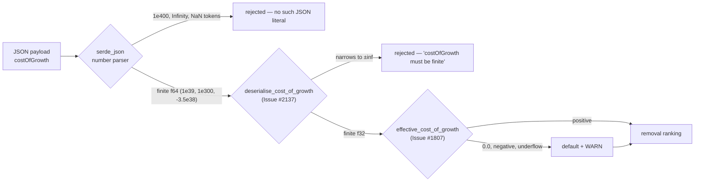

# PR Summary — Issue #2137 (SEC-2090-06: RankFocusNeuronsInput cost_of_growth Infinity)

## Summary

Closes #2137.

`RankFocusNeuronsInput::cost_of_growth` (`costOfGrowth`, optional `f32`) was
deserialised without any finitude check. The issue's stated vector — `1e400`
parsing to `f32::INFINITY` — is not the real one: `1e400` overflows `f64`, so
`serde_json`'s own number parser rejects it (`ErrorCode::NumberOutOfRange`)
before any field validator runs, as it does the bare `Infinity` / `-Infinity` /
`NaN` tokens, which are not JSON literals at all. The genuine hole is
*narrowing*: `1e39`, `1e300`, `-3.5e38` are ordinary finite `f64` values that
`serde_json` accepts and that saturate to `±∞` when stored into the `f32` field.
An infinite cost was previously only mitigated downstream by
`focus::ranking::effective_cost_of_growth`, which silently substitutes the
default and logs a WARN (Issue #1807) — so the caller received rankings computed
against a threshold they never asked for.

The fix adds `deserialise_cost_of_growth` in `src/ffi_types/mod.rs`, wired to the
field with `#[serde(default, deserialize_with = "…")]`, matching the pattern
established by `deserialise_temperature` (#2136) and `deserialise_synapse_weight`
(#2132). A present-but-non-finite cost now fails deserialisation and surfaces as
`success: false` with `errorKind: "data_validation"` and a message naming the
field, the requirement and the issue. Absent or `null` still means "use the
default" (`DEFAULT_COST_OF_GROWTH = 1e-7`), and *finite* but unusable values —
`0.0`, negatives, and `1e-60`, which underflows to `0.0` in `f32` — stay with the
downstream #1807 fallback, which also still guards in-crate Rust callers who
never cross the JSON boundary.



**Caller-visible contract change.** A `rank_focus_neurons` payload carrying
`costOfGrowth: 1e39` previously succeeded (silently falling back to the default);
it now fails with `data_validation`. This is the intent of the issue, is
documented in `docs/FFI_API.md` and `docs/IMPACT_CALCULATION.md`, and is not
gated behind a flag.

### Change surface

```text
 Cargo.lock                                         |   2 +-
 Cargo.toml                                         |   2 +-
 docs/FFI_API.md                                    |  23 ++
 docs/IMPACT_CALCULATION.md                         |  24 +-
 src/ffi_types/mod.rs                               |  30 ++
 src/ffi_types/requests.rs                          |  11 +-
 .../issue_1807_ffi_cost_of_growth_validation.rs    | 106 +++++--
 tests/ffi/issue_2137_cost_of_growth_finitude.rs    | 353 +++++++++++++++++++++
 tests/ffi/main.rs                                  |   1 +
 .../focus/issue_1767_structural_removal_triage.rs  |  16 +-
 10 files changed, 524 insertions(+), 44 deletions(-)
```

## Evidence

- `timeout 1800 ./quality.sh < /dev/null` → `Finished release profile
  [optimized] target(s) in 1m 41s`, `✅ All quality checks passed!`, **exit
  code 0**.
- `cargo test --test ffi issue_2137` → **8 passed**, 231 filtered out.
- `cargo test --test analysis issue_1807` → **7 passed**, 650 filtered out (was
  6 before this change — the reconciliation adds a test, removes none).
- `cargo test --test focus issue_1767` → **8 passed**, 179 filtered out.
- Empirically confirmed before writing the fix: `1e400` and the bare
  `Infinity` / `NaN` tokens are refused by `serde_json`'s parser (so their error
  does *not* cite Issue #2137), while `1e39` / `-1e39` / `1e300` / `-3.5e38`
  deserialise as `f64` and reach the new validator (so their error *does* name
  `costOfGrowth`, `finite` and `Issue #2137`). The two suites assert the two
  mechanisms separately rather than conflating them.
- `graft_find_all "costOfGrowth"` confirms `RankFocusNeuronsInput` is the only
  JSON-facing struct carrying the field, so there is no second unguarded site —
  unlike #2136's temperature, which spanned four request structs.

**Reconciled, not weakened.** Issue #1807 pinned the *opposite* contract for
`1e39` (fallback + WARN). Rather than delete those assertions, the fixture was
split: `invalid_ffi_costs()` became `non_positive_ffi_costs()` keeping `0.0`,
`-1.0`, `-1e-4` and `1e-60`, and the two `1e39` rows moved into a new, stricter
`f32_saturating_cost_of_growth_is_rejected_at_the_boundary` in the same file.
`tests/focus/issue_1767_structural_removal_triage.rs` changed its module doc
only — no assertion in it was touched.

## Acceptance Criteria

<!-- vibe-spec-review inputs="diff+issue-body" -->

All 8 tests in `tests/ffi/issue_2137_cost_of_growth_finitude.rs` pass
(`cargo test --test ffi issue_2137`: 8 passed).

1. **Add custom `Deserialize` impl for `RankFocusNeuronsInput` validating
   cost_of_growth for finitude.** — reviewer: `met` — evidence:
   `deserialise_cost_of_growth` in `src/ffi_types/mod.rs`, wired via
   `#[serde(default, deserialize_with = "deserialise_cost_of_growth")]` on
   `RankFocusNeuronsInput::cost_of_growth` in `src/ffi_types/requests.rs`.

   Note (not a deduction): this is a field-level `deserialize_with`, not a
   hand-written `impl Deserialize for RankFocusNeuronsInput` — functionally
   equivalent, narrower blast radius, and matches the sibling
   `deserialise_temperature` (#2136). `graft_find_all "costOfGrowth"` confirms
   `RankFocusNeuronsInput` is the only JSON-facing struct with the field, so
   there is no second unguarded site.

2. **Reject JSON with Infinity or NaN in cost_of_growth at FFI boundary.** —
   reviewer: `met` — evidence:
   `rank_focus_neurons_rejects_non_finite_cost_of_growth` drives
   `rank_focus_neurons_internal` and pins `success: false` plus
   `errorKind: "data_validation"` and an error naming `costOfGrowth`;
   `f32_saturating_cost_of_growth_is_rejected_at_the_boundary` and
   `non_json_cost_of_growth_tokens_are_rejected_loudly` in
   `tests/analysis/issue_1807_ffi_cost_of_growth_validation.rs` pin the same for
   `1e39` / `-1e39` and for the bare tokens.

   Note: the NaN branch of `deserialise_cost_of_growth` is unreachable from
   JSON — NaN rejection is real but delivered by `serde_json`, not by the new
   code. Infinity rejection via `f32` saturation is genuinely the new code's.

3. **Add regression test: JSON `"cost_of_growth": 1e400` → deserialization
   fails.** — reviewer: `partial` — evidence:
   `deserialise_rejects_f64_overflowing_cost_of_growth` asserts `1e400` and
   `-1e400` are refused — reason: `1e400` overflows **f64**, so `serde_json`'s
   parser rejects it before `deserialise_cost_of_growth` runs; the test would
   pass identically with the fix reverted, so it does not regression-guard the
   fix. The issue's premise that `1e400` "parses to `f32::INFINITY`" is
   factually wrong.

   Real guard coverage comes from
   `deserialise_rejects_f32_saturating_cost_of_growth` (`1e39`, `-1e39`,
   `1e300`, `-3.5e38`), which asserts the message contains `costOfGrowth`,
   `finite` and `Issue #2137`. The test file documents this split honestly
   rather than implying the `1e400` case exercises the new code.

4. **Verify ranking calculations receive valid finite cost values.** —
   reviewer: `met` — evidence:
   `finite_cost_of_growth_yields_finite_ranking_values` asserts a non-empty
   baseline candidate set and that every numeric ranking field stays a finite
   JSON number (not `null`, which is how serde serialises a non-finite `f32`)
   for costs `1e-7 … 1e6`; `deserialise_accepts_finite_costs_of_growth` and
   `deserialise_accepts_finite_but_unusable_costs_of_growth` pin that finite
   values — including `0.0`, negatives, `1e-60` and `3.4e38` — survive to the
   downstream `effective_cost_of_growth` fallback.

   Caveat: the sweep deliberately stops at `1e6`. An *accepted, finite* cost
   above roughly `1.1e38` still overflows the downstream savings arithmetic
   (`savings ≈ cost × synapses × boost`) and serialises `removalSavings` as
   `null`. That is a separate defect, out of this issue's scope, filed as
   **Issue #2174**; the reviewer could not verify the deferral from the diff
   alone, hence this explicit cross-reference. As worded, the criterion holds:
   ranking *receives* a finite cost in every accepted case.

**Unrequested changes in this diff**

- `Cargo.toml` + `Cargo.lock` bumped `0.74.249 → 0.74.250` — mandated by
  `AGENTS.md` for any code change.
- `docs/FFI_API.md` new subsection and `docs/IMPACT_CALCULATION.md` rewrite —
  documentation only, accurate to the shipped code.
- `tests/analysis/issue_1807_*` fixture refactor — forced by the behaviour
  change. It removes the only prior assertion that a non-finite FFI cost falls
  back to the default, replaced in the same file by the stricter rejection test,
  so net coverage is preserved.
- `tests/focus/issue_1767_*` — module doc text only, no assertion changes.
- Behaviour/compat note: payloads that previously succeeded with
  `costOfGrowth: 1e39` now fail with `data_validation`. Intended, but
  caller-visible; documented in both docs files, not gated behind a flag.

## Standards Review

<!-- vibe-standards-review inputs="diff+CODING-STANDARDS.md" -->

`CODING-STANDARDS.md` does not exist at this repository's root, so the diff was
reviewed against `AGENTS.md` and `CONTRIBUTING.md`, which govern here.

**Findings addressed in this PR**

- **violation — missing PR summary file** (`CONTRIBUTING.md:483`, enforced by
  quality-gate step 4 `./scripts/check-pr-summary-location.sh`). No PR summary
  existed for this change, although every sibling in the SEC-2090 series
  (`pr-summary-2132.md` … `pr-summary-2136.md`) has one. The reviewer called
  this "the only hard violation in the diff". **Resolved by this file.**
- **concern — `docs/FFI_API.md` subsection placement** (`AGENTS.md`, "Validated
  FFI Surface"). The new "Cost of Growth Finitude (Issue #2137)" subsection was
  appended *after* the validated-surface table and its closing paragraph,
  whereas the analogous "Neuron Bias Finitude (Issue #2133)" subsection sits
  *before* the table. **Resolved by moving the subsection ahead of the table**
  and adding a closing sentence explaining that `costOfGrowth` is a
  `rank_focus_neurons` tuning parameter rather than part of `CreatureJson`, so
  it correctly has no row in that table.

**Findings accepted as-is, with reasoning**

- **concern — DRY** (`CONTRIBUTING.md:329-333`): the body of
  `deserialise_cost_of_growth` is a near-copy of `deserialise_optional_value`
  rather than reusing a shared detail helper such as
  `non_finite_neuron_data_detail`. Accepted: that shared helper hardcodes
  "neuron data" and "Issue #2134", which reads wrongly for a cost of growth.
  The reviewer noted this is "mitigated by the identical precedent set by
  `deserialise_temperature` (#2136), so this is a consistency-vs-DRY trade-off,
  not a defect".
- **concern — duplicated assertions**:
  `f32_saturating_cost_of_growth_is_rejected_at_the_boundary`
  (`tests/analysis/issue_1807_*`) and
  `rank_focus_neurons_rejects_non_finite_cost_of_growth` (`tests/ffi/issue_2137_*`)
  assert essentially the same shipped behaviour for the same `1e39` / `-1e39`
  literals. Accepted deliberately: the #1807 suite is where the *old* contract
  was pinned, so the replacement assertion belongs beside it to show the
  contract moved rather than vanished; the #2137 suite is where the new
  boundary's own coverage lives.
- **concern — residual silent-null path**: the diff documents a band of finite
  costs above roughly `1.1e38` whose downstream arithmetic overflows and
  serialises as `null`, deferring it to Issue #2174 — a shipped silent-null path
  whose follow-up cannot be verified from the diff alone. Accepted as out of
  scope: #2137 is scoped to the FFI finitude boundary, and widening it to the
  ranking arithmetic would be a different change. Issue #2174 is filed and named
  here and in the test's own doc comment so the deferral is traceable.

**Passes**

Version bumped (`Cargo.toml:3`, `0.74.249 → 0.74.250`, with matching
`Cargo.lock`; no dependency versions touched, so `./bump-deps.sh` is not
implicated). Australian English throughout identifiers and prose
(`deserialise_cost_of_growth`, `deserialiser`, "deserialisation", "serialises",
"behaviour"), with no American spellings on any added line
(`CONTRIBUTING.md:293`). Tests are real-behavioural, not source-grepping: they
drive real `serde_json` deserialisation and the shipped
`rank_focus_neurons_internal`, and assert on the JSON envelope and on the
finitude of actual ranking values; `finite_cost_of_growth_yields_finite_ranking_values`
first asserts a non-empty candidate set, satisfying the #1799
positive-precondition rule. Existing tests preserved — nothing deleted,
`#[ignore]`d or weakened; all three affected suites pass (ffi 8, analysis 7,
focus 8). Docs match shipped code (`errorKind: "data_validation"` matches the
`DiscoveryError::InvalidInput` handling in `rank_focus_neurons_internal`;
`DEFAULT_COST_OF_GROWTH = 1e-7` matches `src/focus/ranking/mod.rs`; the claim
that `1e400` is refused by `serde_json` itself is correct). Error handling fails
loudly: an `Err` from the deserialiser surfaces as `success: false` plus
`errorKind: "data_validation"` and a message naming field, requirement,
offending value and issue — no silent coercion or default substitution at the
boundary. Guard wired at the shipped entry point (`CONTRIBUTING.md:418-429`).
Other gates: `.github/workflows/ci.yml` untouched; no line-number citations in
new prose (#1942); no item made `pub` solely for testing; `[lints.clippy]`
deny-lints respected (all `format!` args inlined, no `filter().next()`, no
collapsible `if`).

## Test Plan

New suite `tests/ffi/issue_2137_cost_of_growth_finitude.rs` (8 tests, registered
at `tests/ffi/main.rs`):

1. `deserialise_rejects_f64_overflowing_cost_of_growth` — `1e400`, `-1e400`
   refused (criterion 3; refused by `serde_json`, not by the new code — the
   test documents this).
2. `deserialise_rejects_bare_infinity_and_nan_tokens` — `Infinity`,
   `-Infinity`, `NaN` refused (criterion 2).
3. `deserialise_rejects_f32_saturating_cost_of_growth` — `1e39`, `-1e39`,
   `1e300`, `-3.5e38` refused with a message containing `costOfGrowth`,
   `finite` and `Issue #2137`. **RED before the fix.**
4. `deserialise_accepts_finite_costs_of_growth` — `1e-7`, `1e-4`, `1.0`,
   `3.4e38` all parse (no over-rejection).
5. `deserialise_accepts_finite_but_unusable_costs_of_growth` — `0.0`, `-1.0`,
   `1e-60` parse and are left to the downstream #1807 fallback.
6. `deserialise_defaults_absent_and_null_cost_of_growth` — omitted and
   explicitly `null` both yield `None`.
7. `rank_focus_neurons_rejects_non_finite_cost_of_growth` — end-to-end through
   `rank_focus_neurons_internal`, asserting `success == false`,
   `errorKind == "data_validation"` and an error naming `costOfGrowth` and
   `Issue #2137`. **RED before the fix.**
8. `finite_cost_of_growth_yields_finite_ranking_values` — non-empty baseline
   candidate set, then every numeric ranking field finite across
   `1e-7 … 1e6` (criterion 4).

Reconciliation coverage:

- `tests/analysis/issue_1807_ffi_cost_of_growth_validation.rs` — 7 passed. The
  `1e39` / `-1e39` rows moved out of the fallback fixture into the new
  `f32_saturating_cost_of_growth_is_rejected_at_the_boundary`; the fallback
  tests for `0.0`, `-1.0`, `-1e-4` and `1e-60` are unchanged.
- `tests/focus/issue_1767_structural_removal_triage.rs` — 8 passed, module doc
  updated to point at both suites.

Run:

```bash
cargo test --test ffi issue_2137 < /dev/null
cargo test --test analysis issue_1807 < /dev/null
cargo test --test focus issue_1767 < /dev/null
./quality.sh < /dev/null
```
