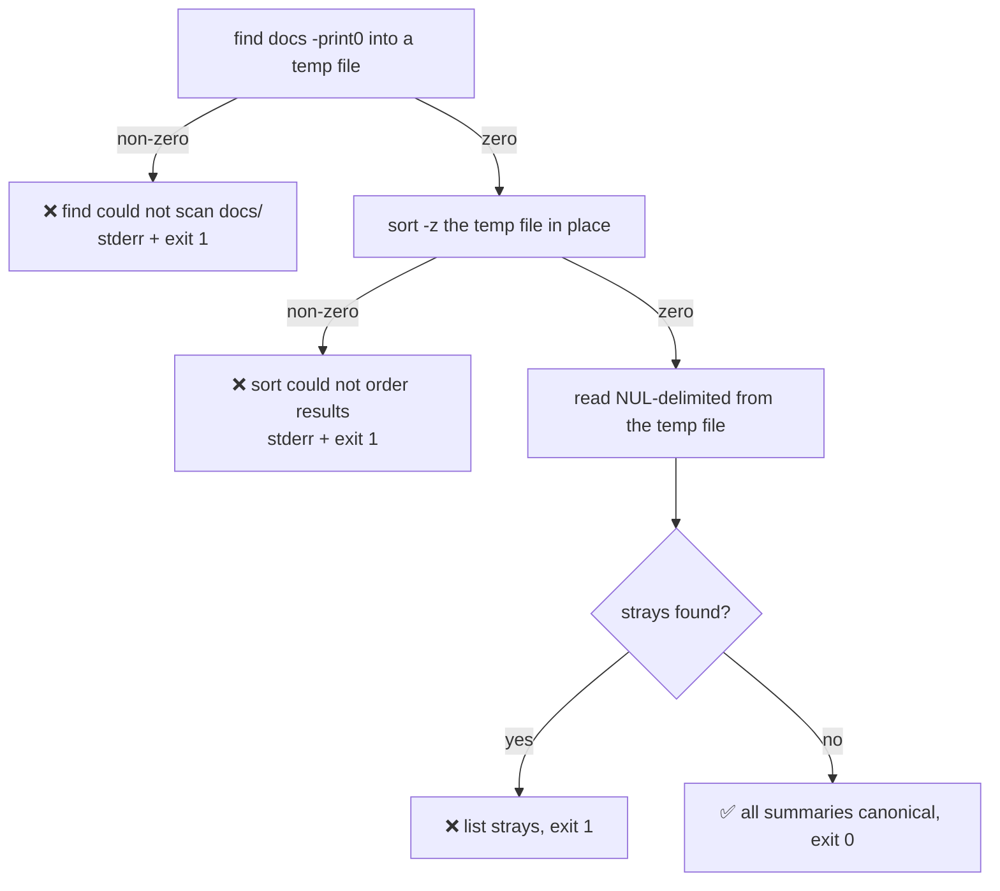

# PR Summary — Issue #2139: the PR-summary location gate must not report ✅ for a scan that never ran

Closes #2139

## Summary

`scripts/check-pr-summary-location.sh` collected stray summaries through
`done < <(find docs … 2>/dev/null | sort)`. Two defects compounded:

1. `2>/dev/null` discarded `find`'s own diagnostic, so nothing said *why* a scan
   failed.
2. `set -euo pipefail` does not check a process substitution's exit status, and
   `sort` — the last command of that pipeline — succeeds on empty input. A
   `find` that scanned nothing was therefore indistinguishable from a `find`
   that found nothing.

The script fell through to `echo "✅ All pr-summary-*.md files live in …"` and
exited `0`, contradicting its own header contract. `./quality.sh:28` runs it as
a pre-commit gate, so the masked failure was reported to the contributor as a
clean gate.

The fix removes the process substitution entirely: `find … -print0` writes into
an `mktemp` file (removed by an `EXIT` trap), and both `find` and the following
`sort -z` are wrapped in `if ! …` so a failed scan prints
`❌ … the PR summary layout was NOT checked.` on stderr and exits `1` — no ✅
line can follow. The stray-file loop then reads that file through a plain
redirect, so `set -e` has no unchecked status anywhere in the path. Per the
issue's own instruction the scan is NUL-delimited end to end (`-print0`,
`sort -z`, `read -r -d ''`), so paths containing spaces survive intact. The
stray-file message and its `exit 1` are byte-for-byte unchanged.



Before the fix, the failing-`find` path on the left did not exist — it merged
straight into `H`.

## Evidence

- **Fix** — `scripts/check-pr-summary-location.sh:17-43`.
- **Regression test** — `tests/issue_2139_pr_summary_gate_fails_loud.rs` (new,
  4 tests) drives the **real** script in a `tempfile` sandbox containing nothing
  but a copy of the script, and asserts on exit status and stdout/stderr. No
  test inspects source text.
- **Second trigger verified by hand** — in a throwaway sandbox,
  `chmod 000 docs/archive` produced `find: ‘docs/archive’: Permission denied`
  followed by `❌ find could not scan docs/ — the PR summary layout was NOT
  checked.` and `exit=1`. The unfixed script printed ✅ and exited `0` for the
  same tree.
- **Targeted tests** —
  `cargo test --test issue_2139_pr_summary_gate_fails_loud --test issue_1991_pr_summary_retention_contract`
  → 20 passed, 0 failed. The pre-existing
  `issue_1991_pr_summary_retention_contract.rs::the_location_guard_passes_on_the_committed_tree`
  still passes, so the real repository tree is unaffected.
- **Script gates** — `bash -n` clean, `shellcheck` clean.
- **Full gate** — `timeout 900 ./quality.sh < /dev/null` → `✅ All quality
  checks passed!` (first attempt, no retries).
- **Audit doc** — the fix is recorded in the findings table and the per-file
  section of `docs/audits/security-sweep-chunk-16-build-scripts.md`.
- **`Cargo.toml` deliberately not bumped** — CI's `version-increment` job owns
  the patch bump, and this PR targets a `milestone/**` branch.

## Reproduction

- **symptom** — with no `docs/` directory present (or an unreadable subtree
  under it), `find` fails, its diagnostic is swallowed by `2>/dev/null`, and the
  unchecked process substitution lets the script print
  `✅ All pr-summary-*.md files live in docs/archive/pr-summaries/` and exit `0`
  — a gate that checked nothing reported as clean.
- **status** — `verified` — the new test was watched failing against the
  unfixed script (`test result: FAILED. 3 passed; 1 failed`, with the captured
  stdout showing the ✅ line and a successful exit) and passing after the fix
  (`4 passed`). The permission-denied variant was reproduced by hand as
  described under Evidence.
- **regression test** —
  `tests/issue_2139_pr_summary_gate_fails_loud.rs::a_scan_that_cannot_run_fails_loud_instead_of_reporting_a_clean_tree`

### Security-fix evidence

- **Test file added by this branch** —
  `tests/issue_2139_pr_summary_gate_fails_loud.rs`.
- **Test identifier** —
  `tests/issue_2139_pr_summary_gate_fails_loud.rs::a_scan_that_cannot_run_fails_loud_instead_of_reporting_a_clean_tree`,
  declared in the added lines of this branch's diff.
- **Fails before, passes after** — against the unfixed script this test fails
  (the script exits `0` and prints ✅ for a scan that never ran); against the
  fixed script it passes (non-zero exit, stderr names `find`, no ✅ on stdout).
  The other three tests pass both before and after, which is what pins the
  unchanged behaviours.
- **Original trigger closed, no trivial bypass** — the trigger was an
  unobservable exit status. The process substitution is gone; `find` and `sort`
  each have their status checked explicitly and the loop reads a plain file
  redirect, so there is no remaining construct in this script whose failure
  `set -e` can skip. `2>/dev/null` is removed, so the underlying cause reaches
  the operator. The ✅ line is now reachable only after both commands returned
  zero.

## Acceptance Criteria

<!-- vibe-spec-review inputs="diff+issue-body" -->

1. **`scripts/check-pr-summary-location.sh` exits non-zero and names the failure
   when `find` cannot complete; no ✅ line printed in that case.**
   reviewer: met — `scripts/check-pr-summary-location.sh:29-33` prints the
   named failure on stderr and exits `1` before any ✅ can be reached.
2. **The regression test runs the real script with no `docs/` present and
   asserts a non-zero exit; it fails against the unfixed script (stated in the
   PR summary).**
   reviewer: partial — the test is confirmed to fail against the unfixed script
   (the reviewer independently reproduced `✅ …` with `exit=0` pre-fix), but at
   review time the branch carried no PR summary file, so the "stated in the PR
   summary" clause was not yet discharged. **This file discharges it**: the
   fails-before/passes-after linkage is stated under *Reproduction* and
   *Security-fix evidence* above.
3. **The clean-tree and stray-file behaviours are unchanged and covered by
   tests.**
   reviewer: met — `scripts/check-pr-summary-location.sh:45-56` is untouched;
   covered by the tests at `:90-112` and `:114-137`; all 4 tests pass.
4. **`bash -n` and `shellcheck` stay clean on the script; `./quality.sh`
   passes.**
   reviewer: met — both re-run clean by the reviewer; `./quality.sh` passed on
   the first attempt.

Unrequested changes:

- `scripts/check-pr-summary-location.sh:34-37` — the `sort -z` status guard.
  reviewer: unrequested — reason: the issue asked only for `find`'s status to be
  captured; checking `sort` too closes the same fail-silent class in the one
  other command on the path.
- `tests/issue_2139_pr_summary_gate_fails_loud.rs:139-158` — a fourth test for a
  stray under a path containing spaces.
  reviewer: unrequested — reason: the issue enumerated exactly three test cases;
  this one pins the NUL-delimited behaviour the issue asked be kept, so it is
  adjacent to the ask but beyond it.
- `docs/audits/security-sweep-chunk-16-build-scripts.md` per-file section — the
  prose "**Fixed** —" paragraph.
  reviewer: unrequested — reason: the issue asked only that the fix be added to
  the findings table; the per-file section was updated as well for consistency
  with the sibling chunk-16 entries.

## Standards Review

<!-- vibe-standards-review inputs="diff+CODING-STANDARDS.md" -->

`CODING-STANDARDS.md` is not present in this repository; the reviewer used the
repository's own canonical standards — `CONTRIBUTING.md` and `AGENTS.md`.

Violations reported:

1. `docs/archive/pr-summaries/pr-summary-2139.md` missing — CONTRIBUTING.md
   "📝 PR Summary File" requires one per PR. **Addressed by this file.**
2. `docs/audits/security-sweep-chunk-16-build-scripts.md:214` — the findings row
   said "The NUL-delimited read is unchanged", which understated the change: the
   pre-fix script was newline-delimited. **Addressed** — the row now states the
   read was switched to `-print0` / `sort -z` / `read -r -d ''` over a plain file
   redirect, with only the stray-file message and its `exit 1` unchanged.
3. `scripts/check-pr-summary-location.sh:29,41` — minor scope hygiene: declare
   the NUL switch as deliberate hardening rather than an incidental edit.
   **Addressed** — the comment at `:39` states why the read is NUL-delimited,
   and this summary records the switch as explicitly requested by the issue.

Areas positively checked clean:

- **Australian English** across all added lines.
- **Bash robustness** — `mktemp` (Issue #1910), single-quoted `trap` (no
  SC2064), explicit `if !` status checks, NUL-safe read; `bash -n` and
  `shellcheck` pass.
- **Comment quality** — explains *why*, cites Issue #2139.
- **Testing doctrine** — the real script is executed in a `tempfile` sandbox,
  assertions are on exit status and stdout/stderr, no source-text greps, no
  timing assertions, non-vacuous per Issue #1799; `tempfile` was already a
  dev-dependency.
- **Documentation** — `markdownlint-cli2` clean; the guard is cited as
  `file.rs::symbol` per Issue #1942.
- **Scope** — no unrelated files, no CI changes, no `Cargo.toml` bump.

## Test Plan

| Test | Tree under the guard | Asserts |
| --- | --- | --- |
| `a_scan_that_cannot_run_fails_loud_instead_of_reporting_a_clean_tree` | no `docs/` at all | non-zero exit, stderr names `find`, no ✅ on stdout |
| `a_canonical_tree_still_passes` | `docs/archive/pr-summaries/{README,pr-summary-1613,pr-summary-2139}.md` + `docs/CONFIGURATION.md` | exit `0`, ✅ naming the canonical directory |
| `a_stray_summary_is_still_listed_and_fails_the_gate` | canonical file + `docs/pr-summary-99.md` | exit `1`, stray listed by path, no ✅ |
| `a_stray_summary_under_a_path_containing_spaces_is_listed_intact` | `docs/old notes/pr-summary-100.md` | exit `1`, path reported whole, not split on its spaces |

Commands run:

```bash
bash -n scripts/check-pr-summary-location.sh
shellcheck scripts/check-pr-summary-location.sh
cargo test --test issue_2139_pr_summary_gate_fails_loud \
           --test issue_1991_pr_summary_retention_contract < /dev/null   # 20 passed
timeout 900 ./quality.sh < /dev/null                                     # ✅ All quality checks passed!
```
